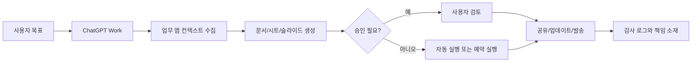

> 한 줄 요약: ChatGPT Work 이슈에서 눈에 띄는 건 새 AI 에이전트 출시 자체보다, 회사 업무의 읽기 권한과 실행 권한이 같은 도구 안으로 들어오기 시작했다는 점이다. 사람들은 생산성보다 권한, 감사, 책임 소재를 먼저 떠올렸다.

## 무슨 일이 있었나

2026년 7월 9일, OpenAI는 ChatGPT Work를 공개했다. 공개 글은 이 기능을 “앱과 파일을 넘나들며 행동하고, 몇 시간 동안 프로젝트를 이어가며, 목표를 완성물로 바꾸는 에이전트”로 설명했다.

범위는 넓다.

- Slack, Microsoft Teams, Google Drive, SharePoint, 이메일, 캘린더, CRM, 프로젝트 관리 도구 같은 업무 앱 연결
- 문서, 슬라이드, 시트, 웹앱 생성
- Scheduled Tasks를 통한 반복 작업 실행
- 데스크톱 앱에서 로컬 파일과 앱 접근
- 내장 브라우저와 Computer Use를 통한 클릭, 입력, 파일 이동
- Codex 앱의 ChatGPT 데스크톱 앱 통합
- Sites 공개 베타를 통한 대시보드, 포털, 인터랙티브 리포트 생성

출시 범위도 따로 봐야 한다. OpenAI 설명에 따르면 웹과 모바일의 ChatGPT Work는 2026년 7월 9일 기준 Pro, Enterprise, Edu 플랜에 먼저 제공된다. Plus와 Business에는 며칠에 걸쳐 배포된다. 데스크톱 앱에서는 Chat, Work, Codex가 Free를 포함한 모든 플랜에서 제공된다고 안내됐다.

Hacker News에서는 이 글이 Best에 올라왔고, 초안 작성 시점 기준 299포인트와 145개 댓글이 붙었다. 단순한 제품 발표치고 반응이 컸다. 기능이 많아서만은 아니다. 이 제품은 “AI가 답변한다”에서 “AI가 회사 시스템 안에서 실제 작업을 한다” 쪽으로 선을 옮긴다.

확인된 사실과 해석은 나눠서 봐야 한다.

| 구분 | 내용 |
|---|---|
| 확인된 사실 | OpenAI는 ChatGPT Work, Scheduled Tasks, 데스크톱 Computer Use, plugins, Sites beta를 공개했다. |
| 확인된 사실 | 업무 앱과 파일을 연결해 문서, 시트, 슬라이드, 사이트를 만들 수 있다고 설명했다. |
| 확인된 사실 | OpenAI는 Zapier, RingCentral, Virgin Atlantic, NVIDIA, 내부 finance/sales 사례를 제시했다. |
| 확인된 사실 | MIT News는 에이전트형 AI(Agentic AI)를 “세상에서 행동을 취하는 AI”로 설명했다. |
| 해석 | 커뮤니티 반응의 중심은 성능보다 권한 위임과 감사 가능성 쪽으로 옮겨가고 있다. |
| 해석 | 앞으로 기업용 AI 도입 논의에서는 모델 정확도보다 접근 권한, 실행 승인, 로그 보존, 책임 소재가 먼저 다뤄질 가능성이 크다. |

## 왜 사람들이 반응했나

ChatGPT Work가 건드린 건 업무 자동화의 오래된 불편함이다. 회사 일은 대개 한 앱 안에서 끝나지 않는다. 영업 기록은 CRM에 있고, 회의 내용은 Slack이나 Teams에 있고, 파일은 Drive나 SharePoint에 있다. 최종 보고는 슬라이드나 스프레드시트로 남는다.

기존 자동화 도구는 이 조각들을 이어 붙이는 데 강했다. 다만 사람이 의도를 설명하고, 예외를 판단하고, 문서를 다듬고, 책임지는 단계는 계속 남았다. ChatGPT Work는 그 중간층까지 가져가겠다고 말한다.

그래서 기대와 불편함이 같이 나온다.

### ChatGPT Work 권한 문제는 읽기와 실행이 합쳐진다는 데 있다

가장 먼저 보이는 리스크는 권한이다.

업무용 AI가 Slack을 읽고, 캘린더를 확인하고, Drive 파일을 열고, CRM을 조회하고, 브라우저에서 클릭까지 한다면 “어떤 데이터를 볼 수 있는가”와 “무엇을 실행할 수 있는가”를 분리해서 봐야 한다.

읽기 권한만 있어도 위험은 있다. 회의록, 고객 정보, 계약서, 가격 정책, 인사 관련 문서가 컨텍스트에 섞일 수 있기 때문이다. 여기에 실행 권한이 붙으면 성격이 달라진다. 잘못된 파일 공유, 부정확한 보고서 배포, 의도치 않은 CRM 업데이트, 외부 URL 게시 같은 운영 사고가 가능해진다.

OpenAI는 사용자가 접근 범위, 확인 시점, 승인 필요 작업을 정한다고 설명한다. 뒤집어 말하면, 조직이 그 경계를 제대로 설계하지 않으면 도구가 너무 많은 일을 할 수 있다.

### AI 에이전트가 불편한 이유는 실수의 단위가 커지기 때문이다

MIT News 인터뷰에서 Phillip Isola는 에이전트형 AI를 생성형 AI와 구분해 설명한다. 생성형 AI가 글, 이미지, 답변을 만든다면 에이전트형 AI는 디지털 환경이나 물리 환경에서 행동을 취한다.

이 차이가 커뮤니티 반응의 중심에 있다.

챗봇이 틀린 답을 하면 사용자가 복사하기 전에 멈출 수 있다. 에이전트가 틀린 판단을 하면 이미 파일을 옮겼거나, 댓글을 달았거나, 보고서를 공유했거나, 예약 작업을 등록했을 수 있다. 실수의 단위가 문장 하나에서 워크플로우 전체로 커진다.

이 흐름에서 가장 약한 고리는 모델 성능 하나로 정해지지 않는다. 권한 범위, 승인 조건, 로그 품질, 되돌리기 가능성, 데이터 분류가 같이 맞아야 한다.

### 회사 업무 자동화가 매력적인 이유는 반복 작업이 실제로 많아서다

반응이 우려만으로 채워진 것은 아니다. ChatGPT Work가 제시한 사례는 많은 조직이 이미 겪는 피로를 정확히 건드린다.

OpenAI가 든 예시는 다음과 같다.

- Zapier: CRM, 이메일 등 고객 접점을 추적해 리드 검토 시스템과 주간 대시보드 생성
- RingCentral: Jira 작업, 출시 계획, go-to-market 일정을 검토해 누락 단계와 담당자 확인
- Virgin Atlantic: 경쟁 항공사의 승객 경험을 조사해 5년 계획 검토용 데이터셋 구성
- NVIDIA: GTC 준비와 사후 리뷰에 필요한 등록, 미팅, 세션 기록, 고객 미팅 노트 정리

이런 작업은 단순 타이핑 노동이 아니다. 여러 시스템의 데이터를 모으고, 빠진 부분을 찾고, 소유자를 확인하고, 의사결정자가 읽을 형태로 바꾸는 일이다. 현업에서 비슷한 고민을 하다 보면 자동화가 실패하는 이유도 대개 여기에 있다. API 호출은 되지만 “이 자료가 지금 회의에 쓸 수 있는 상태인가”를 판단하는 단계가 남는다.

ChatGPT Work는 그 판단 보조까지 제품 범위에 넣었다. 그래서 매력적이고, 동시에 위험하다.

### 경쟁 제품도 같은 방향을 보고 있다

보조 사례를 보면 이 흐름은 한 회사만의 이야기가 아니다.

Anthropic은 2026년 6월 30일 Claude Sonnet 5를 공개하면서 브라우저와 터미널 같은 도구 사용, 계획 수립, 자율 실행 능력을 강조했다. 같은 날 공개한 Claude Science는 과학자를 위한 AI 워크벤치다. PubMed, Jupyter, R, 클러스터 터미널 같은 연구 도구를 한 환경에서 다루고, 산출물의 감사 가능한 이력을 남긴다고 설명했다.

두 제품의 초점은 다르다. OpenAI의 ChatGPT Work는 일반 업무 앱과 문서 생산을 넓게 잡는다. Anthropic의 Claude Science는 연구 업무처럼 검증과 재현성이 강하게 요구되는 영역을 전면에 둔다. 방향은 비슷하다. 에이전트가 대화창 바깥에 머무는 보조 도구가 아니라, 사용자가 일하는 환경 안으로 들어가야 한다고 보는 것이다.

Australian Payments Plus 사례도 같은 선에 있다. OpenAI는 AP+가 결제와 신원 인프라를 다루는 조직이며, ChatGPT Enterprise와 Codex로 복잡한 결제 이슈 조사를 빠르게 했다고 소개했다. 이 사례에서 더 눈에 들어오는 부분은 시간 절감 수치보다 “정확성과 책임이 더 중요하다”는 맥락이다. 결제 인프라에서는 빠른 보고서보다 잘못된 판단의 비용이 훨씬 크다.

## 내가 보는 핵심

ChatGPT Work 이슈는 “AI가 일을 대신한다”는 말로는 부족하다. 더 정확히는 조직의 업무 그래프에 AI가 실행 노드로 들어가는 일에 가깝다.

업무 그래프에는 문서, 사람, 권한, 승인, 일정, 고객 데이터, 내부 규정, 외부 계약이 엮여 있다. 사람이 그 사이를 오갈 때는 느리지만, 맥락상 멈추는 지점이 있다. “이건 공유하면 안 되겠는데”, “이 숫자는 원천을 다시 봐야겠다”, “이 담당자는 아직 확정이 아니다” 같은 마찰이다.

AI 에이전트가 이 마찰을 줄이면 생산성은 오른다. 동시에 조직이 그 마찰에 기대어 통제하던 위험도 같이 줄어든다. 그래서 도입 기준은 “얼마나 똑똑한가”보다 “어디서 멈추게 할 것인가”에 가까워야 한다.

나는 이 이슈를 볼 때 세 가지를 먼저 본다.

첫째, 데이터 경계다. 개인 Drive, 팀 Drive, 고객별 폴더, 법무 문서, 인사 문서가 같은 연결 목록에 들어가면 안 된다. 플러그인 연결은 편해야 하지만, 기본값이 넓으면 운영 리스크가 커진다.

둘째, 실행 경계다. 문서 초안 생성과 외부 공유는 다르다. CRM 조회와 CRM 업데이트도 다르다. 브라우저에서 웹페이지를 여는 것과 버튼을 눌러 상태를 바꾸는 것도 다르다. 같은 에이전트 기능이라도 읽기, 쓰기, 발송, 삭제, 결제, 외부 공개는 별도 정책으로 나눠야 한다.

셋째, 증거 경계다. 에이전트가 만든 문서가 어떤 파일, 어떤 메시지, 어떤 웹페이지, 어떤 계산에서 나왔는지 남아야 한다. Claude Science가 감사 가능한 이력을 전면에 둔 이유도 여기에 있다. 업무용 에이전트의 산출물은 보기 좋은 문서에 그치면 안 된다. 검토 가능한 산출물이어야 한다.

이 기준이 없으면 조직은 이상한 위치에 놓인다. 사람에게는 책임을 묻지만, 사람이 실제로 무엇을 검토했는지는 흐릿해진다. AI에게는 일을 맡기지만, AI가 어떤 근거로 움직였는지는 남지 않는다.

## 앞으로 볼 기준

앞으로 ChatGPT Work 같은 업무용 AI 에이전트 뉴스를 볼 때는 기능 데모보다 운영 조건을 먼저 확인하는 편이 낫다.

- 어떤 앱에 연결되는가
- 기본 권한은 최소 권한(Least Privilege)인가
- 읽기, 쓰기, 발송, 삭제 권한이 분리되는가
- 예약 작업은 누가 만들고 누가 승인하는가
- 외부 공유 전에 사람 검토가 강제되는가
- 에이전트가 사용한 원천 자료와 중간 판단이 로그로 남는가
- 실패한 작업과 취소된 작업도 감사 대상에 포함되는가
- 민감정보, 고객정보, 규제 대상 데이터가 컨텍스트에 들어갈 때 차단 규칙이 있는가
- 모델 변경이나 플러그인 변경이 기존 자동화에 어떤 영향을 주는가
- 사용자가 퇴사하거나 권한이 바뀌면 예약 작업도 함께 정리되는가

특히 Scheduled Tasks는 별도로 봐야 한다. 한 번 실행되는 작업은 사용자가 기억할 가능성이 높다. 반복 작업은 시간이 지나면 배경으로 사라진다. 배경에서 매주 Slack을 읽고, 문서를 고치고, 보고서를 보내는 시스템은 편리하지만, 권한 회수와 로그 검토가 느슨하면 나중에 발견하기 어렵다.

기업 입장에서는 도입을 막는 것보다 작은 범위로 시작하는 편이 현실적이다. 예를 들어 외부 공유 없는 내부 요약, 읽기 전용 리포트, 임시 데이터셋 생성, 초안 작성처럼 되돌릴 수 있는 작업부터 시작할 수 있다. 반대로 고객 발송, 계약 문서 수정, 결제·정산, 권한 변경, 공개 URL 배포는 별도 승인선을 두는 것이 맞다.

커뮤니티가 ChatGPT Work에 반응한 이유는 새 버튼 하나 때문이 아니다. AI가 업무 시스템의 주변 도구에서 업무 흐름의 참가자로 이동하기 시작했기 때문이다. 참가자가 늘면 회의가 빨라질 수 있다. 대신 의사록과 승인선도 더 필요해진다.

ChatGPT Work 같은 에이전트의 가치는 “사람이 안 해도 되는 일을 줄인다”에서 나온다. 위험도 같은 문장에서 나온다. 사람이 안 해도 되는 일과 반드시 멈춰서 봐야 하는 일을 구분하지 못하면, 자동화는 속도보다 불확실성을 키운다.

## 참고 자료

- [선정 글감] [ChatGPT Work](https://openai.com/index/chatgpt-for-your-most-ambitious-work/) (Hacker News Best)
- [관련] [ChatGPT is now a partner for your most ambitious work](https://openai.com/index/chatgpt-for-your-most-ambitious-work) (OpenAI Blog)
- [관련] [Q&A: What is agentic AI today, and what do we want it to be?](https://news.mit.edu/2026/agentic-ai-and-what-do-we-want-it-be-0630) (MIT News)
- [관련] [Introducing Claude Sonnet 5](https://www.anthropic.com/news/claude-sonnet-5) (Anthropic News)
- [관련] [Claude Science, an AI workbench for scientists, is now available](https://www.anthropic.com/news/claude-science-ai-workbench) (Anthropic News)
- [관련] [Australian Payments Plus moves faster with ChatGPT and Codex](https://openai.com/index/australian-payments-plus) (OpenAI Blog)