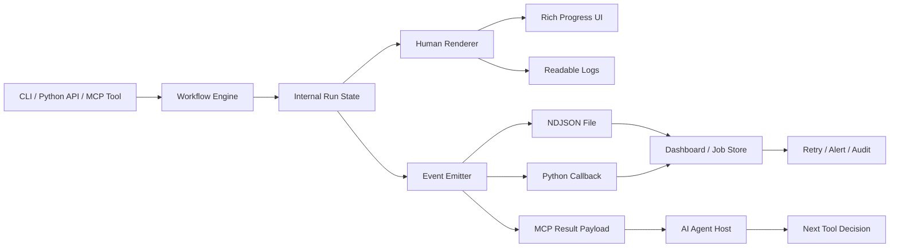

> 한 줄 요약: 에이전트, MCP, 자동화 워크플로가 CLI를 호출하기 시작하면 진행률 표시줄은 단순한 화면 요소가 아니다. 사람이 읽는 출력과 시스템이 의존하는 이벤트 계약을 분리하지 않으면, 콘솔 UI 문구 하나가 제품 통합을 깨뜨릴 수 있다.

## 왜 지금 이슈인가

CLI 자동화에서 위험한 순간은 도구가 널리 쓰이기 시작할 때 온다.

처음에는 사람이 터미널에서 직접 실행한다. 진행률 표시줄(Progress Bar), 상태 문구, Rich 테이블은 좋은 사용자 인터페이스다. 그런데 도구가 쓸 만해지면 누군가 GitHub Actions, 내부 대시보드, Python API, MCP 서버, 에이전트 워크플로 안에서 그 CLI를 호출하기 시작한다.

그때 이런 문자열이 사실상 API처럼 취급된다.

```text
Translating markdown files 12/40 30% docs/intro.md
```

사람에게는 친절한 출력이다. 현재 단계, 처리한 파일 수, 진행률, 작업 중인 파일을 한눈에 보여준다. 하지만 다른 프로그램이 이 문자열을 파싱하기 시작하면 얘기가 달라진다. 문구 하나를 바꾸는 리팩터링이 통합 장애가 된다.

선정 글감인 Co-op Translator 사례도 이 문제를 잘 보여준다. v0.20.0에서 Rich 기반 CLI 진행 UI를 추가하면서 구조화된 번역 이벤트도 함께 넣었다. 겉으로는 UI 개선과 이벤트 기능 추가처럼 보이지만, 실제 쟁점은 하나다.

상태를 누구에게 어떤 계약으로 제공할 것인가.

요즘 CLI는 터미널 안에만 머물지 않는다. CI/CD, 로컬 자동화, 에이전트 도구 호출, MCP, 백오피스 대시보드가 CLI를 호출한다. 사람이 보는 로그와 시스템이 저장할 상태가 같은 출력에 섞이면, 어느 쪽도 마음 놓고 고치기 어렵다.

## 커뮤니티에서 갈리는 지점

CLI 출력 설계에서 흔히 갈리는 의견은 두 가지다.

하나는 “텍스트 출력이면 충분하다”는 쪽이다. stdout에 사람이 읽을 수 있는 로그를 남기고, 필요하면 정규식으로 필요한 값을 뽑으면 된다는 관점이다. 작은 도구, 내부 스크립트, 한 번 쓰고 버리는 자동화에서는 이 방식이 빠르다.

다른 쪽은 “자동화될 가능성이 있으면 출력은 계약이다”라고 본다. 특히 진행 상태, 실패 원인, 처리 대상, 결과 파일처럼 다른 시스템이 저장하거나 판단에 쓰는 값은 텍스트 로그가 아니라 구조화된 이벤트로 제공해야 한다는 입장이다.

둘 중 하나가 항상 맞는 것은 아니다. CLI가 어떤 생애주기를 가지느냐에 따라 답이 바뀐다.

| 상황 | 텍스트 로그로 충분한 경우 | 이벤트 계약이 필요한 경우 |
|---|---|---|
| 사용 주체 | 사람만 직접 실행 | CI, 대시보드, 에이전트가 호출 |
| 상태 사용 | 눈으로 확인 | DB 저장, 재시도, 알림, 집계 |
| 출력 변경 | 자유롭게 문구 수정 | 하위 호환성 고려 필요 |
| 실패 처리 | 로그 보고 수동 판단 | 오류 타입과 원인 분류 필요 |
| 장기 운영 | 낮은 빈도 | 반복 실행, 관측성, 감사 필요 |

Co-op Translator 글에서 제시한 `stage_label`과 `stage_key`의 분리는 이 논쟁을 잘 압축한다.

```json
{
  "stage_key": "translating_markdown_files",
  "stage_label": "Translating markdown files"
}
```

`stage_label`은 사람에게 보여줄 문구다. 더 자연스러운 표현이 있으면 바꿀 수 있어야 한다. 반면 `stage_key`는 통합 코드가 의존하는 안정적인 값이다. 대시보드, 워커, 에이전트, 테스트 하네스(Test Harness)는 이 값을 기준으로 상태를 분기한다.

Microsoft Flint 사례도 같은 축에서 볼 수 있다. Flint는 에이전트가 데이터 시각화를 더 안정적으로 생성하도록 만든 시각화 중간 언어(Intermediate Language)다. 여기서도 핵심은 에이전트에게 저수준 표현을 직접 다 맡기지 않는다는 점이다. 에이전트는 의도를 표현하고, 컴파일러나 런타임이 보기 좋은 결과를 만든다.

CLI 이벤트 설계도 비슷하다. 에이전트나 외부 시스템이 사람용 출력의 줄바꿈, 색상, 문구를 해석하게 만들지 말고, 의존해도 되는 중간 표현을 제공해야 한다.

Mitchell Hashimoto 인터뷰에서 터미널과 CLI 생태계를 바라보는 관점도 연결된다. Vagrant, Packer, Terraform, Vault, Nomad 같은 도구들은 모두 사람과 자동화가 함께 쓰는 도구였다. Ghostty처럼 터미널 자체를 다시 파고드는 작업에서도 터미널이 단순한 텍스트 창이 아니라 개발자 워크플로의 기반이라는 점이 드러난다.

결국 문제는 여기로 모인다.

사람에게 좋은 인터페이스를 만들수록, 기계가 그 인터페이스에 몰래 의존하지 못하게 해야 한다. 그래야 UI도 고칠 수 있고 자동화도 덜 깨진다.

## 아키텍처 관점에서 볼 점

CLI 진행률 설계에서 먼저 분리해야 할 것은 상태(State), 렌더러(Renderer), 이벤트 계약(Event Contract)이다.

상태는 한 번만 계산한다. 현재 작업 단계, 대상 언어, 처리 중인 파일, 완료 수, 전체 수, 경고, 실패 정보를 내부 모델로 관리한다. 그 상태를 사람용 렌더러와 시스템용 이벤트 스트림이 각각 다른 방식으로 소비한다.



이 구조에서 Rich 진행률 표시줄은 사라지지 않는다. 사람에게 현재 작업이 살아 있는지, 어느 파일에서 멈췄는지, 어느 단계가 느린지 보여주는 역할을 맡는다.

반면 이벤트 스트림은 시스템이 믿고 저장할 사실을 제공한다.

```json
{
  "schema": "co-op.translation.event.v1",
  "type": "stage_progress",
  "stage_key": "translating_markdown_files",
  "stage_label": "Translating markdown files",
  "language": "ko",
  "current_path": "docs/intro.md",
  "completed": 12,
  "total": 40,
  "progress": 30
}
```

아키텍처적으로는 세 가지를 봐야 한다.

첫째, 이벤트 타입은 워크플로의 경계를 드러내야 한다. 단순히 `progress: 30`만 보내면 대시보드는 무엇이 30%인지 알 수 없다. `run_started`, `estimate_ready`, `stage_started`, `stage_progress`, `file_completed`, `run_completed`, `file_failed`, `run_failed`처럼 상태 전이를 표현해야 한다.

둘째, 이벤트는 재생 가능해야 한다. Localizeflow 같은 제품 통합을 생각하면, 현재 작업 상태는 이벤트를 누적해서 물질화(Materialize)할 수 있어야 한다. 로그는 조사용 맥락이고, 이벤트는 제품 상태의 원천이다.

셋째, 스키마 버전이 있어야 한다. `co-op.translation.event.v1` 같은 값은 장식이 아니다. 새 필드를 추가하거나 의미를 바꿔야 할 때 기존 통합을 깨지 않고 전환하기 위한 최소한의 장치다.

이 설계는 관측성(Observability)과도 맞닿아 있다. 로그(Log), 메트릭(Metric), 트레이스(Trace), 이벤트(Event)는 서로 대체물이 아니다. 진행률 이벤트를 로그처럼 다루면 검색은 쉬울 수 있지만 상태 복원과 재시도 판단이 어려워진다. 반대로 모든 로그를 이벤트로 만들면 사람에게 필요한 문맥이 사라진다.

좋은 설계는 둘을 섞지 않는다.

## 실무에서 볼 점

실제로는 “언젠가 자동화될까?”보다 “이미 누가 파싱하고 있을까?”를 먼저 확인하게 된다. 오래된 CLI일수록 공식 API가 없어도 주변에 정규식 기반 통합이 붙어 있는 경우가 많다. 문구를 고치기 전에 GitHub Actions, 사내 스크립트, README 예제, 고객사의 래퍼 스크립트를 찾아봐야 한다.

도입 전에 확인할 조건은 꽤 구체적이다.

| 확인 항목 | 질문 |
|---|---|
| 소비자 | 이 출력을 사람이 보는가, 시스템이 읽는가 |
| 안정성 | 어떤 필드가 하위 호환성을 가져야 하는가 |
| 저장성 | 이벤트를 DB에 저장해도 되는가 |
| 순서 | 이벤트 순서가 의미를 가지는가 |
| 실패 | 부분 실패와 전체 실패를 구분하는가 |
| 보안 | 경로, 토큰, 원문 데이터가 이벤트에 섞이지 않는가 |
| 운영 | 이벤트가 너무 많아 로그 비용이나 저장 비용을 키우지 않는가 |
| 테스트 | 스키마 변경을 계약 테스트로 막고 있는가 |

보안과 데이터 리스크도 작지 않다. 사람이 보는 콘솔 로그에는 파일 경로나 일부 입력값이 노출될 수 있다. 이벤트를 그대로 제품 DB에 저장하면 그 정보가 장기간 남는다. 번역 도구라면 원문 경로, 대상 언어, 실패 메시지에 민감한 프로젝트 구조가 섞일 수 있다.

따라서 이벤트 필드는 필요한 만큼만 좁혀야 한다. 파일 내용을 이벤트에 넣지 않고 경로나 식별자만 넣는 식이다. 오류 메시지도 외부 표시용 `error_code`와 조사용 `error_message`를 구분하는 편이 낫다.

운영 관점에서는 이벤트 양도 문제다. 파일이 수만 개라면 `file_completed` 이벤트만으로도 저장량이 커진다. 모든 진행률 업데이트를 초 단위로 저장하면 대시보드는 부드러워지지만 비용과 잡음이 늘어난다. 이때는 이벤트 샘플링, 단계별 집계, 최종 상태 이벤트를 나눠야 한다.

테스트 자동화 하네스에서도 이 구조가 유용하다. 터미널 출력 스냅샷을 비교하는 테스트는 UI 변경에 쉽게 깨진다. 반면 이벤트 계약 테스트는 훨씬 안정적이다.

```python
def test_translation_progress_event_contract():
    event = run_translation_and_collect_first_progress_event()

    assert event["schema"] == "co-op.translation.event.v1"
    assert event["type"] == "stage_progress"
    assert event["stage_key"] == "translating_markdown_files"
    assert isinstance(event["completed"], int)
    assert isinstance(event["total"], int)
```

이 테스트는 Rich 출력의 색상, 표 레이아웃, 문구가 바뀌어도 흔들리지 않는다. 대신 외부 시스템이 실제로 의존하는 계약이 깨질 때만 실패한다.

대안도 있다.

간단한 도구라면 `--json` 출력 하나로 충분할 수 있다. 배치 실행 결과만 필요하다면 진행 이벤트 없이 최종 결과 JSON만 제공해도 된다. Unix 파이프라인과 맞물리는 도구라면 stdout은 데이터, stderr는 사람용 로그로 분리하는 전통적인 방식이 더 적합할 수 있다.

하지만 장시간 실행, 부분 실패, 대시보드 연동, 에이전트 호출, MCP 도구 결과처럼 중간 상태가 의미를 가지는 순간에는 이벤트 스트림이 더 나은 선택이 된다.

여기서 에이전트 이야기가 다시 돌아온다. 에이전트가 도구를 호출한 뒤 다음 행동을 결정하려면, 출력 문장을 추측해서 읽는 것보다 구조화된 결과를 받는 편이 낫다. Flint가 시각화 생성을 위해 에이전트 친화적인 중간 언어를 제안한 것처럼, CLI와 MCP 도구도 에이전트가 안정적으로 해석할 수 있는 중간 표현을 제공해야 한다.

사람에게 보기 좋은 화면은 계속 필요하다. 다만 그것이 자동화의 유일한 진실 공급원이 되어서는 안 된다.

## 정리

진행률 표시줄은 API가 아니다. 하지만 도구가 충분히 유용해지는 순간, 누군가는 그 진행률 표시줄을 API처럼 쓰고 싶어진다.

그 욕구를 막기는 어렵다. 대신 더 나은 표면을 제공할 수 있다. 사람에게는 Rich UI와 읽기 쉬운 로그를 주고, 시스템에는 버전이 붙은 구조화 이벤트를 준다. `stage_label`은 바꿀 수 있게 두고, `stage_key`는 지킨다. 로그는 조사에 쓰고, 이벤트는 상태에 쓴다.

당장 확인해볼 것은 하나다.

내 CLI나 내부 자동화 도구의 출력 중에서 다른 시스템이 정규식으로 파싱하는 줄이 있는지 찾아보자. 그런 줄이 있다면 이미 계약이다. 문구를 더 예쁘게 고치기 전에, 그 계약을 이벤트로 빼낼 때다.

## 참고 자료

- [선정 글감] [Progress Bar Is Not an API](https://dev.to/minseoksong/progress-bar-is-not-an-api-235b) — DEV Community
- [관련] [Flint: A Visualization Language for the AI Era](https://microsoft.github.io/flint-chart/#/) — Microsoft
- [관련] [Lobsters Interview with mitchellh](https://alexalejandre.com/programming/interview-with-mitchell-hashimoto/) — Lobsters/Alex Alejandre