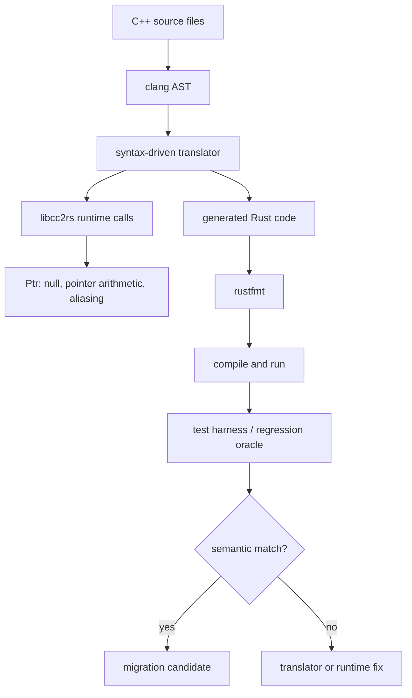

> 한 줄 요약: C++ to Rust 자동 변환과 AI 코드 마이그레이션에서 관건은 언어 교체 자체가 아니다. 커뮤니티가 검증 가능한 의미 보존 체계를 갖췄는지다. 안전한 Rust 출력보다 먼저 확인할 것은 테스트 오라클, 런타임 경계, 운영 전환 비용이다.

## 왜 지금 이슈인가

C++ to Rust 자동 변환, AI 코드 마이그레이션, 대형 시스템 재작성은 이제 연구실 데모와 스타트업 블로그에서 동시에 얘기된다. Cpp2Rust는 C++ 코드를 clang AST로 읽고, 기본값으로 완전한 safe Rust를 만든다고 설명한다. 포인터는 `libcc2rs`의 `Ptr<T>`로 바꾸고, null, 포인터 산술, aliasing 같은 C 포인터 의미는 런타임 체크로 모델링한다.

이 접근이 개발자 커뮤니티에서 말을 부르는 이유는 단순하다. 다들 레거시 C/C++를 줄이고 싶어 한다. 하지만 손으로 다시 쓰는 재작성은 비용도 크고 위험도 크다. 반대로 자동 변환은 그럴듯해 보여도, 변환된 코드가 정말 같은 의미인지, 성능을 감당할 수 있는지, 운영 중 디버깅이 가능한지부터 의심을 산다.

비슷한 시기에 Bun의 Rust 재작성, pgrust의 Postgres Rust 재구현, AI 보조 마이그레이션 이야기가 함께 논의된 것도 같은 맥락에 있다. 세 사례 모두 언어 선택 밖의 문제를 드러낸다.

- 기존 시스템의 동작을 무엇으로 증명할 것인가
- 커뮤니티가 납득할 수 있는 변경 단위는 어디인가
- 안전성을 얻기 위해 런타임 비용과 추상화 비용을 어디까지 받아들일 것인가
- AI가 만든 대량 변경을 사람이 어떤 방식으로 소유할 것인가

## 커뮤니티에서 갈리는 지점

C++에서 Rust로 옮기는 논의는 보통 메모리 안전성(memory safety)에서 시작한다. C와 C++의 use-after-free, double free, data race 같은 문제를 줄이기 위해 Rust를 선택한다는 주장은 설득력이 있다. 하지만 자동 변환이 들어오면 논점이 바뀐다.

Cpp2Rust는 안전한 Rust를 만들려고 C 포인터를 Rust 참조로 직접 치환하지 않는다. 대신 `Ptr<T>`라는 런타임 타입으로 C 포인터 의미를 보존한다. 이 선택은 정직한 편이다. C++의 aliasing과 포인터 산술을 억지로 Rust borrow checker의 정적 규칙 안에 넣으려 하면, 많은 실제 코드가 깨지거나 대량의 `unsafe`로 밀려난다.

커뮤니티가 따지는 건 이 지점이다. safe Rust로 컴파일된다는 말과 Rust다운 설계가 됐다는 말은 다르다. `Ptr<T>`가 C 포인터 의미를 런타임에서 흉내 낸다면, 메모리 안전성은 나아질 수 있어도 코드 구조와 사고방식은 여전히 C++에 가깝다.

Bun의 Rust 재작성 논쟁도 비슷한 선에 있다. Bun 측은 Zig로 만든 대규모 JavaScript 런타임을 Rust로 옮기며 안정성 문제와 유지보수성을 이야기했다. 공개된 글에는 node:zlib, node:http2 주변의 use-after-free 계열 버그 예시가 나온다. 런타임처럼 네이티브 핸들, 비동기 I/O, 재진입 콜백이 얽힌 코드는 언어의 안전장치가 실제 운영 안정성에 영향을 준다.

하지만 Andrew Kelley의 글은 다른 축을 짚는다. 특정 언어를 평가하는 글이라기보다, 오픈소스 생태계와 스타트업 속도가 충돌할 때 커뮤니티가 어떤 감정을 갖게 되는지를 보여준다. 기술적 재작성은 코드만 바꾸지 않는다. 기여자 관계, 후원 구조, 언어 생태계의 상징성까지 같이 건드린다.

pgrust는 또 다른 방향이다. Postgres를 Rust로 다시 구현하되, Postgres 18.3 호환을 목표로 하고 46,000개가 넘는 회귀 쿼리에서 기대 출력과 일치한다고 밝힌다. 여기서 중요한 건 Rust 자체보다 오라클(oracle)이다. 원본 Postgres의 테스트가 새 구현의 기준이 되기 때문에, 커뮤니티가 논쟁할 수 있는 바닥이 생긴다.

| 사례 | 핵심 약속 | 커뮤니티가 따지는 질문 |
| --- | --- | --- |
| Cpp2Rust | C++를 safe Rust로 자동 변환 | safe Rust가 의미 보존과 유지보수성을 보장하는가 |
| Bun Rust rewrite | 대형 런타임을 Rust로 재작성 | AI 보조 대량 변경을 사람이 검증할 수 있는가 |
| pgrust | Postgres 호환 Rust 구현 | 테스트 오라클이 충분히 넓고 운영 차이를 잡는가 |

## 아키텍처 관점에서 볼 점

자동 변환 아키텍처는 보통 파서, 의미 보존 런타임, 검증 하네스(test harness)로 나뉜다. 셋 중 하나라도 약하면 변환기는 데모를 넘어가기 어렵다.

Cpp2Rust의 흐름은 비교적 명확하다. clang이 C++ 파일을 AST(Abstract Syntax Tree)로 파싱한다. 변환기는 AST를 순회하며 Rust 코드를 문자열로 만든다. 필요한 지점에는 `libcc2rs` 호출을 삽입한다. 마지막으로 `rustfmt`로 단일 `.rs` 파일을 정리한다.

이 구조에서 `libcc2rs`는 단순 보조 라이브러리가 아니다. 변환된 프로그램의 의미를 떠받치는 호환성 계층이다. C 포인터를 전부 Rust 참조로 바꾸는 대신, 포인터처럼 움직이지만 Rust 타입 시스템 안에 들어오는 별도 타입을 둔다.

이 방식의 장점은 변환 성공률이다. 레거시 C++ 코드가 가진 불편한 의미를 한 번에 제거하지 않고 Rust 타입 안으로 옮긴다. 단점은 장기 유지보수다. 운영자가 보는 코드는 Rust지만, 디버깅해야 하는 사고 모델은 C++과 런타임 라이브러리의 혼합물이 된다.

Bun과 pgrust 사례를 같이 보면 한 가지 원칙이 나온다. 대형 재작성에서 언어는 목표라기보다 제약 조건에 가깝다. 실제 아키텍처는 검증 루프에서 결정된다.

- 원본과 새 구현의 출력 비교가 가능한가
- 실패 케이스를 자동으로 줄여 재현할 수 있는가
- 성능 회귀를 기능 테스트와 분리해 추적하는가
- 외부 확장, 플러그인, ABI(Application Binary Interface) 경계를 어떻게 다루는가
- 운영 중 장애가 났을 때 원본 시스템으로 되돌릴 수 있는가

pgrust가 Postgres의 회귀 테스트를 오라클로 삼는 방식은 이 점에서 설득력이 있다. Postgres 자체의 동작이 워낙 넓고 미묘하기 때문에, 새 구현의 정확성을 말하려면 단위 테스트 몇 개로는 부족하다. 쿼리 결과, 에러 메시지, 트랜잭션 동작, 스토리지 호환성까지 검증 범위가 넓어져야 한다.

Cpp2Rust 같은 변환기도 같은 압박을 받는다. 문법 변환은 시작일 뿐이다. 템플릿, RAII(Resource Acquisition Is Initialization), 예외, 매크로, undefined behavior, 플랫폼별 컴파일 옵션을 만나면 테스트 하네스가 제품에서 가장 중요한 부분이 된다.

## 실무에서 볼 점

현업에서 C++ to Rust 자동 변환을 검토한다면 첫 질문은 이거다. 변환된 코드가 예쁘냐가 아니라, 현재 시스템의 의미를 얼마나 자동으로 검증할 수 있느냐다.

테스트가 얇은 C++ 코드베이스에 자동 변환기를 먼저 넣으면 위험하다. 변환기는 많은 코드를 빠르게 바꿔주지만, 그 빠름 때문에 사람이 의미 차이를 놓치기 쉽다. 특히 포인터 aliasing, 정수 오버플로, 소유권이 암묵적으로 섞인 코드에서는 작은 차이가 장애로 이어진다.

도입 조건은 구체적으로 잡아야 한다.

- 기존 C++ 빌드가 재현 가능해야 한다
- `compile_commands.json` 같은 컴파일 데이터베이스를 안정적으로 만들 수 있어야 한다
- 핵심 경로에 회귀 테스트와 golden output이 있어야 한다
- 변환 전후 성능 기준선을 별도로 측정해야 한다
- 변환된 Rust 코드의 운영 소유자가 정해져야 한다
- `libcc2rs` 같은 런타임 계층을 벤더 코드처럼 관리할지, 내부 플랫폼처럼 관리할지 정해야 한다

실패하기 쉬운 지점은 안전성 기대치를 잘못 잡을 때다. safe Rust로 출력된다고 설계 부채가 사라지지는 않는다. C++의 포인터 중심 모델을 런타임 타입으로 보존했다면, 메모리 오류의 종류는 줄어도 복잡도는 다른 위치로 이동한다.

AI 보조 재작성도 마찬가지다. Pragmatic Engineer는 Bun의 빠른 Rust 재작성 사례를 두고, 11일과 16만 5천 달러 토큰 비용이라는 숫자를 제시하며 속도와 비용을 같이 다룬다. 숫자는 흥미롭지만, 실무에서 그대로 가져오면 곤란하다. 이 사례의 전제는 대형 프로젝트에 이미 테스트와 운영 맥락이 있고, 변경을 검토할 사람이 있었다는 점이다.

AI가 코드를 많이 만들수록 리뷰는 줄지 않는다. 성격이 바뀐다. 한 줄씩 읽는 리뷰보다, 하네스 설계, 차등 테스트(differential testing), 퍼징(fuzzing), 성능 회귀 탐지가 더 큰 비중을 차지한다. 사람이 할 일은 코드를 직접 타이핑하는 것에서 검증 체계를 설계하는 쪽으로 이동한다.

대안도 있다.

| 선택지 | 맞는 상황 | 피해야 할 상황 |
| --- | --- | --- |
| 자동 변환 후 점진 개선 | 테스트가 있고 레거시 코드 양이 큰 경우 | 의미 검증이 거의 없는 경우 |
| 핵심 모듈만 수동 Rust 재작성 | 경계가 명확하고 장애 영향이 큰 경우 | 도메인 지식이 코드에만 묻혀 있는 경우 |
| C++ 유지 + sanitizers 강화 | 운영 안정성이 이미 높고 변경 리스크가 큰 경우 | 메모리 안전 이슈가 반복되는 경우 |
| FFI로 Rust 신규 모듈 추가 | 새 기능부터 Rust로 격리 가능한 경우 | 호출 경계 비용과 소유권 모델이 복잡한 경우 |

자동 변환은 도입 방식의 하나일 뿐이다. 특히 데이터베이스, 런타임, 네트워크 프록시, 보안 제품처럼 상태와 성능이 얽힌 시스템에서는 한 번에 갈아엎는 방식보다 경계를 나누는 방식이 낫다. 변환된 코드를 바로 제품 코드로 보기보다, 원본 의미를 드러내는 중간 산출물로 보는 편이 현실적이다.

보안 관점에서도 확인할 부분이 있다. Rust 전환은 메모리 안전 취약점을 줄이는 데 도움이 될 수 있지만, 인증, 권한, 암호화, 공급망, 설정 오류까지 해결하지는 않는다. 자동 변환 도구 자체와 런타임 라이브러리도 공급망 일부가 된다. 변환기가 삽입한 런타임 호출이 어떤 실패 모드를 갖는지, panic이 서비스 경계에서 어떻게 처리되는지, 로깅에 민감 정보가 남지 않는지 확인해야 한다.

운영 관점에서는 롤백 전략이 빠지면 안 된다. 원본 C++과 변환 Rust가 같은 데이터 파일을 읽고 쓸 수 있는지, wire protocol이 바뀌지 않는지, 장애 시 어느 버전으로 되돌릴 수 있는지 정해야 한다. pgrust가 디스크 호환성을 이야기하는 이유도 여기에 있다. 호환성은 배포 문서의 표현이 아니라 롤백 가능성을 좌우하는 조건이다.

## 정리

C++ to Rust 자동 변환과 AI 코드 마이그레이션은 감탄이나 회의만으로 판단하기 어렵다. 먼저 물을 질문은 이것이다. 이 도구가 만들어낸 코드를 커뮤니티와 운영팀이 어떤 증거로 신뢰할 수 있는가.

Cpp2Rust는 safe Rust 자동 변환이라는 강한 약속을 내세우지만, 그 약속의 실제 무게는 `libcc2rs`, 테스트 하네스, 원본 의미 보존 전략에 실린다. Bun의 Rust 재작성 논쟁은 대량 변경의 속도와 커뮤니티 신뢰가 별개라는 점을 보여준다. pgrust는 호환성 테스트를 오라클로 삼을 때 재작성 논의가 훨씬 구체적으로 변한다는 예를 준다.

당장 확인해볼 것은 하나다. 내가 맡은 C/C++ 코드베이스에서 자동 변환기를 돌리기 전에, 원본 동작을 증명할 회귀 테스트와 golden output이 어디까지 준비되어 있는지 세어보는 일이다. 그 숫자가 변환 가능성보다 먼저 나온다.

## 참고 자료

- [선정 글감] [Cpp2Rust: Automatic Translation of C++ to Safe Rust](https://github.com/Cpp2Rust/cpp2rust): Lobsters
- [관련] [Rewriting Bun in Rust](https://bun.com/blog/bun-in-rust): Bun
- [관련] [My thoughts on the Bun Rust rewrite](https://andrewkelley.me/post/my-thoughts-bun-rust-rewrite.html): Andrew Kelley
- [관련] [Postgres rewritten in Rust, now passing 100% of the Postgres regression tests](https://github.com/malisper/pgrust): GitHub
- [관련] [The Pulse: What can we learn from Bun’s rapid Rust rewrite with AI?](https://newsletter.pragmaticengineer.com/p/the-pulse-what-can-we-learn-from): The Pragmatic Engineer