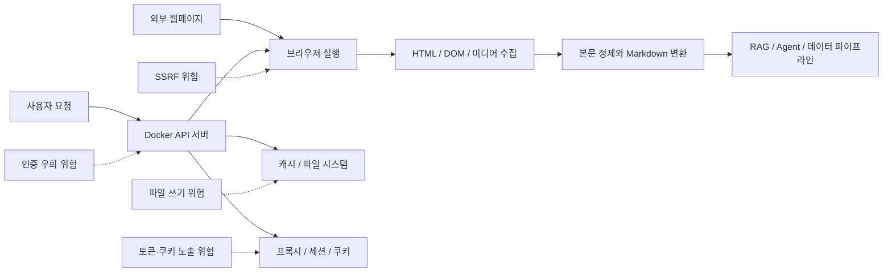

> 한 줄 요약: Crawl4AI가 GitHub Trending에 오른 일은 웹 크롤러 하나의 인기보다, AI 제품에서 데이터 수집을 누가 통제하고 책임질 것인지 묻는 사례에 가깝다.

## 무슨 일이 있었나

Crawl4AI는 LLM에 넣기 쉬운 웹 크롤러와 스크레이퍼를 내세우는 오픈소스 Python 프로젝트다. 제공된 GitHub Trending 스냅샷 기준으로 별은 71,680개, 하루 증가분은 195개다. 프로젝트 설명은 웹페이지를 RAG, 에이전트, 데이터 파이프라인에 넣기 쉬운 Markdown으로 바꿔주는 도구라는 점에 맞춰져 있다.

관련된 쪽은 `unclecode/crawl4ai` 프로젝트와 이를 쓰는 개발자 커뮤니티다. 범위도 단순 CLI 도구에 그치지 않는다. Python 패키지, Docker API 서버, 브라우저 자동화, 프록시, 세션, 쿠키, LLM 기반 추출, CSS/XPath 기반 추출까지 묶여 있다.

확인된 내용은 다음과 같다.

- v0.9.1은 Docker, 브라우저, 코어 영역의 버그 12개를 고친 패치 릴리스로 소개됐다.
- v0.9.0은 Docker API 서버를 secure-by-default 방향으로 바꾼 릴리스로 설명된다.
- v0.8.7은 RCE, SSRF, 인증 우회, 파일 쓰기, XSS, 하드코딩된 JWT 시크릿 등 Docker API 취약점 대응을 포함한 보안 강화 릴리스로 소개됐다.
- 프로젝트는 Cloud API 비공개 베타를 예고했고, 후원 tiers도 운영하고 있다.
- 설치와 사용은 `pip install`, `crawl4ai-setup`, Python API, CLI, Docker 흐름으로 안내된다.

분리해서 봐야 할 부분도 있다. GitHub Trending에 오른 이유가 보안 릴리스 때문인지, Cloud API 예고 때문인지, LLM 데이터 파이프라인 수요 때문인지는 자료만으로 단정하기 어렵다. 다만 README에 드러난 방향은 비교적 분명하다. 누구나 오픈소스로 직접 크롤링할 수 있게 하고, 플랫폼 쪽에서는 대규모 추출 비용을 낮추겠다는 쪽이다.

원문에 나온 가장 짧은 사용 예시는 이렇다.

```python
import asyncio
from crawl4ai import *

async def main():
    async with AsyncWebCrawler() as crawler:
        result = await crawler.arun(
            url="https://www.nbcnews.com/business",
        )
        print(result.markdown)

if __name__ == "__main__":
    asyncio.run(main())
```

CLI 사용 흐름도 간단하다.

```bash
crwl https://www.nbcnews.com/business -o markdown
crwl https://docs.crawl4ai.com --deep-crawl bfs --max-pages 10
crwl https://www.example.com/products -q "Extract all product prices"
```

겉으로는 웹페이지를 Markdown으로 바꾸는 도구다. 커뮤니티가 반응한 지점은 그보다 넓다. LLM 애플리케이션에서 웹 데이터 수집은 이제 부가 기능이 아니다. 답변 품질, 비용, 법적 리스크, 보안 운영을 함께 건드리는 앞단 인프라가 됐다.

## 왜 사람들이 반응했나

첫 반응은 비용과 통제권에서 나온다. 많은 팀이 RAG(Retrieval-Augmented Generation)를 만들 때 처음에는 검색 API나 SaaS 추출 API를 붙인다. 시작은 빠르다. 하지만 페이지 수가 늘고 재수집 주기가 짧아지면 비용과 제한이 곧바로 드러난다.

Crawl4AI가 “zero keys”, “deploy anywhere”, “no lock-in”을 앞세우는 이유도 여기에 있다. 개발자는 데이터를 가져오는 경로를 직접 소유하고 싶어 한다. 내부 지식베이스, 경쟁사 가격 모니터링, 문서 동기화, 리서치 자동화처럼 반복 수집이 필요한 일에서는 API 호출 단가가 제품 구조를 바로 제한한다.

사용성도 크다. 예전의 크롤러는 HTML을 가져온 뒤 파싱 규칙을 직접 짜는 도구에 가까웠다. 지금 필요한 것은 HTML 자체보다 LLM에 넣기 좋은 텍스트다. 제목, 표, 코드, 링크, 본문과 광고의 구분, citation hints 같은 후처리가 품질을 좌우한다.

Crawl4AI가 Markdown Generation, Fit Markdown, BM25 기반 필터링, CSS 기반 추출, LLM-driven extraction을 한 화면에 묶어 보여주는 이유도 이 때문이다. 이제 크롤링의 경쟁력은 요청 성공률에서 끝나지 않는다. 모델 입력으로 들어가기 전 정보 밀도까지 봐야 한다.

보안 문제도 빼놓기 어렵다. README에 드러난 릴리스 이력만 봐도 이 프로젝트의 긴장은 기능보다 운영 표면에서 나온다. Docker API 서버, 원격 브라우저 제어, 프록시, 쿠키, 세션, 파일 캐시, CORS, 정적 파일 서빙은 모두 편리하지만 위험한 조합이다.

특히 v0.8.7에 나열된 RCE(Remote Code Execution), SSRF(Server-Side Request Forgery), 인증 우회, 파일 쓰기, XSS(Cross-Site Scripting), 하드코딩된 JWT 시크릿은 가벼운 버그 목록이 아니다. 크롤러가 서버 형태로 배포되는 순간, 그것은 외부 URL을 대신 열어주는 브라우저이자 내부 네트워크에 접근할 수 있는 프록시가 된다.

v0.9.0에서 “request body is now an untrusted trust boundary”라고 방향을 잡은 것도 같은 맥락이다. 요청 본문을 단순 설정값으로 보지 않고, 공격자가 조작할 수 있는 입력으로 본다는 뜻이다. 이 전환은 도구가 성숙해지고 있다는 신호지만, 이전 구조가 얼마나 위험해질 수 있었는지도 같이 보여준다.

커뮤니티가 이런 프로젝트에 몰리는 이유는 기대와 불안이 함께 있기 때문이다. 오픈소스라서 고칠 수 있고, 직접 배포할 수 있고, 비용을 낮출 수 있다. 반대로 잘못 열어두면 내부망 스캔기, 토큰 탈취 경로, 파일 쓰기 취약점으로 바뀔 수 있다.



## 내가 보는 핵심

이번 이슈의 핵심은 웹 크롤러가 다시 제품 인프라의 앞단으로 올라왔다는 점이다. 예전에는 크롤러가 데이터 팀의 배치 작업처럼 보였다. 지금은 AI 제품의 답변 품질, 최신성, 비용, 감사 가능성을 결정하는 파이프라인이다.

현업에서 비슷한 고민을 하다 보면 처음에는 “페이지를 잘 긁어오느냐”만 본다. 운영에 들어가면 질문이 달라진다.

- 같은 URL을 얼마나 자주 다시 가져올 것인가
- robots.txt, 로그인 세션, 유료 콘텐츠, 약관을 어떻게 다룰 것인가
- 동적 페이지에서 어디까지 렌더링할 것인가
- 모델 입력으로 들어가기 전 광고, 메뉴, 추천글, 댓글을 어떻게 제거할 것인가
- 실패한 크롤을 재시도할 때 대상 사이트에 과부하를 주지 않을 것인가
- 크롤러 서버가 내부 네트워크로 요청을 보내지 못하게 막았는가
- 수집한 원문과 변환된 Markdown의 출처를 추적할 수 있는가

Crawl4AI가 흥미로운 이유는 이런 질문을 한 프로젝트 안에서 보여주기 때문이다. LLM-ready Markdown이라는 편한 입구가 있고, secure-by-default Docker API라는 운영 이슈가 있으며, Cloud API와 후원 모델이라는 지속 가능성 문제도 붙어 있다.

커뮤니티가 민감하게 보는 지점은 오픈소스와 플랫폼화의 경계다. 창작자는 “오픈소스는 접근성을 위한 것이고, 플랫폼은 비용을 낮추기 위한 것”이라고 설명한다. 납득할 수 있는 방향이다. 다만 사용자는 앞으로 몇 가지를 계속 보게 된다.

오픈소스 코어가 충분히 강하게 남는가. 클라우드 전용 기능이 핵심 기능으로 이동하지 않는가. 보안 패치가 무료 사용자에게도 같은 속도로 제공되는가. 대규모 사용자가 늘어날수록 프로젝트의 기본값이 개인 개발자보다 기업 고객에 맞춰지지는 않는가.

이 질문은 Crawl4AI만의 문제가 아니다. AI 인프라 오픈소스가 인기를 얻은 뒤 Cloud API, 엔터프라이즈 지원, 후원 tiers를 붙이는 흐름은 이미 반복되고 있다. 상업화 자체가 문제는 아니다. 사용자가 의존한 자동화 경로가 어느 순간 가격, 인증, 정책 변경에 묶일 수 있다는 점이 문제다.

그래서 이번 Trending은 “좋은 크롤러가 나왔다”는 소식보다 “AI 데이터 파이프라인의 소유권을 어디에 둘 것인가”라는 질문에 가깝다.

## 앞으로 볼 기준

다음에 비슷한 AI 크롤러, 웹 스크레이퍼, 데이터 추출 플랫폼 뉴스를 볼 때는 기능 목록보다 기본값을 먼저 봐야 한다. 특히 Docker API 서버나 원격 브라우저 기능이 있다면 설치 직후 어떤 주소에 바인딩되는지, 인증이 기본으로 켜져 있는지, 토큰 없이 접근 가능한 엔드포인트가 있는지 확인해야 한다.

두 번째는 입력 경계다. URL, 헤더, 쿠키, 프록시, 스크립트, 파일 경로, 캐시 키가 모두 사용자 입력으로 들어올 수 있다. 크롤러는 신뢰할 수 없는 웹을 읽는 도구이면서, 신뢰할 수 없는 사용자 요청을 실행하는 도구이기도 하다. 이중 경계를 놓치면 보안 사고가 기능 뒤에 따라붙는다.

세 번째는 추출 품질의 검증 방식이다. Markdown이 예쁘게 나오는 것과 사실을 빠뜨리지 않는 것은 다르다. RAG에 넣을 자료라면 원문 URL, 수집 시각, 추출 규칙, 삭제된 영역, 실패 로그를 남겨야 한다. 나중에 모델 답변이 틀렸을 때 원인이 원문인지, 크롤러인지, 청킹인지, 검색 랭킹인지 추적할 수 있어야 한다.

네 번째는 법적·정책적 범위다. 공개 웹이라고 해서 모두 자유롭게 수집해도 된다는 뜻은 아니다. 로그인 세션, 유료 콘텐츠, 개인정보, 저작권이 있는 본문, 사이트 약관, rate limit은 따로 판단해야 한다. 기술적으로 가능한 일과 제품에 넣어도 되는 일 사이에는 운영자가 책임져야 할 간격이 있다.

마지막은 의존성의 방향이다. 오픈소스를 직접 운영할지, Cloud API를 쓸지, 기존 SaaS를 쓸지는 상황마다 다르다.

| 선택지 | 장점 | 감수할 점 |
|---|---|---|
| 직접 운영 | 통제권, 비용 예측, 커스터마이징 | 보안 패치, 장애 대응, 스케일링 부담 |
| Cloud API | 빠른 도입, 운영 부담 감소 | 가격 정책, rate limit, 데이터 처리 조건 |
| 기존 SaaS | 안정성, 지원, 관리 기능 | 락인, 세밀한 제어 한계 |
| 자체 개발 | 요구사항 최적화 | 유지보수 비용과 보안 리스크 |

Crawl4AI 같은 프로젝트가 인기를 얻는 것은 개발자들이 다시 직접 도구를 잡고 싶어 한다는 신호다. 하지만 직접 잡는 순간 책임도 같이 온다. 웹을 Markdown으로 바꾸는 첫 성공보다, 그 파이프라인을 누가 호출할 수 있고 어디까지 접근할 수 있는지를 먼저 정해야 한다.

AI 제품의 품질은 모델만으로 정해지지 않는다. 모델 앞에 들어가는 데이터 수집기가 얼마나 정직하고 안전하며 추적 가능한지가 답변의 바닥을 만든다. 이번 이슈가 남기는 질문은 단순하다. 내 서비스의 지식은 남의 API 제한 위에 있는가, 아니면 내가 설명할 수 있는 파이프라인 위에 있는가.

## 참고 자료

- [선정 글감] [#9 unclecode/crawl4ai](https://github.com/unclecode/crawl4ai), GitHub Trending