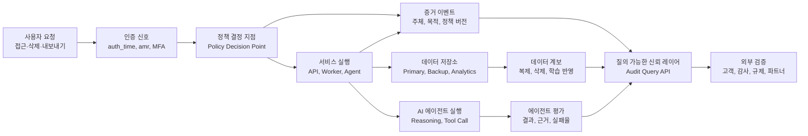

> 한 줄 요약: 신뢰는 감사 로그를 많이 쌓는 일이 아니라, 특정 사용자·시점·행위에 대해 시스템이 답할 수 있게 만드는 구조다. 다만 모든 것을 기록하려 들면 데이터 과잉 수집과 운영 부채로 쉽게 바뀐다.

## 왜 지금 이슈인가

엔지니어링 신뢰, AI 에이전트 거버넌스, 감사 로그, OIDC 세션 메타데이터는 서로 다른 주제처럼 보인다. 실무에서 마주치는 질문은 결국 하나다.

“이 시스템이 그때 맞게 동작했다는 것을 지금 증명할 수 있는가?”

이 글에서 참고한 사례는 운동선수 데이터를 다루는 플랫폼이다. 내부적으로는 접근 제어(Role-Based Access Control), 공유 정책, 삭제 절차가 갖춰져 있었다. 문제는 선수 노조가 한 선수의 특정 날짜 데이터 접근 기록, 외부 파트너 공유 여부, 삭제 요청이 백업·분석 복제본·학습된 모델에 어떻게 반영됐는지 요구하면서 드러났다.

시스템은 실제로는 맞게 동작했을 수 있다. 하지만 그 자리에서 보여주지 못했다. 이 차이가 중요하다.

개발자 커뮤니티에서 이런 이야기가 계속 나오는 이유도 여기에 있다. 많은 팀이 이미 인증, 권한, 로그, 배포 보안, 관측성(Observability)을 갖추고 있다. 그런데 고객, 감사인, 규제기관, 내부 보안팀이 요구하는 것은 “정책이 있다”가 아니라 “그 정책이 이 사건에 적용됐다는 증거”다.

특히 AI 에이전트가 경보를 분류하고, 탐지 규칙을 만들고, 운영 액션까지 수행하는 환경에서는 이 차이가 더 커진다. 에이전트가 허용된 작업만 했는지와 그 작업을 제대로 했는지는 별개의 문제다.

## 커뮤니티에서 갈리는 지점

### 신뢰는 코드로 만들 수 있을까?

한쪽은 신뢰를 엔지니어링 산출물로 봐야 한다고 말한다. 접근 기록, 정책 결정, 데이터 계보(Lineage), 삭제 상태, 인증 강도 같은 증거가 런타임에서 계속 생성되어야 한다는 관점이다.

반대쪽 우려도 타당하다. 모든 것을 증명하려고 하면 시스템은 금세 로그 저장소, 감사 파이프라인, 정책 엔진, 데이터 카탈로그, SIEM(Security Information and Event Management)의 묶음으로 커진다. 운영팀은 제품 기능보다 증거 생산에 더 많은 시간을 쓰게 된다.

그래서 이 주제는 “신뢰를 만들자”보다 “무엇까지 증명해야 하는가”에서 시작하는 편이 낫다.

| 질문 | 좋은 방향 | 위험한 방향 |
| --- | --- | --- |
| 누가 접근했나 | 주체, 시각, 목적, 권한 근거를 남긴다 | 모든 쿼리 본문과 민감 값을 통째로 저장한다 |
| 인증은 충분했나 | `auth_time`, `amr` 같은 세션 신호로 위험도를 판단한다 | 로그인 여부만 보고 고위험 작업을 허용한다 |
| 비밀 값은 노출되지 않았나 | 빌드 로그에서 민감 환경 변수 값을 마스킹한다 | 로그를 디버깅 편의 저장소처럼 쓴다 |
| AI 에이전트는 잘 판단했나 | reasoning, 입력, 출력, 평가 결과를 분리해 추적한다 | 승인 등급만 정하고 품질 평가는 생략한다 |

Google의 Sign in with Google 변경은 이 흐름을 잘 보여준다. 새 OIDC(OpenID Connect) 클레임인 `auth_time`과 `amr`은 사용자가 언제 인증했는지, 어떤 인증 방식을 썼는지를 애플리케이션 백엔드에 전달한다. 이 신호가 있으면 송금, 관리자 권한 변경, 민감 데이터 내보내기 같은 작업에서 단계적 추가 인증(Step-up Authentication)을 요구할 수 있다.

Vercel의 빌드 로그 민감 환경 변수 마스킹도 같은 축에 있다. 민감 값으로 표시된 환경 변수가 32자 이상이면 배포 로그에서 `[REDACTED]`로 대체하고, 마스킹이 일어났다는 사실은 보여주되 실제 값은 남기지 않는다. 증거를 남기면서도 증거 자체가 유출 경로가 되지 않게 만든 사례다.

Elastic의 AI 에이전트 거버넌스 글은 한 단계 더 들어간다. 에이전트가 낮은 위험 작업을 자동으로 처리하고 높은 위험 작업은 사람 승인을 받게 하는 티어 모델만으로는 부족하다고 지적한다. 모든 알림을 오탐으로 분류하는 에이전트도 허용된 범위 안에서만 움직일 수 있다. 하지만 그 판단이 틀렸다면 거버넌스는 실패한 것이다.

여기서 커뮤니티의 갈등이 선명해진다. 자동화는 필요하다. 동시에 자동화가 내린 판단을 검증하는 인프라도 필요하다. 그런데 검증 인프라를 잘못 만들면 또 다른 감시 시스템과 데이터 부채가 된다.

## 아키텍처 관점에서 볼 점

### 감사 로그만으로 엔지니어링 신뢰를 만들 수 있을까?

감사 로그(Audit Log)는 필요하지만 충분하지 않다. 로그는 사건의 조각이다. 신뢰를 만들려면 그 조각이 권한, 데이터 계보, 정책 결정, 인증 상태, 배포 환경과 연결되어야 한다.

운영에서 자주 생기는 문제는 각 팀이 각자 맞는 말을 한다는 데 있다.

보안팀은 IdP(Identity Provider)에 로그인 기록이 있다고 말한다. 플랫폼팀은 Kubernetes 감사 로그가 있다고 말한다. 데이터팀은 웨어하우스 쿼리 로그가 있다고 말한다. ML팀은 학습 데이터 스냅샷을 따로 관리한다고 말한다. 그런데 특정 사용자의 삭제 요청이 전체 경로에서 어떻게 처리됐는지 묻는 순간, 답은 여러 시스템을 수동으로 이어 붙여야 나온다.

신뢰를 산출물로 보려면 이벤트를 쌓기 전에 질문 모델부터 정해야 한다.

이 구조에서 중요한 것은 로그의 양이 아니다.

첫째, 정책 결정 지점(Policy Decision Point)이 남긴 증거와 실제 서비스 실행 결과가 같은 식별자를 공유해야 한다. 요청 ID, 사용자 ID, 리소스 ID, 정책 버전이 서로 이어지지 않으면 나중에 재구성 비용이 커진다.

둘째, 데이터 계보가 운영 이벤트와 분리되면 삭제 증명이 어려워진다. 기본 데이터베이스에서 삭제됐다는 사실과 분석 테이블, 백업, 검색 인덱스, 피처 스토어(Feature Store), 모델 학습 데이터에서 어떻게 처리됐는지는 별도 문제다.

셋째, AI 에이전트는 일반 서비스보다 더 많은 설명 가능성을 요구한다. 입력 프롬프트와 도구 호출(Tool Call), 검색된 컨텍스트, 최종 액션, 평가 결과가 섞이면 안 된다. 민감 데이터는 보호하면서도 판단 과정은 검토할 수 있어야 한다.

넷째, 증거 저장소 자체가 공격 표면이 된다. 빌드 로그에서 환경 변수 값을 마스킹하는 사례가 작아 보여도 실제로는 중요한 원칙을 말한다. 증거는 남겨야 하지만, 비밀 값과 개인정보를 증거라는 이름으로 다시 노출해서는 안 된다.

### Kubernetes와 인프라에서는 어디에 붙여야 할까?

Kubernetes 환경이라면 최소한 세 지점에서 설계를 나눠야 한다.

- API 서버 감사 로그: 누가 어떤 리소스를 바꿨는지
- 워크로드 런타임 로그: 애플리케이션이 어떤 사용자 요청을 처리했는지
- 데이터 레이어 이벤트: 실제 데이터가 조회, 복제, 삭제, 내보내기 되었는지

셋 중 하나만 있어도 운영에는 도움이 된다. 하지만 신뢰 질의에는 부족하다. 예를 들어 Pod가 재시작된 기록만으로는 특정 고객 데이터가 외부 파트너에게 공유되지 않았음을 증명할 수 없다. 반대로 애플리케이션 로그만으로는 해당 작업이 어떤 배포 버전과 어떤 정책 번들에서 실행됐는지 설명하기 어렵다.

실제 설계에서는 OpenTelemetry 같은 관측성 표준, OPA(Open Policy Agent)나 Cedar 같은 정책 엔진, 클라우드 감사 로그, 데이터 카탈로그를 느슨하게라도 연결해야 한다. 처음부터 거대한 통합 플랫폼을 만들 필요는 없다. 가장 자주 요구되는 질문 하나를 골라 끝까지 답할 수 있게 만드는 편이 낫다.

예를 들면 “특정 사용자의 민감 데이터에 누가 접근했는가”를 첫 질의로 잡는다. 그다음 인증 신호, 권한 결정, 서비스 호출, 데이터 조회 이벤트를 하나의 타임라인으로 묶는다. 이 한 가지 질문도 자동으로 답하지 못한다면, 더 넓은 거버넌스 구호는 아직 이르다.

## 실무에서 볼 점

### 도입 전에 무엇을 확인해야 할까?

가장 먼저 확인할 것은 로그 수집기가 아니라 책임 경계다.

누가 접근 목적을 정의하는가. 누가 정책 버전을 승인하는가. 누가 삭제 완료를 선언하는가. 누가 AI 에이전트의 오판을 평가하는가. 이 질문에 답이 없으면 도구를 붙여도 증거는 흩어진다.

두 번째는 데이터 최소화다. 신뢰를 만들기 위해 모든 원문 데이터를 보관하면, 나중에는 그 증거 저장소가 가장 위험한 개인정보 저장소가 된다. 감사 이벤트에는 원문 값보다 참조 ID, 해시, 정책 버전, 상태 전이가 더 적합한 경우가 많다.

세 번째는 시간이다. `auth_time` 같은 인증 시각 신호는 “로그인한 사용자”와 “방금 강하게 인증한 사용자”를 구분하게 해준다. 관리자 설정 변경, 결제 수단 수정, 대량 다운로드처럼 피해가 큰 작업은 세션의 신선도(Freshness)를 봐야 한다.

네 번째는 실패 모드다. 증거 파이프라인에 장애가 생겼을 때 서비스 요청을 막을 것인지, 허용하되 위험 플래그를 남길 것인지 정해야 한다. 모든 감사 이벤트가 동기 경로에 있으면 장애가 서비스 장애로 번진다. 반대로 모두 비동기로 밀면 중요한 증거가 유실될 수 있다.

현업에서 비슷한 고민을 하다 보면 팀은 대개 둘 중 하나로 치우친다. 제품 속도를 위해 증거 생성을 나중으로 미루거나, 감사 대응을 위해 사용하기 어려운 통제 장치를 한 번에 붙인다. 둘 다 오래 버티기 어렵다. 신뢰 레이어는 제품 경로와 너무 멀어도 안 되고, 제품 경로를 매번 붙잡아서도 안 된다.

### AI 에이전트 거버넌스는 왜 더 까다로운가?

일반 백엔드 서비스는 입력과 출력의 관계가 비교적 안정적이다. AI 에이전트는 같은 도구를 호출하더라도 검색 컨텍스트, 모델 버전, 시스템 프롬프트, 정책 힌트에 따라 판단이 달라진다.

그래서 에이전트 거버넌스는 권한 등급만으로 끝나지 않는다.

- 어떤 데이터를 근거로 판단했는가
- 어떤 도구를 어떤 순서로 호출했는가
- 허용된 작업이었지만 품질이 낮지는 않았는가
- 사람 승인이 필요한 상황을 놓치지 않았는가
- 평가 데이터가 실제 운영 분포를 반영하는가

Elastic 글의 지적처럼, 낮은 위험 작업을 자동으로 허용하는 모델은 필요한 출발점이다. 하지만 에이전트가 계속 오판해도 승인 게이트를 건드리지 않는다면 시스템은 조용히 나빠진다. 신뢰는 허용 목록이 아니라 지속적인 평가에서 나온다.

Kent Beck이 AI 시대의 소프트웨어 엔지니어링을 두고 코드 생산보다 신뢰 형성을 강조한 맥락도 여기와 닿아 있다. 에이전트가 코드를 더 빨리 만들수록, 팀은 더 빨리 증명해야 한다. 테스트 자동화, 시나리오 기반 검증, 장애 주입, 회귀 탐지는 생산 속도를 따라잡기 위한 신뢰 장치다.

### 어떤 경우에는 안 하는 편이 낫다

모든 팀이 즉시 거버넌스 플랫폼을 만들 필요는 없다.

데이터 민감도가 낮고, 외부 감사 요구가 약하고, 고위험 자동화가 없다면 우선 기본 로그 품질과 권한 정리부터 하는 편이 낫다. 반대로 의료, 금융, 공공, 아동 데이터, 생체 데이터, 보안 운영처럼 특정 개인이나 조직에 직접 피해가 갈 수 있는 영역은 증거 생성이 제품 요구사항에 가깝다.

도입 조건은 이렇게 볼 수 있다.

| 조건 | 우선순위 |
| --- | --- |
| 개인정보 삭제·열람 요구가 자주 들어온다 | 높음 |
| AI 에이전트가 운영 액션을 수행한다 | 높음 |
| 여러 클라우드와 데이터 복제본이 있다 | 높음 |
| 인증 강도에 따라 작업 위험도가 달라진다 | 중간 이상 |
| 내부 운영자 접근이 민감한 데이터를 포함한다 | 높음 |
| 단순 정적 콘텐츠 서비스다 | 낮음 |

반대로 봐야 할 지점도 있다. 신뢰 엔지니어링은 조직의 불신을 기술로 덮는 장치가 아니다. 권한이 과도하고, 데이터 소유자가 없고, 삭제 정책이 불분명한 상태에서 감사 레이어만 붙이면 모순을 더 빨리 발견할 뿐이다.

## 정리

신뢰를 엔지니어링한다는 말은 감사 대시보드를 멋지게 만든다는 뜻이 아니다. 특정 사건에 대해 시스템이 스스로 설명할 수 있도록 인증, 정책, 데이터 계보, 관측성, 에이전트 평가를 연결한다는 뜻이다.

다만 이 작업에는 역방향 질문이 따라와야 한다. 이 증거는 누구에게 필요한가. 얼마 동안 보관해야 하는가. 원문 값 없이도 검증할 수 있는가. 증거 저장소가 새로운 유출 지점이 되지는 않는가.

당장 확인할 것은 하나다. “특정 사용자 한 명의 민감 데이터에 대해, 지난 30일 동안 누가 접근했고 어떤 정책으로 허용됐는지”를 한 번의 질의로 답할 수 있는지 점검해보면 된다. 그 답을 만들기 위해 필요한 빈칸이 현재 아키텍처의 신뢰 부채다.

## 참고 자료

- [선정 글감] [Trust Is an Engineering Output](https://dev.to/sakurasky/trust-is-an-engineering-output-4g06) - DEV Community
- [관련] [Enhance Security and Trust: New Session Metadata in Sign in with Google](https://developers.googleblog.com/enhance-security-and-trust-new-session-metadata-in-sign-in-with-google/) - Google Developers
- [관련] [Build logs now redact Sensitive Environment Variable values](https://vercel.com/changelog/build-logs-now-redact-sensitive-environment-variable-values) - Vercel Blog
- [관련] [The future of governing AI agents](https://www.elastic.co/blog/the-future-of-governing-ai-agents) - Elastic Blog
- [관련] [How Kent Beck shapes the software engineering industry](https://newsletter.pragmaticengineer.com/p/how-kent-beck-shapes-the-software) - The Pragmatic Engineer