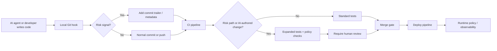

> 한 줄 요약: Git hooks는 AI 코드 리뷰, 테스트 자동화, 인프라 코드 배포를 연결하는 가까운 위험 감지 지점이다. 다만 훅 자체를 보안 장치로 믿으면 실패하고, 리뷰 라우팅과 증거 수집 장치로 설계해야 한다.

## 왜 지금 이슈인가

AI가 코드를 쓰기 시작하면서 Git workflow의 의미가 바뀌고 있다. 예전에는 커밋이 사람이 생각을 정리한 결과물에 가까웠다면, 이제는 AI 에이전트가 만든 패치, 사람이 부분 수정한 코드, 자동 생성된 인프라 코드(Infrastructure as Code)가 같은 브랜치에 섞인다.

선정 글감의 Diff Sniffer는 이 변화를 현실적인 수준에서 짚는다. 도구가 하는 일은 단순하다. AI가 작성한 커밋이고, 미리 지정한 위험 경로를 건드렸고, 사람 리뷰가 없을 때만 경고한다. AI 모델을 다시 호출하지 않고 Git trailer와 path glob만 본다.

흥미로운 지점은 여기다. 문제는 AI 코드인지 아닌지 판정하는 데 있지 않다. 어떤 변경이 사람의 확인 없이 main에 가까워지고 있는지 모른다는 데 있다.

Git hooks는 이 지점에 걸린다. `pre-commit`, `post-commit`, `pre-push` 같은 훅은 개발자 로컬에서 동작한다. 플러그인 서버도, 별도 API도 필요 없다. `.git/hooks/` 아래 실행 파일을 두면 Git이 정해진 시점에 호출한다.

그래서 Git hooks는 갑자기 새로워진 기술이라기보다, AI 에이전트 시대에 다시 쓰임새가 커진 얇은 제어 지점에 가깝다. 코드를 막기보다 변경의 맥락을 붙이고, 위험한 변경을 라우팅하고, CI/CD가 볼 수 있는 단서를 남긴다.

## 커뮤니티에서 갈리는 지점

Git hooks를 AI 코드 리뷰와 테스트 자동화에 쓰자는 이야기는 곧바로 두 갈래로 갈린다.

한쪽은 로컬에서 빠르게 막자는 입장이다. 비밀키, 마이그레이션, Terraform, Kubernetes 매니페스트, 결제 로직처럼 위험한 경로는 커밋이나 푸시 전에 검사하는 편이 낫다. CI까지 가서 실패하는 것보다 개발자 손에 있을 때 피드백을 주는 쪽이 비용이 낮다.

다른 쪽은 로컬 훅을 믿지 말자는 입장이다. 이 비판도 맞다. Git hooks는 저장소에 자동으로 버전 관리되지 않고, 개발자가 우회할 수 있으며, 실행 환경도 제각각이다. `--no-verify` 한 번이면 많은 훅은 지나간다. 보안 경계(Security Boundary)로 삼기에는 약하다.

갈등은 여기서 생긴다. 로컬 훅은 너무 가까워서 유용하지만, 너무 가까워서 신뢰하기 어렵다.

이 문제는 OpenAI의 SWE-Bench Pro 관련 논의와도 닿아 있다. 보조 레퍼런스에서는 731개 작업 중 약 30%가 깨진 과제로 분류됐고, 실패 유형으로 과도하게 엄격한 테스트, 요구사항이 부족한 프롬프트, 낮은 테스트 커버리지, 오해를 부르는 프롬프트가 언급된다. 핵심은 AI가 틀렸다는 단순한 이야기가 아니다. 평가와 테스트가 실제 능력을 제대로 재는 구조인지가 흔들린 것이다.

현업에서도 비슷한 일이 벌어진다. 훅이나 CI가 초록색이라고 해서 변경이 안전하다는 뜻은 아니다. 테스트가 특정 구현만 강제하거나, 숨은 요구사항을 코드 작성자에게 알려주지 않거나, 위험한 경로를 놓치면 자동화는 안전망이 아니라 착시가 된다.

Stack Overflow Blog의 인프라 코드 논의도 같은 축에 있다. AI가 IaC를 작성하고 배포하는 상황에서는 누구나 배포할 수 있다는 감각이 생기지만, 가드레일은 그 속도를 따라가지 못할 수 있다. 결국 깊은 시스템 지식은 사라지는 것이 아니라, 자동화가 어디까지 판단해도 되는지 정하는 기준으로 이동한다.

정리하면 쟁점은 Git hooks를 쓸지 말지가 아니다. 어느 결정을 로컬에서 내리고, 어느 결정은 CI와 코드 오너(Code Owner), 배포 승인, 런타임 정책으로 넘길지다.

| 판단 지점 | Git hooks에 적합 | Git hooks에 부적합 |
|---|---|---|
| 빠른 피드백 | 포맷, 시크릿 패턴, 위험 경로 감지 | 최종 보안 승인 |
| AI 변경 추적 | 커밋 trailer 확인, 생성 도구 표식 검사 | AI 작성 여부의 절대 판정 |
| 리뷰 라우팅 | 특정 경로 변경 시 리뷰 요구 표시 | 리뷰 완료 여부의 단독 보증 |
| 인프라 코드 | Terraform/Kubernetes 파일 변경 감지 | 실제 클러스터 정책 강제 |
| 테스트 자동화 | 관련 테스트 실행 제안 | 릴리스 품질의 최종 판단 |

## 아키텍처 관점에서 볼 점

AI 코드 변경을 다루는 Git hooks 아키텍처는 탐지, 표식, 검증, 라우팅으로 나눠서 봐야 한다.

가장 피해야 할 설계는 훅 하나가 모든 것을 판단하게 만드는 방식이다. 로컬 훅은 빠르지만 약하다. CI는 느리지만 기록이 남고 강제력이 있다. 코드 리뷰 시스템은 사람의 판단을 넣을 수 있지만 병목이 된다.

그래서 역할을 나누는 편이 낫다.

이 구조에서 로컬 훅은 판사가 아니라 신고자다. 커밋 메시지에 trailer를 붙이거나, 위험 경로 변경을 감지하거나, 푸시 전에 경고를 띄운다. 최종 판단은 CI와 리뷰 정책이 한다.

예를 들어 Diff Sniffer식 조건은 다음처럼 해석할 수 있다.

- AI 작성 흔적이 있는가
- `infra/`, `k8s/`, `migrations/`, `auth/`, `billing/` 같은 위험 경로를 건드렸는가
- 사람 리뷰를 요구하거나 완료했다는 표식이 없는가

세 조건이 모두 참일 때만 경고하는 방식은 실무적으로 설득력이 있다. AI가 쓴 모든 코드를 막으면 금방 무시된다. 위험 경로의 모든 변경을 막아도 병목이 된다. 사람 리뷰가 없는 위험한 AI 변경만 잡으면 신호 대비 소음 비율이 좋아진다.

다만 커밋 trailer에 기대는 설계는 조심해야 한다. trailer는 사람이 수정할 수 있다. AI 에이전트가 남긴 표식도 도구마다 다를 수 있다. 따라서 trailer는 증거가 아니라 힌트로 다뤄야 한다.

아키텍처적으로는 같은 규칙을 두 번 적용하는 구조가 안전하다.

첫 번째는 로컬에서 빠르게 알려주는 훅이다. 두 번째는 서버 쪽 CI에서 같은 규칙을 다시 검증하는 단계다. 로컬은 편의를 담당하고, 서버는 기록과 강제력을 담당한다.

Kubernetes나 Terraform 같은 인프라 코드라면 한 단계가 더 필요하다. 파일 변경 여부만 보는 것으로는 부족하다. 실제 리소스 차이, 권한 확대, 네트워크 정책 변경, 공개 엔드포인트 생성 여부를 plan이나 policy-as-code로 확인해야 한다.

예를 들어 `Deployment`의 replica 수 변경과 `ClusterRole`의 권한 확대는 같은 YAML 수정이지만 위험도는 다르다. Git hooks가 둘을 같은 수준으로 경고하면 개발자는 곧 무시하게 된다. 위험 분류는 경로뿐 아니라 리소스 종류와 변경 의미까지 봐야 한다.

## 실무에서 볼 점

Git hooks를 도입할 때 첫 질문은 어떤 훅을 쓸까가 아니다. 어떤 실패를 줄이고 싶은가다.

AI 에이전트가 만든 코드를 걱정한다면 AI 여부만 보면 부족하다. 사람이 작성한 코드도 위험할 수 있고, AI가 만든 코드도 단순 문서 수정일 수 있다. 더 나은 기준은 변경 대상, 검증 상태, 배포 영향이다.

실제로는 이런 조건을 먼저 정하는 편이 낫다.

- 위험 경로: `infra/`, `.github/workflows/`, `k8s/`, `terraform/`, `db/migrations/`, `auth/`, `payments/`
- 위험 변경: 권한 확대, 네트워크 노출, 데이터 삭제, 스키마 변경, 배포 파이프라인 변경
- 요구 증거: 관련 테스트 실행, plan 결과, 보안 스캔, 사람 리뷰, 이슈 링크
- 우회 정책: 긴급 수정 시 누가, 어떤 기록을 남기고 우회할 수 있는지

여기서 우회 정책은 빠지기 쉽다. 하지만 우회할 수 없는 훅은 곧 방해물로 취급되고, 우회 기록이 없는 훅은 운영 리스크를 숨긴다. `--no-verify`를 금지한다고 해결되지 않는다. 서버 쪽에서 위험 변경을 다시 확인하고, 우회 사유를 PR 템플릿이나 CI 로그에 남기는 쪽이 낫다.

테스트 자동화도 같은 관점으로 봐야 한다. SWE-Bench Pro 논의가 보여준 것처럼 테스트가 있다고 해서 평가가 공정한 것은 아니다. 과도하게 구현 세부사항을 강제하는 테스트는 AI뿐 아니라 사람에게도 잘못된 신호를 준다. 반대로 커버리지가 낮은 테스트는 틀린 변경을 통과시킨다.

AI 코드 리뷰를 위한 훅을 만든다면 이런 실패 모드를 체크리스트로 삼을 수 있다.

| 리스크 | 훅에서 할 일 | CI에서 할 일 |
|---|---|---|
| AI 생성 코드가 위험 경로 수정 | 커밋 전 경고, trailer 확인 | 코드 오너 리뷰 필수 |
| 테스트가 너무 좁음 | 관련 테스트 실행 안내 | 커버리지와 변경 기반 테스트 확장 |
| 요구사항이 불명확함 | 이슈 링크나 PR 설명 요구 | 리뷰어가 수용 기준 확인 |
| 인프라 코드 오작동 | plan 실행 안내 | policy-as-code와 승인 게이트 |
| 훅 우회 | 로컬 경고만 제공 | 서버에서 동일 규칙 재검증 |

도입 조건도 분명하다. 저장소 규모가 작고 모든 변경을 한두 명이 보는 팀이라면 복잡한 훅 체계는 과하다. 반대로 AI 에이전트가 PR을 만들고, 인프라 코드와 애플리케이션 코드가 한 저장소에 있으며, 배포가 자주 일어나는 환경에서는 최소한의 위험 라우팅이 필요하다.

Git hooks만으로 시작할 수는 있다. 하지만 거기서 끝내면 안 된다. Husky, pre-commit, Lefthook 같은 훅 관리 도구를 쓰든 직접 스크립트를 쓰든, 최종 규칙은 CI에서 재현 가능해야 한다. 개발자 로컬에만 있는 안전장치는 감사도, 복구도 어렵다.

또 하나의 함정은 AI 감지에 집착하는 것이다. AI가 작성했는지 완벽히 판별하려는 순간 도구는 복잡해지고 신뢰도는 애매해진다. 차라리 위험 변경이 사람 검토 없이 들어오는지를 보는 편이 더 안정적이다.

현업에서 비슷한 고민을 하다 보면 자동화의 목표가 사람을 제거하는 것이 아니라, 사람이 봐야 할 변경을 줄 세우는 데 있다는 쪽으로 정리된다. 특히 인프라, 보안, 데이터베이스 변경은 자동 승인보다 자동 분류가 먼저다.

## 정리

Git hooks는 AI 에이전트 시대의 최종 방어선이 아니다. 가장 가까운 감지 지점이다.

로컬 훅은 빠른 피드백을 주고, CI는 같은 규칙을 재검증하고, 리뷰 정책은 위험한 변경에 사람의 판단을 붙여야 한다. 테스트 자동화와 인프라 코드 가드레일도 이 구조 안에서 봐야 한다.

당장 확인할 것은 하나다. 저장소에서 AI가 작성했든 사람이 작성했든, 사람 리뷰 없이 들어오면 안 되는 경로가 어디인지 목록으로 적어보자. 그 목록이 없다면 Git hooks보다 먼저 위험 모델이 비어 있는 것이다.

## 참고 자료

- [선정 글감] [TIL Git Hooks Exist (After a Decade of Using Git)](https://dev.to/coder_b/til-git-hooks-exist-after-a-decade-of-using-git-d1j): DEV Community
- [관련] [OpenAI just found ~30% of SWE-Bench Pro is broken — and retracted their own recommendation](https://dev.to/thegatewayguy/openai-just-found-30-of-swe-bench-pro-is-broken-and-retracted-their-own-recommendation-3nlh): DEV Community
- [관련] [What's left for infrastructure-as-code after AI moves in?](https://stackoverflow.blog/2026/07/08/what-s-left-for-infrastructure-as-code-after-ai-moves-in/): Stack Overflow Blog