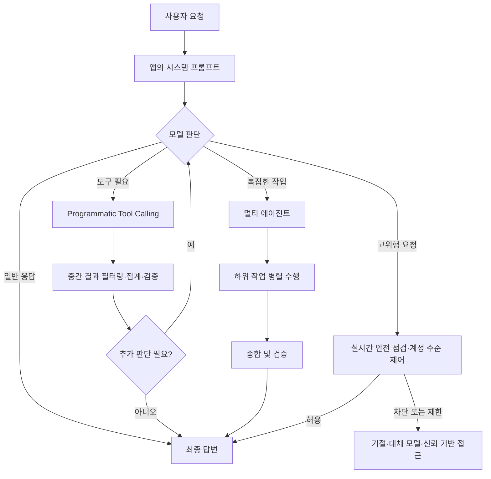

> 한 줄 요약: GPT-5.6 발표에서 실무자가 봐야 할 쟁점은 성능 수치보다 모델과 애플리케이션 사이의 계약이 바뀐다는 점이다. 짧은 프롬프트, Programmatic Tool Calling, 멀티 에이전트, 신뢰 기반 접근은 모두 덜 지시하고 더 많이 맡기는 방향을 가리킨다.

## 무슨 일이 있었나

OpenAI는 2026년 7월 9일 GPT-5.6 모델군을 일반 공개했다. 구성은 플래그십 모델 Sol, 일상 작업용 균형 모델 Terra, 비용 효율 모델 Luna다.

공개 범위는 ChatGPT, ChatGPT Work, Codex, OpenAI API다. API에서는 Responses API로 Programmatic Tool Calling과 멀티 에이전트 베타를 제공한다고 밝혔다. Codex와 ChatGPT Work에는 `max`, `ultra` 같은 고급 추론 설정도 들어간다.

확인된 내용은 크게 다음 축으로 나뉜다.

| 영역 | 확인된 내용 | 실무 영향 |
|---|---|---|
| 모델 제품 | Sol, Terra, Luna 3개 티어 공개 | 최신 모델 하나를 고르는 문제가 아니라 비용, 속도, 품질을 함께 따지는 문제가 됨 |
| 프롬프트 가이드 | 짧은 프롬프트가 내부 평가에서 더 좋은 결과와 낮은 비용을 냈다고 설명 | 기존 장문 시스템 프롬프트를 그대로 쓰면 이득이 줄거나 동작이 달라질 수 있음 |
| 도구 실행 | Programmatic Tool Calling, 멀티 에이전트 베타, `ultra` 공개 | 모델이 도구 호출을 더 직접 조율하는 구조가 됨 |
| 안전 장치 | 사이버보안과 생물/화학 리스크에서 High capability로 분류 | 보안 연구, 악성 사용 탐지, 신뢰 기반 접근이 제품 운영 이슈가 됨 |

OpenAI의 모델 가이드에서 논쟁이 붙은 부분은 프롬프트다. 내부 평가에서 긴 시스템 프롬프트를 최소 프롬프트로 바꿨을 때 점수가 10~15% 개선되고, 전체 토큰은 41~66%, 비용은 33~67% 줄었다고 적었다.

또 하나는 `"Be concise"`, `"Keep it short"` 같은 일반적인 짧게 쓰기 지시를 피하라는 안내다. GPT-5.6은 이미 압축 쪽으로 기울어져 있어서, 이런 지시가 반복 설명을 줄이는 데 그치지 않고 필요한 산출물까지 줄일 수 있다는 설명이다.

Hacker News에서도 반응은 성능표보다 이 대목에 더 많이 붙었다. 확인 시점 기준 GPT-5.6 글은 576 points와 390 comments를 기록했고, 댓글 초반부는 짧은 프롬프트 권장, 간결성 지시의 의미 변화, 비용 인센티브, 사용자의 모호한 의도를 모델이 추정하는 방식에 대한 토론으로 이어졌다.

여기서부터는 해석이다. GPT-5.6이 더 똑똑한지보다, 개발자가 모델에게 무엇을 명시해야 하고 무엇을 맡겨도 되는지의 경계가 다시 그어지고 있다. 이 경계가 흔들리면 프롬프트는 문장이 아니라 운영 계약이 된다.

## 왜 사람들이 반응했나

첫 번째 반응은 사용성의 역설이다. 모델이 더 잘 알아듣는다고 해서 사용자가 덜 신경 써도 되는 것은 아니다.

OpenAI는 GPT-5.6이 사용자의 의도와 기대 작업 수준을 더 잘 추론한다고 설명한다. 동시에 중요한 제약, 승인 경계, 성공 기준은 계속 명시하라고 말한다. 겉으로는 편해졌지만 실제 운영에서는 질문이 바뀐다.

- 이 요구사항은 모델이 추정해도 되는가
- 이 제약은 반드시 고정해야 하는가
- 모델이 더 짧게 답해도 되는가
- 누락되면 장애나 책임 문제가 되는 정보는 무엇인가

커뮤니티가 불편해한 것도 이 부분이다. “짧게 답해” 같은 평범한 지시가 모델 버전에 따라 다른 의미를 갖는다면, 기존 프롬프트 자산의 신뢰도는 내려간다. 프롬프트가 제품 로직 일부라면 모델 업그레이드는 라이브러리 패치가 아니라 동작 계약 변경이다.

두 번째 반응은 비용과 품질의 균형이다. OpenAI는 성능당 비용, 작업당 비용, 토큰 효율을 강하게 내세웠다. 개발자에게는 반가운 방향이다. LLM 제품의 비용은 입력 토큰, 출력 토큰, 추론 노력, 도구 호출, 재시도 횟수까지 합쳐져 금방 커진다.

다만 커뮤니티에서는 이런 의심도 나온다. 모델 회사가 말하는 비용 효율은 사용자에게 돌아오는가, 아니면 공급자의 마진 개선으로 끝나는가. 이 질문은 냉소만은 아니다. 실제 제품에서는 비용 절감이 품질 저하, 근거 누락, 과도한 압축으로 나타날 수 있다.

세 번째 반응은 권한의 이동이다. Programmatic Tool Calling은 모델이 중간 결과를 코드로 처리하고 필요한 정보만 남기는 방식이다. 멀티 에이전트는 여러 하위 작업을 병렬로 나눠 처리한다. `ultra`는 기본적으로 4개 에이전트를 조율한다고 설명됐다.

이 구조는 유용하지만 권한도 함께 이동한다. 예전에는 개발자가 워크플로를 직접 쪼개고, 모델은 각 단계의 텍스트 판단을 맡았다. 이제는 모델이 도구 호출을 조율하고, 중간 결과를 줄이고, 다음 행동을 고를 수 있다.

네 번째 반응은 안전 장치다. GPT-5.6 시스템 카드는 Sol, Terra, Luna 모두 생물/화학 및 사이버보안 영역에서 High capability로 분류했다고 적었다. AI Self-Improvement는 High 미만으로 분류됐다.

OpenAI는 방어적 보안 작업은 보존하되 악용 가능성이 있는 요청에는 더 강한 통제를 적용하겠다고 설명한다. 실시간 점검, 모니터링, 계정 수준 집행, Trusted Access 같은 구조도 함께 언급된다.

이 대목은 보안 연구자와 개발자에게 양면적이다. 악성 사용을 막는 장치는 필요하다. 동시에 합법적인 취약점 분석, 악성코드 분석, 코드베이스 보안 점검이 더 자주 막히면 실무 도입 비용이 오른다. 모델 성능이 올라갈수록 안전 정책은 별도 문서가 아니라 제품 요구사항이 된다.

## 내가 보는 핵심

이번 이슈의 핵심은 GPT-5.6이 얼마나 높은 벤치마크를 냈느냐가 아니다. 모델이 똑똑해질수록 개발자가 쓰던 암묵적 관행이 더 위험해진다는 점이다.

예전에는 장문 시스템 프롬프트가 방어막처럼 쓰였다. 하지 말아야 할 것, 답변 형식, 예외 처리, 문체, 근거 표시, 금지어, 재시도 조건을 계속 덧붙였다. 모델이 약할수록 이런 방식은 어느 정도 합리적이었다.

GPT-5.6 가이드는 반대 방향을 권한다. 중복 지시와 예시를 줄이고, 도구 설명을 단순화하라는 쪽이다. “간결하게”가 아니라 “결론, 근거, 단서, 다음 행동을 남기고 반복과 배경을 줄이라”는 식으로 우선순위를 쓰라고 한다.

이 변화는 프롬프트 엔지니어링을 끝내는 신호라기보다, 프롬프트가 맡는 일이 달라졌다는 신호에 가깝다.

프롬프트는 이제 긴 규칙집보다 다음 네 가지를 명확히 적는 쪽으로 이동한다.

- 성공 기준: 무엇을 만족해야 통과인가
- 승인 경계: 어떤 행동은 사람에게 물어야 하는가
- 증거 기준: 어떤 근거를 남겨야 하는가
- 실패 형식: 무엇을 모르면 어떻게 멈춰야 하는가

실제로 이런 상황에서는 “짧게 답해”보다 “최종 판단, 근거 3개, 남은 리스크, 다음 액션만 남겨라”가 더 안전하다. 전자는 모델에게 길이를 맡긴다. 후자는 산출물의 정보 구조를 지정한다.

Programmatic Tool Calling도 같은 원리다. OpenAI 문서는 PTC를 모든 도구 호출에 쓰라고 하지 않는다. 필터링, 조인, 랭킹, 중복 제거, 집계, 검증처럼 예측 가능한 중간 처리가 있을 때 맞는다고 설명한다. 승인 필요한 작업, 결과가 작고 단순한 작업, 중간 결과의 원문 보존이 필요한 작업에는 직접 도구 호출이 낫다고 한다.

요점은 모델을 덜 믿으라는 데 있지 않다. 맡길 수 있는 일을 더 정확히 나누자는 쪽에 가깝다. 자율성이 커질수록 업무 경계는 더 선명해야 한다.

## 앞으로 볼 기준

GPT-5.6 같은 모델 발표를 볼 때 성능표만 보면 절반을 놓친다. 다음 뉴스나 릴리스를 볼 때는 아래 기준을 같이 봐야 한다.

| 체크포인트 | 물어볼 질문 |
|---|---|
| 프롬프트 호환성 | 기존 시스템 프롬프트가 새 모델에서 같은 산출물을 내는가 |
| 간결성 제어 | 짧아진 답변이 필요한 근거와 예외까지 보존하는가 |
| 도구 권한 | 모델이 어떤 도구를 언제, 몇 번, 어떤 데이터로 호출할 수 있는가 |
| 비용 측정 | 토큰뿐 아니라 재시도, 도구 호출, 병렬 에이전트 비용까지 보고 있는가 |
| 안전 정책 | 정상적인 보안, 연구 작업이 차단될 때 우회가 아니라 공식 경로가 있는가 |
| 데이터 처리 | 중간 결과 축약 과정에서 감사에 필요한 원문과 출처가 사라지지 않는가 |
| 회귀 테스트 | 모델 업그레이드 전후로 대표 업무 세트를 비교하고 있는가 |

도입 전에는 작은 회귀 세트부터 만드는 편이 낫다. 고객 문의 요약, 코드 리뷰, 보안 분석, 문서 검색, 데이터 정리처럼 실제로 돈이 나가거나 책임이 생기는 작업을 20~50개만 골라도 충분하다.

각 작업에는 최소한 네 가지를 기록해야 한다.

- 기대 산출물
- 반드시 포함할 근거
- 허용 가능한 누락 범위
- 실패해야 하는 요청

그다음 GPT-5.5, GPT-5.6 Terra, GPT-5.6 Sol, 필요하다면 `max`나 `ultra`를 같은 입력으로 비교한다. 이때 평균 점수보다 더 봐야 할 것은 실패 양상이다. 비용이 줄었지만 근거가 빠지는지, 답은 좋아졌지만 승인 경계를 넘는지, 보안 요청에서 정상 업무가 막히는지를 봐야 한다.

프롬프트도 정리할 필요가 있다. 장문 규칙을 무조건 없애기보다, 중복과 감정적 문체 지시를 걷어내고 계약 조건만 남기는 편이 낫다.

예를 들면 이런 식이다.

- “친절하고 간결하게 답해” → “먼저 판단을 말하고, 판단 근거와 단서를 포함하라”
- “도구를 효율적으로 사용해” → “검색은 최대 3회, 중복 URL은 제거하고, 출처가 없는 주장은 제외하라”
- “가능하면 자동으로 처리해” → “읽기 작업은 자동 수행하되 쓰기, 삭제, 결제, 전송은 승인 전 중단하라”
- “보안 분석을 해줘” → “방어 목적의 취약점 확인만 수행하고, 악용 가능한 실행 절차는 제외하라”

GPT-5.6 발표가 던진 불편함은 이 지점에 있다. 더 좋은 모델이 나오면 개발자는 덜 써도 될 것 같지만, 실제로는 더 정확히 써야 한다. 길이가 아니라 경계가 문제다.

모델이 작업을 더 많이 맡는 방향은 되돌아가기 어렵다. 다음 질문은 “얼마나 똑똑한가”에서 “맡긴 권한을 설명하고 감사할 수 있는가”로 옮겨간다. 그 답이 없으면 성능 향상은 제품의 안정성이 아니라 운영 리스크로 들어온다.

## 참고 자료

- [선정 글감] [GPT-5.6 - Hacker News](https://news.ycombinator.com/item?id=48849066)
- [관련] [GPT-5.6: Frontier intelligence that scales with your ambition - OpenAI Blog](https://openai.com/index/gpt-5-6/)
- [관련] [Model guidance - OpenAI API Docs](https://developers.openai.com/api/docs/guides/latest-model)
- [관련] [GPT-5.6 System Card - OpenAI Deployment Safety](https://deploymentsafety.openai.com/gpt-5-6/gpt-5-6.pdf)