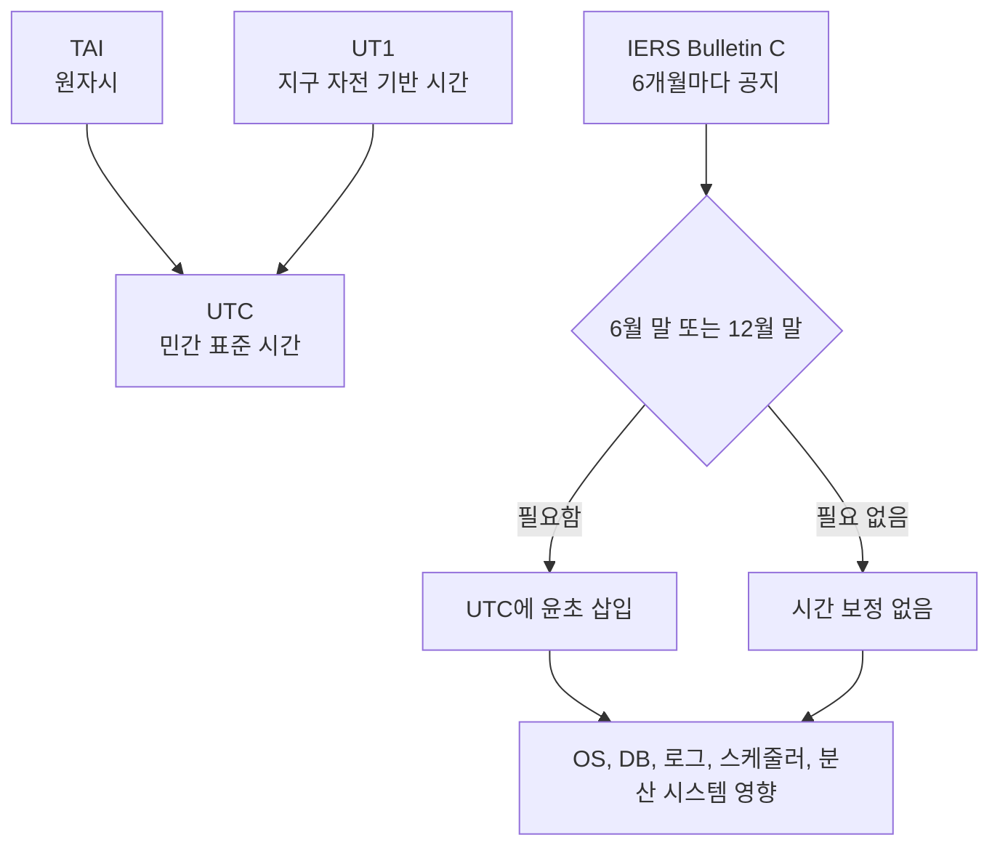

> 한 줄 요약: IERS가 2026년 12월 말 윤초(leap second)를 넣지 않겠다고 공지했다. 새로 추가되는 1초가 없다는 소식이지만, 개발자들이 반응한 이유는 시간 동기화가 여전히 운영에서 까다로운 문제이기 때문이다.

## 무슨 일이 있었나

2026년 7월 6일, 국제지구자전좌표국(IERS, International Earth Rotation and Reference Systems Service)은 Bulletin C 72를 통해 2026년 12월 말 윤초를 도입하지 않는다고 공지했다.

공지의 범위는 명확하다.

- 대상 시점: 2026년 12월 말
- 결정 내용: UTC에 윤초를 추가하지 않음
- 현재 차이: 2017년 1월 1일 0시 UTC 이후, UTC-TAI = -37초
- 발표 주체: IERS Earth Orientation Center
- 공지 성격: 6개월마다 윤초 도입 여부를 알리는 정례 Bulletin C

윤초는 UTC(Coordinated Universal Time)를 지구 자전 기반 시간인 UT1과 크게 어긋나지 않게 유지하기 위해 넣는 1초 보정이다. 원자시인 TAI(International Atomic Time)는 균일하게 흐르지만, 지구 자전은 완벽하게 일정하지 않다. 그래서 UTC는 원자시를 기반으로 하되, 필요할 때 1초를 끼워 넣어 천문학적 시간과의 차이를 맞춰왔다.

이번에 확인된 사실은 단순하다. 2026년 12월 말에는 그 1초 삽입이 없다.

이 공지가 곧 윤초 제도의 종료를 뜻하는 것은 아니다. Bulletin C는 다음 가능 시점에 윤초가 있는지 없는지를 알려주는 문서다. 다만 개발자 커뮤니티에서 이 공지가 화제가 된 이유는 따로 있다. 윤초가 있을 때마다 운영 시스템에서 비슷한 문제가 반복됐고, 언젠가 같은 질문을 다시 해야 하기 때문이다.

윤초가 없는데도 시스템 영향이 표시된 이유가 있다. 운영팀 입장에서는 윤초가 실제로 들어가는 날만 준비하면 되는 문제가 아니다. 시간 처리 로직, NTP 설정, 클라우드 제공자의 스미어(smear) 방식, 로그 정렬, 타임스탬프 비교 방식은 평소에 이미 정해져 있어야 한다.

## 왜 사람들이 반응했나

Hacker News에서 이 짧은 공지가 283포인트와 218개 댓글을 모은 이유는, 윤초가 단순한 천문학 지식이 아니라 서비스 운영의 기억을 건드리기 때문이다.

개발자들이 시간 문제에 예민하게 반응하는 데는 몇 가지 이유가 있다.

| 반응 지점 | 왜 불편한가 | 실무에서 드러나는 형태 |
|---|---|---|
| 신뢰 | 시간은 시스템 전체가 공유하는 전제다 | 로그 순서가 뒤틀리면 장애 분석이 어려워진다 |
| 권한 | 한 기관의 공지가 전 세계 시스템 설정에 영향을 준다 | OS, NTP, 클라우드, 애플리케이션이 각자 다르게 반응할 수 있다 |
| 비용 | 1초 때문에 테스트와 운영 점검이 필요하다 | 평소에는 드러나지 않던 날짜 처리 버그가 특정 시점에만 터진다 |
| 사용성 | 사용자는 윤초를 모른다 | 결제, 예약, 인증 만료 시간이 이상하게 보이면 서비스 문제로 인식한다 |
| 규제와 감사 | 기록의 순서와 시각은 증거가 된다 | 금융, 보안, 접근 로그에서 시간 해석이 곧 책임 문제가 된다 |

사람들이 반응하는 지점은 1초의 길이가 아니다. 그 1초가 시스템 안에서 어떤 의미를 갖느냐다.

많은 코드는 시간이 항상 앞으로만 간다고 가정한다. `now()`를 두 번 호출하면 두 번째 값이 더 크거나 같을 것이라고 믿는다. 날짜 문자열은 한 번 파싱되면 어디서나 같은 의미일 것이라고 생각한다. 분산 시스템의 로그는 타임스탬프로 정렬하면 사건 순서가 복원될 것이라고 기대한다.

윤초는 이런 가정을 불편하게 만든다. 23:59:60 같은 표현을 처리해야 할 수도 있고, 어떤 시스템은 같은 초를 반복한다. 또 어떤 시스템은 24시간 동안 조금씩 시간을 늘려 윤초를 흡수한다. 클라이언트, 서버, 데이터베이스, 외부 API가 같은 방식을 쓰지 않으면 1초는 작은 숫자가 아니라 경계 조건이 된다.

오해도 생기기 쉽다. 윤초가 없다는 공지를 보고 이제 시간 문제는 없다고 읽으면 안 된다. 이번 공지는 2026년 12월 말에 보정이 없다는 뜻이지, 시스템이 윤초나 시간 동기화 리스크에서 자유롭다는 뜻은 아니다.

반대로 모든 서비스가 윤초를 직접 처리해야 한다고 말하는 것도 지나치다. 클라우드 환경, 관리형 데이터베이스, 표준 NTP 구성을 쓰는 서비스는 상당 부분을 하위 계층에 맡길 수 있다. 다만 맡겼다면 어떤 방식으로 맡겼는지는 알아야 한다. 맡긴다는 것과 모른다는 것은 다르다.

## 내가 보는 핵심

이번 이슈는 시간 자체보다 플랫폼 경계에 숨어 있는 운영 계약에 가깝다.

애플리케이션 개발자는 보통 시간을 언어 런타임이나 OS가 주는 값으로 다룬다. 인프라 팀은 NTP 서버와 호스트 설정을 본다. 클라우드 제공자는 리전 단위 시간 동기화 정책을 갖고 있다. 데이터베이스는 타임스탬프 타입과 트랜잭션 순서를 따로 관리한다. 로그 파이프라인은 수집 시각과 발생 시각을 나눠 저장한다.

문제는 장애가 날 때 이 경계가 한꺼번에 겹친다는 점이다.

예를 들어 이벤트 처리 시스템에서 다음과 같은 흐름이 있다고 하자.

- API 서버가 요청 시각을 기록한다
- 메시지 큐가 이벤트를 받는다
- 워커가 처리 완료 시각을 남긴다
- 데이터베이스가 갱신 시각을 자동 입력한다
- 로그 수집기가 별도의 수집 시각을 붙인다
- 분석 시스템이 타임스탬프로 사용자 행동을 재구성한다

평상시에는 이 값들이 대체로 같은 방향으로 움직인다. 그래서 세부 차이가 잘 보이지 않는다. 하지만 시간 보정, 서버 간 시계 차이, 재시도, 큐 지연이 겹치면 어느 시각을 기준으로 볼지부터 정해야 한다.

윤초는 이 질문을 강제로 꺼내는 계기다. 그래서 개발자 커뮤니티에서 짧은 공지 하나에 말이 붙는다. 공지는 한 줄에 가깝지만, 그 뒤에는 서비스가 시간을 다루는 방식 전체가 걸려 있다.

실제로 이런 상황에서는 윤초 지원 여부만 체크하면 부족하다. 더 현실적인 질문은 다음에 가깝다.

- 우리 시스템은 벽시계 시간(wall-clock time)과 단조 증가 시간(monotonic time)을 구분하는가?
- 만료 시간, 재시도 간격, 성능 측정에 같은 시간 API를 쓰고 있지는 않은가?
- 외부 API와 내부 시스템이 서로 다른 시간 보정 방식을 쓸 때 실패 모드가 정의되어 있는가?
- 로그의 발생 시각과 수집 시각을 분리해서 저장하는가?
- 감사나 정산에 쓰는 시간 기준이 문서화되어 있는가?

벽시계 시간은 사람이 읽는 날짜와 시각에 가깝다. 결제 일시, 게시 일시, 예약 시간처럼 사용자와 약속한 시간을 표현한다. 반면 단조 증가 시간은 두 사건 사이의 경과 시간을 재는 데 적합하다. 타임아웃, 지연 시간, 재시도 백오프(backoff), 성능 측정에는 단조 증가 시간이 더 안전하다.

이 둘을 섞으면 문제가 생긴다. 예를 들어 요청 제한(rate limit)을 벽시계 시간으로 계산하면 시계 조정이 들어간 순간 사용자가 갑자기 더 많이 요청한 것처럼 보이거나, 반대로 제한이 느슨해질 수 있다. 인증 토큰 만료 시각은 벽시계 시간이 필요하지만, 요청 처리 시간이 몇 밀리초 걸렸는지는 단조 증가 시간으로 재야 한다.

윤초 논쟁은 결국 시간 API 선택 문제로 내려온다. 1초를 넣느냐 마느냐보다, 어떤 종류의 시간을 어떤 용도에 쓰고 있는지가 더 실무적이다.

## 앞으로 볼 기준

다음에 윤초, 시간 동기화, UTC 정책 변경 뉴스가 나오면 먼저 확인할 기준이 있다.

첫째, 공지의 범위를 봐야 한다. 이번 Bulletin C 72처럼 특정 시점의 윤초 도입 여부를 말하는지, 아니면 제도 자체의 변경을 말하는지 구분해야 한다. 2026년 12월 말에 윤초가 없다는 말은 2027년 이후의 모든 가능성을 닫는 말이 아니다.

둘째, 내가 쓰는 플랫폼의 시간 보정 방식을 확인해야 한다. NTP를 그대로 따르는지, 윤초 스미어를 쓰는지, 컨테이너와 호스트가 같은 기준을 공유하는지 확인하지 않으면 장애 때 해석이 어려워진다.

셋째, 애플리케이션 코드에서 시간의 용도를 나눠야 한다. 사용자에게 보여주는 시간, 정산 기준 시간, 로그 발생 시간, 수집 시간, 성능 측정 시간은 같은 값처럼 보여도 역할이 다르다.

넷째, 데이터 계약에 타임스탬프 의미를 적어야 한다. `created_at`이 서버 수신 시각인지, 클라이언트 발생 시각인지, 데이터베이스 삽입 시각인지 모르면 나중에 분석과 감사에서 비용을 치른다.

다섯째, 장애 대응 문서에 시간 차이를 넣어야 한다. 서버 간 시계 오차, 리전별 시간 정책, 외부 제공자와의 차이를 모르면 로그가 서로 모순되는 것처럼 보인다.

이번 공지는 아무 일도 일어나지 않는다는 소식이다. 운영 관점에서는 이런 소식이 점검하기 더 좋다. 실제로 윤초가 들어가는 날에는 이미 늦다. 아무 일도 없는 2026년 12월 말 전에, 시스템이 시간을 어떤 전제로 믿고 있는지 확인해두는 쪽이 훨씬 싸다.

시간은 대부분의 코드에서 조용한 전역 상태처럼 다뤄진다. 그래서 평소에는 설계 대상이 아니라 배경처럼 보인다. 하지만 배경이라고 생각한 것이 흔들릴 때, 서비스의 순서와 책임과 기록도 같이 흔들린다. 윤초가 없다는 한 줄짜리 공지가 개발자들에게 반응을 얻은 이유는 그 불편한 기억을 건드렸기 때문이다.

## 참고 자료

- [선정 글감] [No leap second will be introduced at the end of December 2026](https://datacenter.iers.org/data/latestVersion/bulletinC.txt) — IERS Bulletin C 72 / Hacker News Best