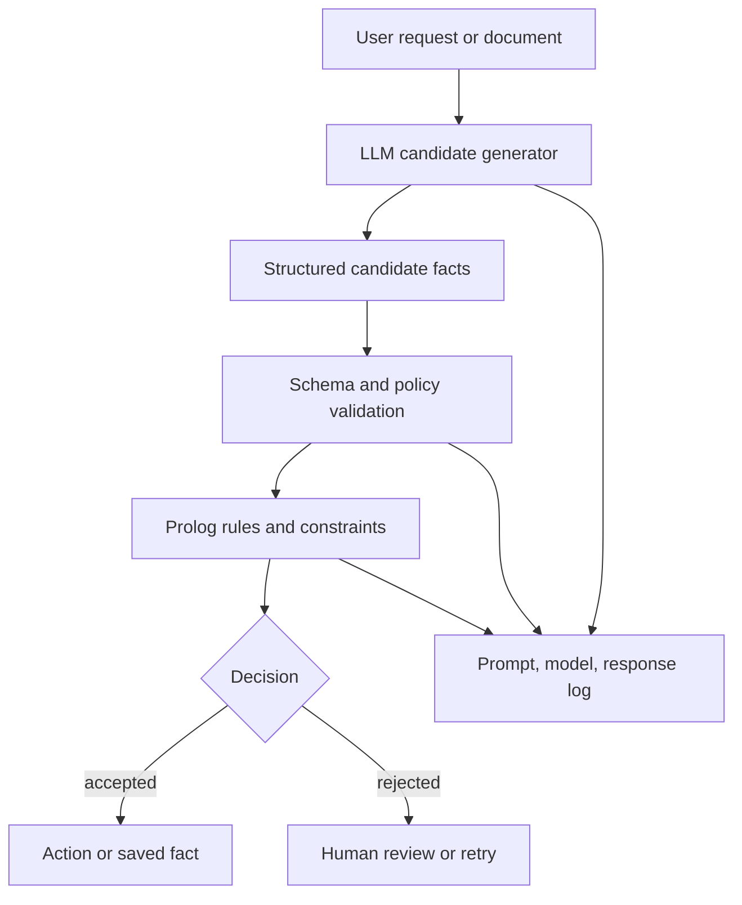

> 한 줄 요약: Prolog에서 LLM을 `llm/2` 술어처럼 부르는 실험은 단순한 문법 장난이 아니다. 결정적 추론 엔진과 확률적 언어 모델을 한 시스템 안에서 어디까지 같이 쓸 수 있는지 묻는 설계 문제다. 핵심은 LLM을 논리의 일부로 믿을지, 논리 바깥의 불안정한 제안기로 둘지다.

## 왜 지금 이슈인가

LLM 에이전트, 테스트 자동화, 인프라 운영 도구가 늘어나면서 개발자들이 다시 묻는 질문이 있다. 자연어 모델을 기존 프로그래밍 언어 안에 함수처럼 넣어도 되는가?

선정 글감인 `pllm`은 이 질문을 작은 형태로 보여준다. SWI-Prolog에서 `llm/2` 또는 `llm/3`를 호출하면 OpenAI 호환 `chat/completions` 엔드포인트에 프롬프트를 보내고, 응답 문자열을 Prolog 변수와 단일화(unification)한다.

예시는 단순하다.

```prolog
?- llm("Say hello in French.", Output).
Output = "Bonjour !".
```

더 흥미로운 부분은 역방향 호출이다.

```prolog
?- llm(Prompt, "Dog").
Prompt = "What animal is man's best friend?", ...
```

첫 번째 인자가 비어 있고 두 번째 인자가 주어지면, 라이브러리는 먼저 원하는 응답을 만들 법한 프롬프트를 LLM에 요청한다. 그다음 그 프롬프트를 다시 제약과 함께 호출한다. 두 번의 API 호출이 필요하고, 모델이 제약을 무시하면 술어는 실패한다.

GitHub나 개발자 커뮤니티에서 이야기가 붙기 쉬운 이유가 여기에 있다. Prolog는 원래 관계를 정의하고, 질의 방향을 바꿔도 의미가 유지되는 언어다. 그런데 LLM은 같은 입력에도 다른 출력을 낼 수 있고, 응답 형식도 완전히 보장되지 않는다.

둘을 붙이면 겉으로는 우아해 보인다. 하지만 운영 시스템에서는 곧바로 다음 질문이 따라온다.

- 이 호출은 순수한 술어인가, 외부 부작용인가?
- 실패는 논리적 실패인가, 네트워크 장애인가?
- 응답이 달라지면 캐시와 테스트는 어떻게 잡을 것인가?
- 로컬 모델과 원격 API를 바꿔도 같은 프로그램이라고 말할 수 있는가?

이 논쟁은 Prolog에만 머물지 않는다. AI 에이전트 프레임워크, 자연어 기반 테스트 생성, 정책 자동화, 배포 판단 도구도 같은 경계에 서 있다. LLM을 추론 엔진으로 볼 것인가, 추론 엔진이 참고하는 불확실한 입력원으로 볼 것인가.

## 커뮤니티에서 갈리는 지점

찬성 쪽의 매력은 분명하다. Prolog는 규칙, 제약, 탐색을 다루는 데 강하다. LLM은 애매한 자연어, 예시 기반 변환, 설명 생성에 강하다. 둘을 묶으면 사람이 쓴 느슨한 요구사항을 논리 규칙에 연결하거나, 테스트 케이스 후보를 만들거나, 지식 베이스에 넣을 초기 사실을 추출하는 흐름을 만들 수 있다.

예를 들어 이런 역할 분리는 자연스럽다.

| 영역 | Prolog가 맡기 좋은 일 | LLM이 맡기 좋은 일 |
| --- | --- | --- |
| 정책 판단 | 명시 규칙, 예외, 충돌 탐색 | 정책 문서에서 후보 조건 추출 |
| 테스트 자동화 | 커버리지 조건, 반례 탐색 | 자연어 요구사항을 테스트 후보로 변환 |
| 운영 진단 | 의존성 그래프, 영향 범위 계산 | 로그와 이슈 설명 요약 |
| 에이전트 계획 | 가능한 액션과 제약 검증 | 사용자 의도 해석, 작업 설명 생성 |

반대 쪽의 우려도 작지 않다. Prolog의 강점은 질의가 실패했을 때 그 실패를 의미 있게 해석할 수 있다는 점이다. 반면 LLM 호출 실패는 여러 층으로 갈라진다. 모델이 답을 틀렸을 수도 있고, 응답 포맷이 어긋났을 수도 있고, rate limit에 걸렸을 수도 있고, 프롬프트 인젝션(prompt injection)에 흔들렸을 수도 있다.

이 차이를 무시하고 `llm/2`를 일반 술어처럼 쓰면 논리 프로그램의 결정성이 흔들린다. 더 정확히는 결정적이어야 할 부분과 불확실해도 되는 부분의 경계가 흐려진다.

Stack Overflow Blog의 “Why intent prediction needs more than an LLM”도 같은 쟁점을 다른 분야에서 다룬다. 그 글은 사람의 미래 행동이나 의도를 예측하는 문제에서 다음 토큰 예측(next-token prediction)만으로는 귀납적 편향(inductive bias)이 맞지 않는다고 본다. Yobi 사례에서는 행동 예측을 위해 트랜스포머(transformer)와 그래프 신경망(graph neural network)을 함께 쓰고, 대규모 개인화 결정을 처리하면서 데이터 프라이버시를 함께 고려한다고 설명한다.

이 관점은 Prolog 안의 LLM 호출에도 들어맞는다. 문제는 LLM이 똑똑한가가 아니다. 해당 작업에 맞는 귀납적 편향을 가진 도구인가가 먼저다.

자연어 답변 생성에는 LLM이 잘 맞는다. 관계형 제약 충족, 재현 가능한 검증, 닫힌 세계 가정(closed-world assumption)에 기반한 판정에는 Prolog가 더 잘 맞는다. 둘을 합칠 때는 누가 최종 판정을 내리는지 분리해야 한다.

## 아키텍처 관점에서 볼 점

LLM을 Prolog 안에 넣을 때 가장 위험한 방식은 LLM 응답을 곧바로 사실처럼 취급하는 것이다.

```prolog
eligible(User) :-
    llm("Is this user eligible? Answer yes or no.", "yes").
```

이런 코드는 읽기에는 편하지만 운영 관점에서는 난감하다. 프롬프트에 들어간 사용자 정보, 모델 버전, 엔드포인트, 온도 설정, 응답 파서, 네트워크 상태가 모두 판정 결과에 섞인다. 나중에 왜 `eligible(User)`가 참이었는지 재현하기 어렵다.

더 안전한 구조는 LLM을 제안기(generator)로 두고, Prolog가 검증기(verifier)가 되는 방식이다.



이 구조에서 LLM은 후보 사실을 만든다. Prolog는 그 후보가 규칙을 만족하는지 판단한다. 저장되는 것은 원문 응답이 아니라 검증된 구조화 데이터와 감사 로그다.

예를 들어 테스트 자동화에서는 LLM이 “결제 실패 시 재시도 버튼이 보여야 한다” 같은 자연어 요구사항에서 후보 시나리오를 만들 수 있다. 하지만 실제 테스트 실행 조건, 기대 상태, 금지된 사이드 이펙트는 별도 규칙으로 검증해야 한다.

```prolog
candidate_test(payment_retry, [
    precondition(payment_failed),
    action(click_retry),
    expected(visible(retry_result))
]).

valid_test(Name) :-
    candidate_test(Name, Steps),
    member(precondition(payment_failed), Steps),
    member(action(click_retry), Steps),
    member(expected(visible(_)), Steps),
    \+ member(action(charge_again), Steps).
```

여기서 LLM은 `candidate_test/2`를 만드는 데 도움을 줄 수 있다. 하지만 `valid_test/1`의 판단은 LLM에게 맡기지 않는 편이 낫다. 특히 결제, 권한, 보안 정책, 배포 승인처럼 실패 비용이 큰 영역에서는 이 분리가 필요하다.

아키텍처적으로 확인할 지점은 네 가지다.

| 질문 | 확인할 내용 |
| --- | --- |
| 재현성 | 모델명, 프롬프트, 옵션, 응답, 파싱 결과를 저장하는가 |
| 격리 | LLM 장애가 전체 추론 실패로 번지지 않는가 |
| 검증 | 응답을 스키마, 정책, 규칙으로 다시 검사하는가 |
| 대체 가능성 | OpenAI 호환 원격 API와 Ollama 같은 로컬 모델을 바꿔도 경계가 유지되는가 |

`pllm`이 OpenAI 호환 엔드포인트와 Ollama 로컬 엔드포인트를 모두 대상으로 삼는 점은 이 대체 가능성을 실험하기 좋게 만든다. 다만 엔드포인트만 바꿀 수 있다고 해서 의미론까지 같아지는 것은 아니다. 모델마다 출력 형식, 지시 준수, 지연 시간, 비용 구조가 다르다.

운영 시스템에서는 모델을 설정값으로 바꾸는 것보다 모델별 계약을 명시하는 쪽이 현실적이다.

- 응답은 JSON이어야 하는가
- 실패 시 재시도할 수 있는가
- 최대 지연 시간은 얼마인가
- 개인정보나 내부 로그를 보낼 수 있는가
- 같은 입력에 대해 캐시를 허용하는가

이 계약이 없으면 `llm/2`는 편리한 술어가 아니라 추론 그래프 안에 숨어 있는 외부 네트워크 호출이 된다.

## 실무에서 볼 점

도입 전에 먼저 볼 것은 사용 목적이다. LLM을 판정자로 쓰려는지, 번역기나 요약기로 쓰려는지, 후보 생성기로 쓰려는지에 따라 설계가 달라진다.

실제로는 “LLM이 답을 잘하느냐”보다 “틀렸을 때 시스템이 어떤 모양으로 실패하느냐”가 더 중요하다. 틀린 후보가 검증 단계에서 걸러지면 품질 문제다. 틀린 후보가 권한 부여나 배포 승인으로 이어지면 사고다.

### LLM을 Prolog에 붙여도 되는 경우

- 자연어 입력을 구조화 후보로 바꾸는 단계
- 테스트 케이스 초안 생성
- 운영 로그의 원인 후보 요약
- 규칙 엔진이 거절한 이유를 사람에게 설명하는 단계
- 로컬 모델로 내부 문서 요약을 시도하는 실험 환경

이 경우에도 최종 저장 전에는 스키마 검증과 규칙 검증을 거치는 편이 안전하다.

### 조심해야 하는 경우

- 접근 권한, 결제, 삭제, 배포처럼 되돌리기 어려운 액션
- 법무, 보안, 개인정보 처리처럼 설명 책임이 큰 판단
- 모델 응답이 데이터베이스의 정규 사실로 저장되는 흐름
- 장애 시 기본 허용으로 떨어지는 정책
- 프롬프트에 외부 사용자가 작성한 텍스트가 그대로 섞이는 구조

특히 프롬프트 인젝션은 Prolog와 결합될 때 더 까다롭다. Prolog 쪽 규칙이 엄격하더라도, LLM이 만든 후보 사실이 교묘하게 들어오면 검증기가 예상하지 못한 경로를 탈 수 있다. 따라서 자유 텍스트를 사실로 변환하는 단계에서는 허용 필드 목록, 타입 검사, 값 범위 제한이 필요하다.

```prolog
allowed_action(read).
allowed_action(search).
allowed_action(summarize).

safe_action(Action) :-
    allowed_action(Action).

reject_unsafe_candidate(Action) :-
    \+ safe_action(Action),
    fail.
```

이런 단순한 화이트리스트도 LLM 응답을 바로 실행하는 구조보다 낫다. 에이전트 시스템에서도 같은 원칙이 적용된다. 모델은 “무엇을 하고 싶다”를 제안할 수 있지만, 실제로 “해도 되는가”는 별도 정책 계층이 결정해야 한다.

대안도 있다.

| 접근 | 장점 | 한계 |
| --- | --- | --- |
| 순수 Prolog 규칙 | 재현성, 설명 가능성, 테스트 용이성 | 자연어와 애매한 입력 처리에 약함 |
| LLM 단독 에이전트 | 빠른 프로토타이핑, 유연한 입력 처리 | 검증, 감사, 실패 격리가 어려움 |
| Prolog + LLM 제안기 | 규칙성과 유연성의 분리 | 경계 설계와 로깅 비용 증가 |
| 전용 모델 또는 분류기 | 특정 작업 정확도와 지연 시간 최적화 | 데이터 준비와 운영 부담 증가 |

Stack Overflow Blog의 보조 사례가 말하는 것도 여기와 닿아 있다. 의도 예측처럼 언어 생성이 아닌 문제에는 LLM 단독보다 문제 구조에 맞춘 모델이 필요할 수 있다. 마찬가지로 논리 추론 문제에는 LLM을 중심에 두기보다, 논리 엔진의 바깥에서 후보를 공급하는 편이 낫다.

## 정리

`llm/2` 같은 인터페이스의 가치는 LLM을 Prolog 안에 자연스럽게 숨기는 데 있지 않다. 오히려 LLM 호출이 논리 프로그램 안으로 들어올 때 어떤 전제가 깨지는지 보여주는 데 있다.

LLM은 애매한 입력을 다루는 데 강하고, Prolog는 명시 규칙을 끝까지 적용하는 데 강하다. 두 도구를 섞을 때 실무적으로 설득력 있는 설계는 역할을 분리하는 것이다. LLM은 후보를 만들고, Prolog는 검증한다. LLM은 설명을 돕고, 규칙 엔진은 결정을 남긴다.

지금 만들고 있는 AI 자동화 흐름에서 LLM 응답이 최종 판단으로 바로 이어지는 지점이 있는지 확인해볼 필요가 있다. 있다면 그 사이에 스키마 검증, 정책 검증, 감사 로그 중 하나라도 넣을 수 있는지 먼저 봐야 한다.

## 참고 자료

- [선정 글감] [A Prolog library for interfacing with LLMs](https://github.com/vagos/llmpl) — Lobsters
- [관련] [Why intent prediction needs more than an LLM](https://stackoverflow.blog/2026/06/30/why-intent-prediction-needs-more-than-an-llm/) — Stack Overflow Blog