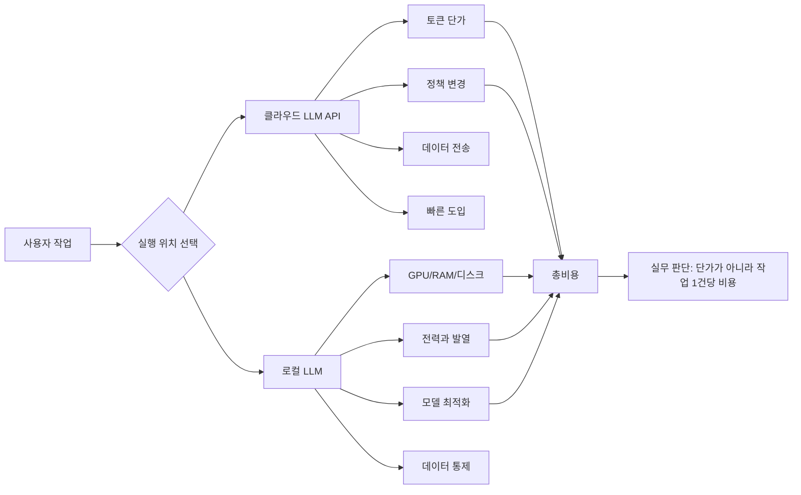

> 한 줄 요약: AI 토큰 가격 인상은 한 업체의 과금 변경으로만 볼 일이 아니다. 에이전트가 토큰을 쓰는 방식, 로컬 LLM 하드웨어의 한계, 오픈 모델 운영비가 사용자 비용으로 드러나기 시작했다.

## 무슨 일이 있었나

Reddit LocalLLaMA에 Neuralwatt 가격이 7월 16일부터 두 배로 오른다는 이메일을 받았다는 글이 올라왔다. 제공된 자료의 기준일이 2026년 7월 10일이므로, 이 글에서는 2026년 7월 16일 시행 예정으로 읽는다. 다만 원문 제목에는 연도가 적혀 있지 않다.

확인된 사실은 좁다.

- 당사자: Neuralwatt 이용자로 보이는 Reddit 게시자와 LocalLLaMA 커뮤니티
- 범위: Neuralwatt의 LLM 사용 가격, 특히 GLM 5.2 접근 용도로 쓰던 사용자들의 비용 문제
- 일정: 게시글 제목 기준 7월 16일부터 가격 두 배 인상
- 반응: 게시자는 값싼 토큰의 시대가 끝나고, 지속 가능한 길은 로컬 LLM뿐일 수 있다고 해석했다

아직 확인되지 않은 부분도 따로 봐야 한다.

- Neuralwatt 전체 상품이 동일하게 두 배 오르는지, 특정 플랜이나 사용량 구간만 해당하는지는 제공 자료만으로 확인되지 않는다.
- 인상 이유가 GPU 비용, 모델 제공사 비용, 수요 폭증, 손실 보전 중 무엇인지는 확인되지 않는다.
- GLM 5.2를 쓰는 모든 사용자가 같은 영향을 받는지도 알 수 없다.

그런데 이 글이 커뮤니티에서 말이 붙는 이유는 가격표 하나 때문이 아니다. 같은 시기에 LocalLLaMA에는 토큰 효율을 90% 낮춰야 한다는 주장, 3장의 RTX 3090으로 75B MoE 모델을 돌린 사례, 27B 모델이 에이전트 작업에서 75B보다 적은 턴으로 이겼다는 경험담, 744B MoE 모델을 일반 PC에서 디스크 스트리밍으로 구동하려는 실험이 함께 올라왔다.

흐름은 이어진다. 사람들은 더 큰 모델을 원하지만, 실제 비용은 토큰 수, 턴 수, KV 캐시, 디스크 I/O, 전력, GPU 메모리에서 새고 있다.

## 왜 사람들이 반응했나

AI 토큰 가격 인상은 월 사용료가 비싸졌다는 불만에서 끝나지 않는다. LocalLLaMA 같은 커뮤니티에서는 이 문제가 곧 선택권의 문제로 번진다.

클라우드 API를 쓰면 빠르게 시작할 수 있다. 로컬 LLM을 쓰면 느리고 번거롭지만, 비용과 데이터 흐름을 직접 통제할 수 있다. 가격이 안정적일 때는 이 둘의 차이가 취향처럼 보인다. 가격이 두 배가 되면 선택지는 운영 리스크가 된다.

### AI 토큰 가격 인상이 불편한 이유

먼저 예측 가능성 문제가 있다.

일반적인 API 사용량은 요청 수만 보면 안 된다. LLM 에이전트(Agent)는 한 번의 요청처럼 보여도 내부에서는 파일 검색, 요약, 재시도, 도구 호출, 검증 프롬프트를 반복한다. Computerphile 영상이 짚은 것처럼, 사람이 보기에는 간단한 작업도 에이전트가 맡으면 토큰 사용량이 빠르게 커질 수 있다.

더 큰 문제는 비용 통제권이다.

채팅형 사용자는 답변이 한두 번 길어지는 정도로 끝날 수 있다. 하지만 자동화 파이프라인, 코드 에이전트, 문서 분석, 고객 지원 봇은 다르다. 입력 토큰과 출력 토큰이 매번 변하고, 실패한 호출도 비용으로 남는다. 가격이 두 배가 되면 예산만 늘어나는 게 아니다. 실패한 설계가 더 빨리 드러난다.

락인(lock-in)도 남는다.

어떤 서비스가 특정 모델을 편하게 제공하면 사용자는 프롬프트, 평가셋, 자동화 스크립트, 내부 문서 처리 흐름을 그 서비스 기준으로 맞춘다. 가격이 바뀌었을 때 다른 서비스로 옮기는 비용은 토큰 단가 표에 나오지 않는다.

| 쟁점 | 겉으로 보이는 문제 | 실제 운영 리스크 |
|---|---|---|
| 가격 인상 | 토큰 단가 상승 | 예산 예측 실패 |
| 에이전트 사용 | 편한 자동화 | 반복 호출과 재시도로 비용 폭증 |
| 대형 모델 선호 | 품질 기대 | 메모리, 지연 시간, 전력 비용 증가 |
| 로컬 LLM 전환 | 비용 절감 기대 | 하드웨어 구성과 운영 부담 증가 |
| 서비스 의존 | 빠른 도입 | 가격·정책 변경에 취약 |

### 로컬 LLM이면 정말 해결될까?

Neuralwatt 글의 게시자는 지속 가능한 길이 로컬 LLM일 수 있다고 썼다. 이해되는 반응이다. 가격표가 흔들릴 때 가장 먼저 떠오르는 대안은 직접 돌리는 것이다.

다만 로컬 LLM은 공짜가 아니다.

보조 레퍼런스의 75B MoE 사례가 이 지점을 잘 보여준다. 게시자는 Nemotron Puzzle-75B-A9B NVFP4를 3장의 RTX 3090에서 돌리며, 3개 스트림 기준 132 tokens/s decode, 약 500W 전력, 256K 컨텍스트, fp8 KV 캐시 같은 수치를 공유했다. 이전에 쓰던 120B MoE GGUF보다 속도와 전력 효율이 나아졌고 GPU 한 장을 비웠다는 점도 언급했다.

이건 로컬 LLM이 가능하다는 증거이면서, 아무나 쉽게 얻는 결과가 아니라는 증거이기도 하다. 24GB GPU 여러 장, vLLM 설정, FP4 실행 경로, 파이프라인 병렬화, KV 캐시 전략을 맞춰야 한다. 클라우드 비용은 청구서로 오고, 로컬 비용은 장비 선택과 운영 시간으로 온다.

GLM 5.2를 일반 PC에서 실행하려는 Colibri 실험도 비슷하다. 744B MoE 모델이지만 토큰마다 활성화되는 파라미터는 약 40B이고, 라우팅된 expert를 디스크에서 스트리밍한다는 접근이다. 자료에는 32GB RAM급 소비자 머신에서 int4, 디스크 기반 expert 스트리밍, LRU 캐시, OS 페이지 캐시를 활용한다는 설명이 나온다.

멋진 실험이지만, 이것도 비용을 없애지는 않는다. GPU 비용을 디스크 용량, I/O 패턴, 구현 복잡도, 응답 지연으로 바꾸는 방식에 가깝다.

## 내가 보는 핵심

이번 이슈의 핵심은 토큰 가격이 올랐다는 사실보다, 사람들이 이제 작업 1건당 비용을 보기 시작했다는 점이다.

LLM 비용을 1M tokens당 얼마로만 보면 판단이 흐려진다. 실제로는 다음 질문이 더 실무적이다.

- 이메일 1,000건을 분류하는 데 얼마가 드는가?
- 코드 수정 PR 하나를 만들 때 몇 번의 도구 호출이 발생하는가?
- 같은 문제를 27B 모델이 6턴에 끝내고 75B 모델이 12턴에 끝내면 어느 쪽이 싼가?
- 긴 컨텍스트를 유지하는 편이 나은가, 검색(RAG)으로 잘라 넣는 편이 나은가?
- 실패한 에이전트 루프를 누가 감지하고 끊는가?

여기서 27B 모델이 75B 모델보다 에이전트 작업에서 나았다는 Reddit 경험담이 흥미롭다. 게시자는 27B 모델이 중립적인 시스템 프롬프트에서 모든 에이전트 작업을 6~9번의 도구 호출로 통과했고, 75B 모델은 튜닝된 프로필이 있어야 통과했으며 턴 수도 두 배가량 필요했다고 적었다. 이 수치는 개인 실험이므로 일반화하면 안 된다. 그래도 비용 판단에는 좋은 힌트를 준다.

에이전트에서는 초당 토큰 수보다 턴 수가 더 비쌀 때가 있다. 빠르게 말하는 모델보다 덜 헤매는 모델이 싸다. 큰 모델보다 작업을 빨리 끝내는 모델이 낫다. 로컬이든 클라우드든 이 원칙은 같다.

토큰 효율을 90% 낮춰야 한다는 주장도 이 맥락에서 읽어야 한다. 프롬프트 앞에 no_think를 붙이면 된다는 식의 반응은 농담처럼 보이지만, 실제 불만은 뚜렷하다. 사용자들은 모델이 추론을 길게 하거나 에이전트가 과하게 탐색하면서 비용을 태우는 상황을 더 이상 무료 부가 기능으로 보지 않는다.

현업에서 비슷한 고민을 하다 보면, 비용 문제는 대개 모델 교체보다 계측 부재에서 먼저 터진다. 어느 프롬프트가 토큰을 많이 쓰는지, 어떤 도구 호출이 반복되는지, 실패한 작업이 몇 번 재시도되는지 로그가 없다. 그러면 가격 인상 공지가 왔을 때 할 수 있는 일이 플랜 다운그레이드나 사용 금지밖에 남지 않는다.

### 클라우드 LLM과 로컬 LLM의 차이점은 가격표가 아니다

클라우드 LLM은 변동비가 선명하다. 쓴 만큼 낸다. 대신 가격 정책, 모델 제공 범위, 속도 제한, 데이터 처리 정책이 외부에 있다.

로컬 LLM은 고정비가 선명하다. 장비를 사고 설정한다. 대신 운영 능력이 없으면 성능과 안정성이 흔들린다. 모델 업데이트, 양자화 품질, 컨텍스트 길이, 드라이버, 서빙 프레임워크까지 직접 봐야 한다.

그래서 Neuralwatt 가격 인상 같은 사건을 보고 바로 로컬로 가야 한다고 말하면 절반만 맞다. 더 정확한 질문은 이것이다.

> 이 작업은 가격이 두 배가 되어도 계속 돌릴 만큼 가치가 있는가, 아니면 비용이 낮아서 방치하고 있던 자동화인가?

이 질문이 불편한 이유는 LLM 도입의 민낯을 건드리기 때문이다. 싸고 빠를 때는 품질 평가가 느슨해진다. 자동화가 실제로 시간을 줄였는지, 오류 검수 비용을 늘렸는지, 사람의 판단을 어디서 대체했는지 따지지 않는다. 가격이 오르면 그 계산을 더 미룰 수 없다.

## 앞으로 볼 기준

다음 AI 토큰 가격 인상, 플랫폼 정책 변경, 모델 제공 중단 뉴스를 볼 때는 감정적인 찬반보다 아래 기준을 먼저 확인하는 편이 낫다.

### 1. 가격 인상 범위가 어디까지인가

전체 가격이 오르는지, 특정 모델만 오르는지, 입력·출력·캐시 토큰 중 무엇이 바뀌는지 봐야 한다. 에이전트형 작업은 출력 토큰보다 입력 재주입과 도구 결과 요약에서 비용이 커질 수 있다.

가격표에 캐시 토큰, 배치 할인, 컨텍스트 길이별 단가가 따로 있다면 실제 비용은 평균 요청이 아니라 최악의 요청에서 결정된다.

### 2. 작업 1건당 토큰을 재고 있는가

토큰 단가가 아니라 작업 단가를 봐야 한다.

- 문서 한 건 요약 비용
- 고객 문의 한 건 처리 비용
- 코드 이슈 하나 해결 비용
- 검색·요약·검증을 포함한 전체 에이전트 비용
- 실패 후 재시도까지 포함한 비용

이 지표가 없으면 가격 인상에 대응할 수 없다. 모델을 바꿔도, 로컬로 옮겨도, 같은 낭비가 다른 형태로 반복된다.

### 3. 작은 모델이 더 싸게 끝낼 수 있는가

보조 레퍼런스의 27B vs 75B 사례처럼, 에이전트 작업에서는 모델 크기와 결과 품질이 단순히 비례하지 않는다. 큰 모델이 더 많이 생각하고 더 많이 호출하면 비싸진다. 작은 모델이 적은 턴으로 끝내면 더 낫다.

평가할 때는 tokens/s만 보지 말고 다음을 함께 봐야 한다.

- 성공까지 필요한 평균 턴 수
- 도구 호출 횟수
- 실패 루프 발생률
- 긴 컨텍스트에서의 성능 저하
- 프롬프트 튜닝 의존도

### 4. 로컬 LLM 전환 비용을 숨기지 않는가

로컬 LLM은 데이터 통제와 장기 비용 면에서 매력적이다. 특히 민감한 문서, 내부 코드, 반복 배치 작업에는 강한 선택지가 될 수 있다.

하지만 하드웨어와 운영 부담을 비용표에 넣어야 한다. GPU 감가상각, 전력, 장애 대응, 모델 파일 저장소, 서빙 프레임워크 업데이트, 속도 저하를 모두 포함해야 한다. Colibri처럼 디스크 스트리밍으로 거대한 MoE를 돌리는 접근은 가능성의 폭을 넓히지만, 일반적인 운영 난이도까지 낮춘다는 뜻은 아니다.

### 5. 데이터와 정책 리스크를 분리해 보는가

가격이 올라도 클라우드를 써야 하는 경우가 있다. 반대로 가격이 싸도 클라우드로 보내면 안 되는 데이터가 있다. 비용 판단과 데이터 판단을 섞으면 둘 다 흐려진다.

검토 기준은 단순하다.

- 입력 데이터에 개인정보나 영업비밀이 있는가
- 모델 제공사의 데이터 보관·학습 정책을 확인했는가
- 로그에 원문 데이터가 남는가
- 장애나 가격 변경 시 대체 경로가 있는가
- 같은 프롬프트를 다른 모델에서 재현할 수 있는가

Neuralwatt 가격 인상 글은 작은 게시물처럼 보인다. 하지만 그 아래에는 더 큰 질문이 깔려 있다. 지금 쓰는 AI 자동화는 가격이 낮아서 그럴듯해 보이는가, 아니면 비용이 드러나도 계속 남길 만큼 일을 줄이고 있는가.

싼 토큰은 실험을 쉽게 만든다. 비싼 토큰은 설계를 드러낸다. 앞으로의 LLM 운영은 어느 모델이 더 똑똑한지보다, 어떤 작업에 얼마를 쓰고 있는지 먼저 묻는 쪽으로 갈 가능성이 크다.

## 참고 자료

- [선정 글감] [Neuralwatt Pricing will Double From 07/16 - Got This Email](https://www.reddit.com/r/LocalLLaMA/comments/1use2ee/neuralwatt_pricing_will_double_from_0716_got_this/) - Reddit LocalLLaMA
- [관련] [CEO: “token efficiency needs to drop 90%” Dude… just write “\no_think” before you ‘summarize this email’ prompts](https://www.reddit.com/r/LocalLLaMA/comments/1uscsin/ceo_token_efficiency_needs_to_drop_90_dude_just/) - Reddit LocalLLaMA
- [관련] [NVIDIA Puzzle-75B-A9B NVFP4 at 132 t/s on 3×3090: Why is this size category a desert otherwise?](https://www.reddit.com/r/LocalLLaMA/comments/1uru9ja/nvidia_puzzle75ba9b_nvfp4_at_132_ts_on_33090_why/) - Reddit LocalLLaMA
- [관련] [The untuned 27B beat the tuned 75B as an agent](https://www.reddit.com/r/LocalLLaMA/comments/1us8x06/the_untuned_27b_beat_the_tuned_75b_as_an_agent/) - Reddit LocalLLaMA
- [관련] [Why AI Tokens are so Expensive - Computerphile](https://www.youtube.com/watch?v=-0HRzXk8vlk) - YouTube Computerphile
- [관련] [Show HN: Getting GLM 5.2 running on my slow computer](https://github.com/JustVugg/colibri) - GitHub / Hacker News Best