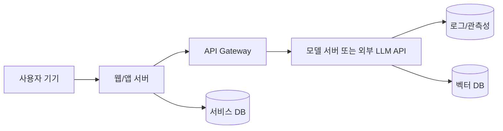
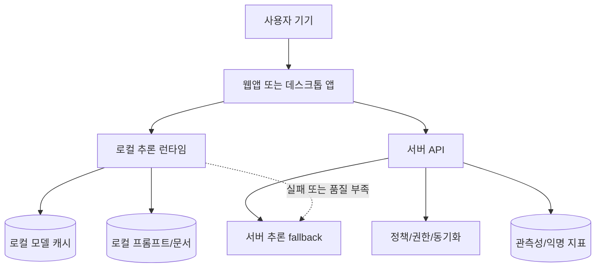

> 한 줄 요약: 로컬 AI 추론에서 먼저 봐야 할 것은 744B 모델을 개인 장비에서 돌릴 수 있느냐가 아니다. 메모리, 디스크, 브라우저, GPU, 개인정보의 경계를 어디에 둘지가 더 중요하다. 커뮤니티가 반응하는 이유도 성능 과시보다 AI 인프라 비용과 통제권을 다시 나눌 여지가 보이기 때문이다.

## 왜 지금 이슈인가

Kubernetes 클러스터에 GPU 노드를 붙이고, 모델 서버를 띄우고, 프롬프트와 응답을 모두 중앙 API로 보내는 방식은 단순하다. 하지만 AI 에이전트와 온디바이스 추론(On-device Inference)이 실무 제품에 들어오면 질문이 달라진다.

정말 모든 추론을 서버에서 해야 할까?

Hacker News에 올라온 colibrì 프로젝트는 이 질문을 극단까지 밀어붙인다. GLM-5.2라는 744B 파라미터 Mixture-of-Experts(MoE) 모델을 소비자 장비에서 실행하려는 시도다. GPU 없이, Python 런타임 없이, C 코드와 디스크 스트리밍만으로 25GB 안팎의 RAM에서 대형 모델을 움직인다.

빠르지는 않다. 프로젝트가 제시한 수치만 봐도 냉간 상태에서는 토큰당 약 11GB의 디스크 읽기가 발생한다. NVMe가 초당 1GB 수준으로 랜덤 읽기를 처리하면 0.05~0.1 tok/s 근처까지 떨어진다. 사용자가 기대하는 챗봇 속도와는 거리가 멀다.

그래도 개발자 커뮤니티에서 말이 붙는 이유는 분명하다. 이 실험은 모델 추론을 서버 API 호출로만 보던 관성을 흔든다. 대형 모델도 라우팅, 캐시, 양자화(Quantization), 계층형 저장소를 어떻게 설계하느냐에 따라 전부 RAM에 올리지 않고 실행할 수 있다. 브라우저 쪽에서는 Google의 LiteRT.js처럼 WebGPU, WebNN, WebAssembly를 이용해 모델을 사용자 기기에서 실행하려는 흐름이 커지고 있다.

한쪽은 744B MoE를 디스크에서 끌어오고, 다른 한쪽은 `.tflite` 모델을 브라우저에서 실행한다. 크기는 다르지만 질문은 같다.

AI 추론은 어디에서 실행돼야 하는가?

## 커뮤니티에서 갈리는 지점

로컬 AI 추론을 둘러싼 논쟁은 로컬이냐 클라우드냐로만 나뉘지 않는다. 실제 쟁점은 더 세분화된다.

| 쟁점 | 로컬 추론 쪽 주장 | 서버 추론 쪽 반론 |
| --- | --- | --- |
| 개인정보 | 입력 데이터가 기기 밖으로 나가지 않는다 | 모델 파일과 런타임 보안도 관리해야 한다 |
| 비용 | 서버 GPU 비용을 줄일 수 있다 | 사용자 장비 성능 편차가 크다 |
| 지연시간 | 네트워크 왕복이 없다 | 모델 로딩과 콜드 캐시가 더 느릴 수 있다 |
| 운영 | 중앙 장애에 덜 묶인다 | 배포, 관측성, 버전 관리가 어려워진다 |
| 품질 | 특정 작업은 작은 모델로 충분하다 | 대형 서버 모델의 품질을 따라가기 어렵다 |

colibrì는 이 논쟁에서 성능 우위를 주장하지 않는다. 병목을 솔직하게 드러내는 쪽에 가깝다. 744B MoE 모델은 매 토큰마다 전체 744B를 쓰지 않고 약 40B 파라미터만 활성화한다. 이 구조를 이용해 dense 영역은 RAM에 두고, routed expert는 디스크에 둔다. 필요한 expert만 읽어오는 방식이다.

이 접근에는 커뮤니티가 좋아할 만한 해커 감성이 있다. 하지만 실무 관점에서는 제약이 먼저 보인다. 디스크 랜덤 읽기, page cache 의존성, 긴 컨텍스트에서의 attention 비용, SSD 온도, swap 발생 가능성, 모델 파일 370GB라는 배포 부담이 모두 운영 리스크다.

LiteRT.js는 훨씬 제품 친화적인 방향에서 같은 문제를 푼다. 브라우저 안에서 WebGPU와 향후 WebNN을 활용하고, CPU fallback은 WebAssembly로 처리한다. 서버 비용과 개인정보 이슈를 줄이면서 웹 애플리케이션 안에 벡터 검색, 객체 감지, 텍스트 처리 같은 기능을 넣을 수 있다.

브라우저 추론도 만능은 아니다. 브라우저별 WebGPU 지원, 모바일 발열, 모델 다운로드 크기, 캐시 무효화, 사용자 동의, 모델 업데이트 전략이 따라온다. 서버에서 한 번만 교체하면 되던 모델이 수많은 클라이언트 환경으로 흩어진다.

커뮤니티 반응의 초점도 이 지점에 있다. 중앙집중형 AI 인프라가 모든 제품에 맞는 답인지 의심하기 시작한 것이다.

## 로컬 AI 추론 아키텍처는 어떻게 달라질까?

기존 AI 서비스 아키텍처는 보통 이렇게 생겼다.

이 구조는 운영하기 쉽다. 모델 버전, 로그, rate limit, 보안 정책을 서버에서 통제할 수 있다. Kubernetes 위에 모델 서버를 올리고, GPU 노드풀을 따로 두고, Prometheus나 OpenTelemetry로 지표를 모으면 된다.

로컬 추론이 들어오면 경계가 갈라진다.

이때 로컬과 서버를 경쟁 관계로만 보면 판단이 흐려진다. 실무에서는 하이브리드가 더 자연스럽다.

예를 들어 다음 작업은 로컬 추론에 잘 맞는다.

- 민감한 문서의 초벌 요약
- 입력창 자동완성
- 짧은 텍스트 분류
- 이미지 전처리
- 벡터 임베딩 기반 로컬 검색
- 오프라인 모드가 필요한 기능

서버 추론이 더 나은 작업도 있다.

- 높은 품질이 필요한 긴 추론
- 최신 지식 검색이 필요한 답변
- 여러 사용자 상태를 합쳐야 하는 에이전트 작업
- 감사 로그와 정책 집행이 필수인 업무
- 모델 업데이트가 자주 필요한 기능

colibrì 같은 디스크 스트리밍 MoE는 또 다른 축을 보여준다. 브라우저나 모바일보다 로컬 워크스테이션, 연구 환경, 제한된 예산의 실험 환경이 더 현실적인 무대다. 모든 expert를 RAM이나 VRAM에 올리지 않고, 활성 expert만 디스크에서 읽는 방식은 모델 배치의 계층형 저장소 설계로 볼 수 있다.

아키텍처 관점에서 병목은 연산보다 데이터 이동에 가깝다. 모델 추론에서 GPU FLOPS만 보던 습관은 여기서 깨진다. 어떤 텐서를 RAM에 둘지, 어떤 expert를 NVMe에 둘지, 어떤 hot expert를 pinned cache에 둘지, speculative decoding이 캐시를 더럽히는지까지 봐야 한다.

colibrì가 MTP(Multi-Token Prediction) speculative decoding에서 int8 head는 39~59% 수락률을 보였지만 int4 head는 0~4%로 무너졌다고 적은 대목도 그래서 의미가 있다. 양자화는 용량만 줄이는 기술이 아니다. 어느 레이어를 몇 비트로 둘지에 따라 추론 전략 전체가 달라진다.

## 로컬 AI vs 서버 AI, 무엇을 기준으로 나눠야 할까?

현업에서 비슷한 선택을 하다 보면 가장 먼저 물어야 할 것은 모델 크기가 아니다. 데이터 경계다.

사용자 입력이 서버로 나가면 안 되는가? 서버로 보낼 수는 있지만 저장하면 안 되는가? 익명화하면 되는가? 조직 내부망 안에서는 가능한가? 이 답에 따라 아키텍처가 먼저 갈린다.

그다음은 지연시간이다. 로컬 추론은 네트워크 왕복을 없애지만 모델 로딩 시간이 생긴다. 브라우저에서 모델을 처음 받는 순간, 데스크톱 앱에서 370GB 모델을 준비하는 순간, NVMe 콜드 캐시에서 expert를 읽는 순간은 모두 사용자 경험에 영향을 준다.

세 번째는 관측성(Observability)이다. 서버 추론은 토큰 수, latency, 에러율, GPU 사용률, 큐 대기 시간을 중앙에서 볼 수 있다. 로컬 추론은 훨씬 조심스럽게 설계해야 한다. 프롬프트나 원문 데이터를 수집하지 않으면서도 실패율, 모델 버전, 장치 성능, fallback 비율은 알아야 한다.

네 번째는 보안이다. 로컬 모델은 데이터 유출을 줄일 수 있지만 새로운 공격면을 만든다. 모델 파일 변조, 악성 WebAssembly, 브라우저 권한 오용, 로컬 캐시에 남은 민감 데이터, 공급망 공격이 생긴다. 특히 AI 에이전트가 로컬 파일이나 브라우저 세션에 접근한다면 추론 위치보다 권한 모델이 더 큰 문제가 된다.

다섯 번째는 배포와 롤백이다. 서버 모델은 한 곳에서 바꾸면 된다. 로컬 모델은 버전이 분산된다. 사용자는 오래된 모델을 계속 쓸 수 있고, 브라우저 캐시는 예상과 다르게 남을 수 있으며, 데스크톱 앱은 업데이트를 미룰 수 있다. 이 상태에서 답변 품질 문제나 보안 패치가 발생하면 운영 난도가 올라간다.

## 실무에서 볼 점

로컬 AI 추론을 도입하기 전에 최소한 아래 조건은 확인해야 한다.

| 확인 항목 | 질문 |
| --- | --- |
| 데이터 민감도 | 입력 데이터가 서버로 가면 안 되는 이유가 명확한가 |
| 모델 크기 | 사용자가 감당할 다운로드와 저장공간 범위인가 |
| 하드웨어 편차 | 저사양 장비에서 fallback 전략이 있는가 |
| 런타임 | WebGPU, WebNN, WASM, 네이티브 런타임 중 무엇을 쓸 것인가 |
| 관측성 | 개인정보 없이 품질과 장애를 볼 수 있는가 |
| 보안 | 모델 파일 무결성과 로컬 캐시 정책이 있는가 |
| 업데이트 | 모델 교체와 롤백 경로가 있는가 |
| 비용 | 서버 비용 절감분이 클라이언트 복잡도를 상쇄하는가 |

작은 기능부터 시작하는 편이 낫다. 예를 들어 전체 챗봇을 로컬로 옮기기보다, 검색어 추천이나 문장 분류처럼 실패 비용이 낮은 기능부터 넣는다. 품질이 부족하면 서버 fallback으로 넘기고, 충분하면 로컬에서 끝낸다.

브라우저 기반이라면 LiteRT.js 같은 런타임이 좋은 출발점이 될 수 있다. 이미 `.tflite` 모델이 있고, 사용자 데이터가 기기 안에 남아야 하며, 실시간 반응성이 필요한 기능이라면 검토할 이유가 있다. 다만 WebGPU 지원률, 모바일 브라우저 성능, 모델 캐싱 정책을 실제 사용자 환경에서 재야 한다.

데스크톱이나 연구 환경이라면 colibrì의 아이디어가 다른 식으로 유용하다. 744B 모델을 느리게라도 돌리는 데 그치지 않고, MoE 모델에서 어떤 expert가 자주 쓰이는지 측정하고 hot expert를 RAM이나 VRAM에 올리는 계층형 캐시 전략을 배울 수 있다. 이 관점은 Kubernetes 위의 모델 서빙에도 이어진다. 모든 모델 replica를 같은 방식으로 띄우는 대신, hot path와 cold path를 분리할 수 있다.

테스트 자동화도 빠지면 안 된다. 로컬 추론은 사용자 장비가 테스트 매트릭스가 된다. CPU, GPU, 브라우저, 드라이버, 메모리, 디스크 속도 조합이 품질에 영향을 준다. 최소한 다음 테스트는 필요하다.

- 모델 로딩 실패 테스트
- 저메모리 환경 테스트
- 네트워크 차단 상태 테스트
- 오래된 모델 버전 테스트
- fallback 경로 테스트
- 프롬프트와 로컬 캐시 삭제 테스트
- 동일 입력에 대한 서버, 로컬 품질 비교 테스트

여기서 하네스(Test Harness)가 필요해진다. 단순 유닛 테스트가 아니라, 고정 입력과 고정 모델 버전, 장치 프로파일을 묶어 반복 측정해야 한다. colibrì가 작은 fixture 모델로 CPU streaming, CUDA dense path, hot-store, CUDA hot-expert 실행을 비교하려 한 것도 같은 이유다. 전체 체크포인트가 없어도 실제 구조와 비슷한 shape를 보존하면 아키텍처 선택을 검증할 수 있다.

운영 리스크는 성능보다 늦게 드러난다. 로컬 추론을 넣은 뒤 사용자가 체감하는 문제는 답변 품질만이 아니다. 노트북 팬이 돌고, 배터리가 줄고, 브라우저 탭이 죽고, SSD 온도가 올라가고, 회사 보안 솔루션이 모델 파일을 격리할 수 있다. 이런 문제는 벤치마크 표에 잘 나오지 않는다.

## 정리

로컬 AI 추론을 클라우드 AI의 반대말처럼 다루면 설계 판단이 흐려진다. 모델, 데이터, 하드웨어, 운영 책임을 어떻게 나눌지 정하는 선택지로 봐야 한다.

colibrì는 극단적인 실험으로 데이터 이동과 캐시 설계의 한계를 보여준다. LiteRT.js는 웹 제품 안에서 로컬 추론을 기능 단위로 가져오는 방향을 보여준다. 둘을 함께 보면 기준은 비교적 분명해진다. 추론 위치는 모델 크기가 아니라 데이터 경계, 지연시간, 관측성, 업데이트 책임으로 정해야 한다.

먼저 확인할 것은 하나다. 지금 만들고 있는 AI 기능 중 서버에 보낼 필요가 없는 입력이 무엇인지 분리하는 일이다. 그 목록이 나오면 로컬 추론은 막연한 기술 트렌드가 아니라 검토 가능한 아키텍처 후보가 된다.

## 참고 자료

- [선정 글감] [Show HN: Getting GLM 5.2 running on my slow computer](https://github.com/JustVugg/colibri) (Hacker News Best)
- [관련] [LiteRT.js, Google's high performance Web AI Inference](https://developers.googleblog.com/litertjs-googles-high-performance-web-ai-inference/) (Google Developers)
- [관련] [WebGPU](https://www.w3.org/TR/webgpu/) (W3C)
- [관련] [Web Neural Network API](https://www.w3.org/TR/webnn/) (W3C)