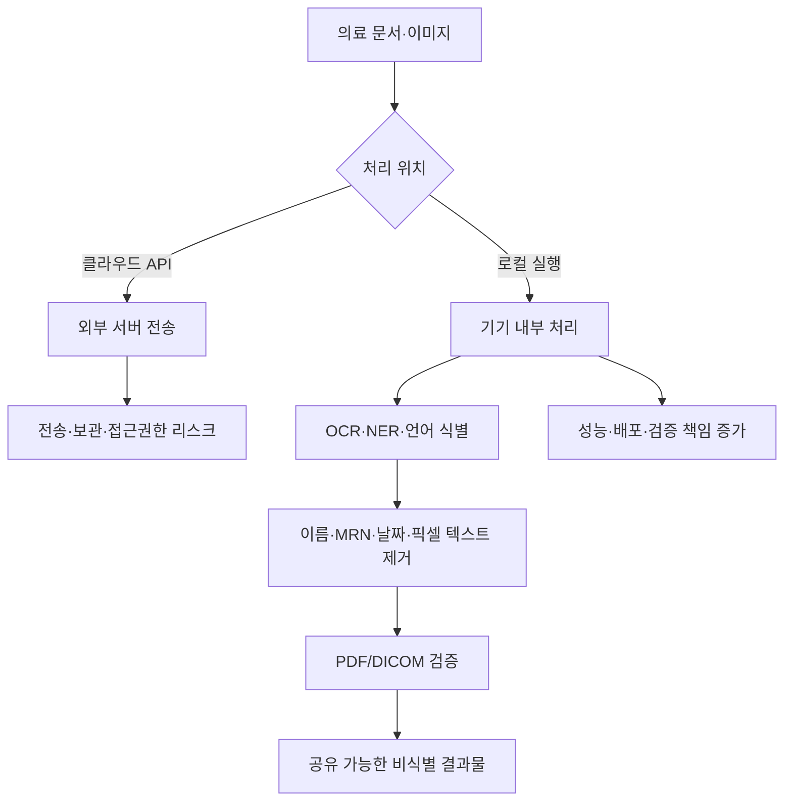

> 한 줄 요약: OpenMed 1.8 논쟁의 초점은 의료 데이터 비식별화 도구가 로컬 AI로 돌아간다는 기술 성과보다, 환자 데이터가 어디까지 이동해도 되는지에 대한 신뢰 기준이 바뀌고 있다는 데 있다.

## 무슨 일이 있었나

Reddit LocalLLaMA에 OpenMed 1.8 출시 글이 올라왔다. 작성자는 OpenMed 관리자로 보이며, 이 프로젝트를 Apache-2.0 라이선스의 임상 자연어 처리(Clinical NLP) 툴킷이라고 소개했다.

규칙은 분명하다. 환자 데이터가 사용자의 하드웨어를 떠나지 않는다는 것.

이번 1.8에서 언급된 범위는 꽤 넓다.

- Android: Kotlin, ONNX Runtime Mobile, ML Kit OCR 기반 OpenMedKit
- iOS/Swift 및 React Native 브리지
- 브라우저 런타임: Transformers.js, ONNX Runtime Web, wasm, WebGPU 백엔드
- PDF 검증 도구: 검은 박스만 덮은 가짜 삭제를 탐지
- DICOM 비식별화: 픽셀에 박힌 텍스트까지 OCR로 처리
- 언어 식별 패키지 추가
- 다음 1.9를 위한 공개 이슈 400개 이상

확인된 사실은 여기까지다. OpenMed 1.8은 로컬 실행, 모바일, 브라우저, PDF 검증, DICOM 비식별화를 전면에 내세웠고, Reddit 커뮤니티에서 기여자를 공개 모집했다.

아직 확인되지 않은 해석도 있다. 이 도구가 특정 병원, 연구기관, 보험사 환경에서 규제 요건을 바로 충족한다거나, 모든 PDF와 DICOM 파일에서 안전한 삭제를 보장한다는 뜻은 아니다. 의료 데이터 비식별화는 이름을 지우는 데서 끝나지 않는다. 재식별 가능성까지 낮춰야 하는 운영 문제다.

이번 이슈가 눈에 띈 이유는 기능 목록보다 조합에 있다. 의료 데이터, 로컬 AI, 오픈 모델, 모바일 실행, 브라우저 추론이 한곳에서 만났다.

## 왜 사람들이 반응했나

### 의료 데이터 비식별화에서 왜 로컬 AI가 민감한가

의료 데이터는 한번 새면 되돌리기 어렵다. 이름, 주민등록번호 같은 직접 식별자만 문제가 아니다. 날짜, 진료과, 희귀 질환명, 검사 패턴, 지역 정보가 조합되면 개인을 다시 찾아낼 수 있다.

클라우드 API를 쓰면 개발은 쉬워진다. 모델 운영, 업데이트, 추론 성능, 장애 대응을 서비스 제공자가 맡아준다. 대신 환자 데이터가 네트워크를 지나 외부 시스템에 도착한다.

OpenMed가 내세운 로컬 실행은 이 부담을 다른 쪽으로 옮긴다. 데이터 이동을 줄이는 대신, 각 기기와 브라우저에서 모델이 제대로 돌아가는지, 같은 입력에 일관된 결과가 나오는지, 업데이트가 어떻게 배포되는지를 사용자가 확인해야 한다.

커뮤니티가 반응한 지점은 이 균형이다.

- 신뢰: 환자 데이터가 외부 API로 가지 않는다는 약속
- 권한: 병원이나 연구자가 도구를 직접 검증하고 수정할 여지
- 비용: 대량 문서 처리에서 API 과금과 네트워크 비용 회피
- 사용성: 휴대폰, 브라우저, React Native까지 넓어진 실행 환경
- 리스크: 로컬 실행이 곧 안전을 뜻하지는 않는다는 불안

로컬은 보안이 끝났다는 표시가 아니다. 보안 경계를 옮기는 선택에 가깝다. 서버 사업자에게 넘기던 책임 일부가 앱, 브라우저, 배포 파이프라인, 사용자 기기 관리로 이동한다.

### 검은 박스 PDF가 왜 문제가 되는가

OpenMed 1.8 설명에서 가장 현실적인 부분은 verify-pdf다. 많은 PDF 삭제 작업은 화면 위에 검은 사각형을 그리는 방식으로 끝난다. 겉보기에는 이름이 가려졌지만, 텍스트 레이어에는 그대로 남아 있을 수 있다.

복사해서 붙여넣으면 환자 이름이 나오는 문서가 생기는 이유다.

이건 단순한 실수처럼 보여도 운영상으로는 위험이 크다. 법무팀, 연구팀, 외부 협력사, 언론 대응 과정에서 PDF를 공유할 때 사람은 보이는 화면을 믿는다. 그런데 기계는 숨은 텍스트를 읽는다.

의료 문서 비식별화에서 검증 단계가 별도 기능으로 나온 것은 그래서 따로 볼 만하다. 삭제했다고 믿는 상태와 실제로 사라진 상태는 다르다.

이런 상황에서는 편집 도구의 UI보다 결과 파일의 구조를 봐야 한다. PDF 텍스트 레이어, 첨부 메타데이터, 이미지 OCR 결과, DICOM 태그, 픽셀에 박힌 글자까지 검증 대상이 된다.

### 오픈 모델 논쟁과 이어지는 지점

같은 LocalLLaMA 커뮤니티에는 open model이 생태계에 더 도움이 되는 기준을 묻는 글도 올라왔다. 그 글은 Artificial Analysis의 Openness Index를 언급하며, 모델 가중치 공개만으로 충분한가를 묻는다.

여기서 연결되는 부분이 있다. 의료 비식별화 도구가 Apache-2.0이라고 해서 전체 위험이 자동으로 낮아지지는 않는다. 라이선스가 허용적이라는 사실과, 모델이 어떻게 학습됐는지 재현 가능하다는 사실은 서로 다르다.

오픈성에는 층위가 있다.

| 구분 | 확인할 질문 | 의료 비식별화에서의 의미 |
|---|---|---|
| 라이선스 | 상업적 사용과 수정이 가능한가 | 병원·벤더가 내부 도입 검토 가능 |
| 코드 | 처리 로직을 볼 수 있는가 | 규칙, 예외, 실패 케이스 점검 가능 |
| 모델 가중치 | 로컬에서 실행할 수 있는가 | 외부 API 의존도 감소 |
| 학습 데이터 | 어떤 데이터로 배웠는가 | 편향, 누락, 규제 이슈 검토 |
| 평가 방법 | 어떤 기준으로 성능을 봤는가 | 실제 문서군에 맞는지 판단 |

OpenMed 글에서 눈에 보이는 장점은 실행 위치와 라이선스다. 커뮤니티가 다음으로 묻게 될 질문은 더 구체적이다. 어떤 데이터셋에서 어떤 식별자 유형을 얼마나 잘 지우는가. 다국어, 손상된 OCR, 의료 약어, 희귀 질환, 날짜 변형, 스캔 품질이 나쁠 때 어떤 실패가 나는가.

오픈 모델 커뮤니티의 관심은 무료로 쓸 수 있느냐에서 끝나지 않는다. 누가 검증할 수 있고, 실패했을 때 누가 고칠 수 있으며, 같은 결과를 다시 만들 수 있느냐로 이동하고 있다.

## 내가 보는 핵심

### 환자 데이터 로컬 처리는 새로운 책임을 만든다

OpenMed 1.8을 좋게만 볼 수도 있다. 환자 데이터가 클라우드로 가지 않는다. 모바일과 브라우저에서 돌아간다. PDF와 DICOM까지 본다. 라이선스도 Apache-2.0이다.

그런데 실무 관점에서는 여기서 멈추면 위험하다. 로컬 실행은 데이터 이동을 줄이지만, 도구의 품질을 보증하지 않는다.

특히 의료 데이터 비식별화는 실패 방식이 조용하다. 앱이 죽거나 에러를 내면 문제를 알아차리기 쉽다. 반대로 이름 하나가 남아 있거나, 날짜 하나가 그대로 보존되거나, 픽셀 속 병원번호가 지워지지 않으면 사용자는 성공한 줄 안다.

로컬 AI 도구를 도입할 때는 성능 지표보다 실패 검출 체계가 먼저다.

- 처리 전 원본과 처리 후 결과를 어떻게 대조할 것인가
- PDF 텍스트 레이어와 이미지 레이어를 함께 검사하는가
- DICOM 태그와 픽셀 텍스트를 분리해 확인하는가
- 사람이 검수해야 하는 샘플링 비율은 얼마인가
- 모델 업데이트 후 회귀 테스트는 있는가
- 기기별 결과 차이를 기록하는가
- 비식별 실패가 발견됐을 때 공유된 파일을 회수할 수 있는가

이런 질문이 빠지면 로컬 도구는 안심을 주는 인터페이스가 된다. 실제 안전과는 거리가 생긴다.

### 브라우저 AI는 배포가 쉬운 만큼 통제가 어렵다

브라우저 런타임도 논쟁의 지점이다. Transformers.js와 ONNX Runtime Web, wasm, WebGPU 조합은 서버 없이 사용자 기기에서 추론하게 해준다. 설치 장벽이 낮고, 테스트도 빠르다.

하지만 브라우저는 통제된 서버 환경이 아니다. GPU 지원 여부, 브라우저 버전, 메모리 제한, 확장 프로그램, 파일 접근 방식이 제각각이다. 같은 로컬 실행이라도 병원 내부 관리 단말과 개인 노트북 브라우저의 위험 모델은 완전히 다르다.

현업에서 비슷한 고민을 하다 보면 로컬이라는 단어가 너무 넓게 쓰인다. 서버실 내부 온프레미스도 로컬이고, 직원 노트북도 로컬이고, 환자 보호자가 쓰는 모바일 브라우저도 로컬이다. 셋은 같은 정책으로 묶기 어렵다.

그래서 OpenMed 같은 도구를 볼 때는 어디에서 돌아가는지가 아니라 어떤 통제 아래에서 돌아가는지를 봐야 한다.

- 관리형 기기인가
- 오프라인 모드가 실제로 가능한가
- 모델 파일은 어디서 내려받는가
- 캐시와 임시 파일은 남는가
- 처리 로그에 민감정보가 섞이지 않는가
- 사용자가 원본 파일을 다시 업로드하지 않도록 흐름이 설계됐는가

데이터가 서버로 가지 않는다는 말은 출발점이다. 데이터가 기기 안에서 어떤 흔적을 남기는지는 별도 문제다.

## 앞으로 볼 기준

### 다음 로컬 의료 AI 뉴스를 볼 때 무엇을 확인해야 하나

OpenMed 1.8 같은 발표를 볼 때는 기능 목록보다 경계를 먼저 그려야 한다. 무엇을 해결했고, 무엇을 해결하지 않았는지를 분리해야 한다.

확인된 사실은 로컬 실행 범위가 넓어졌다는 점이다. Android, iOS, React Native, 브라우저, PDF 검증, DICOM 비식별화가 한 릴리스 안에 들어왔다. 개발자 커뮤니티가 반응할 만한 변화다.

다만 도입 판단은 다음 질문에서 갈린다.

| 체크포인트 | 봐야 할 이유 |
|---|---|
| 비식별 대상 정의 | 이름만 지우는지, 날짜·번호·기관·위치까지 보는지 |
| 재식별 위험 평가 | 남은 조합 정보로 개인 추정이 가능한지 |
| 파일 구조 검증 | 화면상 삭제와 실제 삭제를 구분하는지 |
| 로컬 범위 | 모바일, 브라우저, 내부 서버 중 어디까지 허용할지 |
| 모델 출처 | 학습 데이터, 평가 데이터, 업데이트 절차가 설명되는지 |
| 장애 대응 | 실패한 문서와 공유된 결과물을 어떻게 추적할지 |
| 라이선스와 책임 | Apache-2.0 사용 가능성과 의료 규제 책임을 혼동하지 않는지 |

이 이슈가 남기는 질문은 꽤 단순하다. 환자 데이터를 클라우드로 보내지 않는 도구가 등장했을 때, 우리는 그것을 안전하다고 부를 준비가 되어 있는가.

바로 그렇다고 말하기는 어렵다. 대신 더 나은 질문은 가능하다. 데이터 이동을 줄인 다음, 남은 위험을 어떻게 측정하고 검증할 것인가.

OpenMed 1.8은 그 질문을 개발자 커뮤니티에서 다루게 했다. 환자 데이터 비식별화는 더 이상 백엔드 어딘가의 배치 작업에만 머물지 않는다. 휴대폰, 브라우저, 연구자의 노트북, 병원 내부 도구까지 내려왔다.

그래서 이번 논쟁의 무게는 출시 소식보다 운영 기준에 있다. 로컬 AI가 신뢰를 얻으려면 클라우드를 피했다는 말만으로는 부족하다. 삭제된 것처럼 보이는 데이터가 실제로 사라졌는지, 실패했을 때 알아차릴 수 있는지가 다음 판단 기준이 된다.

## 참고 자료

- [선정 글감] [OpenMed 1.8: Apache-2.0 clinical de-identification that runs fully local, now on Android, iOS, and in the browser. 400+ open issues if you want in on 1.9](https://www.reddit.com/r/LocalLLaMA/comments/1urt5o4/openmed_18_apache20_clinical_deidentification/) (Reddit LocalLLaMA)
- [관련] [Which open models help the eco system more?](https://www.reddit.com/r/LocalLLaMA/comments/1urbn11/which_open_models_help_the_eco_system_more/) (Reddit LocalLLaMA)
- [관련] [Artificial Analysis Openness Index](https://artificialanalysis.ai/evaluations/artificial-analysis-openness-index) (Artificial Analysis)