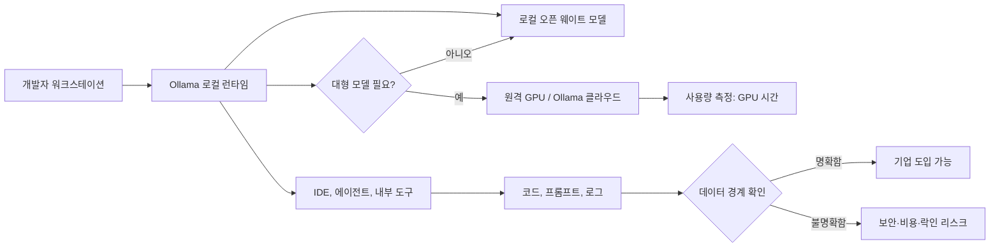

> 한 줄 요약: Ollama 투자는 오픈소스 AI 도구가 로컬 LLM 실행 도구에서 기업용 플랫폼으로 옮겨 가는 장면을 보여준다. 쟁점은 과금 자체가 아니다. 로컬 우선이라는 약속이 어디까지 유지되는지가 문제다.

## 무슨 일이 있었나

2026년 7월 9일 TechCrunch는 Ollama가 6,500만 달러 규모의 시리즈 B 투자를 유치했다고 보도했다. 이번 라운드는 Theory Ventures가 주도했다. 앞서 Benchmark가 주도한 1,500만 달러 시리즈 A까지 더하면 누적 투자금은 8,800만 달러다.

Ollama는 2023년에 나온 오픈소스 AI 개발자 도구다. 출발점은 개발자가 로컬 PC에서 오픈 웨이트(open-weight) AI 모델을 몇 분 안에 실행할 수 있게 하는 것이었다. TechCrunch 보도 기준으로 GitHub 스타는 17만 6,000개, 포크는 약 1만 7,000개다. 회사 측은 월간 개발자 사용자가 890만 명을 넘었고, 포춘 500 기업의 85%에서 Ollama를 쓴다고 밝혔다.

확인된 사실은 여기까지다.

- Ollama는 로컬에서 모델을 실행하는 무료 데스크톱 경험으로 성장했다.
- 더 큰 모델을 원격 GPU에서 쓰는 클라우드 구독 상품도 제공한다.
- 구독은 무료부터 월 100달러까지 있고, 사용량 기준은 토큰이 아니라 GPU 시간이다.
- 회사는 핵심 데스크톱 제품의 전제가 바뀌지 않았다고 말한다.

아직 해석이 필요한 부분도 있다. Ollama의 클라우드 사업이 무료 프로젝트를 약화시키는지, 로컬에서 돌리기 어려운 대형 모델을 쓰기 위한 자연스러운 확장인지는 지금 자료만으로 단정하기 어렵다. 그래도 커뮤니티가 민감하게 보는 이유는 분명하다. 개발자 도구는 한 번 워크플로에 들어오면 교체 비용이 커진다.

## 왜 사람들이 반응했나

### 사람들이 민감한 건 돈보다 약속의 변화다

오픈소스 프로젝트가 투자받는 일은 새롭지 않다. 개발자들이 예민하게 보는 지점은 따로 있다. 처음에는 로컬, 무료, 단순함을 약속한 도구가 어느 순간 계정, 과금, 원격 실행, 기업 영업 중심으로 재배치될 수 있다는 기억이다.

TechCrunch 기사에도 이 긴장이 나온다. 약 1년 전부터 일부 블로그와 소셜 글에서 Ollama의 클라우드 사업이 무료 프로젝트보다 우선되는 것 아니냐는 불만이 있었다고 한다. 개발자 도구의 엔시티피케이션(Enshittification)이라고 부르는 흐름이다.

그래도 클라우드 상품이 생겼다는 이유만으로 프로젝트가 망가졌다고 말하기는 이르다. 대형 오픈 모델은 개인 노트북에서 돌리기 어렵고, 기업은 로컬 실험 다음 단계로 공유 가능한 GPU 인프라를 원한다. Ollama가 그 수요를 잡으려는 것도 이상한 일은 아니다.

갈등은 상업화 자체보다 약속의 경계에서 생긴다.

| 쟁점 | 커뮤니티가 보는 위험 | 회사가 말하는 논리 |
|---|---|---|
| 로컬 실행 | 나중에 클라우드 의존이 커질 수 있음 | 큰 모델은 로컬에서 돌리기 어려움 |
| 무료 도구 | 핵심 기능이 유료로 이동할 수 있음 | 데스크톱 핵심은 그대로 유지 |
| 오픈소스 | 브랜드는 오픈소스인데 수익은 폐쇄형이 될 수 있음 | 모델 발견과 실행 경험을 확장 |
| 기업 도입 | 데이터와 코드가 원격으로 흐를 수 있음 | GPU 시간 기반 과금으로 비용 예측 가능 |

### 로컬 LLM 커뮤니티가 원하는 것은 단순한 무료가 아니다

Reddit의 LocalLLaMA 커뮤니티에서 반복되는 불만을 보면, 돈보다 구체적인 요구가 보인다. 한 사용자는 로컬 LLM용 코딩 도구를 찾으면서 OpenCode의 GUI와 데스크톱 앱 방향은 좋지만 기본 기능이 부족하고, 개발자들이 TUI를 더 우선하는 것처럼 보인다고 썼다. 서버에서 장기 작업을 돌리고 싶다는 요구도 함께 나왔다.

이 반응은 Ollama 이슈와 맞닿아 있다. 로컬 AI 도구 사용자는 모델을 공짜로 돌리는 것만 바라지 않는다. 이들이 원하는 조건은 더 분명하다.

- 내 코드와 데이터가 어디로 가는지 알고 싶다.
- 장기 작업을 안정적으로 맡기고 싶다.
- GUI, 서버, CLI가 각자 따로 놀지 않기를 바란다.
- 필요한 경우 원격 GPU도 쓰되, 그 전환이 명시적이길 원한다.

커뮤니티의 기대는 로컬과 클라우드 중 하나를 고르는 문제가 아니다. 기본값은 로컬이어야 하고, 원격 실행으로 넘어갈 때는 사용자가 통제할 수 있어야 한다는 쪽에 가깝다.

### 오픈 모델 논쟁도 같은 질문으로 이어진다

또 다른 LocalLLaMA 글은 어떤 오픈 모델이 생태계에 더 도움이 되는지 묻는다. 그 글에서 중요한 기준으로 나온 것은 가중치 공개 여부만이 아니었다. 학습 데이터와 학습 절차까지 공개해 재현 가능성을 제공하느냐가 핵심 질문이었다.

소프트웨어로 비유하면 무료 바이너리를 주는 것과 소스 코드를 주는 것은 다르다. LLM에서도 비슷하다. 오픈 웨이트 모델은 사용할 수 있지만, 왜 그런 성능이 나왔는지 검증하거나 같은 방식으로 재현하기는 어려울 수 있다.

Ollama 같은 도구는 이 중간 지대에 서 있다. 사용자는 모델 실행을 쉽게 만든 점에 반응하지만, 모델의 개방성, 실행 위치, 데이터 흐름, 과금 구조는 서로 다른 문제다. 도구가 편해질수록 이 구분은 더 쉽게 흐려진다.

## 내가 보는 핵심

### 로컬 LLM 도구에서 중요한 건 통제 가능성이다

Ollama를 Docker Desktop에 비유하는 설명은 꽤 설득력이 있다. Docker가 컨테이너 실행에 필요한 복잡한 환경 설정을 감췄듯, Ollama는 오픈 모델 실행의 복잡함을 감췄다. 개발자 입장에서 이 추상화는 강력하다. 설치, 모델 다운로드, 실행 명령, API 호출이 단순해지면 실험 속도가 달라진다.

다만 Docker의 비유는 경고로도 읽힌다. 개발자 도구가 표준 관문이 되면 그 도구의 기본값이 생태계의 기본값이 된다. 어떤 모델을 추천하는지, 어떤 실행 경로를 편하게 만드는지, 언제 원격 GPU로 유도하는지, 어떤 사용량을 측정하는지가 모두 영향력을 갖는다.

Ollama의 문제를 오픈소스와 상업화의 대립으로만 보면 놓치는 부분이 있다. 실제 질문은 이쪽에 가깝다.

- 사용자는 언제 로컬에서 실행 중인지 명확히 알 수 있는가?
- 원격 실행으로 넘어갈 때 데이터 범위와 비용이 드러나는가?
- 무료 프로젝트의 핵심 기능이 계속 로컬에서 완결되는가?
- 기업 도입 시 보안팀이 감사할 수 있는 로그와 정책이 있는가?
- 모델 저장소, 실행 런타임, 클라우드 과금이 한 회사에 과도하게 묶이는가?

이 질문에 답하지 못하면 도구가 아무리 좋아도 현업에서는 불안하다. 이 경계를 잘 설계하면 유료 클라우드가 붙어도 커뮤니티 신뢰를 잃지 않을 여지가 있다.

### AI 에이전트 시대에는 신뢰 경계가 더 얇아진다

Ollama 투자 기사와 별개로, Noma Labs가 2026년 7월 6일 공개한 GitLost 사례는 지금의 AI 개발 도구가 왜 신뢰 경계를 더 엄격히 다뤄야 하는지 보여준다. 해당 글은 GitHub의 Agentic Workflows에서 간접 프롬프트 인젝션(indirect prompt injection)을 이용해 비공개 저장소 데이터가 유출될 수 있었다고 주장한다.

여기서 봐야 할 대목은 GitHub 한 제품의 취약점 여부만이 아니다. AI 에이전트는 이슈, README, 코드, 로그처럼 원래 사람이 읽던 텍스트를 지시문처럼 해석할 수 있다. 공격자는 공개 저장소 이슈에 악의적 지시를 심고, 에이전트가 조직 내 다른 권한과 연결될 때 예상하지 못한 데이터 흐름을 만들 수 있다.

Ollama 같은 로컬 LLM 도구도 이 흐름에서 자유롭지 않다. 로컬에서 실행된다는 점은 장점이다. 하지만 에이전트가 IDE, GitHub, 사내 문서, 터미널, 클라우드 GPU를 동시에 붙잡는 순간 위험은 실행 위치만으로 설명되지 않는다.

로컬 실행은 보안의 시작점이지 결승선이 아니다.

현업에서 비슷한 고민을 하다 보면 사용자는 모델 성능보다 권한 모델을 먼저 묻게 된다. 이 에이전트가 어떤 파일을 읽을 수 있는지, 어느 URL로 요청을 보낼 수 있는지, 프롬프트와 결과가 어디에 저장되는지, 실패했을 때 누가 추적할 수 있는지가 실제 도입 판단을 가른다.

### Chatto가 보여준 작고 명시적인 셀프호스팅

Hacker News에서 크게 회자된 Chatto 오픈소스 공개 글도 같은 축에서 읽을 수 있다. Chatto는 팀 채팅 앱을 셀프호스팅할 수 있게 만들었다고 소개한다. 단일 실행 파일, 자체 프론트엔드 제공, 서버별 독립 커뮤니티, 제3자 추적 없음, 사용자별 키 기반 암호화 같은 설명이 붙었다.

이 사례를 Ollama와 바로 비교할 수는 없다. 채팅 앱과 AI 런타임은 문제 영역이 다르다. 그래도 커뮤니티가 반응한 이유는 비슷하다. 사용자는 오픈소스라는 라벨만으로 만족하지 않는다. 운영 모델이 머릿속에 그려지는 도구를 원한다.

Chatto는 데이터가 어디에 있고, 서버가 어떻게 나뉘며, 삭제 시 키가 어떻게 처리되는지 비교적 명시적으로 말한다. Ollama도 기업용 클라우드와 로컬 런타임을 함께 키우려면 이런 수준의 설명이 필요해진다. 모델 실행 도구에서 데이터 경계는 기능 설명이 아니라 제품 신뢰의 일부다.

## 앞으로 볼 기준

### Ollama 같은 오픈소스 AI 도구를 볼 때 확인할 것

다음에 Ollama, OpenCode, 로컬 LLM GUI, 에이전트 런타임 같은 도구 소식을 볼 때는 다운로드 수나 GitHub 스타만 보지 않는 편이 낫다. 스타는 관심을 보여주지만, 현업에서 믿고 들여도 되는지까지 증명하지는 않는다.

실무에서 확인할 기준은 이런 쪽이다.

- 로컬 기능과 클라우드 기능이 문서에서 분명히 나뉘는가
- 원격 실행 시 코드, 프롬프트, 메타데이터가 어디로 전송되는가
- 과금 단위가 토큰, GPU 시간, 작업 단위 중 무엇인가
- 무료 데스크톱 기능의 로드맵이 공개되어 있는가
- 모델 추천, 다운로드, 캐시, 업데이트 정책을 사용자가 제어할 수 있는가
- 기업 환경에서 프록시, 감사 로그, 네트워크 차단, 권한 제한을 설정할 수 있는가
- 에이전트가 외부 입력을 읽을 때 프롬프트 인젝션 방어가 있는가
- 오픈소스 저장소와 유료 서비스 사이의 책임 범위가 명확한가

특히 GPU 시간 기반 과금은 토큰 과금보다 직관적으로 보일 수 있지만, 장기 실행 에이전트에서는 다른 비용 리스크가 생긴다. 코딩 에이전트가 작업을 오래 붙잡거나, 재시도 루프에 빠지거나, 대형 모델을 잘못 선택하면 비용은 조용히 늘어난다. 로컬 도구에서 출발한 서비스일수록 이런 전환 지점에 경고와 제한 장치가 있어야 한다.

### 오픈소스 AI의 다음 논쟁은 라이선스보다 운영 모델에 있다

오픈소스 AI 논쟁은 한동안 라이선스, 가중치 공개, 상업적 사용 가능 여부에 집중됐다. 이제는 운영 모델이 더 앞에 나올 가능성이 크다. 사용자는 모델이 열려 있는지뿐 아니라, 그 모델을 쓰게 만드는 도구의 권한과 경제 구조까지 보게 된다.

Ollama의 투자는 승리 선언도 아니고 배신의 증거도 아니다. 로컬 LLM이 장난감 단계에서 개발자 인프라로 넘어가고 있다는 신호에 가깝다. 이때 커뮤니티가 까다롭게 구는 것은 당연하다. 사랑받는 도구일수록 더 깊은 워크플로에 들어가고, 더 많은 코드와 데이터 가까이에 서기 때문이다.

처음의 긴장으로 돌아가면 답은 단순하다. Ollama가 돈을 벌 수 있느냐가 쟁점이 아니다. 로컬에서 시작한 신뢰를 클라우드 사업으로 가져갈 수 있느냐가 쟁점이다. 앞으로의 평판은 투자금보다 기본값, 문서, 권한 경계, 그리고 무료 핵심 기능을 어떻게 유지하느냐에서 결정될 것이다.

## 참고 자료

- [선정 글감] [Popular open source AI developer tool Ollama raises $65M, grows to nearly 9M users](https://techcrunch.com/2026/07/09/popular-open-source-ai-developer-tool-ollama-raises-65m-grows-to-nearly-9m-users/), TechCrunch
- [관련] [Chatto is now open source](https://www.hmans.dev/blog/chatto-is-open-source), Hacker News Best
- [관련] [What GUI-first coding tool are you pairing your local LLMs with?](https://www.reddit.com/r/LocalLLaMA/comments/1ura06l/what_guifirst_coding_tool_tool_are_you_pairing/), Reddit LocalLLaMA
- [관련] [Which open models help the eco system more?](https://www.reddit.com/r/LocalLLaMA/comments/1urbn11/which_open_models_help_the_eco_system_more/), Reddit LocalLLaMA
- [관련] [GitLost: We Tricked GitHub's AI Agent into Leaking Private Repos](https://noma.security/blog/gitlost-how-we-tricked-githubs-ai-agent-into-leaking-private-repos/), Noma Security