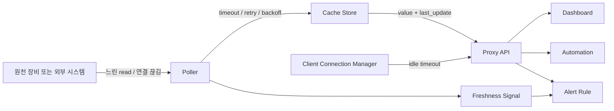

> 한 줄 요약: Modbus 프록시와 캐시 프록시에서 중요한 것은 빠른 응답만이 아니다. stale cache를 현재 데이터처럼 내보내지 않도록 관측성과 타임아웃을 설계해야 한다. 장애를 숨기는 캐시는 장애가 드러난 시스템보다 다루기 어렵다.

## 왜 지금 이슈인가

Kubernetes, 홈 오토메이션, 산업 장비, 데이터 파이프라인을 보면 원천 데이터 앞에 캐시 프록시를 두는 경우가 많다. 이유는 단순하다. 원천 시스템이 느리거나 비싸거나 불안정하고, 너무 자주 읽으면 문제가 생기기 때문이다.

원문의 Modbus 프록시 사례는 작은 태양광 인버터 연동 이야기처럼 보인다. 하지만 개발자들이 바로 공감할 만한 문제가 있다. 화면은 계속 숫자를 보여주는데, 그 숫자가 더 이상 현재값이 아닐 수 있다는 점이다.

크래시(Crash)는 티가 난다. 프로세스가 죽고, 헬스체크가 실패하고, 알림이 울린다. 반대로 캐시가 마지막 정상값을 계속 서빙하면 시스템은 멀쩡해 보인다. 이때 대시보드, 자동화 룰, 과금 로직, 운영 판단은 오래된 데이터를 현재 데이터로 착각할 수 있다.

원문은 Huawei SUN2000 SDongle이 밤에 잠들거나 펌웨어 재부팅 뒤 바로 응답하지 않는 상황을 다룬다. 단순한 구현은 poll, cache, serve 구조로 낮에는 잘 동작한다. 하지만 밤에 `asyncio` read가 끝나지 않으면 캐시는 마지막 낮 시간 값을 붙잡은 채 멈춘다.

이 문제는 Modbus에만 해당하지 않는다. Redis 앞단 캐시, IoT 게이트웨이, Kafka consumer 상태 캐시, Kubernetes controller의 local cache, 관측성 에이전트의 metric buffer에서도 같은 질문이 나온다.

캐시는 언제부터 거짓말을 하는가.

## 커뮤니티에서 갈리는 지점

캐시 프록시를 둘 때 의견은 보통 두 갈래로 나뉜다. 하나는 안정적인 응답을 위해 캐시를 최대한 유지해야 한다는 쪽이다. 다른 하나는 데이터가 오래되면 차라리 실패를 드러내야 한다는 쪽이다.

둘 다 맞는 말이다. 문제는 어떤 값을 다루느냐에 있다.

| 상황 | 오래된 캐시 허용 가능성 | 이유 |
|---|---:|---|
| 블로그 인기글 목록 | 높음 | 몇 분 늦어도 의사결정 피해가 작음 |
| 태양광 발전량 대시보드 | 중간 | 표시용이면 허용 가능하지만 자동화와 연결되면 위험 |
| 배터리 충전 제어 | 낮음 | 오래된 값이 제어 명령으로 이어질 수 있음 |
| 보안 이벤트 탐지 | 매우 낮음 | 누락과 지연이 침해 대응을 늦춤 |
| 결제, 재고, 과금 | 매우 낮음 | stale read가 직접 손실로 이어질 수 있음 |

원문이 설득력 있는 이유는 캐시를 버리라고 말하지 않기 때문이다. 캐시는 유지하되, 신선도(Freshness)를 별도 신호로 만들라고 말한다. 실무에서는 이 관점이 더 쓸모 있다.

커뮤니티에서 자주 나오는 반론은 ready-made add-on이나 기존 프록시를 쓰면 되는 것 아니냐는 질문이다. 맞는 말이다. 직접 만든 프록시는 운영 부담이 크다. 다만 완성된 도구를 쓰더라도 확인해야 할 것은 같다.

- 원천 연결이 끊겼을 때 read timeout이 있는가
- 연결 실패와 일시적인 batch timeout을 구분하는가
- 재시도 간격이 장비를 더 괴롭히지 않는가
- 캐시의 마지막 갱신 시각을 외부에서 볼 수 있는가
- 소비자가 stale 상태를 정상값과 구분할 수 있는가

이 질문에 답하지 못하면 직접 구현했는지, 패키지를 설치했는지는 덜 중요하다. 운영 리스크는 구현 방식보다 데이터 계약에서 터진다.

## 아키텍처 관점에서 볼 점

캐시 프록시는 요청을 대신 받아주는 컴포넌트에 그치지 않는다. 원천 시스템과 소비자 사이에서 시간, 실패, 신뢰도를 번역하는 계층이다.

원문의 구조를 일반화하면 다음과 같다.

여기서 중요한 점은 캐시 저장소(Cache Store)가 값만 들고 있으면 안 된다는 것이다. 값과 함께 마지막 갱신 시각, 갱신 성공 여부, 실패 횟수, 원천 연결 상태가 같이 움직여야 한다.

원문의 구현은 세 가지 축으로 나뉜다.

첫째, batch read마다 강한 타임아웃을 둔다. `asyncio.wait_for`로 각 Modbus register batch를 감싸고, batch 사이에 50ms 간격을 둔다. SDongle처럼 느린 장비는 연속 read를 견디지 못할 수 있기 때문이다.

둘째, 예외를 같은 실패로 뭉개지 않는다. 단일 `TimeoutError`는 한 batch가 빠진 정도로 보고 다음 batch를 시도할 수 있다. 반면 연결 자체가 끊긴 예외라면 내부 루프를 빠져나가 outer loop가 새 연결을 만들게 해야 한다.

셋째, stale cache를 로그와 알림으로 드러낸다. 원문에서는 마지막 갱신 뒤 120초가 지나면 `Cache stale` 경고를 남긴다. 이 신호가 있어야 Home Assistant 같은 소비자가 unavailable 상태나 push notification으로 이어갈 수 있다.

이 구조에서 자주 생기는 실수는 다음과 같다.

- read timeout 없이 원천 시스템을 믿는다
- 실패한 연결에 계속 read를 던진다
- 캐시 hit를 성공으로 기록한다

특히 세 번째가 위험하다. 캐시 hit는 소비자 응답 성공일 뿐, 원천 데이터 갱신 성공이 아니다. 이 둘을 같은 metric으로 합치면 대시보드는 초록색인데 실제 데이터 파이프라인은 멈춘 상태가 된다.

그래서 캐시 프록시의 헬스체크는 여러 층으로 나눠야 한다.

| 헬스체크 | 묻는 질문 | 예시 |
|---|---|---|
| Liveness | 프로세스가 살아 있는가 | HTTP 200, socket accept |
| Readiness | 요청을 받을 준비가 되었는가 | cache initialized |
| Freshness | 데이터가 믿을 만한가 | last_update age < threshold |
| Upstream health | 원천과 통신 가능한가 | last poll success, reconnect count |

Kubernetes에서 readiness probe만 보고 트래픽을 보내는 것과 비슷하다. 프로세스가 살아 있어도 의존성이 죽어 있으면 정상 서비스가 아니다. 캐시 프록시는 여기에 freshness probe가 하나 더 필요하다.

## 실무에서 볼 점

도입 전에 가장 먼저 정해야 할 것은 TTL(Time To Live)이 아니다. 허용 가능한 거짓 정상 시간이 얼마인지부터 정해야 한다. 데이터가 몇 초 늦어져도 되는지보다, 몇 초 뒤부터 정상처럼 보여서는 안 되는지를 정하는 문제다.

현업에서 비슷한 고민을 하다 보면 stale threshold를 너무 기술적으로만 잡기 쉽다. poll interval이 10초니까 30초면 되겠지 같은 식이다. 하지만 기준은 소비자의 행동에서 나와야 한다.

자동화가 1분 단위로 장비를 제어한다면 120초 stale은 너무 길 수 있다. 반대로 사람이 보는 에너지 대시보드라면 2분 경고가 충분할 수 있다. 같은 Modbus 값이라도 표시용인지 제어용인지에 따라 계약이 달라진다.

원문에 나온 숫자는 구체적이다.

| 파라미터 | 값 | 의미 |
|---|---:|---|
| batch 간격 | 50ms | SDongle이 연속 read를 버티도록 완충 |
| poll interval | 10초 | 태양광 데이터 표시에는 충분히 촘촘한 주기 |
| stale threshold | 120초 | 두세 번의 실패를 넘긴 뒤 경고 |
| client idle timeout | 60초 | 죽은 클라이언트 연결 정리 |

이 숫자를 그대로 복사하기보다 각 값이 어떤 실패 모드에 대응하는지 보는 편이 낫다. batch 간격은 장비 보호, poll interval은 데이터 해상도, stale threshold는 신뢰도 계약, idle timeout은 리소스 누수 방지에 가깝다.

보안 관점도 빼면 안 된다. 원문은 실제 LAN IP를 공개하지 말고 placeholder를 쓰라고 짚는다. 사소해 보이지만 운영 글, GitHub gist, 포럼 질문에서 내부 IP, 포트, 장비 모델, 펌웨어 단서가 함께 노출되는 경우가 많다.

Modbus TCP는 인증과 암호화가 약한 환경에서 쓰이는 경우가 많다. 홈 네트워크라고 가볍게 볼 문제가 아니다. 최소한 다음 조건은 확인해야 한다.

- 프록시는 필요한 네트워크 세그먼트에만 노출한다
- 원천 장비 포트는 인터넷에 직접 열지 않는다
- 설정값과 로그에 내부 IP, 장비 식별자를 무심코 공개하지 않는다
- 대시보드 계정과 자동화 권한을 분리한다
- 장애 로그에 원천 응답 payload가 과도하게 남지 않게 한다

운영 관점에서는 backoff 전략이 중요하다. 실패했을 때 빠르게 재시도하는 것은 좋지만, 원천 장비가 재부팅 중이거나 절전 상태라면 재시도 폭주가 복구를 더 늦출 수 있다. 원문처럼 빠른 재시도 뒤 상한을 두는 방식은 작은 장비에 맞는 현실적인 타협이다.

데이터베이스나 API 캐시에서도 같은 원칙을 쓸 수 있다. upstream이 불안정할 때 모든 worker가 동시에 재연결하면 thundering herd 문제가 생긴다. backoff에는 jitter를 더하고, stale 상태는 값과 별도로 노출해야 한다.

도입 조건을 정리하면 이렇다.

| 확인할 조건 | 질문 |
|---|---|
| 데이터 용도 | 표시용인가, 제어용인가, 과금용인가 |
| 실패 허용 | stale 값을 보여줄 것인가, unavailable로 바꿀 것인가 |
| 원천 특성 | read 제한, sleep 모드, 재부팅 시간, rate limit이 있는가 |
| 소비자 특성 | polling 주기, timeout, stale 처리 방식이 있는가 |
| 운영 관측성 | last update age, reconnect count, timeout count를 볼 수 있는가 |
| 보안 경계 | 프록시와 원천 장비가 어느 네트워크에 노출되는가 |

직접 구현할지 기존 도구를 쓸지도 이 표로 판단하는 편이 낫다. 기존 add-on이 freshness와 reconnect를 충분히 제공하면 직접 만들 이유가 줄어든다. 반대로 장비 특성이 까다롭고 stale 처리 정책을 세밀하게 제어해야 한다면 작은 전용 프록시가 더 예측 가능할 수 있다.

다만 직접 만든 프록시는 테스트가 어렵다. 실제 장비는 밤에 자고, 펌웨어 업데이트 중 멈추고, 특정 간격 이하의 요청에만 실패한다. 이런 실패는 단위 테스트만으로 잡기 어렵다.

최소한 다음 하네스(Test Harness)는 두는 편이 좋다.

- read가 영원히 끝나지 않는 upstream 시뮬레이터
- N번 성공 뒤 연결을 끊는 fake Modbus 서버
- batch 중간에만 timeout을 내는 케이스
- 클라이언트가 header 일부만 보내고 멈추는 케이스
- cache age가 threshold를 넘을 때 alert metric이 올라가는지 검증

이런 테스트는 눈에 띄지 않지만 캐시 프록시의 본질을 검증한다. 빠른 정상 경로보다 느리고 애매한 실패 경로가 운영 비용을 더 크게 만들기 때문이다.

## 정리

캐시 프록시를 설계할 때 질문은 캐시를 쓸 것인가가 아니다. 오래된 값을 어떻게 드러낼 것인가다.

Modbus 프록시 사례는 작은 장비 연동 이야기처럼 시작하지만, 핵심은 더 넓게 적용된다. 타임아웃 없는 read는 장애를 붙잡고, freshness 없는 캐시는 거짓 정상 상태를 만든다. 재연결과 backoff는 복구를 위한 장치이고, stale signal은 운영자가 현재 상태를 보게 하는 장치다.

지금 확인할 것은 하나다. 운영 중인 캐시, 프록시, consumer local state 중에서 마지막 원천 갱신 시각을 외부 지표로 볼 수 있는지 확인해보자. 볼 수 없다면 그 시스템은 실패했을 때 조용히 거짓 정상 상태를 만들 가능성이 있다.

## 참고 자료

- [선정 글감] [A Robust Modbus Proxy: Reconnect, Stale-Cache Detection and Timeouts Done Right](https://dev.to/cloudapp_dev/a-robust-modbus-proxy-reconnect-stale-cache-detection-and-timeouts-done-right-149b) — DEV Community