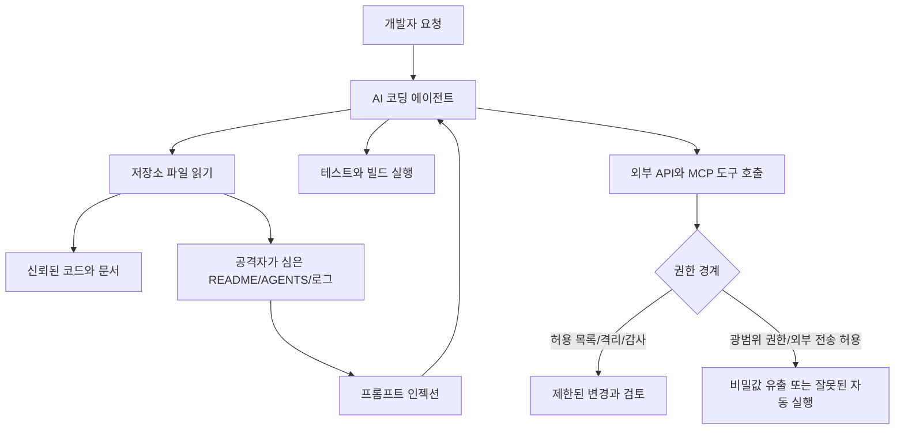

> 한 줄 요약: Meta의 Muse Spark 1.1 논쟁은 AI 코딩 모델 성능보다 “값싼 에이전트에게 어디까지 권한을 줄 것인가”에 가깝다. 토큰 단가가 내려가면 실험은 쉬워지지만, 도구 호출·파일 접근·외부 전송 리스크도 같이 싸진다.

## 무슨 일이 있었나

Meta는 2026년 7월 9일 Muse Spark 1.1과 새 Meta Model API 공개 프리뷰를 발표했다. Muse Spark 1.1은 멀티모달 추론 모델이고, Meta는 이 모델이 에이전트 작업, 컴퓨터 사용, 코딩, 도구 호출에 강하다고 설명했다.

공식 발표에서 확인되는 내용은 다음과 같다.

- Muse Spark 1.1은 Meta AI 앱과 meta.ai의 Thinking 모드에서 제공된다.
- 개발자는 새 Meta Model API 공개 프리뷰를 통해 접근할 수 있다.
- 모델은 100만 토큰 컨텍스트, 도구·함수 호출, 멀티 에이전트 오케스트레이션, 코드 수정·마이그레이션을 내세운다.
- Meta의 평가 보고서는 화학·생물, 사이버보안, 통제 상실 위험을 다뤘다. 완화 전에는 일부 영역에서 high risk 임계값을 배제할 수 없다고 썼고, 배포 시점의 잔여 위험은 완화책 적용 후 moderate or lower라고 정리했다.

가격도 논쟁을 키웠다. TechCrunch는 Reuters 보도를 인용해 입력 100만 토큰당 1.25달러, 출력 100만 토큰당 4.25달러라고 전했다. Hacker News에서는 캐시 입력 가격과 장시간 코딩 세션 비용을 두고 댓글이 이어졌다. HN 게시글은 공개 직후 약 300포인트와 160개 넘는 댓글을 모았다.

다만 확인된 사실과 해석은 나눠서 봐야 한다.

| 구분 | 내용 |
|---|---|
| 확인된 사실 | 2026년 7월 9일 Meta가 Muse Spark 1.1과 Meta Model API 공개 프리뷰를 발표했다. |
| 확인된 사실 | 공식 문서는 에이전트 작업, 코딩, 컴퓨터 사용, 멀티모달 이해, 100만 토큰 컨텍스트를 강조한다. |
| 확인된 사실 | 평가 보고서는 프롬프트 인젝션, 파일 인젝션, 도구 호출 환경을 별도 위험 영역으로 다룬다. |
| 보도 기반 사실 | TechCrunch/Reuters 기준 API 가격은 입력 100만 토큰 1.25달러, 출력 100만 토큰 4.25달러다. |
| 커뮤니티 반응 | HN에서는 가격, 벤치마크 신뢰성, 지역 제한, 오픈웨이트가 아닌 점, Meta 브랜드 신뢰 문제가 섞여 논쟁이 붙었다. |
| 아직 추정 | Meta가 낮은 가격을 얼마나 유지할지, 실제 대규모 코딩 업무에서 경쟁 모델을 대체할지는 공개 벤치마크만으로 판단하기 어렵다. |

## 왜 사람들이 반응했나

### Muse Spark 1.1 가격 논쟁은 왜 컸나

AI 코딩 모델에서 가격은 단순한 할인 정보가 아니다. 에이전트형 코딩은 한 번의 답변으로 끝나지 않는다. 저장소를 읽고, 테스트를 돌리고, 로그를 보고, 다시 코드를 고치고, 스크린샷이나 도구 결과를 해석한다.

즉 비용은 다음 요소가 곱해진 값이다.

- 컨텍스트 길이
- 반복 호출 횟수
- 도구 호출 실패율
- 캐시 입력 가격
- 출력 토큰 길이
- 사람 검토 없이 맡기는 작업 범위

HN에서 캐시 입력 가격 이야기가 길어진 이유도 여기에 있다. 멀티턴 코딩 세션에서는 같은 저장소 맥락을 반복해서 넣는다. 표면 가격이 싸 보여도 캐시 정책이 불리하면 실제 비용이 달라진다. 반대로 캐시가 충분히 싸면 기업 내부 코드베이스 전체를 계속 들고 가는 워크플로도 가능해진다.

가격이 낮아질수록 팀은 더 많은 일을 에이전트에게 맡긴다. 이 지점부터 비용 절감 문제는 운영 리스크와 붙기 시작한다.

### Meta Model API에서 불편했던 지점은 무엇인가

커뮤니티 반응은 찬반 하나로 정리되지 않았다. 크게 네 가지 불편이 겹쳤다.

첫째, 벤치마크 신뢰성이다. HN 첫 댓글 흐름은 Terminal-Bench 세부 조건과 리소스 제한 문제를 짚었다. 모델 비교에서 CPU·메모리·하네스 조건이 다르면 점수는 모델 능력만 말하지 않는다. 특히 코딩 에이전트는 모델 자체보다 실행 환경, 재시도 전략, 툴 래퍼, 테스트 자동화에 따라 성능이 크게 달라진다.

둘째, 접근성이다. 공식 발표는 공개 프리뷰라고 했지만, 커뮤니티에서는 지역 제한을 겪었다는 반응이 나왔다. The Verge는 미국 개발자 대상 공개 프리뷰라고 보도했다. 글로벌 개발자가 같은 날 같은 조건으로 검증하기 어렵다면 초기 평판은 일부 사용자 경험에 기대게 된다.

셋째, 오픈웨이트 기대의 후퇴다. Meta는 Llama 계열로 오픈 모델 생태계에서 강한 이미지를 만들었다. 그런데 Muse Spark 1.1은 API 제품으로 등장했다. 그래서 일부 개발자는 경쟁자가 하나 늘었다고 보면서도, Meta가 이번에는 개방형 모델 리더십보다 유료 API 경쟁 쪽으로 움직였다고 받아들였다.

넷째, 브랜드와 데이터 신뢰다. Meta의 소셜 플랫폼 맥락 때문에 개발자들은 코드, 문서, 고객 데이터가 어떤 정책으로 처리되는지 예민하게 본다. 공식 발표가 성능과 가격을 앞세울수록, 실무자는 데이터 보존, 학습 사용 여부, 리전, 감사 로그, 기업 계약 조건을 먼저 묻게 된다.

## 내가 보는 핵심

이번 이슈의 핵심은 “Meta가 OpenAI·Anthropic과 경쟁할 만한 모델을 냈나”가 아니다. 그 질문은 너무 좁다.

더 나은 질문은 이쪽이다.

> 값싼 에이전트 API가 생겼을 때, 우리는 권한 설계를 가격 설계만큼 빨리 바꾸고 있는가?

Muse Spark 1.1 평가 보고서가 흥미로운 이유도 여기에 있다. Meta는 에이전트형 API가 개발자 통제 도구 호출과 함수 호출을 노출한다고 본다. 그리고 프롬프트 인젝션(Prompt Injection), 특히 에이전트가 읽는 파일에 숨은 지시가 도구 실행을 오염시키는 파일 인젝션(File Injection)을 따로 평가했다.

보고서의 SWE-PI 설명은 꽤 현실적이다. 공격자가 README.md, AGENTS.md, SKILL.md, Makefile, 코드 주석, 로그, MCP 결과 같은 표면에 지시를 심어두고, 에이전트가 작업 중 그 파일을 읽게 만드는 방식이다. 단순 실험 환경에서는 Muse Spark 1.1의 공격 성공률이 낮게 나왔지만, 더 현실적인 SWE-PI Agent에서는 AGENTS.md와 README.md를 통한 공격이 열린 문제로 남는다고 적었다.

현업에서 비슷한 고민을 하다 보면 모델 선택보다 권한 경계가 먼저 흔들린다. 모델은 “테스트를 고치겠다”고 말하지만, 실제로는 토큰을 읽고 파일을 수정하고 셸을 실행하고 네트워크로 데이터를 내보낼 수 있다. 이때 중요한 질문은 모델의 의도가 선한가가 아니라 “실패해도 어디까지 망가지는가”다.

이 그림에서 모델은 가운데에 있지만, 사고는 오른쪽에서 난다. 도구 권한, 네트워크 송신, 비밀값 접근, 워크스페이스 격리, 로그 보존이 느슨하면 더 좋은 모델도 위험한 실행자가 된다.

그래서 Muse Spark 1.1의 낮은 가격은 양면적이다. 작은 팀도 대규모 마이그레이션, 버그 수정, UI 점검을 더 많이 자동화할 수 있다. 동시에 실패한 자동화도 더 많이, 더 오래, 더 깊은 권한으로 실행될 수 있다.

## 앞으로 볼 기준

### AI 코딩 모델 도입 전에 무엇을 확인해야 하나

다음 모델 출시 뉴스를 볼 때는 리더보드 순위보다 아래 항목을 먼저 보는 편이 낫다.

| 체크포인트 | 봐야 할 질문 |
|---|---|
| 가격 | 입력·출력 단가뿐 아니라 캐시 입력, 장기 세션, 재시도 비용이 공개됐나 |
| 접근 범위 | API, 앱, IDE 플러그인, 리전 제한, 기업 계약 조건이 구분돼 있나 |
| 데이터 정책 | 프롬프트·코드·도구 출력이 학습에 쓰이는지, 보존 기간과 삭제 방식이 명확한가 |
| 권한 모델 | 파일 수정, 셸 실행, 네트워크 송신, 이슈·슬랙·메일 작성 권한을 분리할 수 있나 |
| 격리 | 작업 디렉터리, 시크릿, 패키지 설치, 외부 명령 실행을 샌드박스로 묶을 수 있나 |
| 벤치마크 | 모델 점수와 하네스 성능, 리소스 제한, 재시도 전략이 분리돼 공개됐나 |
| 실패 처리 | 불확실할 때 멈추고 사람에게 묻는 에스컬레이션 기준이 있는가 |
| 감사 가능성 | 어떤 파일을 읽고 어떤 명령을 실행했는지 나중에 재구성할 수 있나 |

특히 기업 환경에서는 “이 모델이 우리 코드베이스를 잘 이해하나”보다 “이 모델이 우리 코드베이스에서 해서는 안 되는 일을 못 하게 할 수 있나”가 먼저다. 전자는 파일럿으로 알 수 있지만, 후자는 사고가 난 뒤에야 비용이 보인다.

### Muse Spark 1.1 이후 모델 경쟁을 어떻게 읽을까

Muse Spark 1.1은 모델 경쟁이 세 단계로 넘어갔다는 신호처럼 보인다.

첫 단계는 답변 품질 경쟁이었다. 누가 더 똑똑한가, 누가 더 긴 글을 잘 쓰는가가 중심이었다.

둘째 단계는 코딩 능력 경쟁이었다. 버그 수정, 테스트 통과, 프런트엔드 생성, 저장소 이해가 비교 대상이 됐다.

셋째 단계는 실행 권한 경쟁이다. 모델이 브라우저를 조작하고, 파일을 읽고, 도구를 호출하고, 여러 하위 에이전트에 일을 나눠 맡긴다. 이 단계에서는 모델 가격이 내려가는 순간 자동화의 반경이 넓어진다.

반응이 컸던 이유는 Muse Spark 1.1이 낯선 제품이라서가 아니다. 오히려 익숙한 방향으로 너무 빨리 왔기 때문이다. 더 긴 컨텍스트, 더 싼 토큰, 더 많은 도구 호출, 더 자연스러운 API 호환성. 개발팀이 원하던 것들이 한꺼번에 오면, 그다음 질문은 편의가 아니라 책임이다.

앞으로 비슷한 발표가 나올 때는 “우리도 바꿔야 하나”보다 “바꿔도 되는 경계가 어디인가”를 먼저 정해야 한다. 싼 에이전트는 반가운 소식일 수 있다. 다만 싸졌다는 이유만으로 더 많은 권한을 주는 순간, 비용 최적화는 보안 설계와 충돌한다.

## 참고 자료

- [선정 글감] [Muse Spark 1.1 — Meta AI](https://ai.meta.com/blog/introducing-muse-spark-meta-model-api/)
- [관련] [Meta enters the crowded AI coding battle with Muse Spark 1.1 — TechCrunch](https://techcrunch.com/2026/07/09/meta-enters-the-crowded-ai-coding-battle-with-muse-spark-1-1/)
- [관련] [Muse Spark 1.1 — Hacker News](https://news.ycombinator.com/item?id=48846184)
- [관련] [Muse Spark 1.1 Evaluation Report — Meta AI](https://ai.meta.com/static-resource/muse-spark-1-1-evaluation-report)
- [관련] [Meta says its new AI model is ready to compete on coding — The Verge](https://www.theverge.com/ai-artificial-intelligence/963193/meta-muse-spark-model-api)