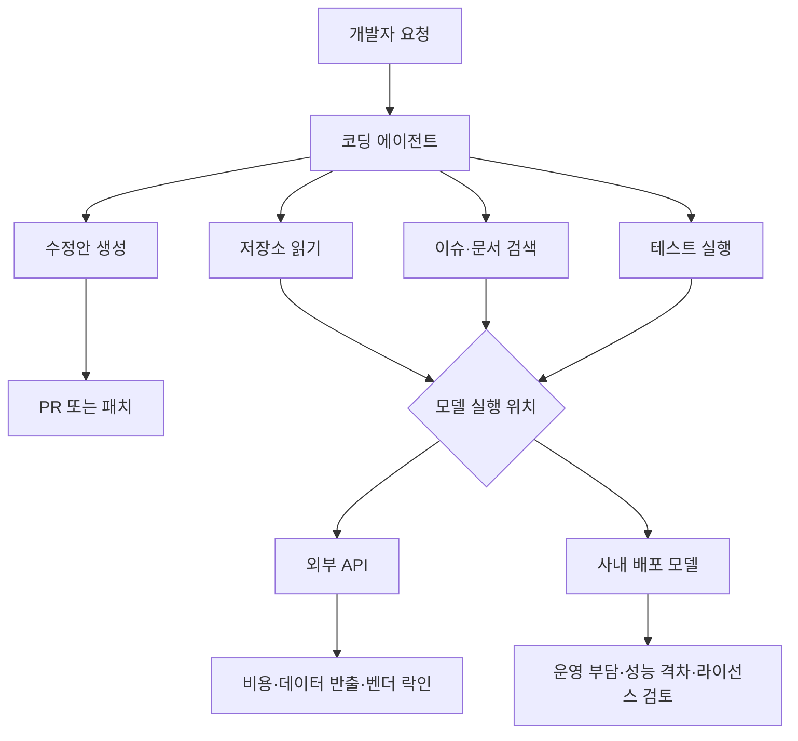

> 한 줄 요약: Meta Muse Spark 오픈소스 변형 소식에 사람들이 반응한 이유는 모델이 하나 더 나와서가 아니다. 기업용 에이전트 코딩 모델이 API 상품, 오픈소스 배포, 플랫폼 락인 사이에서 어디까지 열릴 수 있는지 다시 묻게 만들었기 때문이다.

## 무슨 일이 있었나

Meta Muse Spark 1.1은 2026년 7월 9일 공개된 멀티모달 AI 모델이다. Meta는 이 모델을 에이전트 코딩(agentic coding), 버그 수정, 대규모 코드 마이그레이션, 외부 앱과 서비스에 걸친 워크플로 자동화에 맞춘 모델이라고 설명했다.

여기까지만 보면 새 코딩 모델 출시 소식이다. 그런데 Reddit LocalLLaMA에 올라온 글은 다른 지점에서 관심을 모았다. 게시물 작성자는 CNBC 기사에서 Alexandr Wang이 Meta가 Muse Spark의 오픈소스 변형을 작업 중이라고 확인했다며, 아직 세부 사항이나 일정은 없다고 적었다.

확인된 사실과 추정을 나누면 이렇다.

| 구분 | 내용 |
| --- | --- |
| 확인된 사실 | Meta가 Muse Spark 1.1을 공개했다 |
| 확인된 사실 | Meta는 Spark를 저렴한 에이전트·코딩 모델로 포지셔닝했다 |
| 확인된 사실 | TechCrunch는 입력 100만 토큰당 1.25달러, 출력 100만 토큰당 4.25달러라는 Reuters 보도를 인용했다 |
| 확인된 사실 | Hacker News 관련 글은 수집 시점 기준 333점, 댓글 174개를 기록했다 |
| 제한된 확인 | Reddit 게시물은 Alexandr Wang 발언을 근거로 오픈소스 변형이 작업 중이라고 전했다 |
| 아직 추정 | 공개 시점, 라이선스, 가중치 공개 여부, 상업적 사용 조건, API 모델과의 기능 차이 |

이 이슈에서 조심해야 할 단어는 오픈소스다. 개발자 커뮤니티에서 오픈소스 AI 모델이라고 부를 때도 실제 의미는 꽤 다르다. 코드만 공개될 수도 있고, 모델 가중치(weights)가 공개될 수도 있고, 연구용 라이선스만 붙을 수도 있다. 기업 고객용 API 모델과 같은 성능을 가진 로컬 실행 모델이 나온다는 뜻으로 바로 읽기는 어렵다.

그래도 반응이 붙은 이유는 있다. Meta는 Llama 계열로 오픈 모델 생태계에서 존재감을 만들어 왔다. 그런 회사가 코딩 에이전트 시장에서도 오픈 변형을 언급하기 시작했다면, 개발자들은 자연스럽게 묻게 된다. Claude Code, OpenAI Codex류의 닫힌 에이전트 경험을 로컬 또는 자체 인프라에서 어디까지 대체할 수 있을까.

## 왜 사람들이 반응했나

Muse Spark 오픈소스 변형 논의의 핵심은 성능 비교표가 아니다. 사람들은 이 소식을 코딩 모델 시장의 가격 압박, 데이터 통제, 에이전트 권한 문제와 함께 읽었다.

먼저 비용이다. TechCrunch가 인용한 가격은 Meta가 Spark를 낮은 가격의 에이전트·코딩 모델로 밀고 있다는 해석을 가능하게 한다. 입력 100만 토큰당 1.25달러, 출력 100만 토큰당 4.25달러라는 숫자는 대규모 코드베이스 분석, 반복적인 리팩터링, 마이그레이션 작업처럼 토큰을 많이 쓰는 업무에서 바로 비용 계산으로 이어진다.

현업에서 AI 코딩 도구를 붙여 보면 작은 함수 생성보다 반복 호출에서 비용이 커진다. 저장소를 읽고, 실패 로그를 해석하고, 테스트를 다시 돌리고, 수정안을 재생성하는 루프가 길어질수록 출력 토큰과 도구 호출이 쌓인다. 그래서 저렴한 API 모델이나 로컬 실행 가능한 모델은 단순히 싸다는 문제를 넘어 자동화 범위를 어디까지 넓힐 수 있느냐의 문제로 이어진다.

다음은 신뢰와 데이터 통제다. 에이전트 코딩 모델은 일반 챗봇보다 권한이 넓다. 코드, 이슈, 로그, 환경 변수 이름, 배포 스크립트, 내부 문서 조각까지 읽게 된다. 기업 입장에서는 모델 성능만큼이나 어떤 데이터가 어디로 나가는지가 민감하다.

오픈소스 변형이 실제로 로컬 실행 가능하거나 사내 인프라에 배포 가능한 형태라면, 일부 조직은 API 기반 도구보다 받아들이기 쉬워진다. 반대로 라이선스가 제한적이거나 API 모델보다 기능이 크게 빠진다면 커뮤니티의 기대는 빠르게 식을 수 있다.

마지막은 플랫폼 권력이다. 코딩 에이전트는 IDE 플러그인 하나가 아니라 개발 워크플로의 중간층이 되고 있다. 이 중간층이 특정 API, 특정 클라우드, 특정 계정 체계에 묶이면 팀의 개발 방식 자체가 종속된다.

이 그림에서 핵심은 모델 자체보다 경계다. 같은 에이전트라도 외부 API로 호출하는지, 사내에서 실행하는지에 따라 보안 검토, 비용 구조, 장애 대응, 감사 로그가 달라진다.

Hacker News에서 관련 글이 빠르게 댓글을 모은 것도 이 맥락으로 볼 수 있다. 개발자들은 새 모델의 벤치마크보다 실제로 열리는 범위를 먼저 따진다. 공개된다고 했을 때 그 공개가 재현 가능한 공개인지, 상업적 사용이 가능한 공개인지, 파인튜닝과 배포가 가능한 공개인지가 모두 다르기 때문이다.

## 내가 보는 핵심

이 소식은 Meta가 코딩 모델 경쟁에 들어왔다는 시장 뉴스로만 읽기에는 아쉽다. 더 중요한 질문은 기업용 AI 에이전트가 닫힌 고성능 API와 열린 통제 가능성 사이에서 어디에 균형을 둘 것인가다.

닫힌 API 모델에는 분명한 장점이 있다. 운영 부담이 낮고, 최신 모델을 바로 쓸 수 있으며, 도구 호출과 멀티스텝 추론 품질이 빠르게 개선된다. 보안 심사만 통과하면 팀 입장에서는 가장 빨리 생산성을 확인할 수 있다.

하지만 에이전트 코딩은 단순 질의응답보다 훨씬 끈적한 영역이다. 한 번 워크플로에 들어오면 저장소 구조, 테스트 전략, 배포 규칙, 코드 리뷰 습관까지 도구에 맞춰진다. 나중에 모델을 바꾸려 해도 프롬프트 몇 개를 교체하는 수준으로 끝나지 않는다.

여기서 오픈소스 변형의 의미가 생긴다. 완전히 같은 성능이 아니더라도, 조직이 일부 작업을 자체 통제 가능한 모델로 옮길 수 있다면 선택지가 늘어난다. 예를 들어 민감도가 낮은 공개 저장소 작업은 외부 API를 쓰고, 내부 레거시 코드 분석은 사내 배포 모델을 쓰는 식의 분리가 가능하다.

다만 반대로 봐야 할 지점도 있다. 오픈소스라는 말이 항상 사용자에게 유리한 결말로 이어지지는 않는다. 모델을 직접 운영하려면 GPU 비용, 서빙 안정성, 컨텍스트 관리, 접근 제어, 감사 로그, 업데이트 정책이 따라온다. API 비용을 아끼려다 운영 비용과 책임을 떠안을 수 있다.

또 하나의 함정은 평가다. 코딩 모델은 벤치마크 점수만으로 판단하기 어렵다. 실제 업무에서는 레포지터리 규모, 테스트 품질, 의존성 복잡도, 사내 프레임워크, 코드 리뷰 기준이 성능을 좌우한다. 대규모 코드 마이그레이션을 잘한다고 주장하는 모델도 로컬 규칙과 오래된 빌드 체인을 만나면 쉽게 흔들릴 수 있다.

그래서 이번 이슈의 판단 기준은 Meta가 오픈소스를 하느냐 마느냐가 아니다. 어느 레이어를 여는지다. 가중치, 추론 코드, 도구 연동 방식, 라이선스, 평가 데이터, 배포 가이드 중 무엇이 열리는지에 따라 실무적 의미가 완전히 달라진다.

## 앞으로 볼 기준

다음 뉴스가 나올 때는 모델 이름보다 아래 항목을 먼저 봐야 한다.

- 가중치 공개인지, API 접근 확대인지
- 상업적 사용이 가능한 라이선스인지
- API 버전과 오픈 변형 사이의 성능 차이를 공개하는지
- 컨텍스트 길이, 도구 호출, 파일 편집, 테스트 실행 같은 에이전트 기능이 포함되는지
- 기업이 자체 인프라에 올릴 수 있는 배포 문서가 있는지
- 학습 데이터와 코드 데이터 사용 범위에 대한 설명이 있는지
- 감사 로그, 접근 제어, 데이터 보존 정책을 어떻게 다루는지
- 가격이 낮아도 대규모 반복 작업에서 총비용이 예측 가능한지

커뮤니티가 Muse Spark 오픈소스 변형에 반응한 이유는 기대감만이 아니다. 개발 워크플로가 이미 AI 에이전트 쪽으로 이동하고 있는데, 그 핵심 계층이 몇 개 회사의 API 상품으로만 굳어질 수 있다는 불편함이 깔려 있다.

Meta가 실제로 어떤 형태의 공개를 선택할지는 아직 모른다. 일정도, 라이선스도, API 모델과의 차이도 공개된 범위가 제한적이다. 그래서 지금은 공개 범위가 나올 때까지 과하게 해석하지 않는 편이 낫다.

한 가지는 말할 수 있다. 코딩 에이전트 시장에서 오픈 모델 이야기가 다시 힘을 얻으면, 경쟁의 기준은 모델 성능표에서 끝나지 않는다. 비용, 통제권, 보안, 운영 책임을 함께 계산해야 이 변화를 단순한 도구 교체가 아니라 개발 플랫폼 선택의 문제로 볼 수 있다.

## 참고 자료

- [선정 글감] [Meta are apparently working on an open source variant of Muse Spark.](https://www.reddit.com/r/LocalLLaMA/comments/1usbfz3/meta_are_apparently_working_on_an_open_source/) — Reddit LocalLLaMA
- [관련] [Muse Spark 1.1](https://ai.meta.com/blog/introducing-muse-spark-meta-model-api/) — Meta AI
- [관련] [Muse Spark 1.1](https://news.ycombinator.com/item?id=48846184) — Hacker News
- [관련] [Meta enters the crowded AI coding battle with Muse Spark 1.1](https://techcrunch.com/2026/07/09/meta-enters-the-crowded-ai-coding-battle-with-muse-spark-1-1/) — TechCrunch