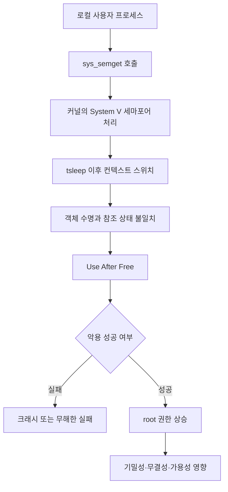

> 한 줄 요약: OpenBSD의 로컬 권한 상승 CVE가 Hacker News에서 주목받은 이유는 취약점 하나의 점수보다, 커널의 작은 메모리 수명 문제가 root 권한까지 이어질 수 있다는 점에 있다. 운영자는 패치 여부만 볼 것이 아니라, 로컬 공격면과 배포 일정을 함께 판단해야 한다.

## 무슨 일이 있었나

2026년 6월 24일, NVD에 CVE-2026-57589가 등록됐다. 대상은 OpenBSD 7.9 이하 버전이다. NVD는 이 취약점을 `sys/kern/sysv_sem.c`의 `sys_semget()` 경로에서 발생하는 use-after-free로 설명했다.

NVD 설명에 따르면 문제는 `tsleep` 이후 컨텍스트 스위치 과정에서 생기며, 로컬 권한 상승을 통해 root 권한 획득으로 이어질 수 있다.

확인된 내용은 다음과 같다.

| 항목 | 내용 |
|---|---|
| CVE | CVE-2026-57589 |
| 공개일 | 2026년 6월 24일 |
| 마지막 수정 | 2026년 6월 26일 |
| 영향 범위 | OpenBSD 7.9 이하 |
| 취약점 유형 | CWE-416 Use After Free |
| 공격 조건 | 로컬 공격, 높은 공격 복잡도 |
| CVSS 3.1 | 7.4 High, `AV:L/AC:H/PR:N/UI:N/S:U/C:H/I:H/A:H` |
| CISA SSVC | exploitation none, automatable no, technicalImpact total |

아직 구분해서 봐야 할 부분도 있다. NVD는 이 기록을 enrichment 중이라고 표시하고 있으며, NVD 자체 CVSS 점수는 아직 제공하지 않았다. 현재 보이는 CVSS 3.1 점수 7.4 High는 CNA인 MITRE가 제공한 값이다.

레퍼런스도 눈에 띈다. CVE 레코드에는 OpenBSD 소스 저장소의 커밋 링크와 OpenAI의 Patch the Planet 페이지가 MITRE 출처로 함께 올라와 있다. 이 조합 때문에 Hacker News에서 더 많은 이야기가 붙었을 가능성이 있다. 다만 NVD 페이지 자체만으로는 누가 발견했는지, 어떤 방식으로 보고됐는지, 실제 익스플로잇 코드가 공개됐는지까지 단정할 수 없다.

Hacker News에서는 이 항목이 275 points와 155 comments를 기록했다. 보안 취약점 하나가 올라왔다는 사실을 넘어, OpenBSD라는 운영체제의 이미지, 커널 취약점의 성격, AI가 취약점 발견 과정에 관여하는 방식까지 논쟁에 섞인 것으로 보인다.

## 왜 사람들이 반응했나

OpenBSD는 보안에 엄격한 운영체제라는 인식이 강하다. 그래서 로컬 권한 상승 취약점이 나오면 반응은 두 갈래로 나뉜다.

먼저 현실적인 반응이 있다. 어떤 운영체제도 커널 버그에서 자유롭지 않다. 특히 동시성, 객체 수명, 잠금이 얽힌 경로에서는 use-after-free가 숨어 있을 수 있다. OpenBSD라고 해서 메모리 안전 문제가 사라지는 것은 아니다.

다른 쪽에는 상징적인 반응이 있다. 보안을 전면에 내세운 프로젝트에서 root 권한 상승 취약점이 발견되면, 사람들은 취약점 자체뿐 아니라 그 취약점이 드러낸 기대와 현실의 차이에 반응한다.

이번 취약점은 원격 코드 실행처럼 인터넷 전체에 바로 영향을 주는 형태는 아니다. CVSS 벡터도 `AV:L`이다. 공격자는 로컬 접근이 필요하다. 공격 복잡도도 `AC:H`로 높게 잡혀 있다. CISA SSVC에서도 exploitation은 none, automatable은 no로 표시됐다.

하지만 영향도는 가볍지 않다. 기술적 영향은 total로 평가됐다. 성공하면 기밀성, 무결성, 가용성 모두에 큰 피해가 생길 수 있다는 뜻이다. 이 조합이 판단을 어렵게 만든다.

낮은 접근성, 높은 영향도.  
자동화는 어렵지만 성공하면 root.  
원격 대란은 아니지만 운영 환경에서는 무시하기 어렵다.

현업에서 이런 판단을 해야 할 때 이 애매함이 가장 곤란하다. 인터넷에 공개된 서비스의 치명적 원격 취약점이면 우선순위가 비교적 분명하다. 하지만 로컬 권한 상승은 환경에 따라 위험도가 크게 달라진다. 셸 접근이 제한된 단일 목적 장비와 여러 사용자가 작업하는 빌드 서버, 점프 서버, 공유 개발 머신은 같은 CVSS 점수를 다르게 읽어야 한다.

커뮤니티가 민감하게 반응한 지점은 크게 네 가지다.

- 신뢰: 보안 지향 운영체제에서도 커널 메모리 수명 버그가 나온다는 사실
- 권한: 로컬 사용자에서 root로 넘어갈 수 있다는 결과의 무게
- 비용: 패치 적용, 재부팅, 서비스 영향, 장비별 배포 타이밍
- 해석: NVD enrichment 전 단계의 정보를 얼마나 확정적으로 받아들일지

특히 use-after-free는 설명만 보면 낯설 수 있지만, 운영 관점에서는 꽤 직관적인 위험이다. 어떤 객체가 더 이상 살아 있지 않은데도 코드가 그 객체를 계속 사용한다. 커널 안에서 이 일이 벌어지면 단순한 크래시가 아니라 권한 경계 붕괴로 이어질 수 있다.

이 그림에서 핵심은 공격자가 처음부터 root가 아니라는 점이다. 시작점은 로컬 사용자다. 문제는 커널 내부의 작은 상태 불일치가 권한 경계를 넘어서는 통로가 될 수 있다는 데 있다.

## 내가 보는 핵심

이번 이슈를 단순히 OpenBSD에도 버그가 있다는 이야기로 읽으면 너무 얕다. 반대로 OpenBSD의 보안성이 무너졌다고 말하는 것도 과하다.

더 실용적인 해석은 이렇다. 보안 평판은 취약점이 없다는 보증이 아니다. 취약점이 발견됐을 때 얼마나 빨리 범위가 좁혀지고, 수정이 이뤄지고, 운영자가 판단할 수 있는 정보로 정리되는지가 더 중요하다.

이번 CVE에서 운영자가 실제로 봐야 할 것은 이름값이 아니다. 다음 질문들이다.

- 이 시스템에 로컬 계정을 가진 사용자가 있는가?
- 외부 사용자가 간접적으로 로컬 코드를 실행할 수 있는 경로가 있는가?
- CI, 빌드, 플러그인, 배치 작업처럼 낮은 권한 코드가 돌아가는가?
- OpenBSD 7.9 이하 장비가 남아 있는가?
- 패치 적용에 재부팅이나 서비스 중단이 필요한가?
- 격리된 장비라고 믿고 있지만 실제로는 SSH, cron, 자동화 계정이 열려 있지 않은가?

로컬 권한 상승은 자주 과소평가된다. 원격에서 바로 뚫리는 취약점이 아니면 패치 우선순위가 뒤로 밀리기 쉽다. 하지만 실제 침해 사고에서는 로컬 권한 상승이 두 번째 단계가 되는 경우가 많다. 처음에는 낮은 권한으로 들어오고, 그다음 시스템 장악을 위해 커널이나 서비스 권한 상승 취약점을 찾는다.

이번 CVE의 CVSS 벡터도 그 애매함을 그대로 보여준다.

| 관점 | 낮게 보이는 이유 | 높게 봐야 하는 이유 |
|---|---|---|
| 공격 벡터 | 로컬 접근 필요 | 내부 계정, CI, 자동화 작업이 있으면 현실적인 경로가 생김 |
| 공격 복잡도 | High | 복잡하다고 불가능한 것은 아님 |
| 자동화 가능성 | CISA 기준 no | 표적 환경에서는 수동 악용도 충분히 의미가 있음 |
| 영향도 | 원격 대량 공격과 다름 | 성공 시 root 권한으로 피해가 커짐 |

여기서 한 가지 더 조심할 점이 있다. NVD 페이지에는 OpenAI의 Patch the Planet 링크가 레퍼런스로 들어가 있다. 이 때문에 일부 독자는 AI가 OpenBSD 커널 취약점을 찾아낸 사건으로 받아들일 수 있다.

그 해석이 가능할 수는 있지만, 제공된 CVE 정보만으로 확정하면 안 된다. NVD가 보여주는 것은 레퍼런스의 존재, MITRE가 제공한 CVE 설명, 관련 커밋 링크, CVSS, CWE, 영향 범위다. 누가 어떤 도구로 어떻게 발견했는지까지 본문에 적으려면 추가 근거가 필요하다.

보안 이슈 글에서 이 선을 지키는 일은 생각보다 어렵다. 사람들은 원인과 주인공을 빨리 찾고 싶어 한다. 하지만 CVE 레코드가 아직 enrichment 중일 때는 확정된 사실과 해석을 섞지 않는 쪽이 낫다.

이번 건에서 확실히 말할 수 있는 문장은 이것이다.

OpenBSD 7.9 이하의 `sysv_sem.c` 경로에 use-after-free가 있고, 로컬 권한 상승으로 이어질 수 있으며, 관련 수정 커밋이 존재한다.

그보다 더 나간 문장은 근거를 따로 확인해야 한다.

## 앞으로 볼 기준

이런 보안 뉴스를 볼 때는 CVSS 숫자 하나로 끝내지 않는 편이 좋다. 특히 로컬 권한 상승 취약점은 배포 환경에 따라 우선순위가 크게 달라진다.

다음 기준으로 보면 판단이 덜 흔들린다.

| 확인할 기준 | 질문 |
|---|---|
| 노출면 | 로컬 사용자가 실제로 존재하는가 |
| 간접 실행 | 웹 서비스, 플러그인, CI 작업이 낮은 권한 코드를 실행하는가 |
| 권한 경계 | root 권한을 얻었을 때 다른 시스템으로 이동할 수 있는가 |
| 패치 비용 | 재부팅, 서비스 중단, 호환성 문제가 있는가 |
| 정보 성숙도 | NVD enrichment, 벤더 권고, 커밋, 메일링리스트 정보가 정리됐는가 |
| 악용 신호 | 공개 PoC, 실제 악용, CISA SSVC 변화가 있는가 |

이번 CVE만 놓고 보면, 공개된 정보상 자동화된 대량 악용 신호는 없다. 공격 조건도 쉽다고 적혀 있지 않다. 그렇다고 패치 검토를 미룰 만한 이슈도 아니다. 영향 범위가 OpenBSD 7.9 이하로 명시됐고, 성공 시 root 권한 상승이라는 결과가 분명하기 때문이다.

이런 상황에서는 모든 장비를 같은 우선순위로 밀어붙이기보다, 로컬 코드 실행 가능성이 있는 장비부터 분류하는 편이 낫다.

- 여러 사용자가 접근하는 서버
- 외부 기여자의 코드가 도는 빌드·테스트 머신
- SSH 계정이 여럿 있는 운영 장비
- 자동화 계정이 많은 배치 서버
- 샌드박스라고 생각하지만 커널은 공유하는 환경

반대로 네트워크 접근이 제한되고, 로컬 계정도 없고, 단일 목적 워크로드만 도는 장비라면 패치 창구를 조금 더 계획적으로 잡을 수 있다. 그래도 버전 식별과 적용 계획은 남겨야 한다. 보안 운영에서 가장 위험한 상태는 안 급하다는 판단이 아니라, 영향 여부를 모르는 상태다.

이번 사건의 질문은 OpenBSD가 안전한가 아닌가가 아니다. 더 정확한 질문은 이것이다.

우리가 신뢰하는 플랫폼에서 커널 취약점이 나왔을 때, 그 신뢰를 패치 지연의 이유로 쓰고 있지는 않은가.

보안 평판은 위험을 지워주지 않는다. 오히려 그런 프로젝트일수록 CVE 하나가 나왔을 때 범위와 조건을 더 차분하게 읽어야 한다. 이번 OpenBSD use-after-free 이슈는 과장해서 소비할 뉴스도, 조용히 넘길 버그도 아니다. 로컬 권한 상승이라는 오래된 공격 경로가 여전히 운영 판단의 중심에 있다는 신호에 가깝다.

## 참고 자료

- [선정 글감] [OpenBSD has a use-after-free allowing local privilege escalation to root](https://nvd.nist.gov/vuln/detail/cve-2026-57589) — Hacker News Best