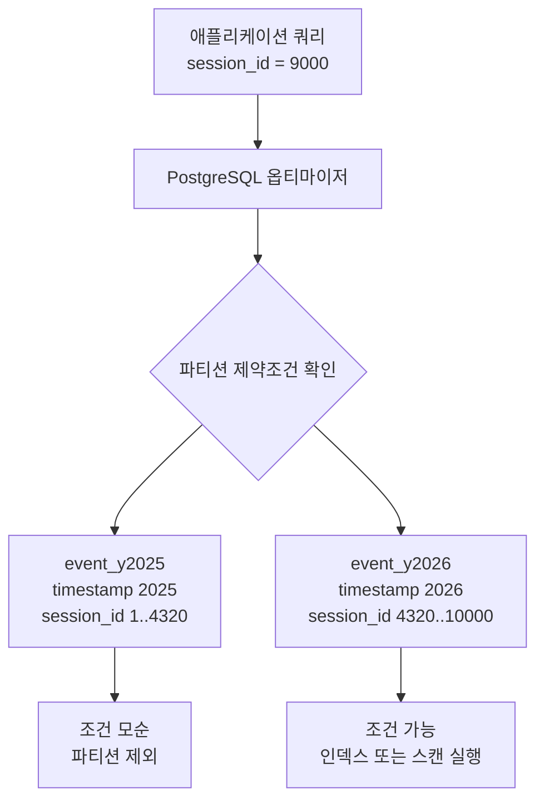

> 한 줄 요약: PostgreSQL 파티션 프루닝은 파티션 키만의 문제가 아니다. 데이터 생성 순서와 업무 규칙 사이에 강한 상관관계가 있다면, 체크 제약조건으로 옵티마이저에게 안전한 단서를 줄 수 있다.

## 왜 지금 이슈인가

파티션 테이블을 쓰기 시작하면 곧 PostgreSQL 파티션 프루닝 문제를 만난다. 시간 기준으로 나눈 이벤트 테이블은 날짜 범위 조회에는 빠르지만, `session_id`, `tenant_id`, `customer_id` 같은 업무 키로 조회하는 순간 모든 파티션을 건드릴 수 있다.

처음에는 인덱스를 만들면 해결될 것처럼 보인다. 하지만 PostgreSQL의 파티션 인덱스는 기본적으로 각 파티션에 붙는 로컬 인덱스(Local Index)다. 쿼리가 100개 파티션을 모두 확인해야 한다면, 각 파티션에서 인덱스를 잘 타더라도 실행 계획은 여전히 100개 테이블을 순회하는 모양이 된다.

개발자 커뮤니티에서 이런 글에 말이 붙는 이유는 분명하다. 파티션은 운영자가 성능과 보관 정책을 통제하려고 도입하지만, 실제 제품 쿼리는 파티션 키 하나로만 움직이지 않는다. 로그, 결제, 세션, IoT 이벤트, 멀티테넌트 데이터는 대개 시간으로 쌓이고 업무 키로 읽힌다.

## 커뮤니티에서 갈리는 지점

가장 단순한 입장은 이렇다. 자주 조회하는 컬럼으로 파티션을 나누면 된다. 세션을 자주 찾으면 `session_id`로 파티셔닝하고, 시간 조회가 많으면 `timestamp`로 파티셔닝한다.

운영 조건은 그렇게 단순하지 않다.

시간 파티션은 데이터 수명주기 관리에 강하다. 오래된 파티션을 detach 하거나 drop 하기 쉽고, 백업과 보관 정책도 명확해진다. 반면 `session_id` 같은 업무 키로 파티셔닝하면 시간 기반 삭제, 월별 집계, 보관 정책이 복잡해질 수 있다.

업무 키 조회가 핵심인 서비스에서 시간 파티션만 고집하면, 애플리케이션의 주요 요청이 모든 파티션을 훑게 된다. 파티션을 많이 만들수록 관리 단위는 좋아지지만, 쿼리 패턴이 맞지 않으면 실행 계획 비용이 커진다.

여기서 글로벌 인덱스(Global Index) 이야기가 나온다. 여러 파티션을 가로지르는 하나의 인덱스가 있다면 `session_id = 1` 같은 조회가 더 자연스러울 수 있다. 하지만 PostgreSQL은 파티션 테이블에 대한 글로벌 인덱스를 지원하지 않는다. 이 제약은 성능뿐 아니라 파티션 키를 포함하지 않는 유니크 제약을 걸기 어렵게 만드는 문제로도 이어진다.

그래서 현실적인 쟁점은 이쪽에 가깝다.

- 파티션 키를 바꿀 것인가
- 로컬 인덱스 순회를 감수할 것인가
- 별도 검색 테이블이나 매핑 테이블을 둘 것인가
- 데이터의 상관관계를 제약조건으로 표현할 것인가

이 글에서 볼 만한 부분은 마지막 선택지다. 데이터가 append-only이고, 세션 ID가 시간에 따라 증가하며, 세션이 짧게 유지된다면 `session_id`와 `timestamp` 사이에는 강한 상관관계가 생긴다. 이 관계를 데이터베이스가 믿을 수 있는 형태로 알려주면, 파티션 키가 아닌 컬럼으로도 일부 프루닝을 기대할 수 있다.

## 아키텍처 관점에서 볼 점

핵심은 옵티마이저(Optimizer)가 무엇을 믿을 수 있느냐다.

통계 정보는 실행 계획을 고르는 데 도움을 준다. 하지만 통계는 추정일 뿐이다. 데이터베이스는 통계만 보고 특정 파티션에 어떤 값이 절대 없다고 단정할 수 없다. 체크 제약조건(Check Constraint)은 다르다. 데이터베이스가 항상 참이라고 보장하는 규칙이기 때문에, 옵티마이저가 파티션 제외 판단에 사용할 수 있다.

예를 들어 이벤트 테이블이 `timestamp`로 연도별 파티셔닝되어 있다고 하자.

```sql
CREATE TABLE event (
  id BIGINT GENERATED ALWAYS AS IDENTITY,
  timestamp TIMESTAMPTZ NOT NULL,
  session_id BIGINT NOT NULL,
  type TEXT NOT NULL,
  data JSONB
) PARTITION BY RANGE (timestamp);
```

`timestamp` 조건이 있으면 PostgreSQL은 관련 연도 파티션만 읽는다.

```sql
SELECT *
FROM event
WHERE timestamp >= '2025-12-01 UTC'
  AND timestamp < '2026-01-01 UTC';
```

하지만 `session_id = 1`만 있으면 이야기가 달라진다. 파티션 키 조건이 없기 때문에 모든 파티션을 후보로 본다. 로컬 인덱스가 있어도 각 파티션의 인덱스를 확인해야 한다.

선정 글감의 접근은 도메인 규칙을 이용한다. 세션 ID가 시간 순서대로 증가하고, 특정 파티션마다 세션 ID 범위가 사실상 분리된다면 각 파티션에 다음과 같은 체크 제약조건을 둘 수 있다.

```sql
ALTER TABLE event_y2025
  ADD CONSTRAINT event_y2025_session_range
  CHECK (session_id >= 1 AND session_id <= 4320);

ALTER TABLE event_y2026
  ADD CONSTRAINT event_y2026_session_range
  CHECK (session_id >= 4320 AND session_id <= 10000);
```

그러면 `session_id = 9000` 같은 쿼리에 대해 2025 파티션은 조건을 만족할 수 없다는 판단이 가능해진다. 이때 프루닝은 마법이 아니라 논리 증명에 가깝다. 쿼리 조건과 체크 제약조건을 비교해 모순되는 파티션을 제외하는 것이다.



운영 관점에서는 이 구조가 세 가지 전제를 강하게 요구한다.

첫째, 데이터가 거의 불변이어야 한다. 과거 이벤트의 `timestamp`나 `session_id`가 수정된다면 체크 제약조건은 쉽게 부담이 된다.

둘째, 업무 키와 파티션 키의 상관관계가 깨지지 않아야 한다. 세션 ID가 외부 시스템에서 뒤섞여 들어오거나, 지연 적재로 과거 시간 데이터가 나중에 들어오면 범위가 틀어질 수 있다.

셋째, 예외값을 처리할 설계가 있어야 한다. 선정 글감에서도 outlier와 gaps and islands가 별도 주제로 다뤄진다. 현실 데이터에는 경계에 걸친 세션, 재처리 데이터, 마이그레이션 데이터, 수동 보정 데이터가 생긴다. 이런 값까지 깔끔한 범위로 묶으려 하면 제약조건이 너무 넓어져 프루닝 효과가 약해진다.

## 실무에서 볼 점

이 기법은 모든 파티션 테이블에 적용할 범용 처방이 아니다. 조건이 맞을 때 쓸 수 있는 최적화다.

먼저 확인할 것은 쿼리 패턴이다. 실제 느린 쿼리가 파티션 키 없이 업무 키만 조회하는지 봐야 한다. 이미 대부분의 쿼리가 시간 범위를 함께 넘긴다면 애플리케이션에서 조건을 보강하는 편이 더 단순할 수 있다.

다음은 데이터 분포다. 파티션별 `MIN(session_id)`, `MAX(session_id)`를 뽑아보고 범위가 얼마나 겹치는지 확인해야 한다.

```sql
SELECT
  tableoid::regclass AS partition_name,
  MIN(session_id) AS min_session_id,
  MAX(session_id) AS max_session_id
FROM event
GROUP BY 1
ORDER BY 1;
```

범위가 거의 겹치지 않는다면 체크 제약조건을 고려할 만하다. 반대로 모든 파티션의 세션 ID 범위가 넓게 겹친다면 이 방식은 별 효과가 없다. 제약조건이 있어도 옵티마이저가 제외할 파티션이 없기 때문이다.

도입 전에 볼 체크리스트는 이렇게 정리할 수 있다.

| 확인 항목 | 봐야 할 질문 |
| --- | --- |
| 데이터 생성 규칙 | 업무 키가 시간 순서와 함께 증가하는가 |
| 변경 가능성 | 과거 row의 키나 시간이 수정되는가 |
| 지연 적재 | 늦게 들어오는 이벤트가 어느 정도인가 |
| 파티션 수 | 로컬 인덱스 순회 비용이 실제 병목인가 |
| 제약조건 관리 | 새 파티션 생성 시 범위 계산을 자동화할 수 있는가 |
| 장애 대응 | 잘못된 범위 때문에 insert가 실패할 때 탐지할 수 있는가 |

실제로 이런 상황에서는 성능 개선보다 운영 자동화가 더 까다롭다. 파티션을 매월 만든다면 매월 체크 제약조건도 계산해야 한다. 범위 산정이 틀리면 데이터 적재가 실패하고, 너무 넓게 잡으면 프루닝 효과가 사라진다.

대안도 같이 봐야 한다.

하나는 애플리케이션 쿼리에 시간 조건을 반드시 포함시키는 방식이다. 세션 조회 API가 세션 시작 시각을 알고 있다면 `session_id`와 `timestamp` 범위를 함께 넘기는 편이 가장 명확하다.

또 하나는 세션 메타 테이블을 따로 두는 방식이다. `session_id`, `started_at`, `ended_at`을 가진 작은 테이블을 먼저 조회한 뒤, 이벤트 테이블에는 시간 범위를 붙여 접근한다. 쿼리는 한 단계 늘지만 파티션 설계가 더 명시적이다.

브린 인덱스(BRIN Index)도 후보가 될 수 있다. 물리 저장 순서와 값의 상관관계가 강한 대용량 append-only 테이블에서는 비용 대비 효과가 좋을 수 있다. 다만 BRIN은 파티션 자체를 논리적으로 제외하는 방식과는 다르다. 블록 범위 단위로 스캔을 줄이는 선택지로 봐야 한다.

별도 검색 저장소를 두는 방법도 있다. 이벤트 원장은 PostgreSQL에 두고, 세션 검색이나 사용자 행동 탐색은 Elasticsearch, ClickHouse, BigQuery 같은 분석용 저장소로 넘길 수 있다. 대신 데이터 동기화, 재처리, 일관성 지연이라는 운영 비용이 생긴다.

체크 제약조건 기반 프루닝은 이 대안들 사이에 있다. 저장소를 늘리지 않고 PostgreSQL 안에서 해결한다. 대신 데이터 규칙을 강하게 믿고, 그 규칙을 계속 검증해야 한다.

## 정리

파티션 프루닝을 파티션 키 선택 문제로만 보면 선택지가 좁아진다. PostgreSQL 옵티마이저는 통계가 아니라 보장된 제약조건을 근거로 움직일 수 있고, 그 제약조건에 업무 도메인의 규칙을 담을 수 있다.

다만 이 방식은 성능 팁이라기보다 데이터 모델링 결정에 가깝다. `session_id`가 시간과 함께 증가한다는 사실, 세션이 짧다는 사실, 이벤트가 append-only라는 사실이 깨지는 순간 제약조건은 최적화가 아니라 운영 리스크가 된다.

당장 확인할 것은 하나다. 파티션별로 자주 조회하는 비파티션 키의 `MIN`, `MAX`를 뽑아 범위가 얼마나 겹치는지 보자. 범위가 선명하게 갈라진다면, 파티션 키를 바꾸기 전에 옵티마이저에게 알려줄 수 있는 사실이 남아 있을 수 있다.

## 참고 자료

- [선정 글감] [How to Achieve Pruning When Querying by Non-Partitioned Columns in PostgreSQL](https://hakibenita.com/postgresql-partition-pruning): Lobsters