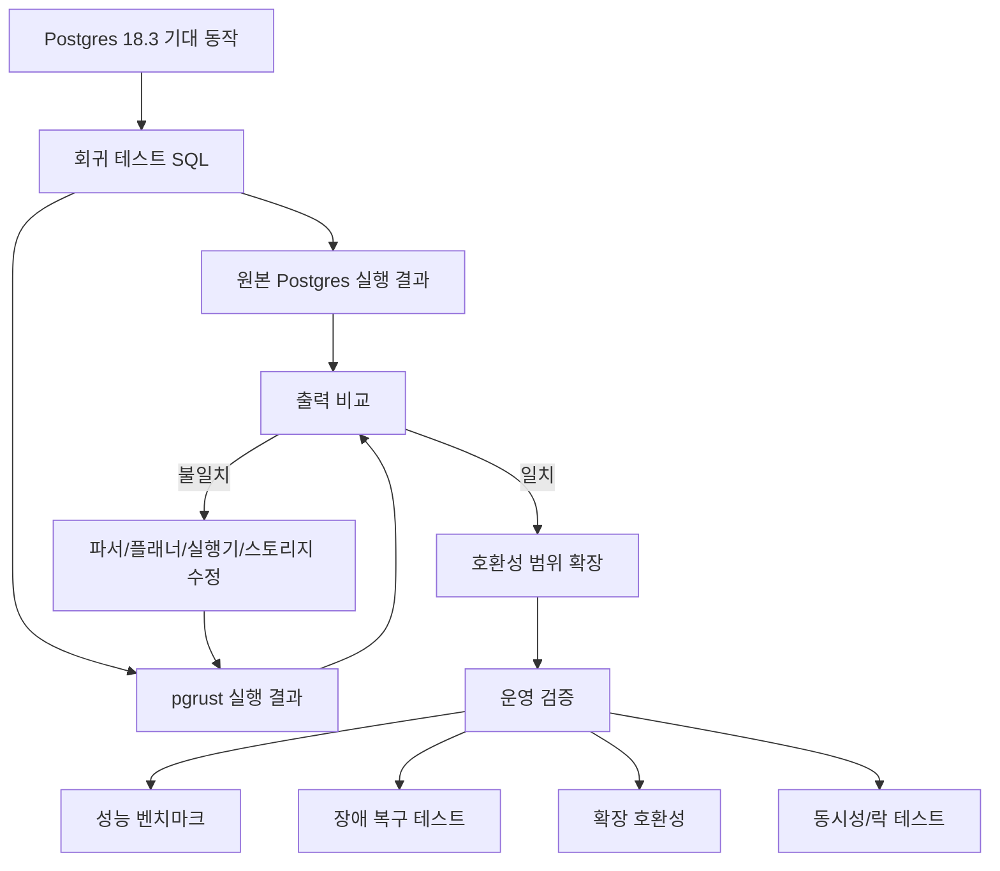

> 한 줄 요약: Postgres Rust 재작성과 Bun의 Rust 전환은 언어 선택보다 넓은 문제를 건드린다. AI 에이전트로 재작성 속도가 빨라졌을 때, 데이터베이스와 런타임의 운영 리스크를 어떤 테스트 하네스와 호환성 계약으로 막을 수 있느냐가 관건이다.

## 왜 지금 이슈인가

pgrust가 Postgres 18.3 호환을 목표로 서버를 Rust로 다시 구현하면서, 46,000개가 넘는 Postgres 회귀 테스트(regression test) 쿼리에서 기대 출력과 일치했다고 공개했다. 더 민감한 지점은 디스크 호환성이다. 기존 Postgres 18.3 데이터 디렉터리에서 부팅할 수 있다는 설명은 이 프로젝트를 단순한 장난감 구현으로 보기 어렵게 만든다.

데이터베이스 커뮤니티가 이런 프로젝트에 반응하는 이유는 Rust가 멋져서가 아니다. Postgres는 이미 검증된 시스템이고, 많은 조직에서 가장 바꾸기 어려운 핵심 상태 저장 계층이다. 다만 내부 구조를 손대기 어려워 생기는 운영 문제도 분명히 있다.

예를 들어 pgrust 로드맵에는 멀티스레드 Postgres 내부 구조, 내장 커넥션 풀링(connection pooling), JSON-heavy workload 개선, 빠른 포크와 브랜칭, no-vacuum 계열 스토리지 실험, AI 생성 SQL을 막는 런타임 가드레일 같은 항목이 들어 있다. 새 데이터베이스를 만들겠다는 말이라기보다, Postgres의 모양은 유지하면서 내부 병목을 다시 보겠다는 쪽에 가깝다.

비슷한 흐름은 Bun의 Rust 재작성 논쟁에서도 보인다. Bun은 Zig로 빠르게 만들어진 JavaScript 런타임이었고, Rust로 옮기면서 안정성 문제와 메모리 안전성, 대규모 유지보수를 앞세웠다. Pragmatic Engineer는 이 전환을 AI를 활용한 빠른 재작성 사례로 다뤘고, Andrew Kelley는 그 결정이 기술뿐 아니라 생태계와 프로젝트 정체성의 문제라고 비판했다.

둘을 함께 보면 쟁점이 또렷해진다. AI 에이전트가 재작성 비용을 낮추면, 비용 때문에 미뤄졌던 대형 시스템 재설계가 다시 검토 대상이 된다. 그렇다고 검증 비용까지 같이 낮아지는 것은 아니다.

## 커뮤니티에서 갈리는 지점

가장 큰 갈림길은 재작성(rewrite)을 혁신으로 볼 것인지, 위험한 우회로로 볼 것인지다.

찬성 쪽은 기존 시스템의 외부 계약을 유지한 채 내부 구현을 바꿀 수 있다면, 언어와 아키텍처의 이점을 얻을 수 있다고 본다. pgrust는 Postgres의 실제 회귀 테스트를 오라클(oracle)로 삼고, 출력 호환성을 기준으로 진척을 측정한다. Bun도 기존 사용자에게는 CLI, 패키지 매니저, 테스트 러너, Node.js API 호환성이 눈에 보이는 계약이다.

반대 쪽은 회귀 테스트 통과가 운영 동일성을 보장하지 않는다고 본다. 특히 데이터베이스는 쿼리 결과만 맞으면 끝나는 시스템이 아니다. 잠금(lock), 트랜잭션 격리(transaction isolation), WAL, 복구, VACUUM, 확장(extension), 쿼리 플래너의 예측 가능성, 파일 시스템과의 상호작용까지 운영 계약에 들어간다.

| 쟁점 | 기대 | 우려 |
| --- | --- | --- |
| Rust 재작성 | 메모리 안전성, 내부 구조 개선 여지 | 기존 C 생태계와 확장 호환성 약화 |
| AI-assisted programming | 대규모 포팅 속도 증가 | 검증되지 않은 대량 변경, 리뷰 병목 |
| 회귀 테스트 기반 호환성 | 기존 동작을 수치로 추적 가능 | 성능, 장애 복구, 동시성 버그는 별도 검증 필요 |
| 디스크 호환성 | 마이그레이션 장벽 감소 | 손상 시 책임 경계와 롤백 전략이 어려움 |
| 새 런타임 가드레일 | 나쁜 쿼리와 AI 생성 SQL 통제 | 예외 처리, 튜닝 권한, 오탐 비용 발생 |

Bun 사례가 pgrust 논쟁에 주는 힌트는 테스트가 충분한 프로젝트일수록 AI 재작성의 위험이 낮아진다는 점이다. Pragmatic Engineer가 언급한 11일 만의 재작성과 높은 토큰 비용은 속도보다 조건을 봐야 한다는 쪽에 가깝다. 광범위한 테스트가 있고, 실패를 빨리 찾을 수 있고, 외부 API 계약이 비교적 선명해야 한다.

Andrew Kelley의 글은 다른 면을 건드린다. 어떤 언어를 떠나는 결정은 기술 부채 해소만으로 설명되지 않는다. 생태계에 대한 투자, 프로젝트가 성장하며 바뀌는 압력, 벤처 자본과 제품 일정도 판단에 영향을 준다. pgrust도 비슷하다. Postgres 호환 데이터베이스를 AGPL-3.0으로 공개했을 때, 기업이 어디까지 채택할 수 있는지와 커뮤니티가 어디까지 기여할지도 기술 판단의 일부가 된다.

## 아키텍처 관점에서 볼 점

pgrust에서 먼저 볼 것은 Rust가 아니라 하네스(test harness)다. Postgres의 회귀 테스트를 그대로 기준으로 삼는 구조는 재작성 프로젝트가 길을 잃지 않게 하는 최소 장치다. AI 에이전트가 코드를 빠르게 바꾸더라도, 오라클이 없으면 빠르게 틀릴 뿐이다.

이 다이어그램에서 위쪽 루프는 기능 호환성이다. 아래쪽은 운영 호환성이다. pgrust가 46,000개 이상의 회귀 쿼리를 통과했다는 사실은 위쪽 루프에서 큰 성과다. 하지만 실제 도입 판단은 아래쪽 루프를 통과해야 시작된다.

데이터베이스 재작성에서 특히 위험한 층은 세 군데다.

첫째, 스토리지와 복구다. 디스크 호환성은 매력적이지만 동시에 위험한 약속이다. 기존 데이터 디렉터리를 읽을 수 있다는 것과 장애, 부분 쓰기, 전원 손실, WAL 재생, 체크포인트 경합에서 원본 Postgres와 같은 안전성을 낸다는 것은 다른 문제다.

둘째, 확장과 프로시저 언어다. pgrust는 현재 기존 Postgres 확장과 PL/Python, PL/Perl, PL/Tcl 같은 절차적 언어 확장이 일반적으로 호환되지 않는다고 밝힌다. PostGIS, pg_stat_statements, 커스텀 타입, FDW, 감사 로깅 확장에 의존하는 환경이라면 SQL 호환성보다 확장 호환성이 먼저 병목이 된다.

셋째, 쿼리 플래너와 성능 예측성이다. 결과가 맞아도 실행 계획이 갑자기 바뀌면 운영자는 장애로 받아들인다. pgrust 로드맵에 나쁜 플랜 전환을 줄이는 항목이 들어간 것도 이 지점을 겨냥한 것으로 보인다. 데이터베이스 운영에서 성능 회귀는 기능 버그만큼 치명적이다.

Bun의 Rust 재작성 사례도 같은 구조로 읽을 수 있다. Bun 블로그는 node:zlib, node:http2 주변의 use-after-free 계열 크래시를 안정성 문제로 언급한다. 런타임에서는 메모리 안전성이 사용자 체감 안정성으로 이어질 수 있다. 데이터베이스에서는 여기에 영속성, 복구, 트랜잭션이라는 더 무거운 계약이 붙는다.

## 실무에서 볼 점

pgrust를 지금 운영 데이터베이스로 검토하기에는 이르다. 프로젝트 스스로도 production-ready가 아니며, 성능 최적화도 아직이라고 밝힌다. 그래도 실무자가 볼 만한 가치는 있다. 재작성 프로젝트를 평가하는 기준을 꽤 선명하게 보여주기 때문이다.

먼저 테스트 하네스를 봐야 한다. 실제 Postgres 테스트를 가져와 실행하고, 기대 출력과 비교하는 방식은 좋은 출발점이다. 여기에 조직 내부 쿼리 로그를 익명화해 replay할 수 있는지, 장애 복구 시나리오를 자동화할 수 있는지, 확장 사용 목록을 기계적으로 점검할 수 있는지가 붙어야 한다.

그다음 라이선스와 배포 모델을 봐야 한다. pgrust는 AGPL-3.0이다. 사내 실험, 로컬 개발 도구, 연구 목적에는 괜찮을 수 있지만, 서비스형 데이터베이스나 폐쇄형 제품에 엮을 때는 법무 검토가 필요하다. 기술적으로 유망해도 라이선스가 채택 경로를 닫을 수 있다.

운영 환경에서는 다음 질문을 먼저 던지는 편이 낫다.

- 기존 Postgres 확장을 얼마나 쓰고 있는가?
- 장애 복구 리허설을 자동으로 돌릴 수 있는가?
- 읽기 전용 복제본이나 임시 브랜치처럼 실패 비용이 낮은 경로가 있는가?
- ORM, 마이그레이션 도구, 백업 도구가 버전 문자열이나 시스템 카탈로그 차이에 민감한가?
- 쿼리 성능 회귀를 p95, p99 지표로 잡아낼 수 있는가?
- AI 생성 SQL을 실제로 받고 있다면, DB 레벨 가드레일이 앱 레벨 검증보다 나은 위치인가?

현업에서 비슷한 고민을 하다 보면 새 엔진의 장점보다 주변 도구의 관성이 더 크게 작동한다. 애플리케이션은 SQL만 보내는 것처럼 보여도, 실제로는 백업 스크립트, 모니터링 쿼리, 마이그레이션, 대시보드, 알림, 장애 대응 문서가 모두 특정 Postgres 동작에 기대고 있다. 재작성 엔진은 이 전체 표면적을 상대해야 한다.

대안도 있다. Postgres 내부를 통째로 다시 쓰는 대신 확장, 프록시, 커넥션 풀러, 쿼리 라우터, 스토리지 계층 실험으로 문제를 좁힐 수 있다. 예를 들어 커넥션 폭증이 문제라면 pgbouncer나 애플리케이션 풀링이 먼저다. JSON-heavy workload가 문제라면 스키마 재설계, 인덱스 전략, 일부 문서 DB 분리도 후보가 된다. AI 생성 SQL이 문제라면 DB 엔진 교체보다 쿼리 예산, 타임아웃, read-only 권한, 샌드박스가 먼저 효과를 낼 수 있다.

그래서 pgrust의 현재 가치는 대체재보다 압력 테스트에 가깝다. 우리가 Postgres를 바꾸고 싶어 하는 진짜 이유가 무엇인지 드러내기 때문이다. 메모리 안전성인지, 멀티스레딩인지, VACUUM 피로인지, 확장 생태계인지, AI 워크로드의 예측 불가능성인지 분리해서 봐야 한다.

## 정리

Postgres Rust 재작성은 Rust 대 C 논쟁으로만 소비하기엔 아깝다. 더 실질적인 질문은 이것이다. AI 에이전트가 대형 시스템 재작성의 속도를 높인다면, 우리는 어떤 테스트와 운영 가드레일을 갖춰야 그 속도를 감당할 수 있을까.

pgrust의 회귀 테스트 100% 통과는 강한 신호다. 동시에 곧바로 생산 환경에 넣어도 된다는 뜻은 아니다. 기능 호환성, 디스크 안전성, 확장 호환성, 성능 예측성, 라이선스 조건을 따로 검증해야 한다.

당장 해볼 일은 단순하다. 운영 중인 Postgres에서 확장 목록, 상위 쿼리, 장애 복구 절차, 백업 검증 여부를 한 번에 적어보는 것이다. 그 표를 만들 수 없다면 새 엔진을 평가할 준비도 아직 안 된 상태다.

## 참고 자료

- [선정 글감] [Postgres rewritten in Rust, now passing 100% of the Postgres regression tests](https://github.com/malisper/pgrust) (Hacker News Best)
- [관련] [Rewriting Bun in Rust](https://bun.com/blog/bun-in-rust) (Bun Blog)
- [관련] [My thoughts on the Bun Rust rewrite](https://andrewkelley.me/post/my-thoughts-bun-rust-rewrite.html) (Andrew Kelley)
- [관련] [The Pulse: What can we learn from Bun’s rapid Rust rewrite with AI?](https://newsletter.pragmaticengineer.com/p/the-pulse-what-can-we-learn-from) (The Pragmatic Engineer)