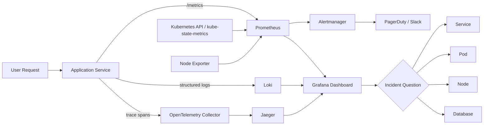

> 한 줄 요약: 관측성(Observability) 비용 논쟁은 Datadog을 쓰느냐, Prometheus와 Grafana를 직접 운영하느냐로 끝나지 않는다. 로그, 메트릭, 트레이스가 장애 대응 시간을 줄이는 구조로 이어져 있는지, 그 운영 책임을 팀이 감당할 수 있는지가 먼저다.

## 왜 지금 이슈인가

스타트업 관측성 스택을 검색하면 Prometheus, Grafana, Loki, OpenTelemetry, Jaeger 조합이 거의 기본값처럼 나온다. 이번 글감도 같은 문제에서 출발한다. 엔지니어 8명 규모의 팀이 월 5,000달러 수준의 상용 관측성 비용을 쓰는 대신, 월 150~200달러 안팎의 80/20 스택으로 시작하자는 주장이다.

이 주장에 커뮤니티가 반응한 이유는 단순한 절약담이 아니기 때문이다.

운영 초기에 필요한 것은 완벽한 플랫폼보다 장애가 났을 때 어디부터 봐야 하는지 알려주는 최소한의 신호다. 반대로 서비스가 조금만 커져도 자체 운영 Prometheus와 Loki는 곧 별도의 운영 대상이 된다. 비용을 아끼는 선택이 장애 분석 비용, 저장소 비용, 온콜 피로도를 뒤로 미루는 선택이 될 수도 있다.

Grafana 쪽 레퍼런스가 말하는 풀스택 관측성(Full-stack Observability)도 이 지점을 다룬다. 현대 애플리케이션은 서비스, 파드(Pod), 노드(Node), 네임스페이스(Namespace), 클러스터(Cluster), 데이터베이스, 클라우드 계정이 서로 얽혀 있다. 로그 탭, 메트릭 탭, 트레이스 쿼리를 따로 열어서는 원인까지 가는 길이 길어진다.

Elastic의 가격 변경 사례도 볼 만하다. Elastic Observability Serverless에서 TSDS(Time Series Data Stream) 지표 데이터의 수집·보관 가격을 표준 Observability GB 단가의 25%로 낮췄고, 시계열 저장 엔진 개선도 함께 내세웠다. 벤더들도 관측성 비용을 기능보다 데이터 저장 방식과 쿼리 효율의 문제로 설명하기 시작했다.

## 커뮤니티에서 갈리는 지점

가장 큰 갈림길은 직접 운영이 싸다는 주장과 직접 운영도 비용이라는 반론이다.

Prometheus, Grafana, Loki, Jaeger는 좋은 기본 조합이다. Kubernetes 환경에서는 `kube-prometheus-stack` 하나로 노드 지표, 파드 지표, Kubernetes 상태 지표, 기본 대시보드를 빠르게 얻을 수 있다. 애플리케이션에 Prometheus 클라이언트를 붙이고 `/metrics`를 노출하면 요청 수, 지연 시간, 에러율도 수집할 수 있다.

다만 비용 계산에서 빠지기 쉬운 항목이 있다.

| 선택지 | 장점 | 숨어 있는 비용 |
|---|---|---|
| Prometheus + Grafana 자체 운영 | 낮은 초기 비용, 높은 통제권, 표준 생태계 | 저장소 증설, 백업, 업그레이드, 알림 품질 관리 |
| Loki 기반 로그 수집 | 라벨 기반 검색, Elasticsearch 대비 단순한 운영 | 라벨 설계 실패 시 비용 증가, 고카디널리티 위험 |
| OpenTelemetry + Jaeger | 벤더 종속 완화, 분산 추적 표준화 | 샘플링 정책, 컨텍스트 전파, 저장 비용 설계 필요 |
| 관리형 관측성 플랫폼 | 빠른 도입, 통합 UX, SLO·프로파일링·상관 분석 | 사용량 기반 과금, 데이터 락인, 비용 예측 난도 |

이번 글감의 장점은 단계를 나누자는 데 있다. 제품 출시 전후의 작은 팀이 처음부터 대형 상용 플랫폼을 전부 도입할 필요는 없다. 장애 원인을 찾는 데 필요한 신호를 먼저 만들고, 팀 규모와 장애 복잡도가 커질 때 관리형 서비스를 검토하자는 판단은 현실적이다.

커뮤니티의 반론도 같은 지점에서 나온다. 80/20 스택은 첫 설치가 쉬워 보일수록 위험하다. Helm 명령어 몇 개로 대시보드가 뜨는 순간, 팀은 관측성을 갖췄다고 착각하기 쉽다. 실제 가치는 대시보드 개수가 아니라 장애 질문에 답하는 속도에서 나온다.

예를 들어 이런 질문이다.

- 특정 API의 p99 지연 시간이 오른 원인이 애플리케이션 코드인가, DB인가, 노드 리소스인가?
- 배포 직후 에러율이 올랐을 때 어느 버전, 어느 파드, 어느 리전에 집중되는가?
- 로그는 남아 있는데 트레이스 ID가 없어 요청 흐름을 잇지 못하는가?
- 알림이 너무 많아 실제 장애가 묻히고 있지는 않은가?

Grafana의 풀스택 관측성 사례는 이 문제를 지식 그래프(Knowledge Graph)로 풀려고 한다. 서비스, 파드, 노드, 클러스터, 데이터베이스 같은 엔티티를 그래프로 연결하고, 각 엔티티에 로그, 메트릭, 트레이스, 프로파일을 매핑한다. 관측성의 다음 단계는 더 많은 데이터를 모으는 일이 아니라, 데이터 사이의 관계를 복원하는 일에 가깝다.

## 아키텍처 관점에서 볼 점

작은 팀의 80/20 관측성 스택은 다음 구조로 시작할 수 있다.

이 구조에서 중요한 것은 도구 이름보다 신호가 이어지는 방식이다.

Prometheus는 수치화된 상태를 보기 좋다. CPU, 메모리, 디스크, 요청 수, 에러율, 지연 시간처럼 시간에 따라 변하는 값을 다루기에 적합하다. Loki는 로그를 Prometheus와 비슷한 라벨 모델로 다루기 때문에 Kubernetes 메타데이터와 함께 보기 좋다. OpenTelemetry는 서비스 경계를 넘어 요청 흐름을 이어준다.

문제는 각 신호가 따로 놀 때 생긴다. 메트릭 대시보드에서 p99 지연 시간이 오른 것을 봤지만, 해당 요청의 로그와 트레이스를 바로 찾지 못하면 분석은 다시 수작업이 된다. Grafana Cloud의 레퍼런스가 서비스, 파드, 노드, 네임스페이스, 클러스터에서 바로 로그, 트레이스, 프로파일로 이동하는 흐름을 강조하는 이유도 여기에 있다.

Elastic의 TSDS 사례는 저장 구조 관점에서 볼 필요가 있다. 지표 데이터는 이벤트 로그와 성격이 다르다. 같은 라벨 세트로 반복 수집되는 시계열 데이터라면 컬럼형 저장이나 시계열 전용 인덱스가 비용과 쿼리 성능에 직접 영향을 준다. Elastic은 TSDS 기반 지표 저장을 표준 GB 단가의 25%로 책정하고, 저장 효율과 쿼리 지연 시간 개선을 내세운다. 자체 운영 스택에서도 보존 기간과 라벨 설계를 비용 변수로 봐야 한다는 신호로 읽을 수 있다.

현업에서 비슷한 고민을 하다 보면 처음에는 알림 몇 개로 충분해 보인다. 서비스 다운, 높은 지연 시간, 5xx 에러율, 디스크 부족, 메모리 압박 정도면 출발선으로는 괜찮다. 이번 글감의 다섯 가지 알림도 이 범주에 있다.

다만 알림은 적을수록 좋은 게 아니라 행동으로 이어져야 좋다. `HighLatency`가 울렸을 때 담당자가 다음에 볼 대시보드, 로그 쿼리, 최근 배포, 영향받은 고객 범위를 바로 좁힐 수 있어야 한다. 그렇지 않으면 알림은 관측성이 아니라 소음이 된다.

## 실무에서 볼 점

도입 전에는 먼저 관측성의 목적을 한 문장으로 정해야 한다.

장애를 빨리 감지하려는가, 원인을 빨리 좁히려는가, 배포 품질을 검증하려는가, 비용을 추적하려는가. 목적이 다르면 필요한 데이터도 달라진다. 작은 팀이 모든 신호를 전부 수집하려고 하면 저장 비용과 운영 부담이 먼저 커진다.

첫 번째 확인 조건은 데이터 카디널리티(Cardinality)다. Prometheus와 Loki에서 라벨은 강력하지만 위험하다. `user_id`, `request_id`, `email` 같은 값을 라벨로 넣으면 시계열과 로그 스트림이 폭발한다. 비용뿐 아니라 쿼리 성능과 안정성도 흔들린다.

두 번째는 보존 기간(Retention)이다. 이번 글감은 Prometheus retention을 7일로 두는 예시를 든다. 초기 팀에는 합리적인 출발점일 수 있다. 다만 장애가 일주일 뒤에 발견되는 제품, 월간 리포트가 필요한 B2B 서비스, 규제나 감사 요구가 있는 환경이라면 7일은 짧다.

세 번째는 온콜 운영이다. PagerDuty 무료 티어든 Slack 알림이든, 알림을 받는 사람이 실제로 대응할 수 있어야 한다. 운영 절차 없이 알림만 붙이면 야간에 깨우는 시스템만 생긴다. 각 알림에는 소유자, 심각도, 첫 확인 링크, 임시 완화 방법이 붙어야 한다.

네 번째는 보안과 개인정보다. 로그에는 토큰, 세션, 이메일, 결제 식별자 같은 민감정보가 섞이기 쉽다. Loki나 Elasticsearch 계열에 무엇을 보내는지 애플리케이션 레벨에서 필터링해야 한다. OpenTelemetry 트레이스에도 헤더와 속성이 들어갈 수 있으므로 수집기(Collector) 단계에서 제거 정책을 둬야 한다.

다섯 번째는 관리형 전환 기준이다. 직접 운영을 시작하더라도 언제 옮길지 기준이 있어야 한다.

- Prometheus 저장소 장애가 서비스 장애 대응을 방해한다.
- 로그 검색 지연 때문에 사고 분석 시간이 길어진다.
- 트레이스 샘플링과 보존 정책을 팀이 계속 미룬다.
- 알림 품질을 개선할 사람이 정해져 있지 않다.
- 관측성 비용보다 운영자의 집중력 손실이 더 커진다.

이 조건이 보이면 관리형 서비스를 검토할 때다. 반대로 아직 트래픽이 작고 장애 패턴이 단순하며 Kubernetes 기본 지표와 애플리케이션 핵심 지표만으로 충분하다면, 상용 플랫폼을 먼저 사는 것도 과한 선택일 수 있다.

## 정리

관측성 스택의 좋은 출발점은 비싼 도구가 아니라 좋은 질문이다. 서비스가 죽었는지, 느린지, 에러가 나는지, 리소스가 부족한지, 최근 배포와 관련이 있는지 답할 수 있으면 초기 80/20 스택은 제 역할을 한다.

다음으로 볼 것은 대시보드 수가 아니다. 지금 운영 중인 서비스에서 가장 자주 발생하는 장애 하나를 고르고, 그 장애를 Prometheus 지표, Loki 로그, OpenTelemetry 트레이스로 10분 안에 따라갈 수 있는지 점검하면 된다. 그 경로가 끊겨 있다면 도구를 더 사기 전에 라벨, 로그 구조, 트레이스 전파부터 손보는 편이 낫다.

## 참고 자료

- [선정 글감] [Cost-Effective Observability: The 80/20 Stack for Startups](https://dev.to/samson_tanimawo/cost-effective-observability-the-8020-stack-for-startups-3pkc) — DEV Community
- [관련] [Full-stack observability in Grafana Cloud: How to investigate issues across services and infrastructure](https://grafana.com/blog/full-stack-observability-in-grafana-cloud-how-to-investigate-issues-across-services-and-infrastructure/) — Grafana Blog
- [관련] [Updated metrics pricing for Elastic Observability: Best-in-class metrics, now cheaper, too!](https://www.elastic.co/blog/metrics-pricing) — Elastic Blog