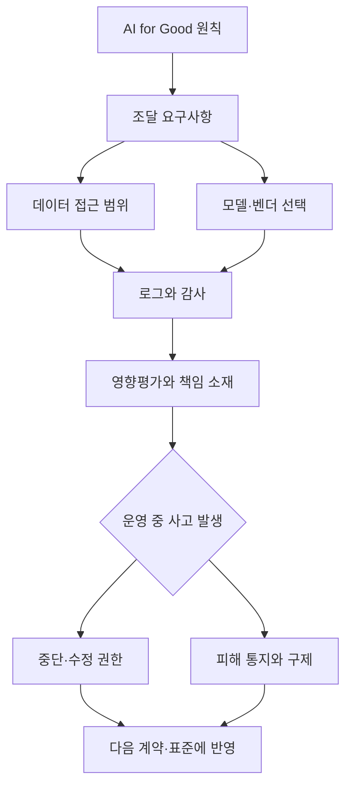

> 한 줄 요약: AI 거버넌스 논쟁의 핵심은 로봇 전시가 아니라, 누가 컴퓨트·표준·조달·감사 권한을 쥐고 AI for Good의 의미를 실제 시스템에 반영하느냐에 있다.

## 무슨 일이 있었나

제네바에서 열린 UN AI for Good Summit은 이름만 보면 방향이 분명해 보인다. AI를 인류의 문제 해결에 쓰자는 행사다. 하지만 WIRED가 전한 현장은 그렇게 단순하지 않았다. 한쪽에는 로봇개, 테슬라, 구조 헬리콥터, 휴머노이드 로봇, 라이브 코딩 세션이 있었고, 다른 한쪽에서는 인권, 조달, 표준, 컴퓨트 격차, 빅테크 의존을 둘러싼 불편한 얘기가 오갔다.

행사를 주관한 곳은 유엔 산하 국제전기통신연합(ITU)이다. ITU 사무총장 도린 보그단-마틴은 AI가 기아, 질병, 기후 문제 같은 난제를 풀 수 있다는 믿음이 시험대에 올랐다고 말했다. 공식 언어는 선의와 협력이었지만, 현장의 긴장은 다른 곳에서 나왔다.

확인된 사실은 이렇다.

- UN AI for Good Summit은 ITU가 주관하는 행사이며, 올해로 10년째를 맞은 국제 AI 행사다.
- 현장에서는 공공부문과 민간기업이 AI 활용, 표준, 컴퓨트 접근성, 인권, 개발 인프라를 논의했다.
- UN은 르완다 대통령 폴 카가메와 Salesforce CEO 마크 베니오프가 공동 의장을 맡는 44명 규모 위원회 구성을 내세웠다.
- Amazon CTO 베르너 보겔스의 키노트 중 친팔레스타인 활동가들이 무대에 올라 Amazon 기술이 이스라엘의 팔레스타인 대상 활동에 쓰인다고 항의했다.
- Access Now의 줄리오 코피는 인도주의·공공 부문이 빅테크를 지나치게 신뢰해 왔다고 비판했다.
- 하버드의 비제이 자나파 레디는 good이라는 말이 엔지니어링 기준으로는 너무 모호하다고 지적했다.

해석은 따로 구분해 보는 편이 낫다. 이 행사가 곧바로 실효성 있는 글로벌 AI 규제로 이어질지는 알 수 없다. 전시된 기술이 실제 공공 시스템에 얼마나 쓰일지도 기사만으로는 단정하기 어렵다. 다만 AI 거버넌스 논쟁이 모델 성능이나 규제 문구만의 문제가 아니라, 인프라와 권한 배분의 문제로 옮겨가고 있다는 점은 분명해 보인다.

## 왜 사람들이 반응했나

AI for Good이라는 말은 듣기 좋다. 그래서 더 예민한 반응을 부른다. 좋은 일을 하겠다는 구호가 실제 시스템에서는 누가 데이터를 갖고, 누가 모델을 운영하고, 누가 사고를 책임지는지 가리는 포장지가 될 수 있기 때문이다.

커뮤니티가 불편해하는 지점은 크게 다섯 가지로 나뉜다.

| 쟁점 | 사람들이 예민하게 보는 이유 | 실무에서 드러나는 형태 |
|---|---|---|
| 신뢰 | 빅테크와 공공기관의 계약 구조가 불투명할 수 있음 | 조달 문서에는 원칙이 있지만 실제 스택은 외부 플랫폼에 잠김 |
| 권한 | 표준과 API를 설계한 쪽이 사실상 규칙을 정함 | 감사를 하려 해도 로그, 모델, 데이터 경로가 닫혀 있음 |
| 비용 | 컴퓨트 접근성이 국가·조직 간 격차를 키움 | 작은 조직은 자체 모델보다 외부 API 의존이 빨라짐 |
| 사용성 | 좋은 의도와 작동하는 시스템은 다름 | 현장 업무에 맞지 않는 AI 도구가 실험으로 끝남 |
| 규제 리스크 | 인권·프라이버시 원칙이 기술 요구사항으로 번역되지 않음 | 영향평가가 문서 작업으로만 남음 |

이 반응을 단순한 반기업 정서로 보면 중요한 부분을 놓친다. 공공기관이나 인도주의 조직은 이미 클라우드, 데이터 플랫폼, AI 모델, 보안 도구를 외부 사업자에 의존하고 있다. 문제는 의존 자체보다 설명 가능성이다. 어느 모델이 어떤 데이터에 접근했고, 누가 프롬프트와 결과를 보관하며, 장애나 오판이 생겼을 때 어느 기관이 책임지는지 답하지 못하면 AI for Good은 운영 문서가 아니라 행사 문구로 남는다.

Estonia의 AI Fuckup Finder 사례는 이 지점을 반대쪽에서 보여준다. 에스토니아 의회가 도박세법 개정 과정에서 문구를 잘못 넣어 온라인 카지노가 1년간 세금망 밖에 놓일 수 있었고, 그 손실 규모가 연간 2,400만 유로로 보도됐다. 루카스 일베스는 Claude와 Gemini로 법안의 불일치를 확인한 뒤, 의회 웹사이트의 초안을 가져와 깨진 참조, 모순된 문구, 산술 오류, 불가능한 날짜를 잡아내는 프로토타입을 만들었다.

여기서 핵심은 AI가 법률가를 대체한다는 이야기가 아니다. 정부 문서처럼 오류 비용이 큰 시스템에서 기계가 잡을 수 있는 문제를 왜 사람만 확인하고 있었느냐는 쪽에 가깝다. AI가 공공영역에 들어올 때의 질문은 금지냐 허용이냐보다 더 구체적이어야 한다.

- 어떤 단계에서 AI가 개입하는가
- 판단 권한은 사람에게 남아 있는가
- 오류 탐지 결과를 누가 검증하는가
- 모델이 틀렸을 때 비용은 누가 부담하는가
- 시스템의 입력과 출력이 감사 가능한가

반대로 Bruce Schneier가 소개한 AI 영상 감시 논쟁은 같은 기술이 전혀 다른 얼굴을 가질 수 있음을 보여준다. 기존 영상 분석이 몇 가지 정해진 검색 조건에 가까웠다면, AI 기반 영상 검색은 자연어로 행동을 찾을 수 있다. 예를 들어 특정 물건을 건네는 사람, 하루에 옷을 여러 번 갈아입은 사람, 같은 장소를 반복해서 지난 차량 같은 질의를 대규모 영상에서 수행할 수 있다.

이 기능은 실종자 수색이나 보안 대응에는 유용할 수 있다. 동시에 행동 단위의 감시가 된다. 같은 자연어 인터페이스가 공공 안전 도구인지, 시민 추적 도구인지는 기술만 보고 결정할 수 없다. 데이터 보관 기간, 질의 권한, 사후 감사, 오남용 제재가 시스템 안에 들어 있어야 구분할 수 있다.

## 내가 보는 핵심

이번 UN AI Summit의 긴장은 로봇이 빨리 달렸다는 장면에 있지 않다. 합의는 느리고, 제품은 빠르며, 표준은 더 늦다는 데 있다.

AI 정책 토론에서 자주 빠지는 부분은 중간층이다. 원칙은 위에 있고 제품은 아래에 있다. 그런데 실제 통제는 그 사이의 조달 조건, 로그 설계, 권한 모델, 평가 기준, 데이터 보존 정책, API 계약에 들어간다. IEEE의 안야 카스페르센이 말한 middleware라는 표현이 그래서 눈에 걸린다. 인권 원칙을 기술적으로 검증 가능한 요구사항으로 바꾸는 층이 없으면, AI 영향평가(AI Impact Assessment)는 체크박스가 된다.

현업에서 비슷한 고민을 하다 보면, 좋은 원칙보다 어려운 것은 작동 가능한 제한을 만드는 일이다. 개인정보를 보호한다는 문장은 쉽다. 하지만 실제 시스템에서는 다음 질문에 답해야 한다.

이 다이어그램에서 빠지면 안 되는 것은 마지막 고리다. 사고가 난 뒤에도 계약과 표준이 그대로면, 영향평가는 학습하지 않는 문서다. AI for Good이 기술 홍보가 아니라 거버넌스가 되려면 운영 중 사고가 다음 시스템 설계로 되돌아가야 한다.

MIT Lincoln Laboratory의 2026년 7월 7일 보도도 같은 축에서 읽을 수 있다. 미 공군 생도가 코딩 초보 상태에서 챗봇을 이용해 군사 업무에 쓸 수 있는 소프트웨어를 만들 수 있는지 실험했다. 이른바 바이브 코딩(Vibe Coding)이 특정 문제를 아는 비전문가에게 개발 능력을 빌려주는 방식이다.

이 사례는 생산성 이야기로만 끝나지 않는다. Bruce Schneier가 말한 skill과 ability의 분리와 맞닿아 있다. AI는 숙련이 낮은 사람에게 더 큰 실행 능력을 준다. 좋은 방향으로는 현장 문제를 빠르게 자동화할 수 있다. 나쁜 방향으로는 보안 공격, 감시, 오판의 규모도 커진다. 그래서 능력을 낮은 비용으로 확장하는 기술일수록 권한과 감사 설계가 더 촘촘해야 한다.

이 관점에서 보면 UN Summit의 질문은 AI가 선한가 악한가가 아니다. AI가 사람과 조직의 능력을 키울 때, 그 능력을 어떤 경계 안에 둘 것이냐다.

## 앞으로 볼 기준

다음 AI 정책 뉴스나 플랫폼 발표를 볼 때는 선언보다 배관을 봐야 한다. 기업이 책임 있는 AI를 말하는지, 정부가 혁신을 말하는지만으로는 판단할 수 있는 것이 많지 않다.

먼저 컴퓨트 접근성을 확인해야 한다. 누가 GPU, 클라우드, 모델 배포 인프라를 확보하는가. 개발도상국이나 작은 공공기관이 선택지를 가질 수 있는지가 중요하다. 선택지가 외부 대형 플랫폼 하나뿐이면, 정책 주권은 문서에만 남는다.

둘째, 모델과 데이터의 위치를 봐야 한다. 데이터가 어디에 저장되고, 어느 관할권의 법을 받으며, 벤더 변경 시 이전이 가능한지 따져야 한다. 공공 부문 AI는 성능보다 탈출 가능성이 먼저일 때가 많다.

셋째, 영향평가가 중단 권한을 갖는지 봐야 한다. 보고서만 쓰고 배포는 그대로 진행된다면 governance theater에 가깝다. 위험 등급이 올라갔을 때 배포를 늦추거나 기능을 제한하거나 계약 조건을 바꿀 수 있어야 한다.

넷째, 자연어 인터페이스가 어떤 권한을 열어주는지 봐야 한다. AI 영상 감시처럼 검색 방식이 바뀌면 권한의 의미도 바뀐다. 예전에는 개발자가 만들어 둔 필터만 쓸 수 있었지만, 이제는 사용자가 말로 새로운 감시 조건을 만들 수 있다. 이 변화는 UI 개선이 아니라 권한 확장이다.

다섯째, 커뮤니티의 반응을 노이즈로 치우지 말아야 한다. 항의, 냉소, 과장된 밈 속에도 보통 한 가지 신호가 있다. 사람들은 기술이 불완전해서만 화내지 않는다. 자신이 통제할 수 없는 시스템이 자신을 평가하고, 배제하고, 감시하고, 비용을 전가할 때 반응한다.

UN AI for Good Summit의 풍경은 그래서 묘하다. 무대 위에서는 합의를 말하고, 전시장에서는 제품이 달리고, 밖에서는 항의가 들어온다. 어느 쪽도 전부 틀렸다고 보기 어렵다. AI는 실제로 오류를 줄이고, 접근성을 넓히고, 현장 업무를 도울 수 있다. 동시에 같은 기술은 공공 책임을 외주화하고, 감시의 단위를 행동으로 넓히고, 작은 조직을 거대 플랫폼에 묶을 수 있다.

앞으로 필요한 질문은 더 차갑고 구체적이어야 한다. 이 AI가 좋은 일을 할 수 있는가가 아니라, 나쁜 방식으로 쓰였을 때 멈출 수 있는가. 누가 멈출 수 있는가. 멈춘 뒤 무엇이 바뀌는가.

그 답이 없는 AI for Good은 선한 의도라기보다 빠른 기술을 따라잡지 못한 합의의 사진에 가깝다.

## 참고 자료

- [선정 글감] [Robot Dogs, Teslas, and Rescue Helicopters: The UN AI Summit Was a Lot](https://www.wired.com/story/robot-dogs-teslas-and-rescue-helicopters-the-un-ai-summit-was-alot/) — WIRED AI
- [관련] [The $28 Million Mistake That Inspired Estonia’s AI ‘Fuckup Finder’](https://www.wired.com/story/the-28-million-dollar-mistake-that-inspired-estonias-ai-fuckup-finder/) — WIRED AI
- [관련] [How novice coders can develop AI programs for military applications](https://news.mit.edu/2026/how-novice-coders-can-develop-ai-programs-for-military-applications-0707) — MIT News
- [관련] [The Realities of AI Video Surveillance](https://www.schneier.com/blog/archives/2026/06/the-realities-of-ai-video-surveillance.html) — Schneier on Security
- [관련] [Cybersecurity and the Gap Between Skill and Ability](https://www.schneier.com/blog/archives/2026/07/cybersecurity-and-the-gap-between-skill-and-ability.html) — Schneier on Security