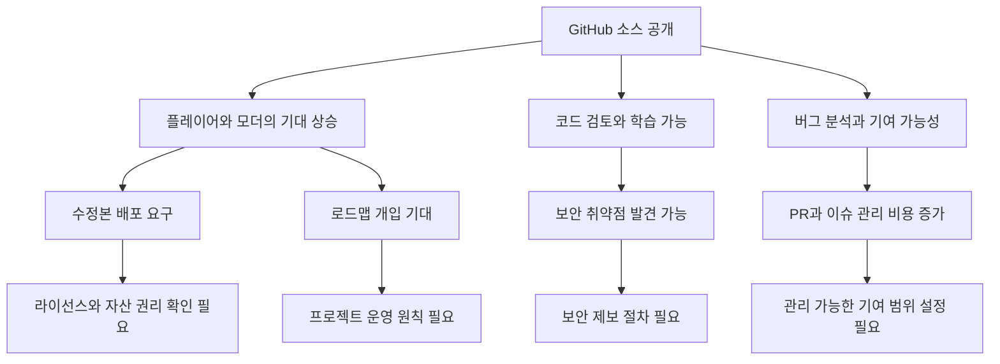

> 한 줄 요약: GitHub Trending에 오른 Unturned U3 SDK 소식은 소스 공개만으로 끝나지 않는다. 커뮤니티가 반응한 이유는 게임을 고칠 수 있다는 기대와, 어디까지 열렸는지 불분명한 경계가 같이 보였기 때문이다.

## 무슨 일이 있었나

2026년 7월 10일 기준 GitHub Trending에는 `SmartlyDressedGames/U3-SDK` 저장소가 상위권에 올랐다. GitHub에 표시된 설명은 “Unturned의 소스 코드”다. Unturned는 무료 오픈월드 좀비 생존 샌드박스 게임이고, 저장소 언어는 C#으로 표시된다.

확인된 범위는 이렇다.

- 당사자: Smartly Dressed Games
- 대상: Unturned U3 SDK GitHub 저장소
- 내용: Unity 프로젝트 형태의 소스 코드와 실행 안내 공개
- 엔진 요구사항: Unity 2022.3.62f3
- 실행 조건: Steam이 켜져 있어야 하고, Unturned가 설치되어 있어야 함
- 이유: 대형 바이너리 파일과 모드는 설치된 게임에서 로드되는 구조로 안내됨
- 반응 지표: GitHub Trending 기준 별 1,835개, 당일 증가 541개로 소개됨

여기서 조심할 부분이 있다. 이 사건을 곧바로 게임 전체의 완전한 오픈소스화로 말하면 과하다. 저장소 설명은 소스 코드 공개를 말하지만, 실행 안내는 여전히 Unity 에디터, Steam, 설치된 Unturned 클라이언트, 외부 바이너리 자산에 기대고 있다.

확인된 사실은 소스와 SDK 접근성이 크게 열렸다는 점이다. 자산, 배포권, 라이선스 범위, 상업적 재사용 가능성, 서버 운영 정책까지 모두 풀렸는지는 따로 봐야 한다.

이번 이슈는 이 차이에서 갈린다. 사람들은 코드를 볼 수 있게 된 데 반응했지만, 동시에 “어디까지 내 마음대로 할 수 있는가”라는 질문도 생겼다.

## 왜 사람들이 반응했나

Unturned U3 SDK가 GitHub Trending에 오른 이유는 게임 하나의 업데이트라기보다 커뮤니티 권한이 조금 옮겨간 일처럼 보였기 때문이다. 플레이어와 모더(Modder)가 게임을 소비하는 쪽에서 내부 구조를 읽고 고칠 수 있는 쪽으로 한 칸 이동했다.

오래 운영된 샌드박스 게임에서 소스 접근은 체감이 크다. 모딩 문서를 읽고 추측하던 사람이 실제 코드 흐름을 확인할 수 있고, 버그 리포트도 “안 됩니다”에서 “이 경로에서 이런 상태가 생깁니다”로 바뀔 수 있다.

물론 반응이 모두 환영만은 아니다. 코드가 공개되면 기대도 커지지만, 책임 소재도 흐려진다.

- 신뢰: 개발사가 커뮤니티를 얼마나 믿고 있는가
- 권한: 코드를 보는 것과 수정본을 배포하는 것은 같은가
- 비용: 커뮤니티 기여를 검토하고 받아들이는 운영 부담은 누가 지는가
- 사용성: Unity, Steam, 설치된 게임까지 필요한 구조가 초심자에게 충분히 낮은 진입장벽인가
- 리스크: 클라이언트 코드 공개가 악용 가능성을 높이지는 않는가

게임 커뮤니티에서는 소스 공개가 종종 낭만적으로 소비된다. “이제 유저가 살릴 수 있다”는 기대가 붙는다. 실제로는 소스 공개보다 어려운 일이 그다음에 온다.

누가 이슈를 분류할지, 어떤 풀 리퀘스트(Pull Request)를 받을지, 취약점 제보는 어디로 받을지, 모드와 본편의 경계를 어떻게 둘지 정해야 한다. 저장소를 여는 순간 프로젝트는 코드 저장소이면서 새로운 커뮤니케이션 창구가 된다.

여기서 불편함도 생긴다. 개발사는 “읽고 배우고 모딩하라”는 뜻으로 공개했을 수 있지만, 일부 사용자는 “이제 커뮤니티가 직접 고쳐도 된다”로 받아들일 수 있다. 같은 공개라도 기대 수준이 다르면 갈등이 생긴다.

이 그림에서 자주 빠지는 부분은 아래쪽이다. 소스 공개는 위쪽의 기대를 바로 만든다. 하지만 커뮤니티 운영이 오래 가려면 아래쪽의 기준이 필요하다.

## 내가 보는 핵심

이번 이슈를 좋은 공개냐, 불완전한 공개냐로만 나누면 놓치는 게 많다. 더 정확한 질문은 “공개된 것은 코드인가, 운영 권한인가”다.

Unturned U3 SDK의 안내를 보면 프로젝트를 열고 실행하는 길은 꽤 구체적이다. Unity Hub를 설치하고, Unity 2022.3.62f3 에디터를 설치하고, Steam을 켜고, Unturned를 설치한 뒤, `Assets/GameStartup.unity` 씬을 열어 플레이한다. 모딩 문서와 FAQ, 예제 영상도 연결되어 있다.

이건 커뮤니티 친화적인 신호다. 압축 파일만 던져놓고 알아서 보라는 방식은 아니다. 실제로 따라 할 수 있는 진입로를 만들었다.

다만 이 구조는 경계도 함께 보여준다. 큰 바이너리 파일과 모드는 GitHub 저장소가 아니라 설치된 게임에서 로드된다. GitHub 저장소만 복제한다고 독립적인 게임 전체가 손에 들어오는 구조는 아니다.

현업에서 비슷한 공개를 고민하다 보면 이 경계가 현실적이다. 모든 것을 한꺼번에 열면 법무, 보안, 빌드 재현성, 자산 권리, 운영 부담이 동시에 튀어나온다. 너무 적게 열면 커뮤니티는 홍보성 공개로 받아들인다.

그래서 이 사례에서 눈에 띄는 지점은 중간 지대다. 코드는 열되, 자산과 실행 환경은 기존 배포 체계에 남긴다. 커뮤니티는 내부를 더 잘 이해할 수 있지만, 프로젝트의 권리와 배포 통제는 여전히 개발사 쪽에 남아 있다.

이 방식으로 얻는 것도 있다.

| 관점 | 얻는 것 | 남는 부담 |
|---|---|---|
| 플레이어 | 게임 구조를 이해할 기회 | 직접 빌드 환경을 맞춰야 함 |
| 모더 | 더 정확한 확장 지점 파악 | 자산과 배포 범위 확인 필요 |
| 개발사 | 커뮤니티 신뢰와 기여 가능성 | 이슈, PR, 보안 제보 관리 |
| 서버 운영자 | 동작 원리 분석 가능 | 악용 가능성 감시 필요 |

위험도 있다. 멀티플레이어 게임은 클라이언트 동작이 공개될 때 치트, 봇, 우회 도구 제작자가 얻는 정보도 늘어난다. 물론 소스 비공개가 보안을 보장하지는 않는다. 하지만 공개 이후에는 “어차피 못 볼 것”이라는 가정으로 버티던 설계가 드러난다.

실무자가 봐야 할 지점은 공개 자체의 선악이 아니다. 공개 이후에도 유지될 수 있는 운영 설계가 있는지다.

- 취약점 제보 채널이 있는가
- 보안 관련 이슈를 공개 이슈로 올려도 되는지 안내되어 있는가
- PR을 받을 범위와 받지 않을 범위가 정리되어 있는가
- 라이선스가 코드, 자산, 상표, 모드에 각각 어떻게 적용되는가
- 빌드 재현성이 어느 정도 보장되는가
- 커뮤니티 수정본과 공식 버전의 경계가 명확한가

이 기준이 없으면 소스 공개는 빠르게 기대 관리 문제가 된다. 별은 늘고 관심은 붙지만, 저장소 관리자는 매일 “이건 왜 안 받아주나요”라는 질문에 답해야 한다.

## 앞으로 볼 기준

앞으로 비슷한 게임 소스 공개나 SDK 공개 뉴스를 볼 때는 “열렸다”는 문장보다 “무엇이 열렸고, 무엇은 닫혀 있는가”를 먼저 봐야 한다. GitHub 저장소 하나만 보고 전체 권한이 넘어왔다고 판단하면 위험하다.

확인할 기준은 네 가지다.

첫째, 라이선스다. 코드를 읽을 수 있는지, 수정할 수 있는지, 배포할 수 있는지, 상업적으로 쓸 수 있는지는 모두 다른 문제다. 저장소가 공개되어 있어도 라이선스가 없거나 제한적이면 실무 활용 범위는 좁다.

둘째, 자산과 빌드 경로다. 게임에서는 코드보다 아트, 사운드, 맵, 애니메이션, 서버 데이터가 더 민감할 때가 많다. Unturned U3 SDK처럼 설치된 게임에서 큰 바이너리와 모드를 로드하는 방식은 이 경계를 유지하려는 선택으로 읽힌다.

셋째, 커뮤니티 기여 정책이다. 모딩과 기여는 다르다. 모드는 사용자 공간에서 확장하는 것이고, 기여는 공식 코드베이스에 들어오는 것이다. 이 둘을 구분하지 않으면 개발사와 커뮤니티 모두 피곤해진다.

넷째, 보안 대응이다. 멀티플레이어 게임에서 소스 공개는 투명성을 높이는 동시에 공격 표면을 더 잘 보이게 만든다. 공개 저장소에는 보안 정책, 취약점 신고 방식, 금지된 공개 이슈 유형이 같이 있어야 한다.

이번 U3 SDK 공개는 완전한 개방 선언보다 더 현실적인 장면을 보여준다. 커뮤니티는 더 깊게 들어갈 수 있게 되었고, 개발사는 모든 통제권을 내려놓지 않았다. 그 균형이 얼마나 잘 작동할지는 저장소를 연 날이 아니라, 이슈와 기여가 쌓이는 다음 몇 달에 드러난다.

이제 볼 것은 별 개수보다 이슈와 PR이 쌓일 때 규칙이 같이 정리되는지다.

## 참고 자료

- [선정 글감] [SmartlyDressedGames/U3-SDK](https://github.com/SmartlyDressedGames/U3-SDK): GitHub Trending