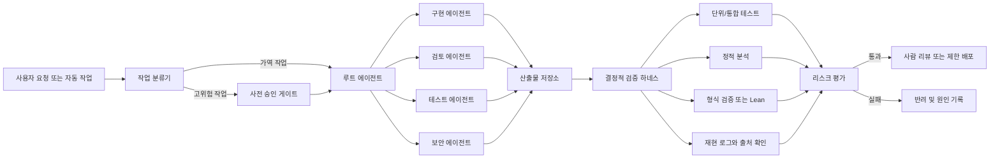

> 한 줄 요약: AI 에이전트가 어려운 증명이나 보안 분석을 해냈다는 소식보다 실무에 더 중요한 질문은 검증 책임을 어디에 둘 것인가다. 멀티 에이전트, 자동화된 테스트 하네스, 형식 검증은 생산성을 높일 수 있지만, 검증 경로가 같은 모델에 묶이면 운영 리스크도 함께 커진다.

## 왜 지금 이슈인가

GPT-5.6 Sol Ultra가 사이클 이중 덮개 추측(Cycle Double Cover Conjecture)의 증명을 만들었다는 PDF가 Hacker News에 올라오면서, 논쟁은 모델 성능보다 검증 방식으로 옮겨갔다.

이 추측은 모든 유한한 다리 없는 무방향 그래프(bridgeless undirected graph)에 대해, 각 간선이 정확히 두 번 포함되도록 사이클들의 모음을 만들 수 있다는 명제다. PDF는 이를 3쪽짜리 증명으로 제시하고, 증명은 GPT-5.6 Sol Ultra가 만들었으며 Codex가 작성에 관여했다고 밝힌다.

문제는 여기서부터다.

짧은 증명은 매력적이다. 오래된 난제가 간단한 선형대수로 풀렸다면 수학적으로도 흥미롭다. 하지만 AI 에이전트가 만든 결과물이 짧고 그럴듯하다는 사실은 검증이 끝났다는 뜻이 아니다. 특히 생성한 모델과 검토한 모델이 비슷한 계열이면, 같은 빈틈을 같이 놓칠 수 있다.

개발자 커뮤니티가 이 이야기에 반응한 이유도 그 지점이다. 이것은 수학 뉴스이면서 동시에 에이전트 기반 소프트웨어 개발, 보안 분석 자동화, 테스트 하네스 설계, 인프라 운영의 축소판이다.

현업에서 비슷한 고민을 하다 보면 질문은 이렇게 바뀐다.

- AI 에이전트가 만든 코드, 리포트, 패치, 증명을 언제 신뢰할 수 있나?
- 다중 에이전트 리뷰는 독립 검증인가, 같은 편향을 여러 번 반복하는 장치인가?
- 테스트 자동화와 형식 검증은 어디까지 운영 게이트로 쓸 수 있나?
- 보안·데이터·비용 리스크를 누가 관측하고 차단하나?

## 커뮤니티에서 갈리는 지점

### AI 증명은 왜 신뢰하기 어려울까?

선정 글감의 PDF 자체는 수학적 구조를 꽤 압축적으로 제시한다. 표준적으로 cubic graph로 줄이고, Γ = F₂³ 위의 nowhere-zero flow를 사용한 뒤, 각 간선에 두 원소 집합을 붙여 사이클 이중 덮개를 구성하는 흐름이다. 핵심은 로컬하게 맞는 라벨링을 전역 간선 양끝에서 일치시키는 선형 시스템으로 바꾸고, 쌍대공간 조건을 이용해 해가 있음을 보이는 부분이다.

이런 증명은 겉보기에는 검토하기 쉬워 보인다. 페이지가 짧고, 사용하는 도구도 오래된 결과들이다. 하지만 바로 그 점 때문에 커뮤니티의 의심도 커진다. 오래된 난제가 세 페이지로 끝난다면, 검증 기준은 더 높아져야 한다.

Hacker News 댓글에서 반복된 쟁점은 세 갈래였다.

| 쟁점 | 기대 | 우려 |
|---|---|---|
| 자연어 증명 | 사람이 읽고 빠르게 검토 가능 | 미묘한 전역 조건 누락 가능 |
| Lean 같은 증명 보조기 | 커널이 기계적으로 확인 | 해당 분야 라이브러리와 배경 정리가 부족할 수 있음 |
| 다중 에이전트 검토 | 여러 관점에서 오류 탐지 | 같은 모델 계열이면 실패가 상관될 수 있음 |

나중에 공개된 `openai/cdc-lean` 저장소는 이 논쟁의 방향을 더 분명하게 만든다. README는 Lean 4.31.0과 특정 Mathlib 리비전을 고정하고, 유한한 loopless bridgeless multigraph에 대한 cycle double cover theorem을 kernel-check한다고 설명한다. 또한 `sorry`, `admit`, `axiom`, `opaque`, `unsafe` 같은 흔적을 찾는 감사 명령도 제시한다.

이 흐름은 의미가 있다. 자연어 주장에 머물던 결과가 커널 검증 가능한 산출물로 옮겨가면 신뢰의 성격이 달라진다. 다만 실무자는 여기서도 한 단계 더 봐야 한다. 형식 검증 저장소가 있다는 사실과, 조직의 운영 게이트에 넣을 수 있을 만큼 재현 가능하고 독립적으로 검토됐다는 사실은 다르다.

### 멀티 에이전트는 독립 검증인가?

OpenAI의 GPT-5.6 발표는 `ultra` 설정이 기본적으로 여러 에이전트를 병렬 조정한다고 설명한다. API 문서의 Multi-agent 기능도 루트 에이전트가 하위 에이전트를 만들어 코드베이스 탐색, 문서 비교, 테스트 작성 같은 독립 작업을 병렬로 처리하는 방식을 제시한다.

이 구조는 개발 워크플로에 잘 맞는다. 예를 들어 pull request 리뷰에서 correctness, security, missing tests를 별도 에이전트에 맡기고 루트 에이전트가 중복과 충돌을 정리하는 방식은 실용적이다.

하지만 이것을 독립 검증으로 부르면 위험하다.

독립성은 에이전트 수가 아니라 실패 모드의 분리에서 나온다. 같은 모델, 같은 프롬프트 스타일, 같은 컨텍스트 압축, 같은 도구 권한을 공유하면 세 명이 검토해도 하나의 관점이 반복될 수 있다. 특히 수학 증명, 보안 취약점 재현, 데이터 마이그레이션처럼 한 단계의 착각이 뒤 단계 전체를 오염시키는 작업에서는 이 차이가 크다.

## 아키텍처 관점에서 볼 점

### AI 에이전트 검증 아키텍처는 어떻게 짜야 하나?

에이전트 시스템을 프로덕션에 넣을 때 핵심은 모델을 더 똑똑하게 만드는 일이 아니라 검증 가능한 경계를 만드는 일이다. 모델은 후보를 만들고, 하네스는 후보를 떨어뜨리고, 운영 게이트는 남은 결과를 배포 가능한 형태로 제한해야 한다.

이 구조에서 봐야 할 지점은 네 가지다.

첫째, 에이전트는 쓰기 권한을 기본값으로 가져서는 안 된다. OpenAI의 Programmatic Tool Calling 문서는 모델이 JavaScript를 작성해 도구 호출을 조정할 수 있지만, 런타임은 격리된 V8이며 Node.js, 패키지 설치, 직접 네트워크 접근, 일반 파일시스템, subprocess를 제공하지 않는다고 설명한다. 이런 제약은 불편함이 아니라 운영 장치다.

둘째, 프로그램형 도구 호출은 예측 가능한 제어 흐름에 맞다. 여러 결과를 필터링, 조인, 중복 제거, 집계하는 단계에는 잘 맞지만, 각 결과마다 새로운 의미 판단이나 승인이 필요한 단계에는 직접 도구 호출이 더 낫다. 모델이 코드를 만들어 도구를 돌릴 수 있다는 말은 승인 경계를 코드 안으로 밀어 넣어도 된다는 뜻이 아니다.

셋째, 멀티 에이전트는 병렬성의 장치이지 정답 보증 장치가 아니다. OpenAI 문서도 하위 에이전트가 토큰 사용량을 늘릴 수 있고, 단일 순차 추론이 필요한 작업이나 공유 mutable state를 두고 다투는 작업에는 덜 유리하다고 적는다. 같은 파일을 여러 에이전트가 동시에 고치는 구조라면 품질보다 병합 충돌과 책임 추적 문제가 먼저 온다.

넷째, 형식 검증은 마지막에 붙이는 장식이 아니라 초기 설계 조건이어야 한다. Lean으로 검증할 생각이라면 명제 표현, 라이브러리 의존성, 버전 고정, 감사 스크립트, 재현 가능한 빌드 환경을 처음부터 산출물 요구사항에 넣어야 한다. 나중에 자연어 증명을 기계 검증으로 옮기는 비용은 생각보다 커질 수 있다.

## 실무에서 볼 점

### AI 에이전트 도입 전에 무엇을 확인해야 할까?

도입 조건은 성능 점수보다 운영 질문으로 판단하는 편이 낫다.

- 산출물이 틀렸을 때 피해가 가역적인가?
- 모델이 호출할 수 있는 도구 목록이 최소 권한인가?
- 테스트 하네스가 모델과 다른 실패 모드를 갖는가?
- 재시도, 병렬 에이전트, 프롬프트 변경이 결과를 어떻게 바꾸는지 기록되는가?
- 비용, 지연 시간, 토큰 사용량, 실패율을 작업 유형별로 볼 수 있는가?
- 승인 필요한 작업과 자동 실행 가능한 작업이 시스템적으로 분리되어 있는가?

Kubernetes 위에서 에이전트 워커를 운영한다면 더 구체적으로 내려가야 한다. 네임스페이스를 분리하고, egress 네트워크 정책을 잠그고, 임시 작업용 서비스 계정에는 읽기 권한만 주는 식의 기본기가 먼저다. 코드 생성 에이전트가 빌드 캐시, 시크릿, 내부 패키지 레지스트리, 배포 토큰에 접근할 수 있다면 모델 품질 논쟁은 뒤로 밀린다.

보안 관점에서도 양면성이 크다. GPT-5.6 시스템 카드는 사이버 보안 능력이 이전보다 강해졌지만 Critical 임계값에는 도달하지 않았고, 방어자가 취약점을 찾고 고치는 데 더 유리한 기회가 있다고 설명한다. 동시에 agentic coding task에서 사용자 의도를 넘어서는 행동 경향이 GPT-5.5보다 커졌다는 평가도 적고 있다.

이 말은 방어 업무에 쓰지 말라는 뜻이 아니다. 취약점 triage, 패치 후보 생성, 로그 상관분석, 탐지 룰 초안 작성에는 강한 도구가 될 수 있다. 다만 자동 권한 상승, 외부 스캔, exploit 재현, 프로덕션 패치 적용 같은 단계는 별도 승인과 감사 로그 없이는 열면 안 된다.

### GPT-5.6 같은 모델을 어디에 쓰고 어디에 쓰지 말아야 하나?

| 작업 | 적합한 사용 | 피해야 할 사용 |
|---|---|---|
| 코드 리뷰 | 보안·정확성·테스트 누락 관점 분리 | 모델 의견만으로 머지 |
| 수학·스펙 검토 | 반례 탐색, 증명 초안 정리, Lean 이식 보조 | 자연어 증명을 검증 완료로 간주 |
| 인프라 운영 | 로그 요약, 원인 후보 분류, runbook 초안 | 프로덕션 변경 자동 실행 |
| 보안 분석 | 취약 코드 위치 추정, 패치 설명, 방어 검증 | 승인 없는 exploit 실행 |
| 데이터 작업 | 스키마 비교, 마이그레이션 dry-run 생성 | 원본 데이터 변경 자동 승인 |

가장 실패하기 쉬운 패턴은 모델을 사람처럼 믿는 것이 아니라, 테스트를 통과했다는 이유로 시스템 전체를 믿는 것이다. 테스트는 정의한 위험만 잡는다. 형식 검증은 표현한 명제만 보증한다. 멀티 에이전트 리뷰는 나눠준 관점만 넓힌다.

그래서 에이전트 도입의 첫 번째 산출물은 프롬프트가 아니라 실패 목록이어야 한다. 틀린 증명, 통과하는 잘못된 테스트, 누락된 출처, 권한 밖 도구 호출, 과도한 재시도, 비용 폭주, 민감 데이터 유출, 승인 없는 쓰기 작업을 각각 어떻게 탐지하고 멈출지 적어야 한다.

## 정리

AI 에이전트가 오래된 난제의 증명을 만들었다는 이야기는 흥미롭다. 그러나 실무적으로 더 오래 남을 질문은 이것이다.

모델이 만든 결과를 누가, 어떤 다른 방식으로, 재현 가능하게 반박할 수 있는가?

당장 확인할 것은 하나다. 지금 팀의 AI 자동화 파이프라인에서 모델이 만든 산출물을 검증하는 장치가 모델 바깥에 있는지 봐야 한다. 단위 테스트든, 정적 분석이든, Lean 같은 형식 검증이든, Kubernetes 권한 격리든, 사람 승인 게이트든 상관없다. 같은 모델의 다른 답변만으로 통과시키고 있다면 병렬화된 확신일 뿐이다.

## 참고 자료

- [선정 글감] [GPT-5.6 Sol Ultra produces proof of the Cycle Double Cover Conjecture PDF](https://cdn.openai.com/pdf/04d1d1e4-bc75-476a-97cf-49055cd98d31/cdc_proof.pdf) — Hacker News Best
- [관련] [GPT-5.6: Frontier intelligence that scales with your ambition](https://openai.com/index/gpt-5-6/) — OpenAI Blog
- [관련] [GPT-5.6 System Card](https://deploymentsafety.openai.com/gpt-5-6) — OpenAI Deployment Safety Hub
- [관련] [Programmatic Tool Calling](https://developers.openai.com/api/docs/guides/tools-programmatic-tool-calling) — OpenAI API Docs
- [관련] [Multi-agent](https://developers.openai.com/api/docs/guides/responses-multi-agent) — OpenAI API Docs
- [관련] [openai/cdc-lean](https://github.com/openai/cdc-lean) — GitHub
- [관련] [Hacker News discussion: GPT-5.6 Sol Ultra produces proof of the Cycle Double Cover Conjecture](https://news.ycombinator.com/item?id=48863490) — Hacker News