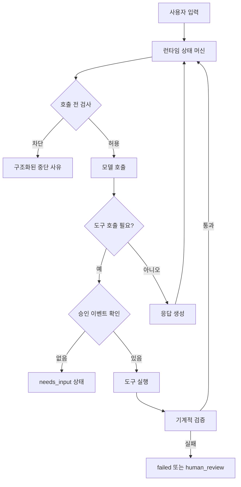

> 한 줄 요약: AI 에이전트의 신뢰성은 프롬프트 품질만으로 정해지지 않는다. 런타임 상태 검사와 기계적 검증이 같이 있어야 한다. 다만 모든 동작을 게이트로 막는 방식도 답은 아니어서, 상태 머신과 승인 이벤트, 구조 검사를 어디에 둘지 설계해야 한다.

## 왜 지금 이슈인가

AI 에이전트 런타임, 상태 머신, 테스트 하네스가 실무 쟁점이 된 이유는 분명하다. 예전에는 에이전트가 채팅창 안에서 답변만 만들었고, 실패도 대체로 텍스트 품질 문제로 보였다. 지금은 다르다. 파일을 고치고, 도구를 호출하고, 백그라운드에서 계속 실행되며, 사람의 승인을 기다린다.

선정 글감이 짚은 Claude Code 2.1.205 변경 내역도 그래서 눈에 띈다. 모델 성능 벤치마크가 아니라 상태 관리 버그가 핵심이었다. 작업 중 보낸 메시지가 `--max-turns` 한계에서 조용히 사라지는 문제, 재개된 백그라운드 에이전트가 계속 failed나 completed로 보이는 문제, 입력 대기 상태가 읽을 수 있는 설명 없이 working으로 돌아가는 문제, Remote Control 화면의 Running 상태가 오래 남는 문제가 고쳐졌다.

겉으로는 작은 UI나 상태 표시 버그처럼 보인다. 하지만 에이전트가 실제 업무 흐름에 들어오면 이런 버그가 운영 사고의 시작점이 될 수 있다. 사용자는 멈춘 줄 알고 기다리고, 런타임은 계속 호출하고, 모델이 만든 문장이 실제 사람의 승인처럼 취급될 수 있다.

커뮤니티에서 말이 붙는 지점도 여기다. 더 긴 컨텍스트, 더 강한 모델, 더 정교한 시스템 프롬프트가 도움이 되는 건 맞다. 다만 에이전트가 실패하는 순간을 보면, 상당수는 추론 능력 부족보다 실행 제어 부족에 가깝다.

## 커뮤니티에서 갈리는 지점

AI 에이전트를 둘러싼 논쟁은 보통 두 갈래로 나뉜다.

한쪽은 프롬프트와 모델 능력을 더 밀어붙인다. 규칙을 더 명확히 쓰고, 작업 지시를 더 세분화하고, 평가 문구를 넣으면 에이전트가 더 잘 따를 것이라고 본다. 다른 쪽은 말로 시키는 방식 자체에 한계가 있다고 본다. 에이전트가 스스로 한 일을 평가하는 구조에서는 실행과 검증이 같은 모델 경로를 공유하기 때문이다.

DEV Community의 150개 작업 실험은 이 논점을 잘 보여준다. 6개 세션, 150개 표준 작업, 2개 규칙 형식을 비교했지만 핵심 결론은 규칙 문장 형식보다 기계적 게이트가 더 강했다는 쪽에 가깝다. 파일 타임스탬프, 정규식 검사, 종료 코드처럼 모델이 직접 판단하지 않는 신호가 규칙 준수 여부를 더 안정적으로 잡아냈다는 주장이다.

Vercel의 konsistent도 같은 방향의 사례다. TypeScript 코드베이스에서 특정 패턴의 파일이 어떤 export를 가져야 하는지, 어떤 폴더에 어떤 파일이 함께 있어야 하는지, 어떤 클래스가 어떤 타입을 구현해야 하는지를 구조적으로 검사한다. TypeScript나 ESLint가 잘 다루지 못하는 프로젝트 관습을 별도 CLI로 검증한다는 점에서, 사람과 에이전트 모두에게 같은 기계적 경계선을 제공한다.

반대로 모든 실패를 런타임 게이트로 해결하려는 접근도 위험하다. 게이트가 많아질수록 개발 흐름은 느려지고, 예외 처리는 복잡해진다. 팀은 왜 막혔는지 모르는 또 하나의 블랙박스를 갖게 된다. 에이전트가 자율적으로 움직이지 못하면 생산성 이점도 줄어든다.

쟁점은 AI 에이전트에 게이트를 둘지 말지가 아니다. 어떤 결정은 모델에게 맡기고, 어떤 결정은 런타임 상태와 외부 검증으로 분리할지다.

| 쟁점 | 프롬프트 중심 접근 | 런타임 검증 접근 |
|---|---|---|
| 규칙 준수 | 지시문과 예시로 유도 | 실행 전 조건 검사 |
| 승인 처리 | 대화 맥락에서 해석 | 승인 이벤트로 기록 |
| 비용 제어 | 모델이 멈추길 기대 | 호출 전 예산·횟수 차단 |
| 코드 관습 | 에이전트가 기억 | CLI·린터가 검사 |
| 실패 분석 | 로그를 읽고 추정 | 상태·사유를 구조화 |

Stack Overflow Blog가 말한 엔터프라이즈 에이전트 개발 시스템도 비슷한 문제의식과 닿아 있다. agent harness만으로는 부족하고, 신뢰성, 정확성, 운영 가능한 개발 시스템이 필요하다는 관점이다. 하네스는 시작점일 뿐이다. 실제 운영에서는 상태 저장, 평가, 승인, 관측성, 배포 흐름까지 붙어야 한다.

## 아키텍처 관점에서 볼 점

AI 에이전트 아키텍처를 모델 호출 중심으로 보면 놓치는 것이 많다. 실제 시스템의 흐름은 대략 이렇다.



여기서 중요한 점은 모델 호출 전에 런타임이 입장 결정을 한다는 것이다. 에이전트가 다음 토큰을 만들기 전에 현재 상태가 working인지, 사람 입력이 필요한지, 최대 턴에 도달했는지, 승인 범위가 맞는지, 예산이 남았는지 확인해야 한다.

선정 글감의 예시는 이 구조를 잘 보여준다. `needs_input` 상태라면 호출하지 않는다. `maxSteps`를 넘겼다면 호출하지 않는다. 모델 가격을 알 수 없거나 예산이 바닥났다면 호출하지 않는다. 재시도 중인데 최근 진전이 없다면 호출하지 않는다.

이런 검사는 보안 장벽이라기보다 실행 제어 장치에 가깝다. 완전한 샌드박스나 권한 시스템을 대체하지는 못한다. 대신 비용 폭주, 프롬프트 루프, 무의미한 재시도, 승인 없는 도구 호출 같은 흔한 사고를 앞단에서 줄인다.

승인 처리는 특히 분리해야 한다. 모델 출력 안에 사용자가 승인한 것처럼 보이는 문장이 들어 있다고 해서 실제 승인이 생긴 것은 아니다. 운영 시스템에서는 승인 이벤트가 별도 데이터로 남아야 한다.

예를 들면 이런 형태다.

```ts
type ApprovalEvent = {
  runId: string;
  approvedBy: "human" | "policy";
  approvedAt: number;
  scope: "tool_call" | "provider_call" | "file_edit";
};
```

이 구조에서는 transcript에 허가 문구가 있느냐보다, 특정 `runId`와 `scope`에 유효한 승인 이벤트가 있느냐가 실행 조건이 된다. Elastic의 AI 에이전트 거버넌스 글이 말한 progressive trust, continuous evaluation, agent-specific telemetry도 이 방향과 맞물린다. 에이전트가 무엇을 할 수 있는지뿐 아니라 실제로 잘하고 있는지 계속 증명해야 한다는 관점이다.

상태 역시 UI 표시용 문자열이면 부족하다. `Running`, `failed`, `completed`, `needs_input` 같은 값은 실행 제어와 연결되어야 한다. UI는 running인데 내부는 입력 대기라면 사용자는 기다리고 시스템은 잘못된 호출을 이어갈 수 있다. 내부는 멈췄는데 화면만 running이면 운영자는 장애를 늦게 알아차린다.

이 문제는 관측성과도 이어진다. 에이전트 로그에는 프롬프트와 응답만 남겨서는 부족하다. 각 호출마다 상태, 승인 출처, 차단 사유, 재시도 횟수, 비용 추정, stop reason, 검증 결과가 함께 남아야 한다.

## 실무에서 볼 점

현업에서 AI 에이전트를 붙일 때 가장 먼저 확인할 것은 에이전트가 잘 답하는지가 아니다. 멈춰야 할 때 멈추는지다.

도입 전에 최소한 다음 조건을 봐야 한다.

- 최대 턴, 최대 스텝, 최대 비용이 런타임에서 강제되는가
- stop reason이 문자열 로그가 아니라 구조화된 상태로 남는가
- 사람 승인과 모델 생성 텍스트가 데이터 모델에서 분리되는가
- 백그라운드 작업의 상태가 실행 제어의 source of truth인가
- 실패 후 재시도가 같은 입력을 반복하지 않는지 검증하는가
- 코드 변경 결과를 정규식, 타입 체크, 테스트, 구조 린터로 확인하는가
- 에이전트별 호출 수, 실패율, 차단 사유, 승인 대기 시간을 볼 수 있는가

도입 조건도 명확히 나눠야 한다. 읽기 전용 질의나 문서 초안 생성처럼 실패 비용이 낮은 작업은 프롬프트와 후처리만으로도 충분할 수 있다. 반면 파일 수정, 배포, 결제, 권한 변경, 고객 데이터 조회처럼 부작용이 있는 작업은 런타임 게이트가 필요하다.

문제는 게이트 자체도 운영 대상이라는 점이다. 예산 검사 로직이 잘못되면 정상 작업이 막힌다. 승인 범위가 너무 넓으면 안전하지 않고, 너무 좁으면 매번 사람이 끼어야 한다. 구조 린터 규칙이 낡으면 에이전트와 사람 모두 엉뚱한 관습에 묶인다.

출발점은 큰 플랫폼을 한 번에 만드는 것이 아니다. 위험한 호출 경로 하나를 골라 그 앞에 작은 pre-call guard를 두는 편이 낫다.

예를 들어 코드 작성 에이전트라면 첫 단계는 이 정도면 충분하다.

- provider call 전 `status`, `stepCount`, `budgetRemaining` 검사
- file edit 전 명시적 승인 이벤트 검사
- 수정 후 `typecheck`, `test`, 구조 린터 실행
- 실패 시 `failed`, `needs_input`, `human_review` 중 하나로만 전이
- 자동 재시도는 같은 실패 사유에서 1회 이하로 제한

이때 Genkit Agents API 같은 프레임워크는 반복 배관을 줄이는 데 도움이 될 수 있다. 메시지 히스토리, tool loop, 스트리밍, persistence, 프런트엔드 프로토콜을 매번 직접 연결하지 않아도 되기 때문이다. 다만 preview API처럼 변경 가능성이 있는 기반 위에 핵심 업무 흐름을 얹는다면 버전 고정, 마이그레이션 계획, 상태 저장 형식의 호환성을 따로 챙겨야 한다.

Elastic이 보안 에이전트 맥락에서 말한 거버넌스도 같은 교훈을 준다. tiered autonomy, 즉 낮은 위험은 자동화하고 높은 위험은 사람 승인을 받는 모델만으로는 부족하다. 허용된 범위 안에서 계속 틀리는 에이전트는 승인 게이트를 건드리지 않고도 피해를 만든다. 거버넌스는 권한표가 아니라 지속 평가와 관측 데이터까지 포함해야 한다.

실제로 이런 상황에서는 에이전트가 한 번 크게 틀리는 것보다 작게 계속 움직이는 쪽이 더 까다롭다. 한 번의 실패는 눈에 띄지만, 잘못된 상태로 이어지는 재시도와 비용 누수는 늦게 발견된다. 그래서 런타임 체크는 방어적 코딩이라기보다 운영 비용을 줄이는 설계에 가깝다.

## 정리

AI 에이전트의 다음 병목은 프롬프트 문장력이 아니라 런타임 정확성이다. 상태가 틀리면 좋은 모델도 잘못된 순간에 호출되고, 승인 모델이 흐리면 생성된 문장이 운영 권한처럼 취급된다.

그렇다고 모든 행동을 막는 게이트 더미를 만드는 것도 답은 아니다. 실무적인 기준은 부작용이 있는 경로부터 분리하는 것이다. provider call, tool call, file edit, deploy처럼 비용이나 상태를 바꾸는 지점 앞에 작은 상태 검사를 두고, 그 결과를 로그와 관측 지표로 남겨야 한다.

당장 확인할 것은 하나다. 지금 쓰는 AI 에이전트나 사내 자동화가 다음 호출을 하기 직전에 멈출 이유를 구조화해서 판단하고 있는가. 그 답이 아니오라면, 더 좋은 프롬프트보다 먼저 상태 머신을 봐야 한다.

## 참고 자료

- [선정 글감] [AI Agents Need Runtime State Checks, Not Just Better Prompts](https://dev.to/assili_salim_e3c07f9954de/ai-agents-need-runtime-state-checks-not-just-better-prompts-5cdp) - DEV Community
- [관련] [I Ran 150 Tasks to Test If AI Agents Follow Rules: The Answer Surprised Me](https://dev.to/yuhaolin2005/i-ran-150-tasks-to-test-if-ai-agents-follow-rules-the-answer-surprised-me-2670) - DEV Community
- [관련] [Building more than just an agent harness](https://stackoverflow.blog/2026/07/10/building-more-than-just-an-agent-harness/) - Stack Overflow Blog
- [관련] [Enforce consistent code for agents and humans with konsistent](https://vercel.com/changelog/enforce-consistent-code-for-agents-and-humans-with-konsistent) - Vercel Blog
- [관련] [Build agentic full-stack apps with Genkit](https://developers.googleblog.com/build-agentic-full-stack-apps-with-genkit/) - Google Developers
- [관련] [The future of governing AI agents](https://www.elastic.co/blog/the-future-of-governing-ai-agents) - Elastic Blog