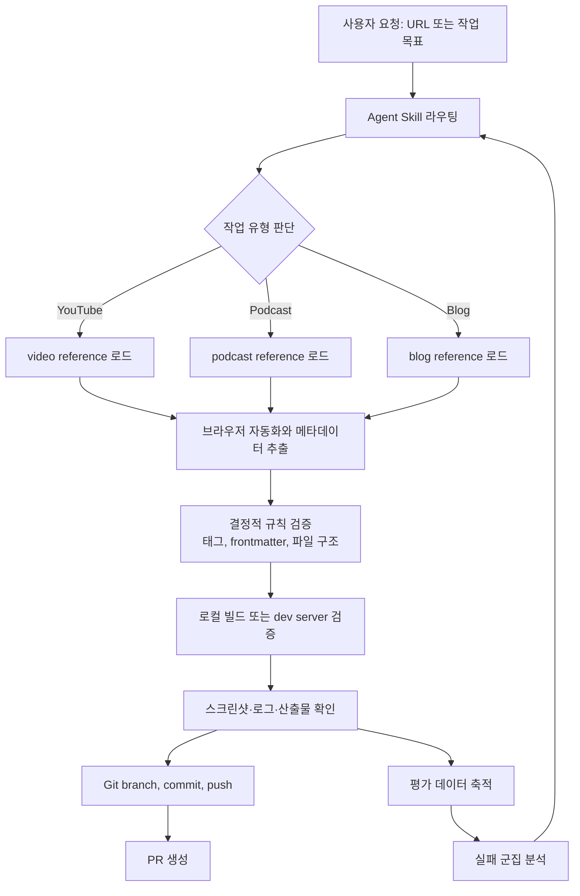

> 한 줄 요약: AI 에이전트 자동화는 프롬프트 파일을 잘 쓰는 문제라기보다 Agent Skills, 테스트 자동화, 평가 루프, 코드 규칙, 운영 관측성을 묶어 재현 가능한 워크플로로 만드는 문제다.

## 왜 지금 이슈인가

AI 에이전트로 콘텐츠를 만들고, 코드를 고치고, PR을 열고, 리뷰까지 맡기는 팀이 늘어나면 먼저 부딪히는 벽은 모델 성능이 아니다. 같은 요청을 넣었는데 오늘은 되고 내일은 안 되는 재현성이다.

DEV Community의 사례는 이 문제를 작게 보여준다. 처음에는 `.github/prompts/` 아래에 비디오, 팟캐스트, 블로그용 프롬프트 파일을 따로 두었다. 각 프롬프트는 URL을 받아 메타데이터를 추출하고 마크다운 파일을 만드는 정도였다.

문제는 자동화가 조금만 커져도 프롬프트만으로는 운영 지식을 담기 어렵다는 점이다.

- YouTube 쿠키 동의 화면을 어떻게 넘길 것인가
- 상대 날짜를 실제 게시일로 어떻게 바꿀 것인가
- 스냅샷 파일을 어디서 읽을 것인가
- `nvm`, `gh`, Git 인증 같은 셸 환경 차이를 어떻게 처리할 것인가
- 파일 생성 뒤 사이트 렌더링과 PR 생성까지 어떻게 검증할 것인가

이런 세부사항은 사람이 옆에 있으면 자연스럽게 처리된다. 하지만 비대화형 에이전트가 혼자 실행되면 모든 예외가 시스템 요구사항이 된다.

GitHub Copilot code review 사례도 같은 방향을 가리킨다. 더 관리하기 쉬운 공용 CLI 도구로 바꿨는데 비용은 늘고 잡아내는 이슈는 줄었다. 도구가 나빠서라기보다, 리뷰어처럼 읽고 증거를 모으는 워크플로에 맞게 지시를 다시 쓰지 않았던 것이 원인이었다.

Google Developers의 에이전트 품질 플라이휠은 이 문제를 더 직접적으로 다룬다. 프롬프트를 몇 개 예제로 확인하는 수준을 넘어서, 데이터 준비, 추론 실행, 자동 채점, 실패 군집 분석, 목표한 최적화를 반복해야 에이전트 품질을 말할 수 있다는 관점이다.

## 커뮤니티에서 갈리는 지점

### Agent Skills가 프롬프트 파일보다 나은가?

프롬프트 파일은 빠르다. 저장소 안에 마크다운 몇 개를 두고, IDE의 에이전트 모드에서 불러오면 바로 쓸 수 있다. 작은 작업에는 충분하다.

하지만 프롬프트 파일은 보통 다음 세 가지에서 약하다.

| 구분 | 프롬프트 파일 | Agent Skills |
|---|---|---|
| 재사용성 | 특정 IDE나 에이전트에 묶이기 쉽다 | 여러 에이전트가 읽을 수 있는 작업 지침으로 분리 가능 |
| 운영 지식 | 짧은 규칙 위주 | 실패 사례, 환경 설정, 검증 절차를 축적 가능 |
| 확장성 | 비슷한 파일이 늘어나며 중복 발생 | 공통 절차와 유형별 절차를 나눌 수 있음 |

선정 글감의 핵심은 비디오, 팟캐스트, 블로그용 프롬프트를 각각 키우는 대신 하나의 `add-content` 스킬로 합친 판단이다. 공통 워크플로는 `SKILL.md`와 `environment.md`에 두고, YouTube, 팟캐스트, 블로그별 차이는 별도 reference 파일로 분리했다.

이 구조는 단순한 정리정돈이 아니다. 에이전트 컨텍스트 비용을 줄이고, 필요한 지식만 로드하게 만드는 아키텍처 결정이다. Anthropic 계열에서 말하는 점진적 공개(Progressive Disclosure) 패턴과도 닿아 있다.

### 오케스트레이션을 더 얹으면 해결될까?

Stack Overflow Blog의 논의는 다른 각도에서 경고한다. 에이전트가 실패할 때마다 라우터, 플래너, 서브에이전트, 재시도 체인을 덧붙이는 방식은 한때 자연스러운 선택이었다. 하지만 모델이 긴 작업을 더 잘 처리하게 될수록 무거운 오케스트레이션은 오히려 품질을 떨어뜨릴 수 있다.

실제로 필요한 것은 복잡한 지휘 체계가 아닐 때가 많다. 좋은 검색(Retrieval), 도메인에 맞는 데이터, 끝까지 확인하는 평가가 더 큰 차이를 만든다.

선정 글감의 Agent Skill 구조도 이 관점과 잘 맞는다. 비디오를 추가하는 에이전트에게 거대한 플래너를 붙이지 않는다. 대신 정확한 도구 호출, 환경 준비, 데이터 추출, 렌더링 검증, PR 생성이라는 좁은 경로를 정리한다.

### 규칙은 LLM에게 맡겨도 될까?

Vercel의 `konsistent`는 에이전트 시대의 코드 규칙을 다른 방식으로 다룬다. TypeScript나 ESLint가 잘 모델링하지 못하는 구조 규칙을 CLI linter로 검증한다.

예를 들면 이런 질문이다.

- 특정 패턴의 파일은 반드시 어떤 함수를 export해야 하는가
- 어떤 폴더에 파일 X가 있으면 파일 Y도 있어야 하는가
- 특정 클래스는 반드시 어떤 타입을 구현해야 하는가

이런 규칙을 프롬프트에 적어둘 수도 있다. 하지만 프롬프트는 지키려고 노력하는 약속이고, linter는 실패를 막는 게이트다.

에이전트와 사람이 같은 코드베이스에서 작업한다면, 규칙은 가능한 한 결정적 도구로 내려와야 한다. LLM은 추론과 변환을 맡고, 구조 검증은 빠르고 재현 가능한 도구가 맡는 편이 운영에 유리하다.

## 아키텍처 관점에서 볼 점

### AI 에이전트 자동화 아키텍처는 어디서 깨질까?

에이전트 자동화는 겉으로 보면 URL 하나를 넣고 PR 하나를 받는 흐름이다. 내부에서는 브라우저 자동화, 파일 생성, 정적 사이트 빌드, Git 작업, 원격 저장소 인증, 리뷰 품질 평가가 이어진다.

한 단계라도 관측되지 않으면 실패 원인을 찾기 어렵다.

이 다이어그램에서 봐야 할 지점은 에이전트가 생각하는 단계보다 검증 경계가 더 많다는 점이다.

브라우저 자동화는 외부 UI에 의존한다. YouTube의 쿠키 동의, 상대 날짜 표기, DOM 변경은 언제든 바뀔 수 있다. 그래서 스냅샷 파일을 읽고, 필드별 추출 근거를 확인하고, 사이트 렌더링까지 봐야 한다.

파일 생성은 저장소 규칙에 의존한다. 태그는 기존 태그만 써야 하고, frontmatter 형식은 Hugo가 읽을 수 있어야 하며, 파일명은 배포 파이프라인과 충돌하지 않아야 한다.

PR 생성은 플랫폼 인증에 의존한다. `gh auth setup-git`, PATH, nvm 초기화 같은 환경 지식이 빠지면 모델 추론이 아무리 좋아도 작업은 끝나지 않는다.

### 도구보다 워크플로가 먼저다

GitHub Copilot code review 사례에서 흥미로운 부분은 더 좋은 도구를 넣었는데 성능이 나빠졌다는 점이다. `grep`, `glob`, `view` 같은 Unix 스타일 도구는 범용성이 높다. 그런데 에이전트가 PR 리뷰어처럼 diff에서 출발해 주변 맥락을 좁혀 가도록 지시받지 않으면, 도구 호출은 늘고 성과는 떨어질 수 있다.

이건 Agent Skills에도 그대로 적용된다. `playwright-cli`를 쓸 수 있다는 사실보다, 언제 브라우저를 열고, 어떤 스냅샷을 읽고, 무엇을 검증한 뒤 닫을지 정해져 있어야 한다.

도구 목록은 역량이 아니라 가능성이다. 운영 가능한 자동화는 가능성을 절차와 검증으로 좁힌 결과에 가깝다.

## 실무에서 볼 점

### Agent Skills 도입 전에 무엇을 확인해야 할까?

첫 번째 조건은 반복 작업의 경계가 분명한지다. 콘텐츠 추가, 테스트 데이터 생성, 마이그레이션 보조, PR 리뷰 초안처럼 입력과 산출물이 비교적 명확한 작업이 좋다.

두 번째 조건은 실패를 판정할 수 있는지다. 에이전트가 만든 파일이 맞는지, 빌드가 되는지, 화면에 렌더링되는지, PR 설명에 필요한 근거가 있는지 확인할 수 있어야 한다.

세 번째 조건은 운영 지식이 축적될 위치가 있는지다. 매번 채팅창에 붙이는 설명은 사라진다. 스킬, reference 문서, linter 설정, 테스트 하네스(Test Harness), CI 로그처럼 저장소 안에 남는 형태가 필요하다.

### 실패하기 쉬운 지점

- 프롬프트를 길게 쓰면 안정화된다고 착각한다
- 에이전트가 지켜야 할 규칙과 CI가 막아야 할 규칙을 구분하지 않는다
- 브라우저 자동화의 외부 의존성을 과소평가한다
- 평가 데이터 없이 프롬프트를 고친다
- 성공 사례만 스킬에 남기고 실패 복구 절차를 남기지 않는다
- 모든 작업을 하나의 만능 스킬로 합친다

현업에서 비슷한 고민을 하다 보면, 자동화를 망치는 건 대개 모델의 창의성이 아니다. 실패했을 때 멈출 기준이 없고, 성공했을 때도 무엇이 좋아졌는지 측정하지 않는 구조가 더 자주 문제를 만든다.

Google의 품질 플라이휠이 말하는 다섯 단계는 그래서 실무적이다. 데이터셋을 준비하고, 에이전트를 실행하고, 독립적인 기준으로 채점하고, 실패를 묶어서 보고, 목표한 부분만 고친다. 이 흐름이 없으면 프롬프트 수정은 개선이 아니라 감에 의존한 조정에 머문다.

### Agent Skills vs 테스트 하네스 차이점

Agent Skills와 테스트 하네스는 서로 대체재가 아니다.

| 항목 | Agent Skills | 테스트 하네스 |
|---|---|---|
| 목적 | 에이전트가 작업하는 방법을 알려준다 | 작업 결과가 맞는지 판정한다 |
| 형태 | `SKILL.md`, reference 문서, 절차 | 테스트 케이스, fixture, evaluator, CI |
| 강점 | 운영 지식 전달, 도구 사용 순서 고정 | 회귀 방지, 품질 추세 측정 |
| 약점 | 잘못된 지시도 그대로 실행될 수 있음 | 테스트에 없는 실패는 놓칠 수 있음 |

좋은 구조는 둘을 붙인다. 스킬은 작업을 수행하고, 하네스는 결과를 판정한다. 여기에 `konsistent` 같은 결정적 구조 검증 도구를 더하면 사람이 리뷰하기 전에 명백한 규칙 위반을 줄일 수 있다.

### 보안과 데이터 리스크

에이전트가 브라우저를 열고, 셸을 실행하고, GitHub에 푸시하고, PR을 만든다면 보안 경계도 같이 넓어진다.

확인할 항목은 구체적이어야 한다.

- 어떤 명령을 실행할 수 있는가
- 어떤 토큰과 쿠키에 접근할 수 있는가
- 외부 페이지에서 가져온 텍스트를 그대로 커밋하지 않는가
- PR 생성 전에 비밀값이 포함되지 않았는가
- 자동화가 실패했을 때 브랜치나 임시 파일을 남기지 않는가
- 로그에 인증 정보나 원문 개인정보가 찍히지 않는가

에이전트 자동화는 편의 기능처럼 시작하지만, 운영 관점에서는 CI/CD 권한을 가진 작업자에 가깝다. 그러면 최소 권한, 감사 로그, 재현 가능한 실행 환경, 실패 시 중단 조건이 필요하다.

## 정리

AI 에이전트 자동화의 성패는 프롬프트를 얼마나 그럴듯하게 쓰는지보다, 운영 지식을 어디에 축적하고 어떤 검증 경계로 막는지에 달려 있다.

프롬프트 파일은 시작점으로 충분하다. 하지만 작업이 PR 생성, 브라우저 자동화, 빌드 검증, 코드 리뷰처럼 넓어지면 Agent Skills, 결정적 linter, 테스트 하네스, 평가 플라이휠이 함께 필요해진다.

당장 확인할 것은 하나다. 지금 쓰는 에이전트 프롬프트 중 반복해서 붙여 넣는 운영 규칙을 하나 고르고, 그 규칙이 스킬 문서에 있어야 하는지, linter에 있어야 하는지, 테스트 하네스에 있어야 하는지 나눠보면 된다. 그 분류가 에이전트 자동화의 첫 아키텍처 리뷰다.

## 참고 자료

- [선정 글감] [From Prompt Files to Agent Skills: How I Unified My Content Automation](https://dev.to/debs_obrien/from-prompt-files-to-agent-skills-how-i-unified-my-content-automation-3h9k) — DEV Community
- [관련] [Driving the Agent Quality Flywheel from Your Coding Agent](https://developers.googleblog.com/driving-the-agent-quality-flywheel-from-your-coding-agent/) — Google Developers
- [관련] [Enforce consistent code for agents and humans with konsistent](https://vercel.com/changelog/enforce-consistent-code-for-agents-and-humans-with-konsistent) — Vercel Blog
- [관련] [Agent orchestration is so two-years ago](https://stackoverflow.blog/2026/07/07/agent-orchestration-is-so-two-years-ago/) — Stack Overflow Blog
- [관련] [Better tools made Copilot code review worse. Here’s how we actually improved it.](https://github.blog/ai-and-ml/github-copilot/better-tools-made-copilot-code-review-worse-heres-how-we-actually-improved-it/) — GitHub Blog Engineering