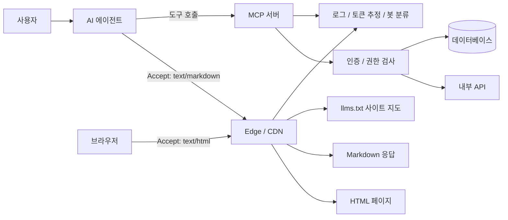

> 한 줄 요약: AI 에이전트 시대의 웹 최적화는 HTML 용량을 줄이는 일이 아니라, 어떤 데이터를 어떤 비용과 권한으로 읽게 할지 정하는 인터페이스 설계에 가깝다.

## 왜 지금 이슈인가

AI 에이전트가 웹사이트를 읽을 때 쓰는 토큰 비용은 이제 에이전트 개발자만의 문제가 아니다. 페이지가 무거우면 에이전트는 내비게이션, 스타일, 스크립트, 구조화 데이터까지 함께 읽고, 그만큼 토큰 예산을 쓴다.

원문은 이 문제를 웹사이트 소유자의 책임으로 돌려본다. 브라우저에는 기존 HTML을 주고, 에이전트가 요청하면 같은 URL에서 마크다운(Markdown) 형태를 주는 콘텐츠 협상(Content Negotiation)을 제안한다. `llms.txt`는 사이트 구조를 한 번에 알려주는 지도 역할을 한다.

이 주장이 GitHub와 개발자 커뮤니티에서 논의될 만한 이유는 분명하다. AI 에이전트가 가격, 약관, 문서, API 사용법, 상품 상태를 대신 읽기 시작하면, 페이지의 가독성은 자동화 성공률과 바로 연결된다.

다만 반대로 봐야 할 지점도 있다. 에이전트가 싸게 읽기 좋은 페이지를 만든다는 말은, 외부 자동화가 내 사이트의 사실과 액션 경로에 더 쉽게 접근한다는 뜻이기도 하다. 읽기 비용을 낮추는 설계는 검색 최적화라기보다 새로운 공개 API를 여는 결정에 가깝다.

## 커뮤니티에서 갈리는 지점

첫 번째 쟁점은 에이전트 친화적인 마크다운 표면을 만들면 누가 이득을 보느냐다.

사이트 운영자는 에이전트가 가격과 조건을 잘못 읽는 위험을 줄일 수 있다. 원문의 예처럼 HTML보다 마크다운이 대략 3분의 1 수준의 토큰으로 읽힌다면, 에이전트는 중간에 끊기지 않고 핵심 내용을 끝까지 읽을 가능성이 커진다.

반대로 콘텐츠 소유자 입장에서는 자동화 트래픽을 더 쉽게 받아들이는 셈이다. Cloudflare가 2026년 7월 1일 글에서 검색(Search), 에이전트(Agent), 학습(Training) 봇을 구분해 제어하는 옵션을 강조한 것도 같은 맥락이다. 모든 자동화를 막거나 모두 허용하는 방식은 너무 거칠다.

두 번째 쟁점은 에이전트 인터페이스를 문서로 둘지, 도구로 둘지다.

DEV Community의 MCP 서버 글은 모델 컨텍스트 프로토콜(Model Context Protocol)을 LLM과 내부 시스템 사이의 어댑터로 설명한다. 에이전트가 저장소를 읽고, CLI를 실행하고, 내부 API나 데이터베이스를 조회하려면 도구 이름, 설명, 입력 스키마, 인증, 전송 방식이 인터페이스가 된다.

마크다운 페이지는 읽기 인터페이스다. MCP 도구는 실행 인터페이스다. 둘을 같은 문제로 묶어 보면, 중요한 것은 에이전트에게 친절해 보이는 형식이 아니라 읽기와 실행의 경계를 어디에 둘지다.

세 번째 쟁점은 비용 모델이다.

Vercel Agent 가격 변경은 이 논의를 더 현실적으로 만든다. 기존의 요청당 0.30달러 방식에서, Vercel Token Rate 100만 토큰당 0.25달러와 공급자 추론 비용을 더하는 방식으로 바뀌었다. 짧은 질문과 로그, 배포, 설정, 런타임 데이터를 읽는 깊은 조사의 비용이 달라진다.

이런 가격 체계에서는 페이지와 문서의 군더더기가 곧 운영비가 된다. 에이전트가 내 사이트를 읽는 비용을 내가 직접 내지 않더라도, 통합 파트너나 사용자의 에이전트가 그 비용을 부담한다. 비용이 높으면 선택받기 어렵고, 비용이 낮으면 더 자주 호출된다.

네 번째 쟁점은 오케스트레이션(Orchestration)보다 검색과 평가가 더 큰 병목이 될 수 있다는 점이다.

Stack Overflow Blog의 인터뷰는 에이전트 시스템에서 과한 오케스트레이션 레이어가 오히려 모델 성능을 해칠 수 있고, 경쟁력은 고유 데이터와 검색 품질, 엔드투엔드 평가에서 나온다고 본다. 이 관점에서는 마크다운 응답이나 `llms.txt`도 단순한 편의 기능이 아니다. 에이전트가 좋은 검색 결과를 얻고, 그 결과가 실제 작업 성공으로 이어지는지 측정하기 위한 데이터 표면이다.

## 아키텍처 관점에서 볼 점

에이전트 친화적인 사이트를 설계할 때 먼저 나눠야 할 것은 브라우저용 표면, 에이전트용 읽기 표면, 에이전트용 실행 표면이다.

브라우저용 HTML은 레이아웃과 상호작용을 포함한다. 에이전트용 마크다운은 사실, 조건, 가격, 문서 본문처럼 읽기에 필요한 정보만 담는다. 실행이 필요하면 MCP 서버나 별도 API처럼 인증과 권한을 가진 경로로 분리한다.

이 구조에서 콘텐츠 협상은 캐시 정책과 함께 봐야 한다. 같은 URL이 `Accept` 헤더에 따라 HTML과 마크다운을 다르게 반환한다면, CDN 캐시 키에도 해당 헤더가 반영되어야 한다. 그렇지 않으면 브라우저가 마크다운을 받거나, 에이전트가 HTML을 받는 장애가 생길 수 있다.

`llms.txt`는 사이트맵처럼 보이지만, 운영상으로는 더 민감하다. 어떤 문서를 에이전트에게 먼저 읽히고 싶은지, 어떤 페이지를 제외할지, 문서의 최신성을 어떻게 보장할지 정해야 한다. 오래된 가격표나 폐기된 API 문서가 지도에 남아 있으면 에이전트는 더 빠르게 틀린 답을 낸다.

MCP 서버는 더 조심해야 한다. 도구 설명이 곧 모델이 보는 인터페이스이므로, 이름과 설명이 애매하면 의도하지 않은 호출이 나올 수 있다. 입력 스키마가 느슨하면 정상 사용과 공격성 입력을 구분하기 어렵다.

읽기 표면과 실행 표면을 같은 수준으로 열어두면 위험이 커진다. 마크다운 문서는 익명 접근이 가능할 수 있지만, 주문 생성, 결제 상태 조회, 내부 로그 접근 같은 도구는 사용자 인증, 서비스 계정 권한, 감사 로그가 필요하다. 에이전트가 호출했다는 사실만으로 신뢰하면 안 된다.

관측성(Observability)도 따로 설계해야 한다. 일반 페이지뷰 지표만으로는 에이전트가 어디서 실패했는지 알기 어렵다.

- 에이전트가 HTML을 받았는지 마크다운을 받았는지
- `llms.txt`를 먼저 읽었는지
- 가격, 약관, API 문서 중 어떤 경로를 자주 읽는지
- 마크다운 응답 크기가 토큰 기준으로 얼마나 되는지
- 봇 분류가 검색, 에이전트, 학습 중 어디에 가까운지
- 실행 도구 호출이 읽기 요청 뒤에 자연스럽게 이어졌는지

이 로그가 있어야 비용 절감이 실제 정확도 개선으로 이어졌는지 판단할 수 있다. 마크다운을 제공했는데 에이전트가 여전히 HTML을 긁고 있다면, 문제는 포맷이 아니라 발견 가능성일 수 있다.

## 실무에서 볼 점

도입 순서는 작게 잡는 편이 낫다. 전체 사이트를 한 번에 에이전트용으로 바꾸기보다, 에이전트가 틀리면 손해가 큰 페이지부터 고르는 식이다.

예를 들면 가격표, 요금제, 반품 정책, API 인증 문서, 장애 공지, 설치 가이드가 먼저다. 블로그 전체를 마크다운으로 열어두는 것보다, 자동화가 실제로 참조할 문서를 정확하게 만드는 쪽이 낫다.

도입 전에 확인할 조건은 네 가지다.

| 확인 항목 | 질문 |
|---|---|
| 콘텐츠 범위 | 에이전트가 읽어도 되는 정보와 제외할 정보가 분리되어 있는가 |
| 최신성 | HTML, 마크다운, `llms.txt`가 같은 배포 흐름에서 갱신되는가 |
| 비용 | 응답 크기와 예상 토큰 수를 배포 전후로 비교할 수 있는가 |
| 보안 | 검색 봇, 에이전트 봇, 학습 봇을 다르게 다룰 수 있는가 |

실패하기 쉬운 지점은 마크다운을 단순 변환 결과물로 보는 것이다. HTML에서 본문만 긁어 마크다운으로 내보내면 겉보기에는 가벼워진다. 하지만 가격의 적용 조건, 지역 제한, 만료일, 예외 조항이 빠지면 에이전트는 더 자신 있게 틀린 답을 낸다.

또 다른 함정은 `llms.txt`를 홍보용 목차처럼 쓰는 것이다. 에이전트에게 필요한 것은 그럴듯한 소개 문구가 아니라 정확한 진입점이다. 문서의 우선순위, 최신 버전, 폐기된 문서와의 구분이 더 중요하다.

대안도 있다.

마크다운 콘텐츠 협상 대신 정적 문서 사이트를 정리하는 방법이 있다. 이미 문서가 가볍고 의미 구조가 깨끗하다면 별도 포맷을 늘리는 비용이 더 클 수 있다.

API 문서와 MCP 서버를 먼저 만들 수도 있다. 에이전트가 단순히 읽는 것을 넘어 사용자 대신 작업해야 한다면, 자연어 페이지보다 타입이 있는 도구와 인증된 API가 낫다.

Cloudflare 같은 엣지 계층에서 봇 분류와 정책을 먼저 세우는 접근도 가능하다. 내 사이트가 콘텐츠 비즈니스에 가깝다면, 에이전트 친화성보다 학습 봇 차단, 유료 크롤링, 검색 봇 허용 범위를 먼저 정해야 한다.

현업에서 비슷한 고민을 하다 보면, 문제는 보통 기술 구현보다 책임 경계에서 생긴다. 문서팀은 더 잘 읽히는 문서를 원하고, 보안팀은 자동화 접근면이 넓어지는 것을 우려한다. 제품팀은 에이전트가 가격과 정책을 정확히 전달하길 바라지만, 법무나 운영팀은 잘못된 자동 안내가 만들어낼 비용을 걱정한다.

그래서 의사결정 문장은 이렇게 바뀌어야 한다.

- 에이전트가 읽기 좋은 페이지를 만들자
- 에이전트가 읽어도 되는 사실을, 낮은 비용으로, 최신 상태로, 감사 가능한 방식으로 제공하자

이 차이가 작아 보여도 운영 결과는 다르다. 전자는 변환 작업이고, 후자는 플랫폼 정책이다.

## 정리

에이전트가 웹을 읽는 비용은 모델 제공사의 가격표에서만 결정되지 않는다. 페이지의 구조, 문서의 밀도, `llms.txt`의 정확성, 봇 정책, MCP 도구의 권한 설계가 함께 비용과 신뢰도를 만든다.

마크다운 응답은 좋은 출발점이 될 수 있다. 다만 SEO 팁처럼 덧붙이는 정도로는 부족하다. 에이전트용 읽기 표면을 하나의 API처럼 보고, 캐시, 버전, 권한, 로그, 봇 분류까지 함께 설계해야 한다.

당장 확인할 것은 하나다. 가장 중요한 가격표나 문서 페이지 하나를 골라 HTML 원문과 본문만 남긴 마크다운의 토큰 크기를 비교해보자. 차이가 크다면, 그 페이지는 이미 에이전트 시대의 병목일 가능성이 높다.

## 참고 자료

- [선정 글감] [What an agent pays to read your site](https://dev.to/turva-dev/what-an-agent-pays-to-read-your-site-ge9) — DEV Community
- [관련] [Build an MCP Server in Go (for Claude Code)](https://dev.to/ohugonnot/build-an-mcp-server-in-go-for-claude-code-2o2i) — DEV Community
- [관련] [Vercel Agent has updated pricing](https://vercel.com/changelog/vercel-agent-has-updated-pricing) — Vercel Blog
- [관련] [Your site, your rules: new AI traffic options for all customers](https://blog.cloudflare.com/content-independence-day-ai-options/) — Cloudflare Blog
- [관련] [Agent orchestration is so two-years ago](https://stackoverflow.blog/2026/07/07/agent-orchestration-is-so-two-years-ago/) — Stack Overflow Blog