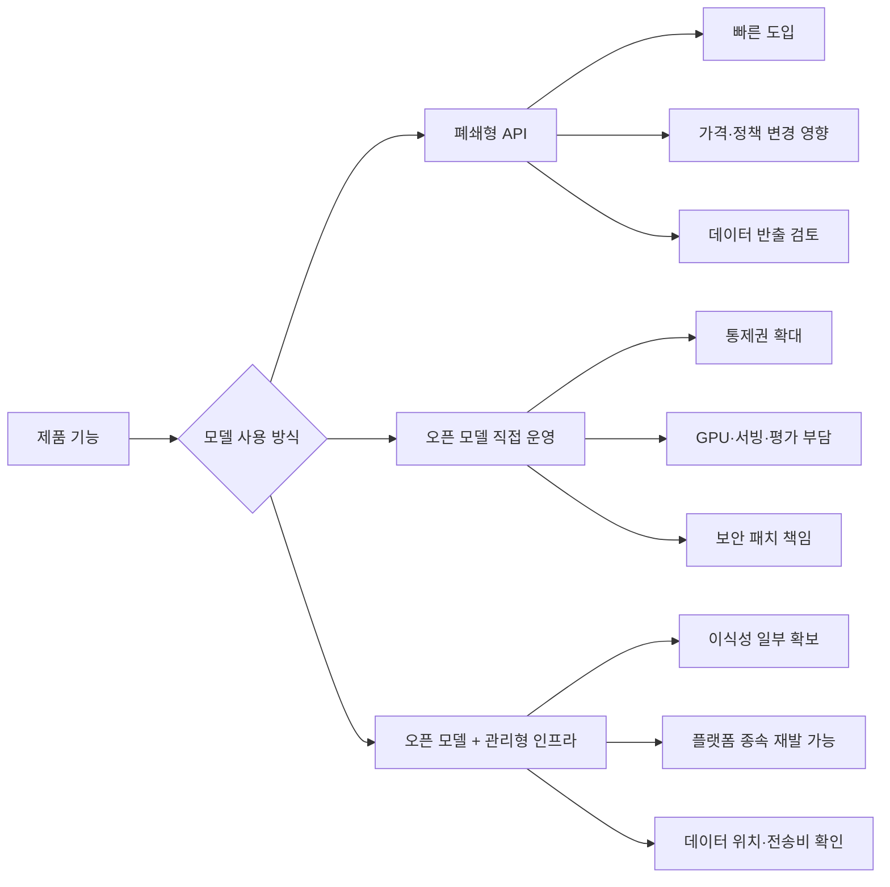

> 한 줄 요약: Hugging Face와 오픈소스 AI 논쟁의 쟁점은 모델 성능 경쟁보다, 기업 AI를 어떤 비용 구조와 정책 변화 위에 올려둘 것인가에 가깝다. API를 빌려 쓰는 방식이 끝났다는 말은 과장이다. 더 정확한 질문은 어디까지 빌리고 어디부터 직접 쥘 것인가다.

## 무슨 일이 있었나

2026년 7월 10일 TechCrunch는 Equity 팟캐스트에서 Hugging Face CEO 클렘 들랑그와 나눈 대화를 소개했다. 기업들이 처음에는 프런티어 모델 API로 시작하지만, 사용량이 커질수록 비용과 통제 문제 때문에 오픈소스 모델 쪽으로 이동한다는 주장이다.

Hugging Face는 AI 모델과 데이터셋을 공유하고 내려받는 허브로 자리 잡았다. TechCrunch는 이 생태계를 AI 분야의 GitHub에 비유했다. 기사에 따르면 Hugging Face는 Fortune 500의 대략 절반이 사용하고 있다.

확인된 사실과 해석은 나눠서 봐야 한다.

| 구분 | 내용 |
| --- | --- |
| 확인된 사실 | TechCrunch는 2026년 7월 10일 Hugging Face CEO 인터뷰를 공개했다 |
| 확인된 사실 | 인터뷰의 중심 주제는 기업 AI에서 오픈소스 모델과 폐쇄형 API의 긴장이다 |
| 확인된 사실 | 기사에는 Anthropic의 중단된 Fable release 이후 open vs closed source 논쟁이 언급된다 |
| 확인된 사실 | Hugging Face는 SkyPilot과 함께 Hub 저장소를 여러 클라우드 GPU 작업에 연결하는 zero-egress storage 흐름을 2026년 7월 7일 소개했다 |
| 확인된 사실 | Hugging Face는 2026년 6월 30일 Every Eval Ever 결과를 모델 페이지에 연결해 평가 결과 메타데이터를 표준화하는 작업을 발표했다 |
| 해석 | 기업들이 전면적으로 API를 버린다는 뜻은 아니다 |
| 해석 | 비용, 데이터 위치, 평가 신뢰성, 정책 변경 위험이 겹치면서 소유 가능한 AI 스택에 대한 관심이 커졌다고 보는 편이 더 정확하다 |

이 이슈를 Hugging Face의 성장담으로만 읽으면 중요한 부분을 놓친다. 사람들이 반응한 지점은 오픈소스의 승리가 아니다. AI가 업무 시스템 안으로 들어오면서 임대형 인프라의 약점이 더 빨리 드러난다는 점이다.

## 왜 사람들이 반응했나

### 왜 기업 AI API 비용에 민감해졌나?

AI API는 시작하기 쉽다. 키를 발급받고 SDK를 붙이면 첫 데모까지 금방 간다. 조직 안에서 AI 프로젝트를 시작할 때 외부 API가 자연스러운 선택이 되는 이유다.

문제는 데모가 운영 기능으로 바뀐 뒤에 나온다. 사용자 수가 늘고, 에이전트(Agent)가 여러 번 도구를 호출하고, 검색 증강 생성(RAG)이 긴 컨텍스트를 붙이고, 로그와 재시도까지 쌓이면 비용 구조가 선명해진다.

Computerphile의 AI 토큰 비용 설명도 이 불편함과 맞닿아 있다. 겉으로는 간단한 작업처럼 보여도, 에이전트가 주변 파일을 읽고 계획을 세우고 다시 확인하는 동안 토큰은 빠르게 늘어난다. 사람에게는 한 번의 요청이지만, 청구서에는 여러 번의 읽기와 추론과 재시도로 찍힌다.

여기서 커뮤니티의 반응은 대체로 둘로 갈린다.

- API는 여전히 가장 빠르고 안정적인 출발점이다
- 하지만 규모가 커진 뒤에도 비용과 정책을 외부 사업자에게 맡기는 것은 위험하다

둘 다 맞는 말이다. 그래서 이번 논쟁은 API와 오픈소스의 승부라기보다, 초기 속도와 장기 통제권 사이의 재배치로 보는 편이 낫다.

### Hugging Face 오픈소스 AI 논쟁이 비용만의 문제가 아닌 이유

비용은 표면이다. 더 깊은 층에는 신뢰와 권한 문제가 있다.

기업이 폐쇄형 API에 의존하면 모델 변경, 가격 변경, 사용 정책 변경, 지역별 데이터 처리 조건을 계속 따라가야 한다. 보안팀은 어떤 데이터가 외부로 나가는지 물어보고, 법무팀은 저작권과 개인정보 처리 범위를 확인하려 한다. 제품팀은 어제 잘 되던 프롬프트가 내일도 같은 품질로 동작할지 걱정한다.

오픈 모델을 쓴다고 모든 문제가 사라지지도 않는다. 모델을 직접 서빙하면 GPU 확보, 추론 최적화, 취약점 대응, 평가, 모니터링을 조직이 맡아야 한다. 운영 부담을 줄이려고 관리형 추론 서비스를 쓰면 다시 임대의 논리가 들어온다.

현업에서 비슷한 고민을 하다 보면 질문은 이렇게 바뀐다.

- 이 기능은 프런티어 모델의 최신 성능이 꼭 필요한가?
- 입력 데이터가 외부 API로 나가도 되는가?
- 사용량이 늘어날수록 비용이 선형으로 감당 가능한가?
- 모델 업데이트가 제품 동작을 바꿔도 괜찮은가?
- 나중에 다른 모델로 바꿀 수 있는 경계가 있는가?

Hugging Face의 주장은 이 질문들의 무게를 등에 업고 있다. 오픈소스 AI가 낭만이라서가 아니라, 기업 AI가 운영 시스템이 되면서 설명 가능한 선택지가 필요해졌다.

### 데이터 위치와 클라우드 종속이 같이 따라온다

Hugging Face와 SkyPilot이 2026년 7월 7일 소개한 zero-egress storage 흐름은 이 논쟁을 더 구체적으로 만든다. 모델과 데이터셋은 Hugging Face Hub에 두고, GPU 작업은 여러 클라우드, 쿠버네티스(Kubernetes), 슬럼(Slurm), 온프레미스(On-premise) 중 가능한 곳에서 돌리는 방식이다.

여기서 봐야 할 것은 데이터와 GPU가 서로 다른 클라우드에 있을 때 생기는 전송 비용이다. GPU는 여기 있는데 데이터는 저기 있으면, 자기 데이터를 읽는 데도 크로스 클라우드 비용을 낸다. AI 시스템이 커질수록 이 비용은 제품 원가로 들어온다.

이 그림에서 가장 흔한 실수는 오른쪽으로 가면 무조건 독립한다고 믿는 것이다. 오픈 모델을 써도 데이터 저장소, GPU 공급자, 모델 허브, 배포 도구에 다시 묶일 수 있다. 임대 대상이 모델 API에서 컴퓨트와 스토리지로 바뀔 뿐이다.

### 평가 결과를 못 믿으면 오픈 모델 선택도 흔들린다

Every Eval Ever와 Hugging Face Community Evals의 연결도 같은 맥락이다. 2026년 6월 30일 Hugging Face는 모델 페이지에 다양한 평가 결과를 연결하고, 평가 메타데이터를 표준화하는 작업을 발표했다.

이 발표에서 흥미로운 대목은 같은 모델이 같은 벤치마크에서 다른 점수를 받을 수 있다는 문제다. 예시로 LLaMA 65B가 MMLU에서 63.7과 48.8로 보고된 사례가 언급된다. 평가 설정, 접근 방식, 생성 파라미터, 메트릭 의미가 빠지면 숫자는 비교 가능한 숫자가 아니다.

커뮤니티가 오픈 모델에 기대하는 것은 공짜 모델이 아니다. 재현 가능한 판단이다. 어떤 모델이 어느 조건에서 어떤 점수를 냈는지 알아야 조직 안에서 승인받을 수 있다.

폐쇄형 API도 비슷하다. 모델 카드가 부족하거나 업데이트 내역이 모호하면, 제품 품질이 떨어졌을 때 원인을 찾기 어렵다. 오픈 모델도 평가 로그가 허술하면 같은 문제를 반복한다.

## 내가 보는 핵심

### 빌려 쓰는 AI가 끝난 것이 아니라, 아무 경계 없이 빌려 쓰는 AI가 위험해졌다

TechCrunch의 제목처럼 기업들이 AI를 임대하는 데서 벗어나고 있다는 말은 강한 표현이다. 실제로는 많은 기업이 계속 API를 쓸 것이다. 프런티어 모델은 여전히 빠르고, 품질이 높고, 운영 부담을 줄여준다.

다만 무심코 모든 AI 기능을 한 공급자의 API 위에 올리는 방식은 점점 설득력을 잃고 있다. 비용만의 문제가 아니다. 모델 정책, 데이터 처리, 평가 기준, 장애 대응이 제품의 주요 리스크가 되기 때문이다.

오픈소스 AI를 선택했다고 자동으로 자유로워지는 것도 아니다. 모델 가중치를 내려받을 수 있다는 사실과 운영 가능한 아키텍처를 가진다는 사실은 다르다. 데이터 파이프라인, 서빙 스택, 평가 체계, 보안 업데이트까지 같이 있어야 실제 선택권이 생긴다.

Tencent의 HiLS-Attention-7B 같은 커뮤니티 모델이 LocalLLaMA에 공유되는 분위기도 이 흐름을 보여준다. 긴 컨텍스트를 효율적으로 다루려는 희소 어텐션(Sparse Attention) 방식은 오픈 모델 생태계가 단순 복제에 머물지 않고 새로운 구조를 실험한다는 신호다. 하지만 이런 모델을 제품에 넣으려면 논문 설명과 체크포인트만으로는 부족하다. 라이선스, 평가 결과, 추론 비용, 장애 시 대체 경로까지 봐야 한다.

여기서 원칙은 단순하다.

모델은 기능이 아니라 공급망이다.  
API든 오픈 모델이든, 공급망으로 취급하지 않으면 비용과 정책 변화가 제품 내부로 그대로 들어온다.

### 오픈소스 AI의 매력은 무료가 아니라 협상력이다

오픈 모델을 갖고 있으면 외부 API 회사와 협상할 수 있다. 특정 기능은 API를 쓰고, 민감 데이터는 내부 모델을 쓰고, 대량 배치 작업은 저렴한 인프라에서 돌리는 식의 선택지가 생긴다.

이 선택지가 있어야 가격이 올랐을 때 대응할 수 있다. 정책이 바뀌었을 때 우회가 아니라 이전을 검토할 수 있다. 성능이 흔들렸을 때 공급자 탓만 하지 않고 내부 평가로 판단할 수 있다.

선택지가 없으면 조직은 빠르게 취약해진다. AI 기능이 제품의 부가 기능일 때는 불편함으로 끝나지만, 고객지원, 검색, 코드 생성, 데이터 분석, 콘텐츠 생성 같은 핵심 워크플로에 들어가면 이야기가 달라진다. 모델 공급자의 결정이 곧 제품 정책이 된다.

그래서 이 논쟁에서 가장 실용적인 태도는 반API도, 무조건 오픈소스도 아니다. 벤더를 바꿀 수 있는 구조를 먼저 만들고, 그 위에서 성능과 비용을 비교하는 것이다.

## 앞으로 볼 기준

### 다음 오픈소스 AI 뉴스를 볼 때 무엇을 확인해야 하나?

앞으로 비슷한 뉴스가 나올 때는 발표 문구보다 운영 조건을 봐야 한다.

- 모델 가중치와 라이선스가 실제 상업 사용에 맞는가
- 학습 데이터와 저작권 설명이 제품 리스크를 감당할 만큼 공개되어 있는가
- 평가 결과가 누가, 어떤 설정으로, 어떤 버전에서 냈는지 남아 있는가
- 긴 컨텍스트, 도구 호출, 에이전트 루프에서 비용이 어떻게 늘어나는가
- 데이터가 어느 지역과 어느 클라우드에 저장되고 이동하는가
- 장애나 정책 변경이 생겼을 때 대체 모델로 전환할 수 있는가
- 모델 변경을 감지할 회귀 평가(Regression Evaluation)가 있는가
- 프롬프트, 검색 인덱스, 로그가 특정 공급자 포맷에 갇혀 있지 않은가

이 체크리스트는 오픈 모델에도 똑같이 적용된다. 모델 파일을 받을 수 있다고 운영 리스크가 사라지지는 않는다. 직접 운영하는 순간 보안 패치, 취약 모델 교체, 비용 최적화가 내부 책임이 된다.

### 기업 AI 아키텍처의 기준은 선택권이다

이번 이슈의 긴장은 여기서 정리된다. 기업들이 정말로 AI 임대를 끝내고 있는지는 아직 단정할 수 없다. 하지만 아무 조건 없이 임대하던 시기는 지나가고 있다.

앞으로의 기업 AI 스택은 한쪽 끝에 프런티어 API, 다른 한쪽 끝에 자체 운영 오픈 모델을 두고 움직일 가능성이 크다. 민감도 낮고 품질 요구가 높은 작업은 API가 맞을 수 있다. 반복량이 크고 데이터 통제가 필요한 작업은 오픈 모델이나 내부 서빙이 맞을 수 있다.

중요한 것은 어느 쪽을 고르느냐보다, 선택을 바꿀 수 있는 상태를 유지하는 일이다. 비용이 오르고, 정책이 바뀌고, 새 모델이 나오고, 규제가 생길 때마다 다시 판단할 수 있어야 한다.

AI를 빌려 쓰는 일은 사라지지 않는다. 다만 이제는 빌린다는 사실을 아키텍처 문서와 비용표와 리스크 목록에 적어야 한다. 그걸 적지 않은 AI 기능은 성능이 좋아도 아직 제품의 일부가 되기에는 덜 검증된 기능에 가깝다.

## 참고 자료

- [선정 글감] [Hugging Face’s CEO on why companies are done renting their AI](https://techcrunch.com/2026/07/10/hugging-faces-ceo-on-why-companies-are-done-renting-their-ai/) (TechCrunch)
- [관련] [Run AI workloads on any cloud, store on Hugging Face: zero-egress storage with SkyPilot](https://huggingface.co/blog/skypilot-hf-storage) (Hugging Face Blog)
- [관련] [Featuring Every Eval Ever Results on Hugging Face Model Pages](https://huggingface.co/blog/eee-community-evals) (Hugging Face Blog)
- [관련] [tencent/HiLS-Attention-7B on Hugging Face](https://www.reddit.com/r/LocalLLaMA/comments/1uspqed/tencenthilsattention7b_hugging_face/) (Reddit LocalLLaMA)
- [관련] [Why AI Tokens are so Expensive - Computerphile](https://www.youtube.com/watch?v=-0HRzXk8vlk) (YouTube Computerphile)