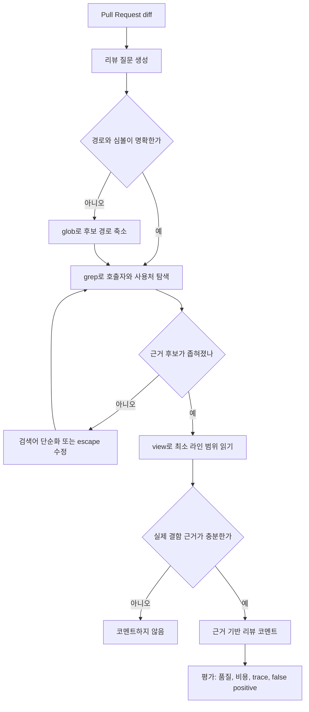

> 한 줄 요약: AI 에이전트 코드 리뷰에서 성능을 가르는 것은 도구 목록이 아니라, 도구를 어떤 순서와 경계 안에서 쓰게 하느냐다. GitHub Copilot 사례는 에이전트 개선의 병목이 모델보다 하네스, 평가셋, 권한 설계에 있을 수 있다는 점을 보여준다.

## 왜 지금 이슈인가

AI 에이전트 코드 리뷰는 단순 자동 코멘트 기능이 아니다. Pull Request diff를 읽고, 주변 코드를 확인하고, 근거를 모은 뒤, 실제 결함일 가능성이 높은 지점을 골라내는 작은 운영 시스템에 가깝다.

GitHub가 Copilot code review에서 겪은 역설은 여기서 출발한다. 기존 전용 코드 탐색 도구를 Copilot CLI가 쓰는 공유 Unix 스타일 도구인 `grep`, `glob`, `view`로 바꿨더니, 처음에는 리뷰 비용이 올라가고 잡아내는 이슈 수가 줄었다. 더 잘 관리되는 공통 도구로 갈아탔는데 결과가 나빠진 셈이다.

이 이야기가 개발자 커뮤니티에서 말이 붙을 만한 이유는 단순하다. 많은 팀이 지금 같은 결정을 하고 있기 때문이다.

- 에이전트에게 GitHub, CI, 배포, 이슈 트래커 도구를 붙인다.
- 컨텍스트를 더 많이 주면 더 정확해질 것이라고 기대한다.
- 승인 프롬프트를 붙였으니 쓰기 권한도 괜찮다고 본다.
- 작은 eval 점수 상승을 근거로 프롬프트나 도구 변경을 배포한다.

그런데 에이전트 시스템에서 도구 추가는 기능 확장이면서 실패 경로 확장이기도 하다. 읽을 수 있는 것이 많아질수록 잘못 읽을 가능성도 커지고, 쓸 수 있는 것이 많아질수록 피해 범위도 넓어진다.

GitHub 사례의 핵심은 도구가 나빴다는 말이 아니다. 범용 코딩 어시스턴트의 도구 사용 습관을 코드 리뷰라는 좁은 작업에 그대로 가져온 것이 문제였다.

## 커뮤니티에서 갈리는 지점

### 왜 더 좋은 도구가 더 나쁜 리뷰를 만들 수 있을까?

사람은 `grep` 결과를 보고 필요 없는 파일을 금방 버린다. 에이전트는 다르다. 도구 출력이 한 번 컨텍스트에 들어오면 이후 추론에도 계속 영향을 준다.

코드 리뷰 에이전트가 저장소를 넓게 탐색하기 시작하면 다음 문제가 생긴다.

| 선택 | 기대 | 실제 리스크 |
| --- | --- | --- |
| 넓은 검색 | 놓치는 문맥 감소 | 관련 없는 코드가 추론을 오염 |
| 큰 파일 읽기 | 주변 맥락 확보 | 토큰 비용 증가, 초점 분산 |
| 반복 탐색 | 근거 보강 | 탐색 루프 발생 |
| 공통 도구 재사용 | 유지보수 비용 감소 | 작업별 사용법이 맞지 않으면 품질 하락 |

GitHub는 처음에 공유 도구를 넣었을 때 에이전트가 Pull Request를 검토하기보다 저장소를 둘러보는 행동을 보였다고 설명한다. broad search, guessed paths, broad reads가 이어졌고, 이는 리뷰어의 흐름과 달랐다.

리뷰어의 질문은 보통 이렇게 좁다.

- 이 diff가 기존 호출자에게 깨지는 동작을 만들었나?
- 이 설정 키가 다른 경로에서도 쓰이나?
- 이 helper의 의미가 바뀌었는데 테스트가 그 경계를 잡고 있나?
- 이 라인 근처에서만 확인하면 되는 근거는 무엇인가?

반대로 범용 코딩 에이전트는 변경을 만들기 전에 넓은 영역을 이해하려 한다. 그 습관은 구현 작업에는 도움이 될 수 있지만, 리뷰 작업에서는 비용과 잡음을 키운다.

### 평가셋이 작으면 개선과 잡음을 구분하지 못한다

여기서 반대편 질문도 필요하다. GitHub는 내부 벤치마크 trace를 보고 개선했다고 했지만, 많은 팀은 그 정도의 관측 장치를 갖고 있지 않다. 에이전트 변경을 pass rate 하나로만 판단하면 쉽게 속는다.

DEV Community의 eval 글은 작은 평가셋의 함정을 숫자로 설명한다. pass rate가 0.90에서 0.85로 떨어지는 회귀를 80% power, one-sided alpha 0.05 조건에서 잡으려면 약 253개 예제가 필요하다고 한다. 50개 예제는 power가 약 35%라서 그런 회귀를 세 번 중 두 번가량 놓칠 수 있다.

이 수치는 에이전트 코드 리뷰에도 바로 연결된다. 리뷰 에이전트의 변경은 보통 이런 작은 차이로 나타난다.

- 쓸모 있는 코멘트 1개 증가
- false positive 1개 감소
- 평균 tool call 비용 몇 퍼센트 감소
- 특정 언어 또는 프레임워크에서만 회귀

평가셋이 작으면 이런 차이는 개선이 아니라 샘플 흔들림일 수 있다. 특히 LLM 기반 시스템은 decoding, tool output, repository shape, prompt wording에 따라 결과가 흔들린다. 한 번의 run에서 좋아 보인 숫자를 배포 근거로 삼으면 실제 사용자 트래픽에서 회귀가 드러난다.

그래서 GitHub 사례에서 더 볼 대목은 20% 비용 절감 자체보다 trace를 본 방식이다. 점수만 본 것이 아니라 에이전트가 어떤 순서로 `grep`, `glob`, `view`를 호출했는지, 실패 후 어떻게 회복했는지, diff 근거에 머물렀는지를 봤다.

### 승인 프롬프트만으로는 안전하지 않다

도구가 읽기에서 쓰기로 넘어가면 논의는 더 까다로워진다. Vercel의 GitHub Tools for eve는 `maintainer`, `code-review`, `issue-triage`, `ci-ops` 같은 preset으로 GitHub 에이전트 도구 범위를 나누고, `mergePullRequest` 같은 쓰기 도구에는 기본적으로 승인을 요구한다고 설명한다. 이 방향은 합리적이다. 도구 권한을 작업 단위로 나누지 않으면 에이전트는 쉽게 과한 능력을 갖는다.

다만 승인 프롬프트는 안전장치의 끝이 아니다. Anthropic은 Claude를 여러 제품에 넣으면서 human-in-the-loop 방식의 한계를 짚었다. Claude Code의 permission prompt에서 사용자가 약 93%를 승인했다는 telemetry를 공개했고, 프롬프트가 많아질수록 각 승인에 덜 주의를 기울인다고 설명한다.

이 숫자는 에이전트 코드 리뷰에도 불편한 질문을 던진다. 리뷰 코멘트 작성은 읽기 작업이라 비교적 안전해 보인다. 하지만 자동 label, issue 생성, CI 재실행, PR merge, dependency update까지 연결하면 blast radius가 커진다.

사람에게 매번 물어보면 안전할 것이라는 가정은 약하다. 더 나은 질문은 이것이다.

- 에이전트가 실수했을 때 피해가 어디까지 번지는가?
- 읽기, 코멘트, 수정, 병합 권한이 같은 실행 환경에 묶여 있는가?
- 승인 없이 가능한 행동과 승인이 필요한 행동이 명확히 갈라져 있는가?
- 승인하는 사람이 실제 근거를 확인할 수 있게 UI가 설계됐는가?

## 아키텍처 관점에서 볼 점

### AI 코드 리뷰 에이전트는 도구 목록이 아니라 작업 흐름이다

GitHub가 개선한 방향은 도구 교체라기보다 리뷰 흐름 재설계에 가깝다. 바뀐 리듬은 간단하다.

1. diff에서 구체적인 리뷰 질문을 만든다.
2. `grep`, `glob`로 후보를 좁힌다.
3. 필요한 파일과 라인 범위만 `view`로 읽는다.
4. 근거가 충분하면 판단하고, 부족하면 한 번 더 좁힌다.
5. 실패한 검색은 단순화해서 재시도하고, 잘못된 경로는 추측하지 않고 `glob`로 되돌아간다.

이 흐름은 에이전트에게 저장소를 이해하라고 시키는 것이 아니라, diff 기반 가설을 검증하라고 시키는 방식이다.

이 다이어그램에서 핵심은 `view`가 늦게 나온다는 점이다. 파일을 읽는 행위는 싸 보이지만 에이전트에게는 비싸다. 읽은 내용이 컨텍스트에 남고, 다음 판단의 배경이 된다.

현업에서 비슷한 흐름을 만들다 보면 성능 병목은 모델 호출 횟수보다 컨텍스트 오염에서 먼저 튀어나온다. 관련 없는 파일을 많이 읽은 에이전트는 더 똑똑해지는 것이 아니라 더 자신 있게 빗나갈 때가 있다.

### 구조 규칙은 프롬프트보다 오래 간다

Vercel의 `konsistent`도 같은 문제를 다른 층위에서 다룬다. TypeScript 코드베이스에서 폴더 구조, export, 파일 쌍, class 구현 규칙처럼 TypeScript나 ESLint가 잘 모델링하지 않는 구조 규칙을 CLI linter로 강제한다.

이런 도구가 에이전트 시대에 의미가 있는 이유는 프롬프트가 아니라 환경을 바꾸기 때문이다. 에이전트에게 “이 프로젝트에서는 harness 파일이 이런 export를 가져야 한다”고 매번 설명하는 것보다, 구조 규칙을 검사하는 deterministic gate를 두는 편이 낫다.

코드 리뷰 에이전트도 마찬가지다. 프롬프트만으로 모든 실수를 막으려 하면 한계가 빠르게 온다.

- 프롬프트: 어떻게 탐색해야 하는지 알려준다.
- 하네스(Harness): 어떤 도구를 어떤 입력으로 부를 수 있는지 제한한다.
- 린터와 테스트: 구조적 위반을 결정적으로 잡는다.
- eval trace: 에이전트가 실제로 어떤 행동을 했는지 보여준다.
- 권한 경계: 실수했을 때 피해 범위를 줄인다.

이 조합이 없으면 에이전트 개선은 대화 문구 튜닝으로 축소된다. 반대로 이 조합이 있으면 모델을 바꾸거나 도구를 공유해도 회귀를 추적할 수 있다.

### 에이전트 도구 설계에서 분리해야 할 네 가지

| 층위 | 설계 질문 | 실패하면 생기는 일 |
| --- | --- | --- |
| 작업 의도 | 구현, 리뷰, triage 중 무엇인가 | 범용 탐색이 좁은 업무를 침범 |
| 도구 의미 | `grep`, `glob`, `view`를 언제 쓰나 | 읽기 과다, 검색 루프 |
| 평가 방식 | 점수와 trace를 같이 보나 | 작은 eval에서 착시 발생 |
| 권한 경계 | 읽기와 쓰기가 분리됐나 | 승인 피로, blast radius 확대 |

에이전트 플랫폼을 만들 때 흔한 실수는 이 네 층을 한 프롬프트 안에 몰아넣는 것이다. 그러면 변경 원인을 알기 어렵다. 모델이 나빠진 것인지, 도구 설명이 맞지 않는지, eval set이 흔들린 것인지, 권한 설계가 과한 것인지 분리되지 않는다.

## 실무에서 볼 점

### AI 코드 리뷰 도입 전에 무엇을 확인해야 할까?

AI 코드 리뷰를 붙이기 전에 먼저 정해야 할 것은 모델이 아니다. 어떤 리뷰 질문을 자동화할지다.

좋은 초기 범위는 좁고 검증 가능한 질문이다.

- 변경된 함수의 호출자가 깨지는가?
- 권한 체크가 빠진 경로가 있는가?
- 설정 이름 변경이 다른 파일에 반영됐는가?
- 테스트 fixture와 production schema가 어긋났는가?
- deprecated API 사용이 새 코드에 들어왔는가?

반대로 다음 범위는 초기에 위험하다.

- 전체 설계 품질 평가
- 성능 병목 일반 진단
- 보안 취약점 전수 탐지
- 대형 리팩터링의 의미 검증
- 팀 컨벤션을 암묵적으로 추론하는 리뷰

에이전트는 좁은 질문을 받을수록 근거 중심으로 움직인다. 넓은 질문을 받으면 저장소를 탐색하고, 탐색한 만큼 비용과 잡음이 늘어난다.

### 평가셋은 몇 개면 충분할까?

정답은 없다. 다만 30개, 40개, 50개 예제로 pass rate만 보는 방식은 회귀 탐지에 약하다. DEV Community 글의 숫자처럼 0.90에서 0.85로 떨어지는 차이를 제대로 보려면 253개 수준의 예제가 필요할 수 있다.

실무에서는 처음부터 완벽한 평가셋을 만들기보다 다음 형태가 현실적이다.

- 대표 PR 유형별로 예제를 나눈다.
- 언어, 프레임워크, 변경 크기, 보안 민감도를 태깅한다.
- pass rate 하나 대신 confidence interval을 함께 본다.
- 코멘트 품질을 vague score보다 binary criterion으로 쪼갠다.
- 비용, tool call 수, 읽은 토큰, false positive를 같이 기록한다.
- 실패한 run의 trace를 샘플링해 사람이 읽는다.

특히 코드 리뷰 에이전트에서는 좋은 코멘트를 많이 쓰는 것보다 나쁜 코멘트를 줄이는 편이 더 체감된다. 개발자는 틀린 리뷰를 몇 번 받으면 이후 맞는 리뷰도 덜 믿는다.

### 권한은 preset보다 조직의 실패 시나리오에 맞춰야 한다

Vercel GitHub Tools의 preset 방식은 좋은 출발점이다. `repo-explorer`, `code-review`, `ci-ops`, `maintainer`처럼 역할별 도구 묶음을 나누면 에이전트의 능력을 설명하기 쉬워진다.

하지만 preset 이름만 보고 안전하다고 판단하면 안 된다. 같은 `maintainer`라도 조직마다 위험이 다르다.

- 오픈소스 저장소인가, 내부 서비스 저장소인가?
- PR merge가 배포로 바로 이어지는가?
- CI 재실행이 비용이나 quota를 크게 쓰는가?
- label 변경이 자동 배포나 릴리즈 노트에 연결되는가?
- dependency update가 보안 정책과 충돌할 수 있는가?

Anthropic의 containment 관점으로 보면, 에이전트 배포 리스크는 실패 확률과 피해 규모의 곱이다. 모델이 좋아져 실패 확률이 낮아져도, 에이전트에게 더 많은 권한을 주면 피해 규모는 커질 수 있다.

그래서 권한 설계는 승인 프롬프트 추가보다 먼저 와야 한다.

- 읽기 전용 리뷰 에이전트부터 시작한다.
- 코멘트 작성은 별도 rate limit과 품질 gate를 둔다.
- PR 수정, CI 재실행, merge는 별도 tool group으로 분리한다.
- 승인 화면에는 에이전트의 근거 파일과 라인 범위를 같이 보여준다.
- 반복 승인 작업은 자동화하지 말고 정책으로 제한한다.
- 에이전트가 낸 변경은 사람이 낸 변경과 audit log에서 구분한다.

승인은 마지막 확인 장치이지, 주된 보안 모델이 아니다.

### 도구 공유는 비용 절감이지만, 작업별 instruction은 분리해야 한다

GitHub가 공유 CLI 도구로 옮긴 이유는 타당하다. 도구 구현을 제품마다 따로 갖고 있으면 유지보수 비용이 커지고, 한 제품의 개선이 다른 제품에 퍼지기 어렵다.

문제는 도구 공유와 instruction 공유를 같은 결정으로 보면 생긴다.

`grep`, `glob`, `view`라는 도구는 같아도 작업은 다르다.

| 작업 | 적합한 탐색 습관 |
| --- | --- |
| 코드 리뷰 | diff에서 시작해 최소 근거만 읽기 |
| 기능 구현 | 관련 영역을 넓게 파악한 뒤 수정 |
| 버그 수정 | 재현 경로와 호출 체인을 좁히기 |
| repo Q&A | 구조 이해를 위해 넓게 탐색 |
| 보안 점검 | source/sink와 권한 경계를 따라가기 |

공유해야 할 것은 도구 구현과 telemetry schema다. 분리해야 할 것은 작업별 system prompt, tool instruction, eval set, 권한 preset이다.

이 구분이 없으면 하나의 에이전트 하네스가 모든 제품에 잘 맞을 것처럼 보인다. 실제로는 한 제품에서 좋아진 도구 설명이 다른 제품의 행동을 망칠 수 있다.

## 정리

AI 에이전트 코드 리뷰의 반직관은 이렇다. 도구가 좋아질수록 에이전트가 더 나아지는 것이 아니라, 잘못된 작업 습관을 더 빠르고 더 넓게 실행할 수도 있다.

GitHub Copilot code review 사례는 공유 도구 도입의 실패담이 아니다. 에이전트 시스템을 제품처럼 운영해야 한다는 신호에 가깝다. diff에서 질문을 만들고, 검색으로 좁히고, 최소 라인만 읽고, trace로 행동을 검증해야 한다. 작은 eval 점수 상승에 취하지 말고, 권한은 승인 프롬프트보다 blast radius 기준으로 나눠야 한다.

당장 확인할 것은 하나다. 지금 쓰는 코드 리뷰 에이전트나 PR 자동화 봇의 최근 실행 trace를 열어, 첫 파일 읽기가 diff 기반 근거였는지 아니면 저장소 탐색의 시작이었는지 보자. 그 차이가 비용, 품질, 신뢰의 출발점이다.

## 참고 자료

- [선정 글감] [Better tools made Copilot code review worse. Here’s how we actually improved it.](https://github.blog/ai-and-ml/github-copilot/better-tools-made-copilot-code-review-worse-heres-how-we-actually-improved-it/) — GitHub Blog Engineering
- [관련] [The regression your eval set is too small to catch](https://dev.to/maya_andersson_dev/the-regression-your-eval-set-is-too-small-to-catch-2nlg) — DEV Community
- [관련] [How we contain Claude across products](https://www.anthropic.com/engineering/how-we-contain-claude) — Anthropic Engineering
- [관련] [Give your eve agent GitHub tools](https://vercel.com/changelog/github-tools-eve) — Vercel Blog
- [관련] [Enforce consistent code for agents and humans with konsistent](https://vercel.com/changelog/enforce-consistent-code-for-agents-and-humans-with-konsistent) — Vercel Blog