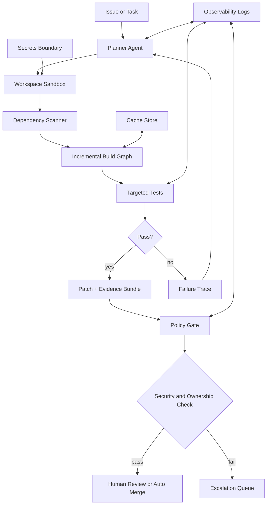

> 한 줄 요약: AI 에이전트와 클라우드 코딩 하네스가 빨라질수록 병목은 모델 성능보다 개발 환경의 증분성, 격리, 검증 비용으로 옮겨간다. 에이전트를 잘 쓰려면 더 큰 모델을 찾기 전에 작고 재현 가능한 작업 단위를 먼저 설계해야 한다.

## 왜 지금 이슈인가

AI 에이전트, 테스트 자동화, 개발 하네스를 둘러싼 논쟁은 결국 같은 질문으로 이어진다. “사람이 코드를 고칠 때 쓰던 개발 환경을 여러 에이전트가 병렬로 만지는 환경으로 그대로 확장할 수 있는가?”

겉으로는 코딩 에이전트의 성능 경쟁처럼 보인다. 하지만 현업에서 자주 막히는 지점은 더 구체적이다.

- 에이전트가 어떤 파일을 읽고 고쳤는지 추적할 수 있는가
- 변경된 코드만 빠르게 테스트할 수 있는가
- 실패한 작업을 재현 가능한 로그와 상태로 되돌릴 수 있는가
- 여러 에이전트가 만든 패치를 안전하게 합칠 수 있는가
- 토큰 비용보다 더 비싼 CI, 리뷰, 보안 검증 비용을 통제할 수 있는가

1997년 버클리 기술 보고서인 Practical Algorithms for Incremental Software Development Environments는 지금 읽어도 낡게 느껴지지 않는다. 핵심은 개발 환경을 단순한 편집기나 빌드 도구가 아니라 변경 전파(Change Propagation), 의존성 그래프(Dependency Graph), 캐시 무효화(Cache Invalidation)를 다루는 증분 시스템으로 본다는 점이다.

이 관점은 클라우드 에이전트에도 그대로 이어진다. 에이전트가 많아질수록 전체 저장소를 매번 읽고, 전체 테스트를 매번 돌리고, 전체 리뷰를 매번 사람에게 넘기는 방식은 금방 한계에 닿는다.

## 커뮤니티에서 갈리는 지점

AI 코딩 도구 논쟁은 보통 두 갈래로 갈린다.

한쪽은 에이전트가 더 많은 개발 작업을 맡을 수 있다고 본다. The Pragmatic Engineer가 OpenAI, Anthropic, Cursor 방문기에서 전한 분위기도 이쪽에 가깝다. 클라우드에서 실행되는 에이전트가 주류 흐름이 되고, 비개발자까지 코딩 하네스를 쓰는 장면이 늘고 있다는 관찰이다.

다른 쪽은 생산성 향상보다 운영 리스크를 먼저 본다. 에이전트가 패치를 만들 수 있다는 사실과 그 패치를 조직의 배포 파이프라인에 넣을 수 있다는 사실은 다르다. 전자는 모델 능력의 문제이고, 후자는 시스템 설계의 문제다.

이 차이를 흐리면 도입 판단도 흔들린다.

| 쟁점 | 기대 | 우려 |
|---|---|---|
| 클라우드 에이전트 | 병렬 작업, 긴 작업 위임, 비개발자 자동화 | 권한 관리, 작업 격리, 비용 폭증 |
| 코딩 하네스 | 재현 가능한 실행 환경, 테스트 자동화 | 하네스 자체의 유지보수 비용 |
| 증분 빌드/테스트 | 빠른 피드백, 작은 변경 검증 | 의존성 그래프가 틀릴 때 생기는 거짓 안정감 |
| 자동 리뷰 | 반복 검토 절감 | 보안·도메인 맥락 누락 |
| 에이전트 병렬화 | 처리량 증가 | 충돌, 중복 수정, 리뷰 큐 과부하 |

여기서 반대로 봐야 할 지점이 있다. 에이전트 도입의 성패는 얼마나 자율적인가보다, 얼마나 제한된 환경에서 반복 가능하게 실패하는가에 더 크게 좌우된다.

사람 개발자는 빌드가 깨졌을 때 주변 맥락을 읽고 우회한다. 에이전트는 그 우회 방법까지 하네스 안에 정의되어 있어야 한다. 테스트 명령, 린트 범위, 샌드박스 권한, 비밀값 접근 정책, 실패 로그 수집 방식이 불명확하면 에이전트는 그 빈틈을 토큰과 CI 시간으로 메운다.

1997년 증분 개발 환경 논의가 다시 유효해지는 이유가 여기에 있다. 인터페이스는 바뀌었지만 핵심 문제는 같다. 변경이 발생했을 때 무엇을 다시 계산해야 하고, 무엇은 재사용해도 되는가.

## 아키텍처 관점에서 볼 점

AI 에이전트 하네스를 단순히 “LLM이 들어간 CI”로 보면 설계가 얕아진다. 더 적절한 모델은 증분 개발 환경 위에 에이전트 실행 계층을 얹는 것이다.

이 구조에서 핵심 컴포넌트는 모델이 아니다. 현실적인 병목은 오히려 아래 네 가지에 가깝다.

### 변경 범위를 어떻게 계산할까?

증분 환경의 출발점은 변경 영향 분석(Change Impact Analysis)이다. 파일 하나가 바뀌었을 때 어떤 테스트를 다시 돌릴지, 어떤 문서를 갱신해야 하는지, 어떤 서비스 계약을 검증해야 하는지를 계산해야 한다.

단순한 파일 경로 매핑만으로는 부족하다. 예를 들어 TypeScript 모노레포에서 공통 타입 하나가 바뀌면 프론트엔드 빌드, API 스키마, SDK 생성, 일부 E2E 테스트까지 연쇄될 수 있다. 반대로 README 오타 수정에 전체 테스트를 태우는 것은 낭비다.

실무에서는 보통 세 층으로 나눠 본다.

- 정적 의존성: import, package graph, build target
- 동적 의존성: 테스트 실행 중 실제로 접근한 파일, DB fixture, API mock
- 조직 의존성: 코드 오너, 보안 리뷰, 배포 승인 정책

에이전트는 이 셋을 모두 알아야 한다. 하나라도 빠지면 너무 많이 검증하거나, 더 위험하게는 너무 적게 검증한다.

### 캐시는 언제 믿을 수 있을까?

증분 빌드와 테스트 자동화의 장점은 캐시다. 하지만 캐시는 결국 신뢰의 문제다.

캐시 키가 소스 파일 해시만 보면 환경 변수, 시스템 패키지, 생성 코드, 테스트 데이터 변경을 놓칠 수 있다. 에이전트가 만든 패치가 우연히 캐시를 타고 통과하면 사람 리뷰어는 “CI가 초록색”이라는 신호에 과도하게 기대게 된다.

그래서 에이전트 하네스의 캐시는 성능 기능이면서 보안 기능이다. 캐시 키에는 최소한 다음 요소가 포함되어야 한다.

- 소스 입력 해시
- 락파일과 도구 버전
- 테스트 데이터 버전
- 생성 코드 입력
- 컨테이너 이미지 digest
- 정책 파일과 권한 설정

이 기준을 맞추지 못한다면 캐시를 끄는 편이 낫다. 느린 검증은 비용 문제지만, 잘못된 검증은 배포 사고로 이어진다.

### 에이전트는 어디까지 권한을 가져야 할까?

클라우드 에이전트가 강력해질수록 보안 경계가 흐려진다. 에이전트가 저장소를 읽고, 테스트를 실행하고, 패키지를 설치하고, 외부 문서를 가져오고, PR을 만들 수 있다면 이미 작은 개발자 계정에 가깝다.

권한 모델은 사람 계정 복제가 아니라 작업 단위 위임이어야 한다.

- 읽기 가능한 저장소 범위 제한
- 쓰기 가능한 파일 경로 제한
- 네트워크 접근 기본 차단
- 비밀값 직접 접근 금지
- 패키지 설치 allowlist
- 생성된 패치의 provenance 기록
- 위험 파일 변경 시 자동 승격 리뷰

특히 Kubernetes 매니페스트, Terraform, GitHub Actions, 배포 스크립트, 인증·인가 코드처럼 운영 권한과 연결된 파일은 일반 애플리케이션 코드와 다르게 다뤄야 한다. 에이전트가 YAML 한 줄을 바꿨을 뿐이어도 실제로는 클러스터 권한이나 배포 경로를 바꾸는 일일 수 있다.

### 관측성은 선택 기능이 아니다

에이전트 하네스에는 관측성(Observability)이 필요하다. 단순히 토큰 사용량을 보는 수준으로는 부족하다.

필요한 로그는 이런 것이다.

- 어떤 입력으로 작업을 시작했는가
- 어떤 파일을 읽었는가
- 어떤 명령을 실행했는가
- 어떤 테스트가 선택되었고 왜 제외되었는가
- 실패 후 어떤 재시도가 있었는가
- 최종 패치가 어떤 근거로 제출되었는가

이 정보가 없으면 에이전트가 만든 결과를 디버깅할 수 없다. 비용 최적화도 어렵다. The Pragmatic Engineer 글에서 언급된 spend-per-token 최적화 흐름도 같은 맥락으로 볼 수 있다. 토큰 비용만 줄일 것이 아니라, 불필요한 재시도와 과도한 전체 테스트 실행을 줄이는 쪽으로 플랫폼을 설계해야 한다.

## 실무에서 볼 점

에이전트 도입을 검토할 때 가장 흔한 실수는 도구부터 고르는 것이다. 먼저 봐야 할 것은 저장소와 파이프라인이 증분 실행을 견딜 수 있는지다.

### 도입 전에 확인할 조건

아래 질문에 답하기 어렵다면, 에이전트를 붙여도 기대한 만큼 좋아지지 않는다.

- 변경된 파일에서 관련 테스트를 찾는 규칙이 있는가
- 로컬과 CI의 실행 결과가 충분히 일치하는가
- 테스트 데이터와 외부 의존성이 버전 관리되는가
- 실패 로그만 보고 원인을 좁힐 수 있는가
- 코드 오너와 보안 리뷰 조건이 기계적으로 표현되어 있는가
- 긴 작업을 작은 패치 단위로 쪼갤 수 있는가
- 에이전트가 건드리면 안 되는 파일 범위가 정의되어 있는가

여기서 하나라도 빈칸이면 에이전트는 그 빈칸을 메우지 않는다. 빈칸을 더 빠르게 드러낼 뿐이다.

### AI 에이전트 vs 기존 CI 차이점

기존 CI는 보통 주어진 변경을 검증한다. 에이전트 하네스는 변경을 만들고, 검증하고, 실패를 해석하고, 다시 변경한다. 이 루프 때문에 설계 난도가 올라간다.

| 항목 | 기존 CI | AI 에이전트 하네스 |
|---|---|---|
| 입력 | 사람이 만든 패치 | 태스크, 코드베이스, 정책 |
| 실행 방식 | 정해진 파이프라인 | 계획-수정-검증 반복 |
| 실패 처리 | 로그 제공 | 원인 추정 후 재시도 |
| 위험 | 검증 누락 | 검증 누락 + 잘못된 수정 |
| 최적화 대상 | 빌드 시간 | 빌드 시간, 토큰, 재시도, 리뷰 부하 |
| 필요한 통제 | 테스트 신뢰도 | 테스트 신뢰도, 권한, provenance |

이 차이 때문에 기존 CI가 안정적이지 않은 조직일수록 에이전트 도입 효과가 낮다. 반대로 타깃 테스트, hermetic build, 코드 오너 정책, preview 환경이 잘 잡힌 팀은 비교적 작은 범위부터 효과를 볼 가능성이 크다.

### 실패하기 쉬운 지점

첫 번째는 전체 자동화 욕심이다. 처음부터 에이전트에게 기능 개발 전체를 맡기면 실패 원인을 분리하기 어렵다. 작은 리팩터링, 테스트 보강, 문서와 코드 동기화, 정적 분석 경고 수정처럼 성공 기준이 선명한 작업부터 시작하는 편이 낫다.

두 번째는 테스트 신뢰도 과신이다. 테스트가 부족한 코드베이스에서 에이전트는 그럴듯한 패치를 더 빨리 만든다. 이때 리뷰어는 변경량과 자연스러운 설명에 속기 쉽다. 에이전트가 생성한 설명은 증거가 아니라 주장이다. 증거는 실행 로그, 테스트 선택 근거, diff 범위, 정책 통과 기록이다.

세 번째는 비용을 토큰만으로 보는 것이다. 실제 비용은 더 넓다.

- 에이전트 실행 시간
- CI minute
- 캐시 저장소
- 리뷰어 대기열
- 실패 재시도
- 보안 검토
- 잘못된 자동 수정의 롤백 비용

토큰 단가가 내려가도 이 비용이 같이 줄어드는 것은 아니다. 그래서 플랫폼 팀의 역할은 모델 호출을 싸게 만드는 데서 끝나지 않는다. 작업을 작게 만들고, 검증을 좁히고, 실패를 재현 가능하게 만드는 쪽이 더 큰 절감으로 이어질 수 있다.

### 대안과 트레이드오프

에이전트 하네스가 항상 답은 아니다. 작업 성격에 따라 다른 선택지가 더 낫다.

| 상황 | 더 나은 선택 |
|---|---|
| 반복적인 포맷·마이그레이션 | codemod, AST 기반 변환 |
| 규칙이 명확한 보안 검사 | SAST, policy-as-code |
| 테스트 선택 최적화 | 빌드 시스템의 dependency graph |
| 운영 변경 검증 | GitOps, admission controller, policy engine |
| 불명확한 제품 판단 | 사람 중심 리뷰와 설계 문서 |

에이전트는 이 도구들을 대체하기보다 함께 써야 한다. 예를 들어 Kubernetes 설정 변경을 에이전트가 제안하더라도, 최종 검증은 OPA/Gatekeeper, Kyverno, admission policy, dry-run 배포 같은 기존 통제 장치가 맡는 편이 자연스럽다.

반대로 에이전트가 잘하는 영역도 있다. 흩어진 실패 로그를 읽고 후보 원인을 좁히거나, 테스트가 없는 코드 주변에 안전망을 추가하거나, 오래된 문서와 실제 코드의 차이를 찾아내는 작업은 하네스가 잘 설계되어 있으면 꽤 실용적이다.

## 정리

AI 에이전트의 다음 병목은 추론 능력 하나로 설명되지 않는다. 병목은 개발 환경이 변경을 얼마나 작게 이해하고, 얼마나 정확하게 다시 계산하고, 얼마나 안전하게 실패를 기록하느냐로 옮겨간다.

1997년의 증분 개발 환경 논의와 2026년의 클라우드 코딩 에이전트 흐름은 같은 질문을 공유한다. 무엇이 바뀌었는지보다, 다시 계산하지 않아도 되는 것이 무엇인지 알아내는 시스템이 필요하다.

당장 확인할 것은 하나다. 지금 저장소에서 파일 하나를 바꿨을 때, 어떤 테스트와 리뷰와 보안 검사가 필요한지 기계적으로 설명할 수 있는가. 그 답이 흐리다면 에이전트 도입보다 먼저 의존성 그래프와 검증 경계를 정리해야 한다.

## 참고 자료

- [선정 글감] Practical Algorithms for Incremental Software Development Environments — Lobsters  
  https://www2.eecs.berkeley.edu/Pubs/TechRpts/1997/Archive/CSD-97-946.pdf
- [관련] Impressions from visiting OpenAI, Anthropic, & Cursor — The Pragmatic Engineer  
  https://newsletter.pragmaticengineer.com/p/impressions-from-visiting-openai