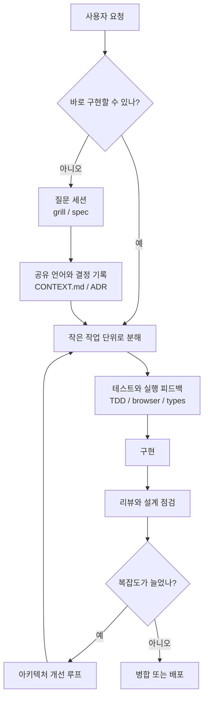

> 한 줄 요약: AI 코딩 에이전트 스킬 저장소가 GitHub Trending에 오른 이유는 새 도구가 나와서가 아니라, 개발자들이 에이전트에게 어디까지 맡기고 어디서 멈춰 세울지 따지기 시작했기 때문이다.

## 무슨 일이 있었나

GitHub Trending 스냅샷에서 `mattpocock/skills`, `addyosmani/agent-skills`, `obra/superpowers`가 함께 화제가 됐다. 세 저장소는 모두 Claude Code, Codex, Cursor, GitHub Copilot CLI 같은 코딩 에이전트에 반복 가능한 작업 절차를 넣는 방법을 다룬다.

이번 스냅샷 기준으로 `mattpocock/skills`는 Shell 기반 저장소다. “vibe coding이 아니라 실제 엔지니어링을 위한 skills”를 내세운다. 빠른 설치 명령은 `npx skills@latest add mattpocock/skills`이고, 사용자가 원하는 스킬과 대상 코딩 에이전트를 고른 뒤 `/setup-matt-pocock-skills`로 이슈 트래커, 라벨, 문서 저장 위치를 설정하는 흐름이다.

확인되는 내용은 이렇다.

- 당사자: Matt Pocock, Addy Osmani, Jesse Vincent 쪽 공개 저장소와 이를 설치해 쓰는 개발자 커뮤니티
- 범위: 모델 자체가 아니라 에이전트가 따를 워크플로, 명령어, 문서화 규칙, 테스트 루프
- 성격: 폐쇄형 제품 발표가 아니라 공개 저장소 기반의 개발 방법론 실험

조심해서 봐야 할 부분도 있다. 별 수와 하루 증가량이 크다고 해서 실제 프로덕션 도입이 그만큼 넓다는 뜻은 아니다. GitHub Trending은 호기심, 북마크, 논쟁, 실험 수요가 섞여 움직인다. 다만 같은 시점에 비슷한 저장소들이 같이 올라왔다는 점은 개발자들이 코딩 에이전트의 사용법 자체를 다시 정리하고 있음을 보여준다.

`mattpocock/skills`의 문제의식은 분명하다. 에이전트가 원하는 대로 일하지 않고, 답을 장황하게 늘어놓고, 실행 피드백 없이 코드를 만들고, 코드베이스를 빠르게 복잡하게 만든다는 것이다. 그래서 `/grill-me`, `/grill-with-docs`, `/tdd`, `/diagnosing-bugs`, `/improve-codebase-architecture` 같은 스킬로 질문, 도메인 언어, 테스트, 디버깅, 설계 점검을 작게 나눠 넣는다.

`addyosmani/agent-skills`는 제품 개발 생명주기에 더 가깝다. `/spec`, `/plan`, `/build`, `/test`, `/review`, `/ship`으로 이어지는 흐름을 제시하고, 각 단계마다 원칙을 붙인다. `obra/superpowers`는 한 발 더 나아가 “에이전트가 바로 코드로 뛰어들지 않고, 먼저 무엇을 만들지 묻고, 설계에 합의하고, 구현 계획을 세운 뒤 자율적으로 진행한다”는 개발 방식을 강조한다.

세 저장소의 공통점은 에이전트를 더 똑똑하게 만드는 데 있지 않다. 에이전트가 실수하기 쉬운 지점 앞에 절차와 마찰을 둔다.

## 왜 사람들이 반응했나

반응의 중심에는 편리함보다 불안이 있다. 개발자들은 이미 코딩 에이전트가 빠르다는 것을 안다. 문제는 빠른데 틀릴 때다.

첫 번째 불편은 통제권이다. GSD, BMAD, Spec-Kit 같은 방식이 전체 프로세스를 크게 잡아주는 동안 사용자는 편해질 수 있다. 하지만 그 프로세스 안에서 버그가 나면 어디를 고쳐야 할지 흐려진다. `mattpocock/skills`가 “작고, 바꾸기 쉽고, 조합 가능하다”고 말하는 이유가 여기 있다. 커뮤니티가 반응한 것도 거창한 프레임워크보다 손에 잡히는 절차를 원했기 때문이다.

두 번째는 신뢰 문제다. 에이전트가 코드를 그럴듯하게 만들수록 리뷰 비용이 사라지는 것은 아니다. 비용의 모양이 바뀐다. 사람이 직접 코드를 쓰던 시기에는 구현 속도가 병목이었다. 에이전트가 들어오면 병목은 “이 변경이 우리가 원한 변경인가”로 옮겨간다.

이 차이는 작지 않다.

| 쟁점 | 에이전트 도입 전 | 에이전트 도입 후 |
|---|---|---|
| 병목 | 구현 속도 | 의도 정렬과 검증 |
| 실패 형태 | 늦게 완성됨 | 빨리 잘못 완성됨 |
| 리뷰 초점 | 코드 스타일과 결함 | 요구사항 해석, 테스트 근거, 설계 부채 |
| 필요한 장치 | 티켓, PR, CI | 질문 루프, 도메인 문서, 스킬, 자동 검증 |

세 번째는 비용이다. 여기서 비용은 API 요금만 뜻하지 않는다. 에이전트가 프로젝트 용어를 모르고 매번 길게 설명하면 토큰도 쓰고 사람의 집중력도 쓴다. `mattpocock/skills`가 공유 언어와 `CONTEXT.md`, ADR(Architecture Decision Record)을 강조하는 대목은 단순 문서화가 아니다. 에이전트와 사람이 같은 단어로 같은 구조를 가리키게 만드는 비용 절감 장치다.

네 번째는 사용성이다. 개발자는 완전 자동화를 원한다고 말하지만, 실제로는 멈춰야 할 지점이 분명한 자동화를 원한다. `addyosmani/agent-skills`의 `/build auto` 설명이 흥미로운 이유도 여기에 있다. 한 번 계획을 승인하면 여러 작업을 진행하되, 실패나 위험한 단계에서는 멈춘다는 식이다. 완전 자율보다 승인 지점이 설계된 자율에 가깝다.

다섯 번째는 플랫폼 리스크다. 이런 스킬 저장소는 여러 에이전트에 설치될 수 있다. Claude Code, Codex, Cursor, Copilot CLI, Cline 같은 도구가 언급된다. 장점은 이식성이다. 부담스러운 점은 조직마다 다른 보안 정책, 저장소 권한, 이슈 트래커 접근권, 로컬 파일 접근 범위가 한 번에 얽힌다는 것이다.

현업에서 비슷한 고민을 하다 보면 “스킬을 설치했다”는 사실보다 “그 스킬이 무엇을 읽고, 무엇을 쓰고, 언제 명령을 실행할 수 있는가”가 더 큰 질문이 된다. 특히 `/implement`, `/ship`, `/triage`처럼 이슈 트래커와 코드 변경, 배포 흐름 근처에 붙는 명령은 편의 기능이면서 운영 권한의 입구가 된다.

## 내가 보는 핵심

이번 이슈의 핵심은 코딩 에이전트가 개발자를 대체하느냐가 아니다. 개발 절차가 프롬프트와 저장소 파일로 내려오기 시작했다는 점이다.

예전에는 팀의 개발 방식이 회의, 위키, PR 문화, CI 설정, 배포 규칙에 흩어져 있었다. 이제 그 일부가 에이전트가 읽고 실행할 수 있는 스킬로 포장된다. 작은 변화처럼 보이지만 영향은 크다. 개발 문화가 문서에서 실행 가능한 절차로 이동하고 있기 때문이다.

여기서 좋은 스킬과 위험한 스킬이 갈린다.

좋은 스킬은 에이전트의 자유도를 줄이는 대신 결과의 예측 가능성을 높인다. 질문을 먼저 하게 만들고, 테스트를 먼저 만들게 하고, 모르는 용어를 문서에 남기게 하고, 큰 작업을 작은 단위로 쪼개게 한다. 사람이 귀찮아서 건너뛰기 쉬운 기본기를 에이전트에게 강제하는 방식이다.

위험한 스킬은 반대로 책임 경계를 흐린다. “알아서 해줘”를 더 세련되게 포장하면서도, 실패했을 때 어느 결정이 잘못됐는지 추적하기 어렵게 만든다. 자동 커밋, 자동 이슈 변경, 자동 배포가 들어가는 순간부터는 생산성 기능이 아니라 운영 시스템으로 봐야 한다.

`obra/superpowers`가 말하는 자동 진행, `addyosmani/agent-skills`가 말하는 생명주기 명령, `mattpocock/skills`가 말하는 작은 조합 가능성은 서로 다른 방향처럼 보이지만 같은 질문을 공유한다.

에이전트에게 일을 맡긴다는 것은 무엇을 표준화한다는 뜻인가?

나는 이 질문에 대한 답이 모델 성능보다 오래 갈 가능성이 있다고 본다. 모델은 계속 바뀐다. 하지만 “요구사항을 묻고, 용어를 맞추고, 작은 단위로 만들고, 테스트로 확인하고, 설계를 다시 본다”는 흐름은 특정 모델에 묶이지 않는다. 그래서 이번 저장소들이 단순한 프롬프트 모음보다 더 큰 반응을 얻은 것이다.

물론 한계도 있다. 스킬은 팀의 판단을 대신하지 못한다. 나쁜 요구사항을 좋은 구현으로 바꾸지 못하고, 빈약한 테스트 문화를 자동으로 고쳐주지도 못한다. 도메인 언어를 문서화한다고 해서 조직 안의 이해관계가 사라지는 것도 아니다.

그래도 놓치면 안 되는 지점이 있다. 코딩 에이전트 시대의 생산성 경쟁은 누가 더 긴 프롬프트를 쓰느냐가 아니라, 누가 더 좋은 피드백 루프를 에이전트 주변에 배치하느냐로 옮겨가고 있다.

## 앞으로 볼 기준

다음에 코딩 에이전트 스킬이나 자동화 프레임워크가 화제가 된다면, 별 수보다 먼저 봐야 할 것은 다섯 가지다.

- 어떤 권한을 요구하는가: 파일 읽기, 파일 쓰기, 명령 실행, 이슈 트래커 수정, 배포 접근이 어디까지 열리는가
- 어느 지점에서 사람 승인을 요구하는가: 계획, 구현, 커밋, 배포, 삭제 작업 중 어디서 멈추는가
- 실패를 어떻게 다루는가: 테스트 실패, 타입 오류, 재현 불가 버그, 요구사항 모호성을 그냥 넘기지 않는가
- 팀의 언어를 남기는가: `CONTEXT.md`, ADR, 이슈, PR 설명처럼 다음 세션에 이어질 흔적이 생기는가
- 특정 모델에 갇히는가: Claude, Codex, Cursor 등 도구가 바뀌어도 절차를 재사용할 수 있는가

특히 보안과 운영 관점에서는 설치 명령만 보고 판단하면 안 된다. `npx skills@latest add ...` 같은 빠른 시작은 실험에는 편하지만, 조직 저장소에서는 공급망, 스크립트 실행, 버전 고정, 변경 이력 검토가 필요하다. 스킬이 단순 텍스트라면 리뷰하기 쉽지만, 설치기와 자동 실행 흐름이 섞이면 검토 범위가 넓어진다.

도입을 검토한다면 처음부터 전사 표준으로 밀어붙이기보다, 낮은 권한의 저장소에서 작은 흐름부터 보는 편이 낫다. 예를 들어 `/grill-me`나 `/spec`처럼 질문과 명세를 돕는 스킬은 비교적 위험이 낮다. 반면 `/implement`, `/ship`, 자동 커밋, 이슈 상태 변경은 권한과 감사 로그를 같이 봐야 한다.

개발자 커뮤니티가 이번에 반응한 이유는 새 장난감이 생겨서만은 아니다. 에이전트가 코드를 쓰는 속도는 이미 충분히 빠르다. 이제 남은 문제는 그 속도를 조직이 감당할 수 있는 형태로 바꾸는 일이다.

빠른 에이전트는 혼자 두면 복잡도도 빠르게 만든다. 좋은 스킬은 그 속도 앞에 질문, 테스트, 기록, 리뷰라는 마찰을 둔다. 앞으로의 차이는 에이전트를 얼마나 믿느냐보다, 믿기 전에 어떤 확인 장치를 통과하게 하느냐에서 갈릴 것이다.

## 참고 자료

- [선정 글감] [#6 mattpocock/skills](https://github.com/mattpocock/skills) - GitHub Trending
- [관련] [#4 addyosmani/agent-skills](https://github.com/addyosmani/agent-skills) - GitHub Trending
- [관련] [#7 obra/superpowers](https://github.com/obra/superpowers) - GitHub Trending