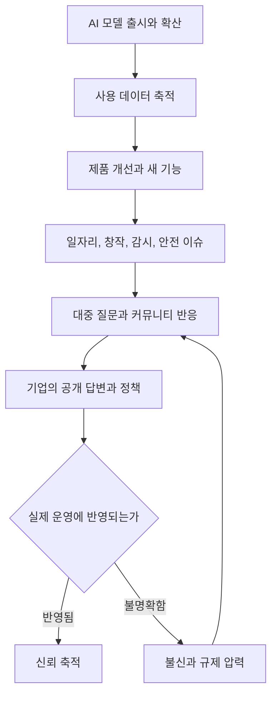

> 한 줄 요약: AI 규칙을 누가 정하느냐는 질문은 이제 철학 논쟁보다 제품, 데이터, 감시, 안전장치를 어떻게 운영하느냐에 가깝다. Anthropic의 공개 질문 캠페인은 의미가 있지만, 신뢰는 질문을 받는다는 선언이 아니라 그 답변이 실제 모델과 정책에 어떻게 반영되는지에서 갈린다.

## 무슨 일이 있었나

2026년 7월 9일 Anthropic은 Inviting hard questions라는 글을 공개하고, AI가 일자리, 가족, 사회, 과학, 안전에 미치는 영향에 대해 대중의 어려운 질문을 받겠다고 밝혔다.

핵심은 단순한 의견 수렴이 아니다. Anthropic은 자신들이 공익회사(Public Benefit Corporation)이며, 고도화된 AI 모델의 이익을 확보하고 위험을 줄이는 것이 회사 미션이라고 설명했다. 또 사람들이 던진 질문에 대해 어떤 구체적 조치를 취하는지 공개적으로 추적하고 보고하겠다고 했다.

확인된 사실은 다음과 같다.

| 항목 | 내용 |
|---|---|
| 발표일 | 2026년 7월 9일 |
| 당사자 | Anthropic |
| 범위 | AI의 일자리, 사회, 가족, 과학, 의학, 안전 관련 공개 질문 접수 |
| 기존 조사 | 미국인 52,000명 대상 Anthropic Public Record 1차 조사 |
| 사용자 조사 | 159개국, 70개 언어의 Claude 사용자 81,000명 대상 Anthropic Interviewer 조사 |
| 추가 장치 | Anthropic Institute, Long-Term Benefit Trust, 포커스 그룹, 익명화된 실제 사용 데이터 연구 |

아직 추정에 가까운 부분은 따로 봐야 한다. 이 캠페인이 실제 제품 정책, 모델 학습, 안전 필터, 기업 고객 계약, 데이터 거버넌스에 얼마나 영향을 줄지는 발표문만으로 알 수 없다. 공개 질문을 받는 것과 의사결정 권한을 나누는 것은 다른 문제다.

함께 봐야 할 맥락도 있다. Bruce Schneier는 2026년 6월 30일 AI 영상 감시의 현실을 다룬 글에서, AI가 대규모 영상에서 자연어 질문으로 행동을 찾게 만들고 있다고 짚었다. 예전 감시 도구가 제한된 사전 검색에 묶여 있었다면, 이제는 사람이 언어로 원하는 행동 패턴을 묻고 시스템이 영상 흐름에서 답을 찾는 쪽으로 이동한다는 것이다.

이 두 흐름은 따로 떨어져 있지 않다. 한쪽에서는 AI 기업이 사회적 질문을 공개적으로 받겠다고 말하고, 다른 한쪽에서는 AI가 감시와 권력 행사의 단위를 바꾸고 있다. 그래서 사람들은 묻는다. 질문을 받을 사람은 누구인가. 답을 채점할 사람은 누구인가. 시스템을 멈출 권한은 어디에 있는가.

## 왜 사람들이 반응했나

AI 공개 질문 캠페인이 반응을 얻는 이유는 사람들이 질문 창구 자체를 원해서만은 아니다. 이미 많은 사람이 AI를 쓰고 있고, 동시에 불편함을 느낀다. 이 모순이 커뮤니티의 반응을 만든다.

### AI 규칙은 누가 정해야 하나?

가장 큰 쟁점은 권한이다. 모델 회사는 안전 연구, 오용 방지, 공익 미션을 말할 수 있다. 하지만 실제 규칙은 제품의 기본값, API 제한, 데이터 보존 정책, 가격 정책, 이용약관, 계정 제재 기준 안에서 작동한다.

사용자 입장에서 질문은 더 실무적이다.

- 내가 입력한 데이터가 어떻게 쓰이는가
- 내 조직의 민감 정보가 모델 개선에 들어가는가
- 거절 응답과 안전 필터 기준은 누가 정하는가
- 특정 국가, 직군, 언어권 사용자의 우려가 동일하게 반영되는가
- 공개 보고가 마케팅 문구를 넘어 검증 가능한 지표를 담는가

Anthropic은 52,000명의 미국인과 81,000명의 Claude 사용자를 조사했다고 밝혔다. 이 숫자는 넓은 의견 수렴의 신호다. 동시에 편향 문제도 남는다. 미국인 조사와 Claude 사용자 조사는 각각 다른 집단이다. 이미 Claude를 쓰는 사람과 아직 AI 서비스를 신뢰하지 않는 사람의 질문은 다를 수 있다.

### AI 감시는 왜 더 민감한가?

Schneier가 짚은 AI 영상 감시 사례는 이 논쟁을 더 날카롭게 만든다. 감시 기술은 새롭지 않지만, 자연어 기반 영상 검색은 권한의 문턱을 낮춘다.

이전에는 감시 시스템에 특정 객체, 번호판, 얼굴, 위치 같은 제한된 검색 조건이 많았다. 이제는 행동을 묻는 방식이 가능해진다. 예를 들어 누군가 옷을 여러 번 갈아입었는지, 특정 장소를 반복해서 지났는지, 두 사람이 물건을 주고받았는지 같은 질문이 시스템의 검색어가 될 수 있다.

여기서 불편함은 정확도만의 문제가 아니다. 오탐이 있더라도 수사나 행정 조치의 시작점이 될 수 있고, 정상 행동이 의심 행동으로 재분류될 수 있다. 검색 가능한 행동의 범위가 넓어지면 감시 대상이 되는 기준도 넓어진다.

AI 기업이 공익과 안전을 말할 때 커뮤니티가 민감하게 반응하는 이유가 여기에 있다. 사람들은 AI의 좋은 사용 사례만 보지 않는다. 같은 기술이 채용 평가, 보험 심사, 치안, 교육 감시, 콘텐츠 단속, 기업 내부 모니터링에 들어갈 때 어떤 권력 관계를 만드는지도 본다.

### 공개 질문이 신뢰를 만들려면 무엇이 필요한가?

질문을 받는다는 발표는 출발점이다. 그러나 신뢰는 세 가지에서 갈린다.

| 기준 | 좋은 신호 | 위험 신호 |
|---|---|---|
| 답변 가능성 | 질문별로 책임 부서와 조치 상태를 공개 | 어려운 질문을 가치 선언으로만 처리 |
| 반영 경로 | 제품 정책, 데이터 정책, 모델 평가에 연결 | 캠페인 페이지와 실제 운영이 분리 |
| 외부 검증 | 독립 연구자, 시민단체, 규제기관과 교차 검증 | 회사 자체 지표만 반복 |

이런 상황에서는 질문 수보다 질문 이후의 상태 관리가 더 중요하다. 이 질문을 받았는지, 검토 중인지, 정책에 반영했는지, 반영하지 않았다면 왜 그런지 추적할 수 있어야 한다. 이 흐름이 없으면 공개 질문은 고객 지원 티켓보다 약한 장치가 된다.

## 내가 보는 핵심

이번 이슈의 핵심은 AI 기업이 착한 의도를 가졌는지 아닌지가 아니다. 고성능 AI가 사회 기반 기능이 될수록, 기업의 내부 윤리 장치만으로는 부족하다는 점이다.

Anthropic의 접근에는 긍정적인 면이 있다. 일자리, 창작, 인간의 주체성, 안전, 과학적 가능성 같은 질문을 공개 의제로 올렸고, 조사 규모와 조직 장치도 함께 제시했다. AI 위험을 외부 비판으로만 두지 않고 회사 안의 연구 과제로 끌어들였다는 점도 볼 만하다.

하지만 커뮤니티가 보고 싶은 것은 선언이 아니라 연결이다.

- 대중 질문이 모델 평가 항목으로 들어가는가
- 특정 우려가 제품 기본값을 바꾸는가
- 고위험 사용처에는 별도 심사와 제한이 있는가
- 사용자 데이터 연구가 충분히 익명화되고 설명 가능한가
- 공익회사라는 구조가 매출 압력과 충돌할 때 어떤 결정을 내리는가

AI 영상 감시 사례는 이 연결의 필요성을 잘 보여준다. 어떤 모델이 자연어로 영상을 검색할 수 있다면, 그 기능은 물류 현장의 안전 점검에도 쓰일 수 있고, 도시 전체의 행동 감시에도 쓰일 수 있다. 기능 자체는 중립적으로 보일 수 있지만, 배포 환경과 권한 구조가 결과를 바꾼다.

그래서 앞으로 AI 거버넌스를 볼 때는 모델 성능표만 보면 안 된다. 다음 질문을 같이 봐야 한다.

> 이 기능은 누가 요청할 수 있고, 누가 거절할 수 있으며, 누가 사후에 감사할 수 있는가?

현업에서 비슷한 고민을 하다 보면 기능의 선의보다 운영 권한이 더 오래 문제로 남는다. 처음에는 내부 효율화 도구였던 것이 나중에는 평가 도구가 되고, 평가 도구가 다시 제재 도구로 이동할 수 있다. AI 시스템은 특히 이 이동 속도가 빠르다.

Anthropic이 던진 hard questions라는 표현이 설득력을 얻으려면, 어려운 질문을 받는 태도에서 멈추지 않아야 한다. 답하기 어려운 질문일수록 제품 출시 기준, 고객 제한, 감사 로그, 데이터 보존 기간, 외부 보고 방식에 흔적을 남겨야 한다.

## 앞으로 볼 기준

다음에 AI 기업의 공익, 안전, 공개 의견 수렴 발표를 볼 때는 네 가지를 확인하면 된다.

### 1. AI 공개 질문이 실제 정책으로 이어지는가?

질문 접수 페이지가 있는지만 보지 말고, 질문별 처리 상태가 있는지 봐야 한다. 공개 보고서가 나온다면 다음 항목이 들어가야 신뢰할 수 있다.

- 반복적으로 제기된 질문
- 회사가 수용한 질문과 거절한 질문
- 거절 사유
- 바뀐 제품 정책
- 바뀐 모델 평가 방식
- 아직 해결하지 못한 영역

해결하지 못한 문제를 명확히 적는 쪽이 오히려 더 신뢰를 준다. 모든 질문에 좋은 답을 가진 회사는 없다. 없는 답을 있는 것처럼 포장할 때 불신이 커진다.

### 2. AI 감시와 고위험 사용처를 따로 다루는가?

모든 AI 사용처를 같은 위험도로 보면 판단이 흐려진다. 글쓰기 보조, 코드 리뷰, 고객 응대, 영상 감시, 채용 평가, 금융 심사, 치안 분석은 같은 범주가 아니다.

특히 영상 감시처럼 사람의 이동, 행동, 관계를 해석하는 영역은 별도 기준이 필요하다.

- 자연어 검색 로그가 남는가
- 검색 권한이 직무별로 제한되는가
- 행동 기반 검색어에 금지 범위가 있는가
- 오탐으로 인한 피해 구제 절차가 있는가
- 외부 감사가 가능한가

Schneier가 말한 변화는 기술 데모의 문제가 아니다. 검색 가능한 세계가 넓어지면 의심 가능한 사람도 늘어난다. 이 지점에서 안전장치가 없으면 AI는 편의 기능이 아니라 권력 증폭기가 된다.

### 3. 사용자 조사와 비사용자 우려를 구분하는가?

Claude 사용자 81,000명의 의견은 가치 있는 자료다. 하지만 사용자 조사는 서비스 경험자 중심의 데이터다. 반대로 AI를 쓰지 않거나 쓰고 싶지 않은 사람의 우려는 다른 경로로 들어와야 한다.

AI 정책에서 빠지기 쉬운 목소리는 보통 이런 쪽이다.

- 자동화로 영향을 받지만 도구 선택권은 없는 노동자
- 감시 대상이 되지만 시스템 설명을 받지 못하는 시민
- 창작물이 학습 데이터로 쓰였는지 확인하기 어려운 창작자
- 영어권 기준의 안전 정책에 맞지 않는 언어권 사용자
- 기업 고객의 설정에 종속되는 최종 사용자

좋은 거버넌스는 많이 쓰는 사람의 의견만 모으지 않는다. 영향을 받지만 로그인하지 않는 사람의 의견을 어떻게 반영할지까지 다룬다.

### 4. 공익 미션과 사업 모델의 충돌을 설명하는가?

공익회사라는 법적 구조나 장기 감독 기구는 의미 있는 장치다. 다만 그것만으로 답이 끝나지는 않는다. AI 기업은 동시에 인프라 비용, 기업 고객, 투자자 기대, 모델 경쟁, 채용 경쟁을 안고 있다.

따라서 다음 질문이 필요하다.

- 수익성이 큰 고객의 사용 사례가 사회적 위험을 키울 때 거절할 수 있는가
- 안전 평가 때문에 출시가 늦어질 때 그 판단을 설명할 수 있는가
- 공익 목표와 매출 목표가 충돌한 사례를 공개할 수 있는가
- 외부 연구자가 회사 주장과 다른 결론을 냈을 때 반박이 아니라 검증으로 대응하는가

이 질문들은 기업을 공격하기 위한 것이 아니다. AI가 점점 더 많은 결정의 앞단에 놓이기 때문에 필요한 운영 질문이다.

처음의 긴장으로 돌아가면, AI 규칙을 누가 정하느냐는 질문에는 단일한 답이 없다. 기업, 사용자, 규제기관, 연구자, 시민사회가 나눠 가져야 한다. 다만 지금 당장 확인할 수 있는 것은 있다. 질문을 받겠다는 회사가 그 질문을 제품과 정책의 변경 이력으로 남기는지다.

그 흔적이 쌓이면 공개 질문은 신뢰의 시작이 된다. 흔적이 없으면 또 하나의 캠페인으로 지나간다. AI 시대의 어려운 질문은 말로 어려운 것이 아니라, 답이 실제 권한을 건드릴 때 어려워진다.

## 참고 자료

- [선정 글감] [Inviting hard questions](https://www.anthropic.com/news/hard-questions) - Anthropic News
- [관련] [The Realities of AI Video Surveillance](https://www.schneier.com/blog/archives/2026/06/the-realities-of-ai-video-surveillance.html) - Schneier on Security