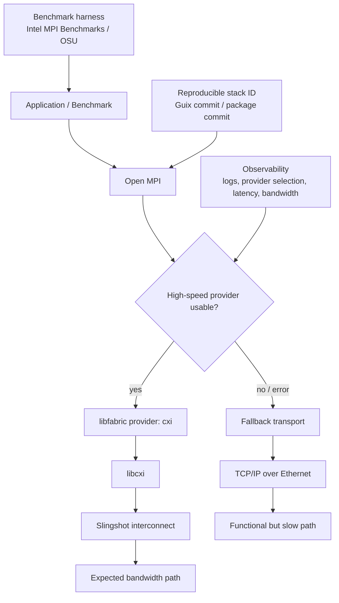

> 한 줄 요약: Kubernetes, AI 인프라, 엣지 캐시, HPC처럼 성능이 기능의 일부인 시스템에서는 성능 회귀를 단순 버그가 아니라 배포 계약 위반으로 봐야 한다. 관측성만으로는 부족하다. 재현 가능한 빌드, 벤치마크 하네스, 롤백 가능한 스택 식별자가 함께 있어야 한다.

## 왜 지금 이슈인가

성능 회귀(Performance Regression)는 장애보다 늦게 발견되는 경우가 많다. 에러율은 정상이고, 배포도 성공했고, 대시보드도 초록색인데 사용자 체감만 나빠지는 식이다.

Guix HPC 글의 사례가 눈에 띄는 이유는 증상이 아주 분명했기 때문이다. Open MPI 5와 Slingshot 인터커넥트 조합에서 기대 대역폭은 약 25GB/s 수준이었지만, Intel MPI Benchmarks의 PingPong 결과는 약 2.3GB/s에 머물렀다. 원인은 libcxi 오류가 libfabric을 거쳐 Open MPI로 전파되고, 결국 TCP/IP over Ethernet 경로로 떨어진 것이었다.

이 이야기가 GitHub나 개발자 커뮤니티에서 말이 붙기 좋은 이유는 HPC 특수 장비의 버그라서가 아니다. 지금의 인프라는 Kubernetes 네트워크 플러그인, GPU·TPU 런타임, 데이터베이스 프록시, CDN 캐시, AI 에이전트 실행 환경처럼 여러 계층이 함께 성능을 만든다.

한 계층의 작은 업그레이드가 전체 경로를 바꾸고, fallback은 장애를 막는 대신 성능 저하를 숨긴다. 안정성을 위해 넣은 완충 장치가 성능 회귀를 조용히 통과시키는 셈이다.

## 커뮤니티에서 갈리는 지점

성능 회귀를 두고 먼저 갈리는 지점은 자동화 범위다.

Guix 사례에는 자동 성능 회귀 테스트가 없었다. 이유도 현실적이다. Slingshot 같은 인터커넥트는 접근 가능한 하드웨어가 제한적이고, 매 커밋마다 두 노드를 잡아 MPI 벤치마크를 돌리는 일은 일반적인 CI처럼 싸지 않다.

반대로 Google의 TPU Developer Hub가 보여주는 방향은 하드웨어·소프트웨어 스택을 문서와 코드 중심 레시피로 최대한 명시하는 것이다. TPU는 모델 코드만 빠르다고 성능이 나오지 않는다. 병렬화, 네트워킹, 컴파일러, 런타임, 서빙 경로가 맞물린다. 개발자가 성능 문제를 만났을 때 어느 레이어를 의심해야 하는지 안내하는 지식 허브가 필요해지는 이유다.

Cloudflare의 Smart Tiered Cache 사례도 같은 축에 있다. 기존 Smart Tiered Cache는 원본 서버에 가까운 upper-tier 데이터센터를 실시간 지연시간으로 고르는 방식이었다. 그런데 public cloud origin은 anycast나 regional unicast 프런트엔드 뒤에 있어 하나의 origin IP가 여러 Cloudflare 데이터센터에서 비슷하게 가까워 보일 수 있다. 이때 시스템은 안전하게 여러 upper tier로 fallback하지만, 단일 tier가 주는 캐시 효율은 잃는다.

Cloudflare Workers Cache는 또 다른 관점을 준다. Worker 앞에 tiered cache를 두면 캐시 hit 시 Worker가 실행되지 않고 CPU time 비용도 들지 않는다. 다만 이 구조에서는 Cache-Control, stale-while-revalidate, cache tag purge 같은 정책이 애플리케이션의 성능 계약이 된다.

커뮤니티에서 부딪히는 질문은 이렇다.

| 쟁점 | 한쪽 주장 | 반대쪽 우려 |
|---|---|---|
| 자동 성능 테스트 | 배포 전에 회귀를 잡아야 한다 | 하드웨어 비용과 테스트 시간이 크다 |
| fallback | 장애보다 느린 정상 동작이 낫다 | 성능 저하가 조용히 묻힌다 |
| 문서화 | 튜닝 지식을 코드와 문서로 남겨야 한다 | 실제 환경 차이를 문서가 다 담지 못한다 |
| 캐시·가속 계층 | 비용과 지연시간을 크게 줄인다 | 무효화, 지역성, 일관성 문제가 늘어난다 |

실무 판단은 한쪽만 고르는 문제가 아니다. 모든 경로를 자동화할 수 없다면, 적어도 비싼 경로와 위험한 경로를 분리해야 한다. 모든 fallback을 막을 수 없다면, fallback이 발생했을 때 성능 지표가 명확히 붉게 변해야 한다.

## 아키텍처 관점에서 볼 점

성능 회귀를 아키텍처 문제로 보면 핵심은 데이터 경로가 실제로 어디를 지나갔는지다.

Guix 사례의 정상 경로는 대략 Open MPI → libfabric → libcxi → Slingshot이다. 회귀가 발생하면 이 경로가 실패하고 Open MPI가 TCP/IP over Ethernet으로 떨어진다. 기능은 살아 있지만 성능 특성은 완전히 다른 시스템이 된다.

이 그림은 HPC에만 해당하지 않는다.

Kubernetes에서도 CNI, 서비스 메시, eBPF 계층, 노드 커널, DNS, ingress controller 중 하나가 경로를 바꾸면 비슷한 일이 생긴다. 요청은 성공하지만 p99 latency가 밀리고, 네트워크 정책은 유지되지만 우회 경로가 생기고, 특정 노드 풀에서만 재현된다.

데이터베이스도 마찬가지다. connection pooler, read replica 라우팅, query planner, storage engine 버전이 바뀌면 기능 테스트는 통과해도 tail latency가 무너질 수 있다. 블록체인 노드나 validator 인프라에서는 네트워크 전파 지연, 디스크 I/O, mempool 처리량이 성능이자 안정성 지표가 된다.

AI 에이전트 시스템도 예외가 아니다. 모델 호출, tool execution, vector database, browser automation, sandbox, queue worker가 이어진 구조에서는 특정 계층의 fallback이 비용과 지연시간을 키운다. 예를 들어 embedding 모델이 바뀌었거나, vector index 설정이 달라졌거나, 브라우저 실행 환경이 느린 pool로 이동했는데 최종 답변은 계속 생성될 수 있다. 이때 사용자는 품질 저하로 느끼고, 운영자는 원인 계층을 늦게 찾는다.

성능 회귀를 잡기 위한 아키텍처 조건은 세 가지다.

- 첫째, 스택을 다시 만들 수 있어야 한다. Guix의 `guix describe`, `guix time-machine`, `--with-commit`이 강한 이유는 특정 시점의 패키지 버전, configure flag, compiler, 의존성을 다시 조립할 수 있기 때문이다.
- 둘째, 데이터 경로 선택이 관측 가능해야 한다. Open MPI, libfabric, libcxi의 verbose log가 없었다면 fallback 원인은 훨씬 늦게 보였을 가능성이 크다.
- 셋째, 벤치마크가 운영 가설과 연결돼야 한다. PingPong 벤치마크는 단순하지만, 이 사례에서는 기대 대역폭과 실제 transport 선택을 검증하는 하네스로 충분했다.

Cloudflare의 region hint도 같은 문제를 다른 방식으로 푼다. IP만 보고는 origin의 실제 지역성을 알기 어렵다면, 운영자가 cloud region 정보를 명시해 캐시 계층의 선택지를 줄인다. 자동 탐지가 애매한 지점에 사람이 아는 배치 정보를 넣어 성능 경로를 안정화하는 방식이다.

## 실무에서 볼 점

성능 회귀 대응을 잘하려면 먼저 어떤 성능이 제품 기능인지 정해야 한다.

모든 API에 대해 고가의 벤치마크를 돌릴 필요는 없다. 대신 아래 조건 중 하나라도 해당하면 성능 테스트를 배포 게이트에 가깝게 다뤄야 한다.

| 도입 조건 | 확인할 질문 |
|---|---|
| 고속 네트워크·GPU·TPU 의존 | fallback 경로가 생기면 지표가 바로 드러나는가 |
| 캐시 계층 의존 | cache hit ratio, origin request, purge 실패가 함께 보이는가 |
| Kubernetes 다계층 네트워크 | CNI, ingress, service mesh 변경을 성능 기준으로 비교하는가 |
| 데이터베이스 병목 가능성 | 쿼리 플랜, replica 라우팅, connection pool 변경을 기록하는가 |
| AI 에이전트 워크로드 | 모델·도구·검색·실행 환경별 latency와 비용을 분리해 보는가 |

현업에서 비슷한 고민을 하다 보면 성능 테스트가 자주 두 가지 이유로 밀린다. 하나는 너무 비싸서 나중에 하자는 판단이고, 다른 하나는 벤치마크가 실제 트래픽을 대표하지 못한다는 불신이다. 둘 다 맞는 말일 때가 많다.

그래서 처음부터 완벽한 성능 CI를 만들기보다 회귀를 판정할 최소 하네스를 정하는 편이 낫다. Guix 사례처럼 수동으로 good/bad를 판정하더라도, 재현 가능한 스택과 반복 가능한 명령이 있으면 bisect가 가능해진다. 자동화는 그 다음이다.

운영 리스크도 분리해서 봐야 한다.

- 보안 리스크: Guix 로그에는 unrestricted service ID 사용 경고가 나온다. 성능 디버깅 로그는 내부 토폴로지, provider, domain, service ID 같은 민감한 단서를 드러낼 수 있으므로 수집 범위와 보관 정책이 필요하다.
- 데이터 리스크: 캐시 계층에서는 stale-while-revalidate와 purge tag가 잘못 설계되면 오래된 데이터가 빠르게 퍼진다.
- 플랫폼 리스크: public cloud origin처럼 IP와 실제 지역성이 일치하지 않는 구조에서는 자동 최적화가 흔들릴 수 있다.
- 비용 리스크: Workers Cache처럼 Worker 실행을 줄이는 구조는 비용 절감 효과가 크지만, miss storm이나 purge 폭주 상황에서는 origin과 compute 비용이 함께 튈 수 있다.
- 운영 복잡도: TPU나 HPC 스택처럼 하드웨어와 런타임 결합이 강한 환경은 문서, 레시피, 재현 가능한 빌드 정보가 없으면 개인 지식에 의존하게 된다.

대안도 있다. 모든 것을 Guix나 Nix로 옮길 필요는 없다. 컨테이너 이미지 digest, Helm chart version, Terraform module version, kernel version, GPU driver, CNI plugin version을 한 묶음으로 기록하는 것만으로도 회귀 조사 속도는 달라진다.

Kubernetes 환경이라면 배포 단위마다 다음 정보를 남기는 방식이 현실적이다.

- workload image digest
- node pool과 kernel version
- CNI, ingress, service mesh version
- 주요 feature flag
- benchmark 또는 smoke performance 결과
- p50, p95, p99 latency와 error budget 변화
- fallback 발생 횟수 또는 provider 선택 로그

테스트 자동화도 하나의 레이어로 고립해야 한다. 성능 하네스가 운영 클러스터를 과도하게 흔들면 하네스 자체가 리스크가 된다. 별도 노드 풀, 제한된 시간 창, synthetic workload, 샘플링된 production replay 중 무엇을 쓸지 정해야 한다.

성능 회귀의 판정 기준은 절대값 하나로 끝내기 어렵다. 25GB/s가 2.3GB/s로 떨어지는 사례는 명확하지만, 일반 웹 서비스에서는 p99가 180ms에서 260ms로 오르는 변화가 더 흔하다. 이때는 latency, throughput, cost per request, cache hit ratio, CPU time을 함께 봐야 한다.

## 정리

성능 회귀는 느린 버그가 아니다. 시스템이 원래 약속한 경로를 잃어버렸다는 신호다.

Guix의 MPI 회귀 사례는 재현 가능한 배포 스택이 왜 강력한지 보여준다. Cloudflare의 캐시 사례는 자동 최적화가 origin 지역성, cache policy, purge semantics 같은 명시적 힌트 없이는 흔들릴 수 있음을 보여준다. Google의 TPU Developer Hub는 하드웨어 가속 인프라에서 성능 지식을 코드와 문서로 관리해야 한다는 흐름을 보여준다.

지금 확인할 것은 하나다. 운영 중인 핵심 경로에서 fallback이 발생했을 때, 대시보드가 성공률이 아니라 성능 계약 위반으로 표시하는가. 표시되지 않는다면 장애는 아니어도 이미 디버깅하기 어려운 시스템에 가까워지고 있다.

## 참고 자료

- [선정 글감] [Debugging performance regressions](https://hpc.guix.info/blog/2026/07/debugging-performance-regressions/) — Lobsters
- [관련] [Unlocking the Power of the TPU Stack: Introducing our new Developer Hub](https://developers.googleblog.com/unlocking-the-power-of-the-tpu-stack-introducing-our-new-developer-hub/) — Google Developers
- [관련] [Improving Smart Tiered Cache for Public Cloud Regions](https://blog.cloudflare.com/smart-tiered-cache-for-public-clouds/) — Cloudflare Blog
- [관련] [Your Worker can now have its own cache in front of it](https://blog.cloudflare.com/workers-cache/) — Cloudflare Blog