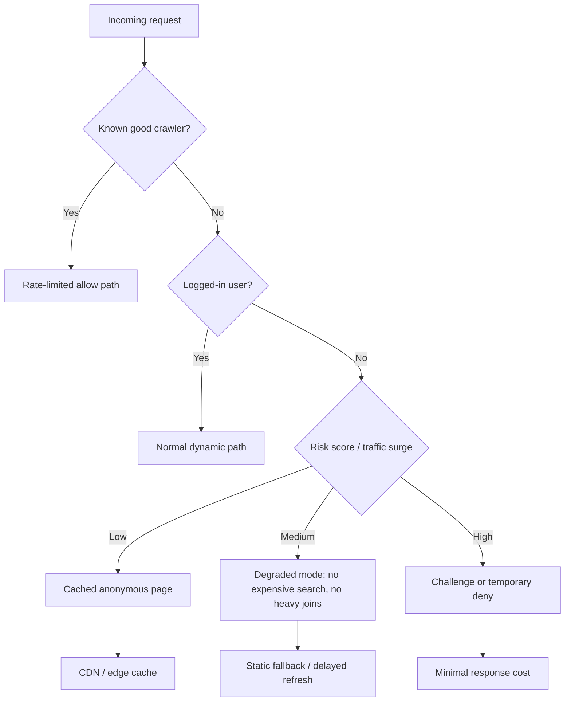

> 한 줄 요약: AI 스크래퍼와 주거용 프록시는 웹 크롤링 차단만의 문제가 아니다. 익명 트래픽, 봇 방어, 검색 접근성, 운영 비용이 한꺼번에 얽힌 인프라 문제다.

## 왜 지금 이슈인가

AI 스크래퍼, 주거용 프록시, 봇 방어는 이제 작은 웹사이트 운영자만의 고민이 아니다. LWN 사례에서 까다로운 지점은 트래픽 양보다 출처를 식별하기 어려운 방식이었다. 몇 시간 동안 수백만 개의 고유 IP에서 요청이 들어오고, 각 IP는 두세 번만 접근한 뒤 사라진다. 사용자 에이전트(User-Agent)는 믿기 어렵다. CSS나 이미지를 요청하지 않는 패턴을 보고 봇으로 판단할 즈음에는 이미 그 주소가 다시 쓰이지 않는다.

논쟁이 붙는 이유도 여기에 있다. 기존 봇 방어는 나쁜 IP를 찾고, 차단하고, 평판을 누적하는 방식에 기대는 경우가 많았다. 그런데 주거용 프록시(Residential Proxy)는 이 평판 모델을 흔든다. 요청은 클라우드 데이터센터가 아니라 일반 가정, 모바일 네트워크, 스트리밍 기기, 무료 VPN 앱, SDK가 들어간 소비자 기기에서 온다.

문제는 웹페이지를 긁어가는 행위에서 끝나지 않는다. 누군가의 노트북이나 휴대폰이 프록시 노드가 되면, 그 장치는 접속 중인 사설망 안쪽 자원에도 접근할 수 있는 위치에 놓인다. 웹사이트 운영자에게는 스크래핑 방어 문제지만, 플랫폼 보안 쪽에서는 앱스토어 심사, 공급망, 네트워크 경계, 사용자 동의가 함께 엮인다.

## 커뮤니티에서 갈리는 지점

첫 번째 쟁점은 방어 비용을 사용자에게 넘겨도 되느냐다.

Anubis 같은 작업 증명(Proof of Work) 기반 방어는 스크래퍼에게 비용을 부과한다. 요청 전에 브라우저가 계산 작업을 수행하게 만들면 대량 요청의 단가가 올라간다. 작은 사이트에는 매력적인 선택지다. 별도 계정 체계나 복잡한 봇 탐지 시스템 없이도 자동화 트래픽을 어느 정도 늦출 수 있기 때문이다.

반론도 있다. 실제 독자도 기다려야 한다. 접근성 도구, 오래된 브라우저, 저사양 기기, 스크립트 제한 환경에서는 정상 사용자가 먼저 막힐 수 있다. 더 까다로운 점은 주거용 프록시가 이미 남의 기계를 빌려 쓰는 구조라는 데 있다. 공격자가 수많은 소비자 기기의 CPU를 계산 비용으로 쓸 수 있다면, 작업 증명은 비용을 공격자에게만 물리는 장치가 아닐 수 있다.

두 번째 쟁점은 합법적 크롤러와 악성 스크래퍼를 어떻게 나눌 것인가다.

검색 엔진, 인터넷 아카이브, 연구용 크롤러는 오픈 웹의 일부였다. robots.txt를 지키고 식별 가능한 사용자 에이전트를 쓰는 크롤러까지 막으면 웹의 발견 가능성은 줄어든다. 그렇다고 모든 익명 트래픽을 열어두면 독립 사이트가 트래픽 비용과 서버 부하를 떠안아야 한다.

그래서 allowlist 방식이 나온다. 특정 대형 검색 엔진만 허용하는 식이다. 운영은 쉬워지지만, 이미 강한 사업자의 지위가 더 굳어진다. 작은 검색 서비스, 아카이브, 독립 연구자는 통과하기 어려워진다. 오픈 웹을 지키려는 방어가 웹을 몇몇 문지기 뒤로 밀어 넣는 역설이 생긴다.

세 번째 쟁점은 AI 기업의 책임 범위다.

식별 가능한 대형 모델 기업의 크롤러는 적어도 사용자 에이전트를 밝히고 robots.txt를 따르는 경우가 있다. LWN 글도 이들을 가장 큰 직접 문제로 보지는 않는다. 더 거친 트래픽은 누가 돈을 대는지 알 수 없는 주거용 프록시 네트워크에서 온다.

그래도 의심은 쉽게 사라지지 않는다. 모델 학습 데이터가 필요하다는 수요는 분명하고, 데이터 조달 경로는 충분히 투명하지 않다. 직접 공격했다는 증거와 생태계에 압력을 만들었다는 책임은 구분해야 한다. 실무에서도 이 구분이 필요하다. 방어 정책은 의심이 아니라 관측 가능한 행위, 요청 비용, 준수 여부를 기준으로 세워야 한다.

## 아키텍처 관점에서 볼 점

AI 스크래퍼 방어를 단일 미들웨어로 보면 실패하기 쉽다. 실제 병목은 요청 입구, 동적 페이지 생성, 검색 인덱스, 캐시 무효화, 로그인 상태, 백엔드 쿼리 비용에 흩어져 있다. 방어 장치는 봇을 완벽히 식별하는 도구라기보다, 비싼 경로로 들어오는 익명 요청을 싼 경로로 밀어내는 구조에 가까워야 한다.

이 구조에서 먼저 봐야 할 것은 익명 요청의 기본 경로다. 공격 중일 때만 방어를 켜는 방식은 늦다. 목록 페이지, 오래된 글, 태그 페이지, RSS, 검색 결과처럼 반복 조회되는 화면은 가능한 한 캐시 가능한 형태여야 한다. LWN도 공격 중 비싼 작업을 줄이는 최적화를 했고, 방어 모드에서 오히려 응답 시간이 좋아지는 경우가 있었다고 설명한다.

로그인 사용자는 별도 신뢰 경로로 분리하는 편이 낫다. 계정이 있다고 무조건 안전한 것은 아니지만, 익명 대량 트래픽과 같은 큐에서 처리하면 실제 독자가 같이 밀린다. 세션 기반 사용자는 더 높은 비용의 동적 기능을 쓰게 하되, 비정상 패턴에는 별도 제한을 둔다. 모든 요청을 같은 비용으로 처리하지 않는 것이 핵심이다.

차단보다 성능 격리가 먼저다. IP 차단 목록을 끝없이 늘리는 방식은 주거용 프록시 앞에서 효율이 떨어진다. 대신 익명 요청이 데이터베이스의 비싼 쿼리, 검색 인덱스, 이미지 변환, 추천 계산, 댓글 렌더링까지 끌고 가지 못하게 해야 한다. 봇을 완전히 막지 못해도, 봇이 태울 수 있는 비용의 상한은 낮출 수 있다.

데이터 흐름을 이렇게 보면 방어의 목적도 달라진다. 사람인지 기계인지 맞히는 분류 모델을 만드는 일이 아니다. 요청이 실패해도 운영자가 손해를 덜 보는 경로를 설계하는 일이다.

## 실무에서 볼 점

도입 전에 먼저 확인할 것은 로그의 해상도다. 사용자 에이전트, IP, ASN, 요청 경로, 응답 코드, 응답 시간, 캐시 적중 여부, 로그인 여부, 정적 자원 요청 여부가 분리되어 있어야 한다. 봇이 CSS와 이미지를 가져가지 않는다는 단서는 이런 로그가 있어야 보인다.

두 번째는 비싼 엔드포인트 목록이다. 스크래퍼는 꼭 홈페이지를 때리지 않는다. 검색, 태그, 페이지네이션, 오래된 아카이브, 동적 피드, 문서 변환 경로가 더 약할 수 있다. 현업에서 비슷한 고민을 하다 보면 방어 솔루션을 먼저 붙이고 싶어지지만, 실제 효과는 비싼 경로를 찾아 캐시하거나 기능을 낮추는 데서 더 빨리 나온다.

세 번째는 정상 크롤러 정책이다. robots.txt를 지키는 크롤러, 검색 노출에 필요한 크롤러, 아카이브 목적의 크롤러를 같은 바구니에 넣으면 나중에 운영자가 직접 예외를 계속 추가하게 된다. 정책 문서에는 허용 기준, rate limit, 연락 채널, 차단 해제 절차가 있어야 한다.

네 번째는 사용자 경험의 비용이다. 캡차(CAPTCHA), 퍼즐, 작업 증명, 로그인 강제, paywall은 모두 효과가 있지만 각각 다른 부작용이 있다.

| 선택지 | 얻는 것 | 잃는 것 |
|---|---|---|
| 작업 증명 | 대량 요청 비용 증가 | 저사양 기기와 접근성 환경에 부담 |
| 캡차 | 자동화 일부 차단 | 정상 사용자 이탈, 개인정보와 외부 의존성 |
| 로그인 강제 | 신뢰 경로 분리 | 오픈 웹 접근성 감소 |
| 강한 allowlist | 운영 단순화 | 대형 플랫폼 의존 심화 |
| 캐시와 성능 격리 | 사용자 영향 최소화 | 설계 변경과 관측 체계 필요 |
| 데이터 포이즈닝 | 스크래핑 가치 하락 | 법적, 윤리적, 품질 리스크 검토 필요 |

보안 관점에서는 앱 생태계도 봐야 한다. 무료 VPN, 광고 SDK, 수익화 라이브러리가 사용자 기기를 프록시 노드로 만드는 구조라면 웹사이트 운영자만으로는 해결하기 어렵다. 앱스토어 심사, 모바일 OS 권한 모델, 네트워크 사용 고지, 엔터프라이즈 MDM 정책까지 연결된다. 회사 내부망에서는 알 수 없는 앱이 설치된 개인 기기가 사내 Wi-Fi에서 어떤 외부 명령을 수행할 수 있는지도 점검 대상이 된다.

운영 리스크는 비용 청구서로만 오지 않는다. 봇 방어가 과하게 작동하면 검색 유입이 끊기고, 아카이브가 깨지고, 독자가 사이트를 신뢰하지 않게 된다. 방어가 약하면 서버 비용과 장애 대응이 누적된다. 그래서 기준은 봇 차단률보다 정상 사용자의 성공률, 익명 요청의 평균 처리 비용, 공격 중 핵심 페이지의 p95 응답 시간, 비싼 쿼리 호출 수에 가까워야 한다.

## 정리

AI 스크래퍼 문제는 더 똑똑한 봇 탐지 제품 하나로 끝나지 않는다. 주거용 프록시가 일반 사용자 네트워크를 공격 표면으로 바꾸면 IP 평판과 사용자 에이전트 중심의 방어는 힘을 잃는다. 오픈 웹을 유지하려면 모든 방문자를 의심하는 벽을 세우는 대신, 익명 대량 요청이 시스템의 비싼 부분을 태우지 못하게 설계해야 한다.

먼저 볼 곳은 분명하다. 사이트나 서비스에서 로그인하지 않은 요청이 가장 비싼 백엔드 경로를 직접 호출하는 지점을 찾아야 한다. 그 목록이 나오면 봇 방어 논의는 추상적인 찬반이 아니라 캐시, 격리, 제한, 예외 정책의 설계 문제로 바뀐다.

## 참고 자료

- [선정 글감] [An update on the scraper situation](https://lwn.net/SubscriberLink/1080822/990a8a5e2d379085/), Lobsters/LWN