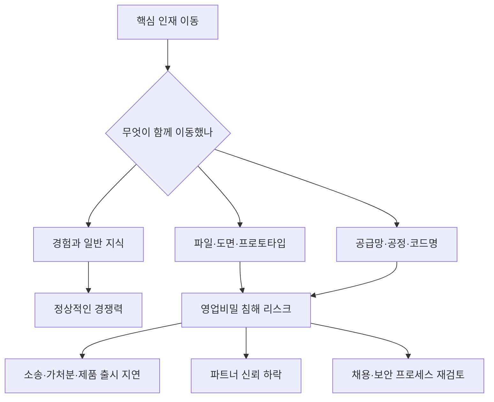

> 한 줄 요약: Apple과 OpenAI의 영업비밀 소송은 인재 유출 의혹에 머물지 않는다. AI 하드웨어 경쟁에서 경험과 도용의 경계를 어디에 둘지가 쟁점이다. 다만 지금 확인된 것은 Apple의 주장과 OpenAI의 부인이다. 법원이 판단한 사실은 아직 없다.

## 무슨 일이 있었나

미국 시간 2026년 7월 10일, Apple은 OpenAI를 상대로 영업비밀 침해와 계약 위반을 주장하는 소송을 냈다. 관할 법원은 캘리포니아 북부연방지방법원이다.

쟁점은 OpenAI가 준비하는 AI 하드웨어 사업이다. Apple은 OpenAI, io Products, 전 Apple 임직원 Tang Tan과 Chang Liu 등을 상대로 Apple의 미공개 기술, 제품, 공정, 공급망 정보가 OpenAI의 하드웨어 개발에 쓰였다고 주장한다.

확인된 사실과 아직 다투는 쟁점을 나누면 이렇다.

| 구분 | 내용 |
|---|---|
| 날짜 | 2026년 7월 10일 미국 시간 기준 소송 제기 |
| 원고 | Apple |
| 피고로 언급된 대상 | OpenAI, io Products, Tang Tan, Chang Liu 등 |
| 핵심 분야 | AI 하드웨어, 미공개 제품, 제조 공정, 공급망 정보 |
| OpenAI 입장 | 다른 회사의 영업비밀에 관심이 없고 독자적 혁신에 집중한다는 취지로 부인 |
| 아직 판단되지 않은 것 | 실제 도용 여부, OpenAI 조직 차원의 지시 여부, 해당 정보가 제품 개발에 쓰였는지 여부 |

Apple의 주장은 꽤 구체적이다. Tang Tan이 OpenAI 채용 과정에서 Apple의 비밀 프로젝트 코드명을 사용했고, 지원자에게 Apple 하드웨어 부품을 면접에 가져오라고 했으며, 퇴사 예정자에게 보안 절차를 피하는 방법을 알려줬다는 내용이 들어 있다.

Tang Tan은 Apple에서 24년을 일했고, iPhone과 Apple Watch 제품 디자인을 맡았던 인물이다. OpenAI는 2025년 Jony Ive의 하드웨어 스타트업 io를 65억 달러 규모로 인수했다. Apple은 이 io Products도 소송 대상에 포함했다. 다만 Jony Ive 개인은 소송 대상에 포함되지 않았다고 보도됐다.

다른 피고로 언급된 Chang Liu에 대해서는 Apple 지급 노트북을 반납하지 않은 채 기밀 기술 문서를 내려받았고, OpenAI에 지원하는 다른 Apple 직원에게 면접 준비용 정보를 공유했다는 주장이 나왔다.

여기서 선을 그어야 한다. 기사에 나온 많은 문장은 소장 속 Apple의 주장이다. 소송은 사실이 확정되는 절차가 아니라, 사실을 다투기 시작하는 절차다. OpenAI는 혐의를 부인했고 법원 판단은 아직 나오지 않았다.

그래도 이 사건에 말이 붙는 이유는 있다. 직원 몇 명의 이직 문제로 끝나지 않고, 스마트폰 이후의 AI 기기를 누가 어떤 방식으로 만들 수 있는지의 문제와 맞닿아 있기 때문이다.

## 왜 사람들이 반응했나

### Apple OpenAI 소송이 불편한 이유는 인재 이동의 경계 때문이다

기술 업계에서 이직은 제품 전략과 맞물려 움직인다. 한 회사에서 공급망, 칩, 센서, 배터리, 열 설계, UX 패턴을 다뤄본 사람이 다른 회사로 옮기는 일은 흔하다. 문제는 머릿속에 남은 경험과 회사 서버에서 가져온 자료 사이의 선을 어디에 긋느냐다.

커뮤니티 반응이 갈리는 것도 여기서 시작된다.

한쪽은 Apple 출신 하드웨어 인력이 OpenAI로 이동했고, OpenAI가 첫 하드웨어 제품을 준비하는 상황에서 Apple이 과하게 방어하는 것 아니냐고 본다. 모바일 이후 AI 기기의 주도권을 놓치지 않으려는 전략적 소송이라는 해석이다.

반대로 지원자에게 부품을 가져오게 했다거나 퇴사자의 보안 우회가 언급됐다는 주장이 사실이라면, 평범한 이직이 아니라 조직적 정보 반출 의혹이라고 보는 쪽도 있다. 공급업체, 제조 공정, 미공개 부품 정보는 아이디어보다 훨씬 구체적인 자산이다. 경쟁사가 알면 제품 출시 시점과 원가 구조가 달라질 수 있다.

그래서 이 사건은 시끄럽다. 양쪽 모두 쉽게 넘길 수 없는 대목을 붙잡고 있다.

### AI 하드웨어는 앱 경쟁보다 영업비밀 리스크가 크다

소프트웨어에서는 공개 논문, 오픈소스, API 문서, 벤치마크를 바탕으로 경쟁하는 영역이 많다. 코드와 데이터도 보호 대상이지만, 제품 구현의 상당 부분은 밖에서도 검증할 수 있다.

하드웨어는 다르다. 완성품보다 보이지 않는 과정이 더 큰 차이를 만든다.

- 어떤 부품을 어떤 공급업체에서 받는가
- 어떤 금속 마감 공정을 쓰는가
- 열과 배터리 제약을 어떻게 타협하는가
- 제조 수율을 어디서 확보하는가
- 초기 프로토타입에서 어떤 실패를 겪었는가
- 출시 전 제품군이 어떤 방향으로 정리되고 있는가

이 정보는 제품 발표 자료에 나오지 않는다. 하지만 경쟁사가 알면 개발 기간을 줄일 수 있다. Apple이 소장에서 미공개 기술, 제조 공정, 공급망, 프로토타입을 반복해서 언급한 이유도 여기에 있다.

OpenAI 입장에서 AI 하드웨어는 ChatGPT를 앱 밖으로 꺼내는 방법일 수 있다. AI를 기기 수준에 붙이면 스마트폰 플랫폼을 거치지 않고 사용자 접점을 만들 수 있다. Apple 입장에서는 iPhone 중심 생태계에 대한 도전으로 읽힐 만하다.

법적 쟁점과 별개로, 두 회사 사이에 긴장이 생길 수밖에 없는 구조다.

### 커뮤니티가 보는 진짜 질문은 OpenAI가 하드웨어 회사가 될 수 있느냐다

OpenAI는 모델과 제품 경험에서는 이미 거대한 플랫폼이 됐다. 하지만 하드웨어는 다른 체질을 요구한다. 모델을 잘 만든다고 해서 공급망, 내구성, 반품, 인증, 제조 수율, 수리 정책, 개인정보 처리까지 자연스럽게 따라오지는 않는다.

이번 사건은 OpenAI의 확장 방식에 대한 질문으로도 읽힌다.

AI 회사가 하드웨어로 가려면 기존 하드웨어 인재를 데려오는 일을 피하기 어렵다. 그런데 기존 강자의 인력을 너무 빠르게 흡수하면 의심도 따라온다. 데려온 것은 사람인가. 아니면 그 사람이 접근하던 회사의 축적물인가.

이 질문은 OpenAI만의 문제가 아니다. AI 시대에는 인재 이동이 데이터 이동, 노하우 이동, 운영 관행 이동과 얽힌다. 특히 모델, 디바이스, 클라우드, 반도체, 로봇이 한 제품 안에서 묶일수록 이직의 경계는 더 복잡해진다.

## 내가 보는 핵심

### 영업비밀 소송의 핵심은 훔쳤느냐보다 증명 가능한 경계다

이번 사건을 Apple 대 OpenAI의 감정싸움으로만 보면 놓치는 부분이 있다. 실무에서 더 무서운 문제는 악의가 있었는지보다 경계를 증명할 수 있느냐다.

한 사람이 회사를 옮길 때 머릿속 경험은 함께 이동한다. 하지만 파일, 도면, 내부 프레젠테이션, 공급업체 목록, 미공개 프로토타입, 코드명, 제조 조건은 함께 이동하면 안 된다. 이 경계가 문서, 로그, 프로세스로 남아 있어야 분쟁이 났을 때 조직을 방어할 수 있다.

Apple은 회사 지급 기기 통신, 서버 로그, 파일 접근 기록 등을 조사해 정황을 확보한 것으로 보도됐다. 소송으로 가면 디스커버리(Discovery) 절차를 통해 OpenAI 내부 자료까지 더 들여다보려 할 가능성이 있다.

현업에서 비슷한 고민을 하다 보면 기술력보다 기록 체계가 먼저 회사를 지킨다는 생각을 하게 된다. 누가 어떤 자료에 접근했는지, 퇴사 전후 접근 권한이 어떻게 닫혔는지, 면접 과정에서 금지된 질문이 있었는지, 새로 합류한 인력이 이전 회사 자료를 가져오지 않았다는 확인을 어떻게 남겼는지가 나중에 제품의 법적 리스크가 된다.

### 반대로 Apple의 주장만으로 OpenAI 제품을 단정하면 안 된다

이 대목에서는 약간 삐딱하게 봐야 한다. Apple이 소송을 냈다고 해서 OpenAI의 하드웨어 사업이 곧바로 부정한 기반 위에 있다고 확정할 수는 없다.

대기업의 영업비밀 소송은 경쟁 제품의 속도를 늦추는 전략으로도 쓰인다. 출시 전 제품에 법적 불확실성을 붙이고, 파트너와 공급업체를 조심스럽게 만들고, 인재 채용 시장에 신호를 줄 수 있다.

Apple에도 동기는 있다. OpenAI가 AI 에이전트 중심의 기기를 만든다면 사용자가 앱을 여는 방식 자체가 달라질 수 있다. 앱스토어, 기본 앱, Siri, iPhone 하드웨어의 결합으로 쌓아온 통제력이 약해질 수 있다.

그렇다고 Apple의 주장을 가볍게 넘겨도 된다는 뜻은 아니다. 지원자에게 부품을 가져오게 했다거나 퇴사자 보안 절차 회피가 있었다는 주장은 사실이라면 상당히 무겁다. 다만 지금 독자가 해야 할 일은 편을 고르는 것이 아니라 증거의 층위를 나누는 것이다.

- 소장에 적힌 주장은 Apple의 버전이다
- OpenAI의 짧은 부인은 방어의 시작일 뿐이다
- 실제 판단은 로그, 내부 메시지, 채용 기록, 파일 접근 기록, 공급업체 커뮤니케이션에서 갈릴 가능성이 크다
- 제품이 실제로 어떤 설계와 공정을 쓰는지는 별개의 검증 대상이다

소송 보도에서 가장 위험한 읽기는 강한 문장을 사실 확정처럼 받아들이는 것이다. 영업비밀 사건의 소장은 원래 공격적으로 쓰인다. 인용된 표현이 세다고 해서 법원이 같은 결론을 냈다는 뜻은 아니다.

### AI 플랫폼 경쟁은 이제 보안팀과 법무팀의 싸움도 된다

AI 업계의 초기 경쟁은 모델 성능과 GPU 확보에 가까웠다. 이제는 배포면이 넓어졌다. 브라우저, 운영체제, 스마트폰, 웨어러블, 전용 기기, 사내 업무도구까지 AI가 들어간다.

그 순간 경쟁의 기준도 바뀐다. 더 큰 모델을 만들었다는 사실만으로 끝나지 않는다. 어떤 데이터를 다뤘는지, 어떤 라이선스 아래 학습했는지, 어떤 직원이 어떤 정보를 가지고 합류했는지, 어떤 공급망으로 제품을 만들었는지가 같이 따라온다.

이번 사건이 개발자 커뮤니티에서 크게 반응을 얻은 이유도 이 때문이다. 개발자에게는 낯익은 패턴이다. 빠르게 만들라는 압박이 커질수록 경계 문서화는 뒤로 밀린다. 채용은 공격적으로 진행되고, 온보딩은 속도 중심으로 움직인다. 이전 회사에서 배운 것을 어디까지 써도 되는지 애매한 상태로 프로젝트가 굴러간다.

AI 하드웨어처럼 큰 시장에서는 그 애매함이 제품 전체를 멈출 수 있다.

## 앞으로 볼 기준

### Apple OpenAI 영업비밀 소송에서 다음에 확인할 것

이 사건을 계속 볼 때는 감정적인 구도보다 다음 체크포인트가 더 쓸모 있다.

| 확인할 지점 | 왜 봐야 하나 |
|---|---|
| 법원이 임시 금지명령을 내리는지 | OpenAI 하드웨어 개발과 출시 일정에 직접 영향 |
| 디스커버리에서 내부 메시지가 공개되는지 | 조직 차원의 지시 여부를 가를 가능성 |
| Apple이 특정 영업비밀을 얼마나 구체화하는지 | 포괄적 주장인지, 보호 가능한 비밀인지 판단 |
| OpenAI가 독자 개발 기록을 제시하는지 | 클린룸 개발, 설계 이력, 공급망 독립성을 보여줄 수 있음 |
| io Products와 OpenAI 본체의 역할 분리 | 책임 범위와 의사결정 라인을 가르는 요소 |
| Apple과 OpenAI의 기존 AI 파트너십 변화 | Siri, Apple Intelligence 통합 흐름에도 파장 가능 |

특히 봐야 할 것은 특정 파일을 누가 가져갔느냐 하나가 아니다. 그 정보가 OpenAI 내부에서 어떻게 흘렀는지다. 개인 일탈이면 손해배상과 접근 제한의 문제로 좁혀질 수 있다. 조직적 채용 관행과 제품 개발 프로세스에 연결되면 이야기가 커진다.

### 실무 조직이 배울 점은 채용 속도보다 격리 설계다

AI 기업뿐 아니라 빠르게 인재를 데려오는 팀이라면 이 사건에서 바로 확인할 것이 있다.

첫째, 경쟁사 출신 인력의 온보딩 문서를 따로 둬야 한다. 이전 회사 자료, 미공개 정보, 고객 목록, 코드, 도면, 로드맵을 가져오지 않는다는 선언은 형식이 아니라 방어 기록이다.

둘째, 면접관 교육이 필요하다. 면접에서 후보자의 역량을 확인하려다 보면 이전 회사의 구체적 구현, 공급업체, 장애 사례, 미공개 실험을 묻고 싶은 유혹이 생긴다. 그 질문 자체가 나중에 리스크가 될 수 있다.

셋째, 새 프로젝트의 설계 이력을 남겨야 한다. 어떤 공개 자료와 내부 실험을 근거로 결정했는지 기록하면, 나중에 유사성이 발견돼도 독자 개발 경로를 설명할 수 있다.

넷째, 퇴사자 권한 회수는 자동화돼야 한다. 노트북 반납, 토큰 폐기, 저장소 접근 차단, 로그 보존은 감정의 문제가 아니라 기본 운영 절차다.

이런 절차는 느려 보인다. 하지만 제품 출시 직전에 소송으로 멈추는 것보다 훨씬 싸다.

### 다음 AI 하드웨어 뉴스를 읽을 때 필요한 질문

OpenAI의 AI 기기가 실제로 iPhone의 대안이 될지는 아직 알 수 없다. AI 에이전트가 앱 중심 UX를 대체할지도 검증되지 않았다. 전용 AI 기기 시장은 이미 기대와 실망을 모두 보여준 적이 있다.

그래서 다음 뉴스를 볼 때 질문은 단순해야 한다.

- 이 제품은 스마트폰을 대체하는가, 아니면 스마트폰의 주변 장치인가
- 사용자의 개인정보와 로컬 데이터를 어디까지 처리하는가
- 하드웨어 차별점이 공개 기술로 설명되는가
- 공급망과 제조 파트너가 기존 강자의 자산과 어떻게 분리되는가
- 인재 이동이 제품 경쟁력으로 설명되는가, 아니면 자료 이동 의혹으로 설명되는가
- 법적 불확실성이 출시 일정과 파트너십에 어떤 영향을 주는가

처음의 긴장은 여기로 돌아온다. Apple이 맞느냐 OpenAI가 맞느냐는 법원이 따질 일이다. 지금 독자가 봐야 할 것은 AI 하드웨어 경쟁이 멋진 데모와 유명 디자이너의 합류만으로 설명되지 않는다는 점이다.

다음 세대 기기를 만들겠다는 회사는 모델 성능뿐 아니라 데이터 출처, 인재 이동, 공급망, 보안 로그, 면접 질문까지 함께 설명해야 한다. AI가 물리적 제품으로 내려오는 순간, 속도만으로는 부족하다. 법적 정당성과 운영 기록도 같이 따라붙는다.

## 참고 자료

- [선정 글감] [Apple sues OpenAI over alleged trade secret theft](https://techcrunch.com/2026/07/10/apple-sues-openai-over-alleged-trade-secret-theft/), TechCrunch
- [관련] [Apple sues OpenAI, accuses ex-employees of stealing trade secrets](https://9to5mac.com/2026/07/10/apple-sues-openai-trade-secret-theft/), 9to5Mac
- [관련] [Apple Is Suing OpenAI for Allegedly Stealing Hardware Secrets](https://www.wired.com/story/apple-sues-openai-allegedly-stealing-ip-hardware/), WIRED
- [관련] [Hacker News discussion](https://news.ycombinator.com/item?id=48865019), Hacker News