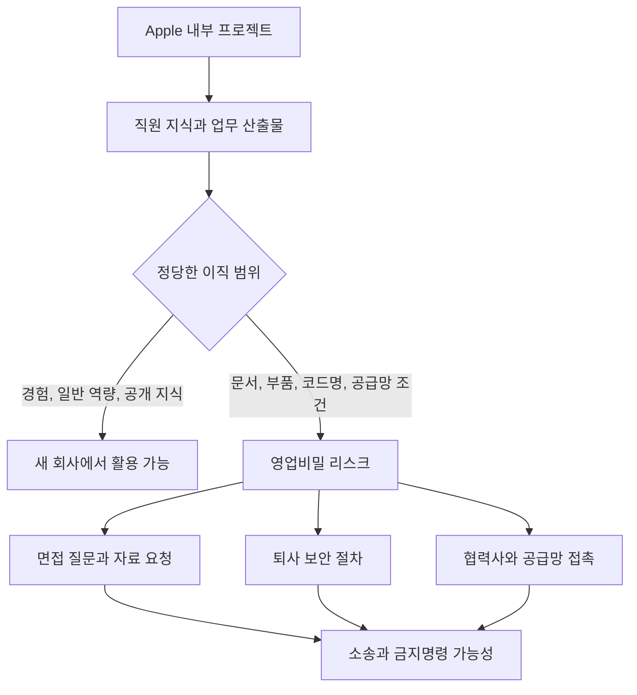

> 한 줄 요약: Apple OpenAI 소송은 AI 하드웨어 경쟁이 인재 영입 문제에서 끝나지 않고 영업비밀, 공급망, 면접 절차, 퇴사 보안까지 걸린 분쟁으로 커졌다는 사례다. 아직 법원이 판단한 사실은 아니지만, 개발 조직이 다음 채용과 협업에서 무엇을 남겨야 하는지는 분명해졌다.

## 무슨 일이 있었나

2026년 7월 10일, Apple은 미국 캘리포니아 북부연방지방법원에 OpenAI, io Products, 그리고 전 Apple 직원 일부를 상대로 소송을 제기했다. 쟁점은 Apple의 미공개 제품, 하드웨어 부품, 설계 문서, 제조 관련 자료, 공급업체 정보가 OpenAI의 AI 하드웨어 사업에 부당하게 넘어갔는지다.

선정 글감인 9to5Mac 보도에 따르면 Apple은 전 Apple 임원 Tang Tan과 전 엔지니어 Chang Liu를 핵심 피고로 지목했다. Tang Tan은 Apple에서 iPhone과 Apple Watch 제품 디자인을 이끌었던 인물이고, 이후 Jony Ive 쪽 하드웨어 조직과 연결됐다. OpenAI는 2025년 Jony Ive의 스타트업 io를 65억 달러 규모로 인수했고, 그 뒤 첫 소비자용 AI 하드웨어 제품을 준비해왔다.

여기서 분리해서 봐야 할 것이 있다.

확인된 사실은 Apple이 소송을 냈고, 소장에 구체적인 행위가 주장돼 있다는 점이다. Apple은 OpenAI가 2026년 2월 문제를 제기받고도 응답하지 않았다고 주장한다. 또 소송은 손해배상과 금지명령(injunctive relief)을 요구한다.

아직 확정되지 않은 것은 Apple의 주장이 실제 법정에서 입증될지다. 소장에는 채용 면접에서 Apple 내부 코드명이 언급됐고, 지원자에게 실제 부품이나 CAD/design artifacts, prototypes를 가져오라고 했으며, 퇴사 보안 절차를 우회하는 방법이 공유됐다는 주장이 담겼다. OpenAI 측은 WIRED에 다른 회사의 영업비밀에는 관심이 없다고 밝혔다.

현재 이 사건은 유죄 판결이나 사실 확정이 아니라, Apple의 구체적 주장과 OpenAI의 부인이 맞붙은 소송이다. 다만 커뮤니티가 반응한 이유는 여기서 끝나지 않는다. 이 소송이 AI 하드웨어 경쟁에서 어디까지가 정당한 이직이고, 어디서부터가 조직적 지식 이전인지 묻고 있기 때문이다.

## 왜 사람들이 반응했나

Apple OpenAI 소송이 Hacker News에서 큰 반응을 얻은 이유는 두 회사 이름값만으로 설명하기 어렵다. 개발자와 창업자 입장에서는 이 문제가 면접, 퇴사, 노트북 반납, 공급망 대화, 투자 미팅까지 이어지는 현실적인 리스크로 보이기 때문이다.

첫 번째 불편함은 인재 이동과 영업비밀의 경계다. 사람은 회사를 옮기면 경험과 판단력을 함께 가져간다. 그 자체는 금지될 수 없다. 하지만 미공개 부품, 내부 문서, 회로 설계, 제조 공정, 공급업체 조건은 다르다. Apple의 주장처럼 실제 파일, 부품, 프로토타입이 이동했다면 그건 기억의 이동이 아니라 자산의 이동이다.

두 번째는 면접이라는 회색지대다. 하드웨어 면접은 지원자의 실제 설계 능력을 검증해야 한다. 그래서 어떤 부품을 골랐는지, 어떤 시뮬레이션 도구를 썼는지, 어떤 공급업체와 협업했는지 묻고 싶어진다. 그런데 질문이 경쟁사의 미공개 제품으로 향하면 면접은 평가 절차가 아니라 정보 수집 채널이 된다.

세 번째는 OpenAI의 위치 변화다. OpenAI는 더 이상 모델 API와 ChatGPT만의 회사로 보이지 않는다. Jony Ive, io 인수, 400명 이상의 전 Apple 직원이라는 맥락이 붙으면서 AI 하드웨어 시장의 직접 경쟁자로 읽힌다. 그래서 이번 소송은 Apple이 OpenAI의 하드웨어 진입을 견제하는 전략적 소송인지, 실제 영업비밀 침해를 막는 방어인지에 대한 논쟁을 낳았다.

네 번째는 공급망 리스크다. WIRED와 9to5Mac 보도에는 Apple의 금속 마감 기술과 배터리, 전원 관련 공급업체에 대한 주장도 등장한다. 이 부분이 민감한 이유는 하드웨어 회사의 경쟁력이 제품 아이디어 하나에 있지 않기 때문이다. 같은 컨셉이라도 소재, 공정, 수율, 부품 조달, 품질 기준을 통과해야 제품이 된다.

실제로 이런 상황에서는 문서 하나보다 공급업체와의 대화 기록이 더 큰 의미를 가질 때가 있다. 누가 어떤 내부 용어를 썼는지, 어떤 부품을 특정해 물었는지, 상대방이 왜 Apple의 허가가 있다고 믿었는지 같은 로그가 사건의 방향을 바꿀 수 있다.

## 내가 보는 핵심

이번 이슈의 핵심은 AI 회사가 하드웨어 회사가 되는 순간, 리스크의 종류가 바뀐다는 데 있다.

소프트웨어 중심 조직은 빠른 채용, 강한 문제 해결력, 이전 프로젝트 경험을 높게 평가한다. 그런데 하드웨어는 물리적 샘플, CAD 파일, 제조 문서, 공급업체 네트워크, 테스트 공정이 얽힌다. 사람만 영입했다고 생각했는데, 상대 회사가 보기에는 제품 개발 체계 일부가 통째로 이동한 것처럼 보일 수 있다.

Apple이 주장한 내용 중 실무자가 특히 봐야 할 부분은 세 가지다.

| 쟁점 | Apple의 주장 | 실무 리스크 |
|---|---|---|
| 면접 | 후보자에게 실제 부품과 설계 자료를 요구 | 채용 절차가 정보 수집으로 해석될 수 있음 |
| 퇴사 | 보안 절차 우회, 회사 노트북 미반납, 파일 다운로드 | 개인 일탈이 아니라 조직 관리 실패로 번질 수 있음 |
| 공급망 | Apple 협력사에 내부 용어와 특정 공정 관련 질문 | 협력사가 어느 회사 권한으로 움직였는지 다툼 발생 |

여기서 커뮤니티 반응이 갈리는 지점도 이해된다. 한쪽은 Apple이 인재 유출과 AI 하드웨어 경쟁에 예민하게 반응한다고 본다. 다른 쪽은 소장에 적힌 행위가 사실이라면 평범한 이직의 범위를 이미 넘었다고 본다.

TechCrunch의 보조 보도는 Apple이 이 행위를 OpenAI 고위 리더십과 연결해 주장한다는 점을 짚는다. 개인 몇 명이 파일을 들고 나갔다는 수준이 아니라, 채용과 제품 개발 과정에서 반복된 패턴이라는 프레임이다. 이 차이가 크다. 개인 일탈이면 포렌식과 손해배상 문제가 중심이지만, 조직 패턴이면 채용 정책, 임원 책임, 제품 출시 금지까지 논의될 수 있다.

비슷한 축에서 Fizz와 Sidechat 소송도 같이 볼 만하다. 그 사건은 대학 커뮤니티 앱 경쟁에서 투자자가 펀딩 미팅 중 알게 된 비공개 정보를 경쟁사에 넘겼다는 주장으로 확장됐다. 분야는 다르지만 구조는 닮았다. 정보가 필요한 쪽은 면접, 투자 검토, 협력사 미팅이라는 합법적 접점을 갖고 있고, 정보를 가진 쪽은 그 접점이 어디서부터 남용인지 증명해야 한다.

그래서 이 사건을 Apple 대 OpenAI의 대결로만 보면 실무 교훈을 놓친다. 경쟁이 치열해질수록 회사 간 접점은 정보 유출 경로로 의심받기 쉽다. 채용, 투자, 파트너십, 공급망 협의는 모두 필요한 활동이지만, 기록이 없으면 나중에 방어하기 어렵다.

현업에서 비슷한 고민을 하다 보면 가장 애매한 지점은 질문의 수준이다. 이전 회사에서 어떤 문제를 풀었는지 묻는 것은 자연스럽다. 하지만 미공개 프로젝트명, 구체 부품명, 공급업체명, 원가 조건, 제조 결함률, 내부 승인 절차를 묻는 순간 질문은 위험해진다. 면접관이 궁금해서 물었다고 해도, 소송에서는 그 의도가 다르게 읽힐 수 있다.

## 앞으로 볼 기준

앞으로 Apple OpenAI 소송을 볼 때는 누가 이기느냐보다 무엇이 입증되는지를 봐야 한다. 특히 다음 네 가지가 사건의 무게를 가를 가능성이 크다.

첫째, 자료의 실제 이동 여부다. 단순 기억과 경험인지, 문서, 부품, 프로토타입, 노트북, 다운로드 로그가 있는지에 따라 판단은 달라진다.

둘째, OpenAI 내부의 관여 수준이다. 개인 직원의 행동인지, 임원이나 채용팀이 요구, 묵인, 반복한 절차인지가 다르다. Apple이 말한 established pattern이 입증된다면 사건은 훨씬 커진다.

셋째, 공급업체 접촉의 맥락이다. 특정 Apple 공정이나 부품을 알고 있다는 듯이 접근했는지, 협력사가 OpenAI에 권한이 있다고 믿게 된 이유가 무엇인지가 쟁점이 된다.

넷째, OpenAI 하드웨어 제품과 Apple 자료 사이의 연결성이다. 비슷한 사람이 모였다는 사실만으로는 부족하다. 문제 된 자료가 실제 제품 결정, 설계 방향, 공급망 구성에 영향을 줬다는 연결고리가 필요하다.

기업과 개발 조직 입장에서 당장 점검할 것도 분명하다.

- 면접관에게 경쟁사 미공개 프로젝트, 내부 코드명, 부품 샘플, 설계 파일을 요구하지 말라는 기준을 문서화한다.
- 입사자에게 이전 회사 자료 반입 금지와 개인 저장소 정리를 확인받는다.
- 퇴사자는 노트북, 계정, 클라우드 접근, 다운로드 로그를 빠르게 점검한다.
- 협력사와 대화할 때 어떤 권한으로 어떤 정보를 요청하는지 기록한다.
- 투자 미팅과 파트너십 검토에서는 공유 자료의 범위와 사용 제한을 남긴다.

이 소송은 아직 판결이 아니다. 그래도 실무자가 그냥 지나치기 어려운 사건이다. AI 하드웨어 경쟁이 빨라질수록 회사들은 더 공격적으로 인재를 모으고, 더 빨리 공급망을 열고, 더 많은 비공개 정보를 듣고 싶어 한다. 속도 자체가 문제라는 뜻은 아니다.

다만 이제 속도를 내는 조직은 한 가지를 같이 증명해야 한다. 우리는 사람을 데려왔지, 상대 회사의 제품 개발 기억장치를 가져온 것이 아니라는 점이다. 그 증명은 문제가 터진 뒤의 해명보다, 면접 질문 하나와 협력사 메일 하나에서 먼저 시작된다.

## 참고 자료

- [선정 글감] [Apple sues OpenAI, accuses ex-employees of stealing trade secrets](https://9to5mac.com/2026/07/10/apple-sues-openai-trade-secret-theft/) (9to5Mac / Hacker News Best)
- [관련] [Apple sues OpenAI over alleged trade secret theft](https://techcrunch.com/2026/07/10/apple-sues-openai-over-alleged-trade-secret-theft/) (TechCrunch)
- [관련] [Apple Is Suing OpenAI for Allegedly Stealing Hardware Secrets](https://www.wired.com/story/apple-sues-openai-allegedly-stealing-ip-hardware/) (WIRED)
- [관련] [Filing: College app Fizz accuses VC of sharing confidential startup information with rival Sidechat](https://techcrunch.com/2026/07/10/filing-college-app-fizz-accuses-vc-of-sharing-confidential-startup-information-with-rival-sidechat/) (TechCrunch)