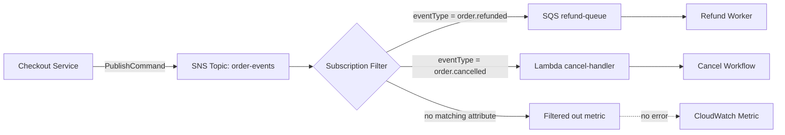

> 한 줄 요약: AWS SNS 메시지 필터는 장애가 없어도 메시지를 버릴 수 있다. 이벤트 기반 아키텍처에서 실제 계약을 보려면 퍼블리셔 코드만 보지 말고 토픽, 구독, 필터 정책을 같이 봐야 한다.

## 왜 지금 이슈인가

이벤트 기반 아키텍처(Event-driven Architecture)는 서비스 사이의 직접 호출을 줄이는 데 도움이 된다. 그런데 운영에서는 문제의 위치가 더 멀리 숨어 보일 때가 많다. 호출 관계가 줄어든 만큼, 메시지가 어디에서 멈췄는지 한눈에 보이지 않는다.

AWS SNS(Simple Notification Service)에서 특히 헷갈리는 부분이 필터 정책(Filter Policy)이다. 퍼블리셔가 토픽에 메시지를 발행하면 `MessageId`가 반환된다. 예외도 없고, 재시도도 없고, 데드 레터 큐(Dead Letter Queue)에도 아무것도 없다.

그런데 구독자는 호출되지 않는다.

선정 글감의 예시는 환불 이벤트다. 결제 서비스가 `OrderRefunded` 이벤트를 SNS 토픽에 발행했고, 호출은 성공했다. 하지만 환불 처리 Lambda는 실행되지 않았다. 원인은 메시지 손실이 아니라 구독 필터 불일치였다.

구독 쪽 필터 정책은 `eventType` 메시지 속성(Message Attribute)을 요구하고 있었다.

```json
{
  "eventType": ["order.refunded", "order.cancelled"]
}
```

하지만 퍼블리셔는 메시지 본문만 보냈고, `MessageAttributes`를 넣지 않았다. SNS는 메시지를 정상적으로 받았고, 필터 조건에 맞지 않는 구독에는 전달하지 않았다.

이런 문제는 GitHub나 개발자 커뮤니티에서 자주 논쟁이 붙는다. 코드는 맞아 보이고, 인프라도 맞아 보이고, 테스트도 통과하는데 실제 업무 이벤트만 빠진다. 장애라기보다 계약 누락에 가깝다. 그래서 더 늦게 발견된다.

## 커뮤니티에서 갈리는 지점

SNS 필터 정책을 둘러싼 논점은 기능 자체가 아니다. 필터링은 유용하다. 하나의 토픽에서 여러 소비자가 필요한 이벤트만 받게 만들 수 있고, 불필요한 Lambda 실행이나 SQS 적재도 줄일 수 있다.

문제는 계약이 어디에 있느냐다.

퍼블리셔 코드를 보면 메시지가 어떤 토픽으로 나가는지는 알 수 있다. 하지만 그 토픽에 붙은 구독들이 어떤 속성을 요구하는지는 보이지 않는다. 필터 정책은 토픽이 아니라 구독에 붙어 있다. 그래서 발행 코드를 리뷰하는 사람은 실제 전달 조건을 놓치기 쉽다.

찬성 쪽은 이렇게 본다.

- 토픽 하나를 이벤트 버스로 쓰면서 소비자별 관심사를 나눌 수 있다.
- 소비자 코드에서 조건문을 반복하지 않아도 된다.
- 메시지 라우팅을 인프라 설정으로 옮겨 운영자가 조정할 수 있다.
- 비용과 노이즈를 줄일 수 있다.

우려 쪽은 다른 지점을 본다.

- 필터 조건이 코드 리뷰 범위 밖에 있다.
- 테스트 더블(Mock)로는 실제 SNS 필터 동작을 재현하기 어렵다.
- 필터 미스는 실패가 아니라 미전달이므로 DLQ로 가지 않는다.
- `NumberOfNotificationsFilteredOut` 같은 메트릭을 보기 전까지는 원인을 추적하기 어렵다.
- AI 코딩 도구도 저장소 밖의 구독 설정을 모르면 잘못된 발행 코드를 그럴듯하게 만든다.

SNS가 위험하다는 뜻은 아니다. 필터 기반 라우팅을 쓰는 순간, 이벤트 계약(Event Contract)이 애플리케이션 코드 밖까지 넓어진다는 뜻이다.

현업에서 비슷한 문제를 만나면 장애 대응 회의가 엉뚱한 곳에서 시작되기 쉽다. 퍼블리셔 로그는 성공, 컨슈머 로그는 없음, DLQ도 없음. 그러면 네트워크, 권한, Lambda 콜드 스타트, 재시도 설정을 뒤진다. 실제 원인은 메시지 속성 하나가 빠진 것일 수 있다.

## 아키텍처 관점에서 볼 점

SNS 필터 정책을 쓰는 구조에서는 메시지 흐름을 발행 성공과 전달 성공으로 나눠 봐야 한다.



퍼블리셔 관점에서는 `PublishCommand`가 성공하면 일이 끝난 것처럼 보인다.

```ts
await sns.send(
  new PublishCommand({
    TopicArn: process.env.ORDER_EVENTS_TOPIC,
    Message: JSON.stringify(refund),
  }),
);
```

하지만 구독 필터가 `eventType`을 요구한다면 이 코드는 불완전하다. 올바른 발행 코드는 메시지 본문뿐 아니라 라우팅에 필요한 속성까지 포함해야 한다.

```ts
await sns.send(
  new PublishCommand({
    TopicArn: process.env.ORDER_EVENTS_TOPIC,
    Message: JSON.stringify(refund),
    MessageAttributes: {
      eventType: {
        DataType: "String",
        StringValue: "order.refunded",
      },
    },
  }),
);
```

아키텍처에서 확인할 지점은 네 가지다.

### SNS 필터 정책은 어디에 있는가?

필터 정책은 토픽 전체의 계약이 아니라 구독별 계약이다. 같은 토픽에 세 개의 구독이 붙어 있으면 각각 다른 조건을 가질 수 있다.

그래서 이벤트 스키마 문서에 `OrderRefunded` payload만 적어서는 부족하다. 메시지 본문 스키마와 라우팅 속성 스키마를 나눠 관리해야 한다.

### FilterPolicyScope는 무엇인가?

SNS 필터 정책은 메시지 속성(MessageAttributes)을 볼 수도 있고, 메시지 본문(MessageBody)을 볼 수도 있다. `FilterPolicyScope`가 `MessageAttributes`라면 `eventType`은 메시지 속성에 있어야 한다. `MessageBody`라면 JSON 본문 안에 있어야 한다.

둘은 운영상 다른 계약이다. 개발자는 같은 `eventType`이라는 이름만 보고 착각하기 쉽지만, SNS는 위치까지 구분한다.

### DLQ는 왜 잡지 못하는가?

데드 레터 큐는 보통 전달 실패를 다룬다. 구독 대상이 실패하거나 재시도 끝에 처리하지 못한 메시지를 보관하는 식이다.

필터 불일치는 전달 실패가 아니다. SNS는 조건에 맞지 않는 구독을 건너뛴다. 그래서 DLQ에 아무것도 없다는 사실은 정상 처리의 증거가 아니다. 아예 전달 시도 자체가 없었다는 신호일 수 있다.

### 테스트는 무엇을 검증하는가?

단위 테스트에서 SNS 클라이언트를 Mock 처리하면 보통 `PublishCommand` 호출 여부만 본다. 이 테스트는 토픽 ARN, payload, 호출 횟수는 확인할 수 있다.

하지만 구독 필터와의 호환성은 확인하지 못한다. 필터 정책이 저장소 밖 AWS 계정에 있기 때문이다. 이 간극은 AI 코딩 도구에도 그대로 적용된다. 도구가 저장소만 읽는다면 구독 설정을 알 수 없고, 기존 코드 패턴이 빠져 있으면 같은 실수를 반복한다.

## 실무에서 볼 점

SNS 필터 정책을 쓰기 전에 먼저 정할 것은 필터를 쓸지 말지가 아니다. 이벤트 계약을 어디에서 검증할지다.

가장 단순한 선택지는 필터 정책을 쓰지 않고 컨슈머가 본문을 보고 무시하는 방식이다. 이 방식은 비용과 노이즈가 늘 수 있지만, 전달 경로는 단순하다. 모든 컨슈머가 메시지를 받고 각자 판단하므로 조용한 미전달은 줄어든다.

반대로 SNS 필터를 쓰면 라우팅은 깔끔해진다. 대신 계약 검증을 별도로 만들어야 한다.

도입 전에 확인할 조건은 다음과 같다.

| 확인 항목 | 봐야 할 질문 |
| --- | --- |
| 이벤트 이름 | 모든 퍼블리셔가 같은 `eventType` 값을 쓰는가 |
| 필터 위치 | `MessageAttributes`와 `MessageBody` 중 어디를 기준으로 필터링하는가 |
| 구독별 요구값 | 같은 토픽의 구독들이 서로 다른 필터 조건을 갖는가 |
| 테스트 방식 | 실제 필터 정책과 발행 코드를 함께 검증하는 테스트가 있는가 |
| 관측성 | `NumberOfNotificationsFilteredOut` 메트릭을 대시보드나 알림에서 보는가 |
| 변경 절차 | 새 구독 필터 추가 시 퍼블리셔 계약도 같이 리뷰되는가 |

실패하기 쉬운 지점은 새 이벤트를 추가할 때다. 기존 토픽에 `order.refunded`를 추가하고, 소비자 구독에는 필터를 넣는다. 퍼블리셔 코드는 payload만 보내도록 작성한다. 리뷰어는 이벤트 본문이 맞는지 보고 승인한다.

이 상태에서는 각자 맡은 일은 했는데 시스템은 깨진다.

그래서 운영 기준은 코드 스타일이 아니라 계약 가시성으로 잡아야 한다. 다음 중 하나는 필요하다.

- SNS 토픽과 구독 필터 정책을 IaC(Infrastructure as Code)로 관리하고 리뷰에 포함한다.
- 이벤트 카탈로그에 payload schema와 routing attributes를 함께 기록한다.
- 통합 테스트에서 실제 또는 로컬 에뮬레이션된 필터 정책을 적용한다.
- 배포 전 검사에서 발행 코드의 `MessageAttributes`와 구독 필터 요구값을 대조한다.
- CloudWatch에서 필터 아웃 메트릭을 토픽별로 본다.

AI 에이전트나 코딩 어시스턴트를 쓰는 팀이라면 한 가지를 더 봐야 한다. 도구가 코드를 생성하기 전에 인프라 계약을 조회할 수 있는지다.

선정 글감은 이 문제를 인프라 그래프와 MCP(Model Context Protocol) 관점에서 풀었다. AWS 계정에서 토픽, 구독, 필터 정책을 읽고, 도구가 `get_topic_details` 같은 질의로 필요한 속성을 알게 하는 방식이다. 여기서 중요한 점은 LLM이 인프라를 추측하게 두지 않는 것이다. 결정적인 인프라 정보를 읽기 전용으로 가져와 컨텍스트에 넣어야 한다.

이 접근은 설득력이 있다. 다만 모든 팀에 바로 맞지는 않는다. AWS 계정 접근 권한, 읽기 전용 권한 범위, 로컬 개발 환경의 인증 방식, IaC와 실제 리소스의 드리프트(Drift) 처리까지 같이 정해야 한다.

작게 시작한다면 더 현실적인 첫 단계도 있다. 토픽별로 필터 정책을 덤프해서 저장소 안 문서나 테스트 fixture로 넣고, 발행 코드 변경 시 함께 갱신하게 만드는 것이다. 자동화 수준은 낮지만 계약이 보이기 시작한다.

## 정리

SNS 메시지 드롭 문제는 메시징 시스템의 신뢰성 문제가 아니라 계약의 위치 문제에 가깝다. 퍼블리셔 코드는 성공했고, SNS 설정도 의도대로 동작했다. 하지만 둘을 함께 검증하는 장치가 없으면 업무 이벤트는 조용히 사라진다.

이벤트 기반 아키텍처를 운영한다면 가장 중요한 SNS 토픽 하나부터 확인해도 된다. 구독 필터 정책을 열고, 현재 퍼블리셔 코드가 그 필터에 필요한 `MessageAttributes` 또는 `MessageBody` 키를 실제로 보내는지 대조해보자.

빠진 속성이 하나라도 나오면 단순한 누락으로 넘기기 어렵다. 코드와 인프라 사이에 아직 문서화되지 않은 계약이 있다는 뜻이다.

## 참고 자료

- [선정 글감] [Why SNS Silently Drops Your Messages and How to Catch It Before You Ship](https://dev.to/siddharth_pandey_27/why-sns-silently-drops-your-messages-and-how-to-catch-it-before-you-ship-1fcm) - DEV Community