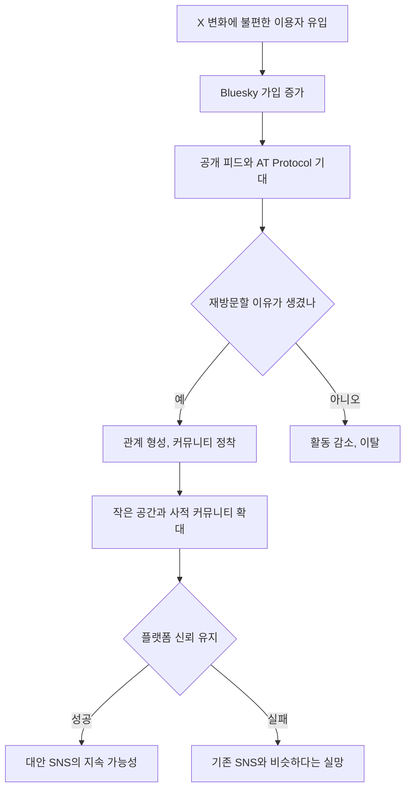

> 한 줄 요약: Bluesky CEO 교체보다 더 큰 쟁점은, 탈중앙 소셜 네트워크가 성장 압박을 받을 때 중앙화된 제품 판단을 어디까지 받아들이느냐다.

## 무슨 일이 있었나

2026년 7월 10일, Bluesky에서 임시 CEO였던 Toni Schneider가 정식 CEO가 됐다. TechCrunch 보도에 따르면 Schneider는 2026년 3월 Jay Graber가 CEO 자리에서 물러나 최고혁신책임자(Chief Innovation Officer)로 이동한 뒤 약 4개월 동안 회사를 이끌었다.

당사자를 구분하면 이렇다.

| 구분 | 확인된 사실 |
|---|---|
| Jay Graber | Bluesky CEO에서 물러나 최고혁신책임자로 이동 |
| Toni Schneider | 임시 CEO에서 정식 CEO로 전환 |
| Automattic | WordPress와 Tumblr의 배후 회사, Schneider가 과거 CEO를 맡았던 회사 |
| True Ventures | Schneider가 파트너로 있는 VC, Bluesky 투자자 |
| Bluesky | X의 변화에 불편함을 느낀 이용자들이 이동한 대표적 대안 소셜 플랫폼 |

Schneider가 밝힌 방향 중 눈에 띄는 대목은 작은 공간과 더 사적인 커뮤니티다. 그는 이 방향에서 다음 성장이 나올 수 있다고 설명했다.

확인된 사실은 CEO 전환, Jay Graber의 역할 변경, Bluesky 사용자 수가 4,300만 명까지 늘었다는 점, 그리고 최근 성장과 유지에 어려움이 있다는 보도다. 반면 Bluesky가 죽어가고 있다는 식의 표현은 일부 관찰과 커뮤니티 반응에 가까운 해석이다. 참여도 감소, 사용자 이탈, 대선 이후 유입과 이후 둔화라는 맥락은 논의되고 있지만, 플랫폼의 장기 생존을 단정할 신호로만 보기는 어렵다.

이번 이슈가 단순한 인사 뉴스로 끝나지 않는 이유가 여기에 있다. Bluesky는 평범한 SNS가 아니라 AT Protocol을 앞세워 같은 소셜 그래프를 여러 앱이 공유할 수 있다는 기대를 받은 플랫폼이다. 그런데 이제 그 플랫폼이 성장 둔화를 맞았고, 정식 CEO는 더 작고 사적인 커뮤니티를 말한다.

## 왜 사람들이 반응했나

Bluesky 사용자들이 민감하게 보는 지점은 CEO 이름 자체가 아니다. 대안 소셜 플랫폼이 결국 기존 플랫폼과 비슷한 성장 논리를 따라가는지, 아니면 다른 운영 원칙을 지킬 수 있는지가 문제다.

X를 떠난 이용자 상당수는 기능 부족만 보고 이동한 것이 아니다. Elon Musk 인수 이후의 정책 변화, 정치적 노출, 콘텐츠 조정 방식, 신뢰 문제에 피로를 느낀 사람들이 Bluesky를 찾았다. 그래서 Bluesky에 대한 기대는 앱 사용성보다 운영 철학에 더 가까웠다.

그런 플랫폼에서 CEO가 바뀌고, 투자자이면서 과거 플랫폼 운영 경험이 있는 인물이 전면에 선다. 커뮤니티가 반응하는 건 자연스럽다.

- 신뢰: 이용자가 떠나온 플랫폼의 문제를 반복하지 않을까
- 권한: 프로토콜은 열려 있어도 제품 결정은 한 회사가 주도하는가
- 비용: 작은 커뮤니티 기능이 운영 비용과 모더레이션 비용을 얼마나 키우는가
- 사용성: 공개 타임라인 중심 경험이 쪼개지면 발견성과 활력이 줄어들지 않는가
- 규제 리스크: 사적인 공간이 늘수록 신고, 유해 콘텐츠, 개인정보 처리 부담이 커지지 않는가

Bluesky의 어려움은 성장 수치만으로 설명하기 어렵다. 대안 플랫폼은 보통 특정 사건을 계기로 급성장한다. X의 정책 변화, 선거, 유명 인사의 이동, 커뮤니티 갈등 같은 외부 충격이 이용자를 밀어 넣는다. 하지만 그 이후에는 전혀 다른 문제가 생긴다.

처음 온 사람은 불만 때문에 들어오지만, 남아 있는 사람은 습관 때문에 남는다. 여기서 소셜 플랫폼은 꽤 단순한 시험을 받는다. 내가 글을 올렸을 때 반응이 오는가. 내가 시간을 쓰고 싶은 사람이 있는가. 내가 떠나면 잃는 것이 있는가.

Bluesky가 작은 공간과 사적인 커뮤니티를 말하는 것도 이 시험과 연결된다. 공개 피드만으로는 모든 이용자를 붙잡기 어렵다. 반대로 커뮤니티를 잘게 나누면, 새 이용자는 어디로 가야 할지 더 모를 수 있다.

커뮤니티에서 오해가 생기기 쉬운 부분도 있다. CEO가 바뀌었다고 해서 Bluesky의 프로토콜 방향이 바로 폐기되는 것은 아니다. AT Protocol은 Bluesky가 다른 앱과 같은 소셜 네트워크를 공유할 수 있게 만드는 기반으로 설명돼 왔다. TechCrunch 보도도 Graber 시기 AT Protocol이 확장됐다고 짚었다.

다만 이용자 입장에서는 프로토콜의 가능성보다 당장 보이는 제품 변화가 더 크게 느껴진다. 홈 피드가 재미있는지, 차단과 신고가 제대로 작동하는지, 커뮤니티 분위기가 안정적인지, 내가 올린 글이 사라지지 않고 관계로 이어지는지가 더 직접적이다.

## 내가 보는 핵심

이번 Bluesky CEO 전환의 핵심은 탈중앙 기술과 중앙화된 제품 운영 사이의 긴장이다.

프로토콜은 분산을 약속할 수 있다. 하지만 성장, 수익, 모더레이션, 커뮤니티 설계는 누군가 빠르게 결정해야 한다. 소셜 네트워크에서는 이 간극이 더 선명하다. 이용자는 자유로운 구조를 원하지만, 동시에 스팸과 괴롭힘이 줄어든 안전한 공간도 원한다. 추천이 덜 조작되길 바라지만, 볼 만한 글은 계속 떠오르길 바란다.

이 요구들은 서로 충돌한다.

작은 커뮤니티를 만들면 친밀감은 올라갈 수 있다. 대신 공개성과 발견성은 줄어들 수 있다. 사적인 공간을 강화하면 이용자는 덜 노출된다고 느낄 수 있다. 대신 운영자는 더 많은 권한 요청, 신고, 접근 제어, 데이터 보관 정책을 다뤄야 한다.

현업에서 비슷한 제품 판단을 하다 보면 커뮤니티 기능은 단순한 화면 추가가 아니다. 그룹, 초대, 비공개 게시물, 멤버 권한, 신고 흐름이 붙는 순간 데이터 모델과 운영 정책이 같이 바뀐다. 처음에는 기능처럼 보이지만 실제로는 거버넌스 설계에 가깝다.

Bluesky가 조심해야 할 지점도 여기에 있다. X의 대안이라는 정체성만으로는 충분하지 않다. 대안은 비교 대상이 있을 때 강하다. 시간이 지나면 이용자는 원래 싫어했던 플랫폼이 아니라 지금 쓰는 앱 자체를 평가한다.

Bluesky가 더 작고 사적인 공간으로 간다면 질문은 하나로 모인다.

플랫폼은 이용자에게 더 많은 통제권을 주는가, 아니면 성장 둔화를 막기 위해 커뮤니티를 더 잘게 포장하는가.

이 차이는 문구로는 구분하기 어렵다. 실제 제품에서 드러난다. 예를 들어 사용자가 자신의 관계망, 피드, 차단 목록, 커뮤니티 참여 기록을 얼마나 가져갈 수 있는지 봐야 한다. 운영 정책이 바뀌었을 때 앱을 떠나는 비용이 얼마나 낮은지도 봐야 한다.

소셜 플랫폼의 신뢰는 선언이 아니라 탈출 가능성에서 나온다. 나갈 수 있는데도 남는 플랫폼과, 나가기 어려워서 남는 플랫폼은 겉으로는 같은 활성 이용자처럼 보인다. 하지만 위기가 왔을 때 반응은 전혀 다르다.

## 앞으로 볼 기준

Bluesky 관련 다음 뉴스를 볼 때는 사용자 수보다 제품 권한의 방향을 먼저 봐야 한다.

첫째, 작은 커뮤니티가 어떤 단위로 설계되는지 확인해야 한다. 단순한 그룹 기능인지, 초대 기반 공간인지, 공개 피드와 분리된 사적 네트워크인지에 따라 리스크가 달라진다.

둘째, AT Protocol과 Bluesky 앱의 관계를 나눠 봐야 한다. 프로토콜은 열려 있다고 해도, 주된 사용 경험이 한 앱에 묶이면 이용자 체감은 중앙화 플랫폼과 비슷해질 수 있다.

셋째, 모더레이션과 권한 위임 구조를 봐야 한다. 작은 커뮤니티가 늘면 중앙 운영팀만으로는 맥락을 모두 판단하기 어렵다. 커뮤니티 관리자에게 권한을 나눠줄지, 신고와 항소 절차를 어떻게 둘지, 투명성 리포트를 어떤 범위로 낼지가 관건이다.

넷째, 투자자와 경영진의 이해관계를 과장 없이 봐야 한다. Schneider가 Automattic CEO 출신이고 True Ventures 파트너이며 두 조직이 Bluesky 투자자라는 사실은 확인된 맥락이다. 이것만으로 이해충돌을 단정할 수는 없다. 다만 성장 압박, 수익화, 플랫폼 통제 방향을 볼 때 참고해야 할 배경인 것은 맞다.

다섯째, 커뮤니티 반응을 단순한 불평으로 넘기면 안 된다. 대안 소셜 플랫폼에서 이용자 불만은 제품 피드백이면서 동시에 정체성 검증이다. 사람들은 버튼 위치보다 약속이 바뀌는 느낌에 더 빨리 반응한다.

Bluesky는 이제 쉬운 질문을 지나왔다. X가 싫은 사람들을 모으는 단계는 분명한 계기가 있을 때 가능했다. 앞으로의 질문은 더 어렵다. X가 싫어서 온 사람들이 Bluesky가 좋아서 남을 수 있는가.

CEO의 임시 꼬리표가 사라진 일은 그래서 인사 이동으로만 볼 수 없다. 탈중앙 소셜 네트워크가 성장 기업이 되는 순간, 커뮤니티는 늘 같은 질문을 던진다. 우리가 믿은 것은 기술이었나, 운영 방식이었나, 아니면 떠날 곳이 있다는 감각이었나.

## 참고 자료

- [선정 글감] [Bluesky’s interim CEO, Toni Schneider, drops the ‘interim’](https://techcrunch.com/2026/07/10/blueskys-interim-ceo-toni-schneider-drops-the-interim/): TechCrunch