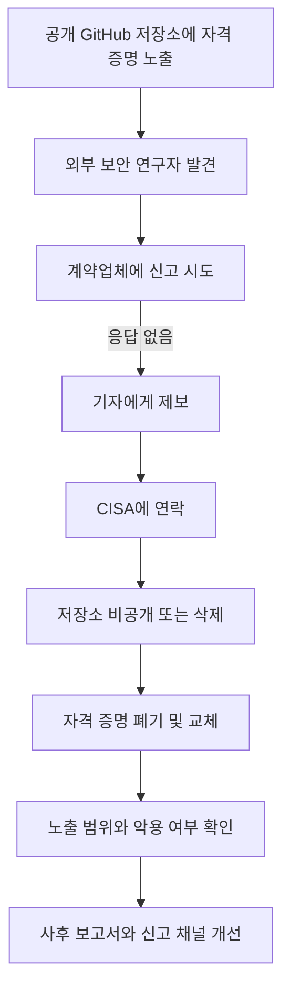

> 한 줄 요약: CISA 사고 대응에서 더 불편한 지점은 GitHub에 노출된 자격 증명을 외부 연구자와 기자가 먼저 발견했는데도, 신고 경로와 의사결정 체계가 뚜렷하지 않았다는 점이다.

## 무슨 일이 있었나

2026년 7월 10일, TechCrunch는 미국 사이버보안·인프라보안국(CISA)의 사후 보고서를 인용해 CISA가 5월 보안 사고 당시 준비된 사고 대응 플레이북 없이 초동 대응을 시작했다고 보도했다.

사건은 공개 GitHub 저장소에서 시작됐다. CISA 계약업체 직원이 미국 정부 시스템 접근에 쓰일 수 있는 민감한 키와 자격 증명을 공개 저장소에 올렸고, GitGuardian 소속 보안 연구자가 이를 발견했다. 연구자는 먼저 해당 계약업체에 알리려 했지만 응답을 받지 못했다. 이후 보안 기자 Brian Krebs에게 제보했고, Krebs가 CISA에 연락한 뒤 저장소가 내려가고 노출된 자격 증명이 폐기·교체됐다는 흐름이다.

확인된 사실과 해석은 나눠 봐야 한다.

| 구분 | 내용 |
|---|---|
| 확인된 사실 | 공개 GitHub 저장소에 민감한 키와 자격 증명이 노출됐다 |
| 확인된 사실 | CISA는 고객 또는 임무 데이터가 노출되지 않았다고 밝혔다 |
| 확인된 사실 | CISA는 연구자 신고 채널이 잘 정의돼 있지 않았다고 인정했다 |
| 확인된 사실 | CISA는 초동 단계에서 플레이북을 만들며 대응해야 했다고 밝혔다 |
| 아직 조심해야 할 해석 | 플레이북 부재가 실제로 몇 시간 또는 며칠의 지연을 만들었는지는 공개되지 않았다 |
| 아직 조심해야 할 해석 | 노출된 자격 증명이 실제 공격에 악용됐다는 증거는 보도 내용 안에 없다 |

문제는 자격 증명 유출 자체만이 아니다. 이런 유출은 어느 조직에서도 일어날 수 있다. 더 중요한 질문은 외부인이 먼저 발견했을 때 조직이 어떤 경로로 제보를 받고, 누가 권한을 갖고, 어떤 순서로 폐기·교체·검증·공지할지를 미리 정해두었느냐다.

## 왜 사람들이 반응했나

### CISA 사고 대응 플레이북이 없었다는 말의 무게

CISA는 미국 연방 네트워크 방어와 주요 인프라 보호를 맡는 기관이다. 그래서 이번 반응은 단순한 조롱으로만 보기 어렵다. 보안 사고는 어느 조직에서도 발생할 수 있지만, 사고가 났을 때 따라야 할 절차까지 없었다는 말은 신뢰 문제로 이어진다.

특히 자격 증명 사고는 초동 대응이 빠를수록 피해 범위를 줄일 수 있다. 저장소를 내리고, 키를 폐기하고, 새 키를 배포하고, 기존 로그에서 악용 흔적을 찾는 일이 서로 맞물려 있다. 한 단계가 늦어지면 나머지 판단도 불확실해진다.

현업 상황으로 바꿔 보면 더 선명하다. Slack이나 이메일로 제보가 들어왔는데, 이것을 보안 사고로 볼지 운영 이슈로 볼지, 계약업체 책임으로 둘지 내부 사고로 볼지 정해져 있지 않으면 담당자는 바로 움직이기 어렵다. 그 사이 노출된 키는 여전히 유효할 수 있다.

### 보안 연구자 신고 경로가 흐리면 선의가 우회한다

이번 사건에서 불편한 대목은 연구자가 먼저 계약업체에 알리려 했지만 응답을 받지 못했다는 점이다. 이후 기자를 거쳐 CISA가 움직였다. 결과적으로 문제는 처리됐지만, 정상적인 취약점 신고 경로라고 보기는 어렵다.

보안 연구자에게 필요한 것은 거창한 환대가 아니다. 최소한 다음 정보는 공개돼 있어야 한다.

- 어디로 신고해야 하는가
- 어떤 정보를 포함해야 하는가
- 언제까지 접수 확인을 받을 수 있는가
- 법적 위협 없이 선의의 신고를 할 수 있는가
- 계약업체와 원청 기관 중 누가 책임지고 대응하는가

신고 경로가 애매하면 연구자는 조직 내부보다 언론, 소셜 미디어, 공개 이슈 트래커 같은 우회로를 택하게 된다. 그때부터 사고 대응은 기술 절차보다 평판 대응에 가까워진다.

### 랜섬웨어 협상가 사건이 보여주는 내부자 리스크

같은 날 TechCrunch가 보도한 플로리다 랜섬웨어 협상가 유죄 사건은 다른 각도에서 이번 이슈를 보강한다. 보도에 따르면 Angelo Martino는 사이버보안 회사의 랜섬웨어 협상가로 일하면서 BlackCat 계열 공격에 가담한 혐의로 5년 이상의 형을 선고받았다. 미국 법무부는 암호화폐와 자산 1,000만 달러 이상을 압수했다고 밝혔다.

이 사례는 보안 생태계가 선의의 전문가만으로 움직이지 않는다는 점을 보여준다. 사고 대응 회사, 협상가, 보험, 계약업체, 클라우드 운영자, 정부 기관이 한 흐름에 묶이면 신뢰 경계가 흐려진다. 누가 방어자인지, 누가 이해관계자인지, 누가 접근권을 가졌는지 계속 확인해야 한다.

CISA 사건도 같은 질문을 던진다. 계약업체 직원이 공개 저장소에 자격 증명을 올렸다면, 원청 기관은 계약업체의 개발·배포·비밀 관리 방식을 어느 정도까지 점검하고 있었나. 자격 증명 스캔은 있었나. 공개 저장소 업로드를 막는 정책은 있었나. 사고 이후 키 교체만으로 끝내기 어려운 이유가 여기에 있다.

### 사이버보안이라는 말이 너무 넓어질 때

Schneier on Security가 소개한 Cybersecurity Mission Creep 논의도 이 사건과 맞닿아 있다. 요지는 여러 정책 이슈가 사이버보안 문제로 재포장되면서 긴급성과 예외성이 붙고, 전문가 판단에 대한 과도한 위임이 생길 수 있다는 것이다.

이 관점에서 보면 CISA 사건은 양면적이다. 한편으로는 보안 기관에 더 많은 권한과 예산, 인력이 필요하다는 주장으로 이어질 수 있다. 다른 한편으로는 보안이라는 이름 아래 실제 운영 절차의 부실함이 가려져서는 안 된다는 반론도 가능하다.

보안은 만능 명분이 아니다. 플레이북, 감사 로그, 키 회전, 신고 채널, 책임자 지정 같은 운영 항목이 빠져 있다면, 보안이라는 큰 단어는 오히려 문제를 흐리게 만든다.

## 내가 보는 핵심

### 문제는 사고가 아니라 사고를 받을 준비다

이번 사건을 CISA도 실수한다는 식으로 소비하면 남는 것이 많지 않다. 더 중요한 대목은 조직이 외부 신호를 받아들이는 방식이다.

보안 사고는 내부 모니터링에서만 발견되지 않는다. 연구자, 기자, 고객, 경쟁사, 오픈소스 커뮤니티, 클라우드 사업자, 검색엔진 캐시에서 발견될 수 있다. 그래서 사고 대응 체계는 내부 탐지 이후의 절차만 다루면 부족하다.

실제로 필요한 플레이북은 이런 질문에 답해야 한다.

- 외부 제보를 누가 1차로 받는가
- 제보자가 계약업체 문제를 신고했을 때 원청은 어떻게 개입하는가
- 노출된 자격 증명의 권한 범위를 어떻게 즉시 식별하는가
- 키 교체 뒤 기존 세션과 토큰은 어떻게 무효화하는가
- 악용 흔적이 없다는 판단은 어떤 로그로 검증하는가
- 사후 공지는 어느 범위까지 공개하는가

이 질문들은 화려하지 않다. 하지만 사고 당일에는 이런 답들이 대응 속도를 좌우한다.

### 물 공급 워게임이 보여준 2차 피해의 감각

WIRED가 다룬 미국 수도 인프라 워게임 기사도 같은 원칙을 더 큰 규모로 보여준다. 기사 속 시뮬레이션은 2027년 7월 직전, 해커가 미국 전역의 수도 유틸리티 5,000곳을 방해하는 가상 상황을 다뤘다. 물 공급 중단은 병원, 냉장 물류, 의약품 제조, 데이터센터 냉각으로 번진다.

이 이야기를 CISA 사건에 그대로 대입할 수는 없다. 이번 사건에서 그런 피해가 발생했다는 뜻도 아니다. 다만 사고 대응에서 정말 어려운 부분은 1차 원인보다 2차 효과를 파악하는 일이다.

자격 증명 하나가 어디까지 닿는지 모르면, 조직은 과소 대응과 과잉 대응 사이에서 흔들린다. 너무 좁게 보면 침해 범위를 놓친다. 너무 넓게 보면 정상 서비스까지 멈춘다. 준비된 플레이북은 이 판단을 자동화하지는 못해도, 최소한 판단 순서를 제공한다.

### 정부 기관이라서 더 엄격해야 하지만, 정부만의 문제는 아니다

CISA는 2025년 1월 도널드 트럼프 2기 행정부 출범 이후 정식 국장이 없는 상태였고, 인력 감축·휴직·해고의 영향을 받았다고 보도됐다. TechCrunch는 그 규모가 전체 인력의 약 3분의 1에 영향을 미쳤다고 전했다.

이 맥락은 사고를 설명하는 배경이 될 수 있다. 다만 면죄부는 아니다. 인력이 줄면 더더욱 플레이북이 필요하다. 사람이 부족한 조직일수록 암묵지에 기대면 안 된다. 담당자가 바뀌어도 돌아가는 절차가 있어야 한다.

민간 조직도 다르지 않다. 스타트업은 빠르게 만들다가 비밀 관리가 흐려지고, 대기업은 계약업체와 계열사 경계에서 책임이 흐려진다. 공공기관은 조달과 위계 때문에 신고 경로가 느려질 수 있다. 형태는 달라도 실패 패턴은 비슷하다.

## 앞으로 볼 기준

### 다음 CISA 같은 보안 사고에서 무엇을 확인해야 하나

앞으로 비슷한 뉴스를 볼 때는 유출 여부만 보지 말고 다음 기준을 함께 봐야 한다.

| 체크포인트 | 봐야 할 질문 |
|---|---|
| 탐지 출처 | 내부 탐지였나, 외부 연구자·기자·고객 제보였나 |
| 신고 경로 | 제보자가 공식 채널로 접수할 수 있었나 |
| 권한 범위 | 노출된 키가 어떤 시스템과 데이터에 접근할 수 있었나 |
| 폐기 절차 | 키 교체뿐 아니라 세션·토큰·파생 권한까지 무효화했나 |
| 악용 검증 | 로그 기준과 조사 기간을 공개했나 |
| 계약업체 책임 | 원청과 협력사의 역할이 구분됐나 |
| 사후 개선 | 플레이북, 교육, 자동 스캔, 공개 신고 채널이 실제로 바뀌었나 |

여기서 자주 빠지는 항목은 악용 검증이다. 데이터가 노출되지 않았다는 말과 악용 흔적을 찾지 못했다는 말은 다르다. 고객 데이터가 노출되지 않았다는 말과 임무 수행에 필요한 운영 정보가 안전했다는 말도 다르다. 표현이 비슷해 보여도 범위가 다르면 의미가 달라진다.

### 보안 사고 대응 플레이북은 문서가 아니라 권한 설계다

플레이북을 문서 템플릿으로만 보면 실패한다. 실제 플레이북은 권한 설계에 가깝다. 누가 저장소를 내릴 수 있는지, 누가 키를 폐기할 수 있는지, 누가 계약업체에 강제 조치를 요구할 수 있는지, 누가 외부 연구자에게 답할 수 있는지가 정해져야 한다.

그래서 좋은 사고 대응 문서는 길이가 아니라 실행 가능성으로 판단해야 한다. 새벽에도 담당자가 찾을 수 있어야 하고, 법무·홍보·보안·운영이 서로 다른 말을 하지 않아야 하며, 계약업체가 응답하지 않을 때의 우회 권한이 있어야 한다.

CISA의 이번 사후 보고서는 불편하지만 쓸모 있는 고백이다. 방어 기관도 사고 중에 절차를 만들 수밖에 없었다면, 다른 조직은 자기 상태를 더 냉정하게 봐야 한다. 공개 GitHub에 키가 올라가는 사고를 완전히 없애기는 어렵다. 하지만 그 키를 발견한 사람이 누구든, 조직 안으로 빠르게 들어올 수 있는 문은 미리 만들어둘 수 있다.

## 참고 자료

- [선정 글감] [US cybersecurity agency CISA had to build its incident playbook during the incident, agency reveals](https://techcrunch.com/2026/07/10/us-cyber-agency-cisa-had-to-build-its-incident-playbook-during-the-incident-agency-reveals/) — TechCrunch
- [관련] [Florida ransomware negotiator convicted for helping ransomware gang extort US companies](https://techcrunch.com/2026/07/10/florida-ransomware-negotiator-convicted-for-helping-ransomware-gang-extort-us-companies/) — TechCrunch
- [관련] [Cybersecurity Mission Creep in the US](https://www.schneier.com/blog/archives/2026/07/cybersecurity-mission-creep-in-the-us.html) — Schneier on Security
- [관련] [What Happens if China Hacks the US Water Supply? I Went to a Secret War Game to Find Out](https://www.wired.com/story/what-happens-if-china-hacks-the-us-water-supply-war-game-volt-typhoon/) — WIRED Security