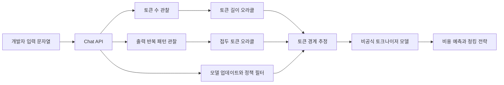

> 한 줄 요약: 폐쇄형 LLM 토크나이저를 Chat API만으로 재구성할 수 있을까. 이 질문이 눈길을 끈 건 해킹 놀이여서가 아니다. 모델 API가 내부 동작을 어디까지 새어 나오게 하는지, 플랫폼이 어느 선까지 예측 가능성을 책임져야 하는지 건드렸기 때문이다.

## 무슨 일이 있었나

Reddit LocalLLaMA에 폐쇄형 LLM 토크나이저를 Chat API만으로 재구성할 수 있는지 묻는 글이 올라왔다. 제공된 자료만으로는 게시 날짜를 확인할 수 없다. 논의의 초점은 꽤 분명하다.

작성자는 Chat API에서 두 가지 관찰 지점을 얻을 수 있다고 봤다.

- 토큰 길이 오라클(Token Length Oracle): 임의 문자열 `s`를 넣었을 때 `tokenize(s)`의 길이를 알 수 있는 기능
- 접두 토큰 오라클(Prefix Token Oracle): 문자열 `s`와 정수 `n`을 넣었을 때 `tokenize(s)`의 앞 `n`개 토큰을 다시 디코딩한 문자열을 얻는 기능

첫 번째는 많은 API에서 비용 계산, 컨텍스트 길이 제한, 사전 검증 같은 형태로 이미 간접 제공된다. 더 민감한 쪽은 두 번째다. 작성자는 모델이 특정 텍스트를 통제된 방식으로 반복하게 만들면, 일반 채팅 인터페이스에서도 앞부분 토큰 경계를 추정할 수 있다고 본다.

예를 들어 문자열이 `abc`일 때 토크나이저가 `(a, bc)`로 자르는지 `(ab, c)`로 자르는지는 토큰 개수만 보고 구분하기 어렵다. 접두 토큰 오라클이 있으면 병합 순서(merge order)의 모호성을 줄일 수 있다. 질문은 여기로 모인다. 이 두 오라클만으로 토큰 ID는 달라도 토큰 경계가 같은 등가 토크나이저를 만들 수 있느냐다.

확인된 내용과 해석은 나눠서 봐야 한다.

| 구분 | 내용 |
|---|---|
| 확인된 사실 | 글은 Chat API에서 관찰 가능한 두 오라클을 전제로 폐쇄형 토크나이저 재구성 가능성을 묻는다 |
| 확인된 사실 | 목표는 토큰 ID 복제가 아니라 임의 입력의 토큰 분할 경계를 맞추는 등가 토크나이저다 |
| 글의 주장 | 모델을 통제된 방식으로 반복 출력하게 만들면 접두 토큰 오라클을 만들 수 있다는 아이디어다 |
| 아직 추정 | 특정 상용 API에서 이 방법이 안정적으로 통한다는 증거는 제공된 자료만으로 확인되지 않는다 |
| 아직 추정 | 전체 어휘와 병합 규칙을 실용적 비용 안에서 완전히 복원할 수 있는지는 별도 검증이 필요하다 |

## 왜 사람들이 반응했나

이 글이 흥미로웠던 건 토크나이저가 아주 은밀한 기술이라서만은 아니다. 많은 오픈소스 모델은 토크나이저를 공개하고 있고, BPE(Byte Pair Encoding)나 SentencePiece 같은 방식도 개발자에게 낯설지 않다.

사람들이 본 건 API 표면이다. 사용자가 모델 가중치도, 토크나이저 파일도, 서버 내부 로그도 보지 못하는데 반복 질의만으로 내부 경계를 복원할 수 있다면, 폐쇄형 플랫폼의 비공개 범위가 생각보다 얇을 수 있다.

### API가 보여주는 것은 정말 출력뿐인가

일반적인 Chat API는 입력과 출력만 제공하는 것처럼 보인다. 하지만 토큰 수, 최대 컨텍스트 길이, 비용 청구 단위, 스트리밍 조각, 반복 출력 패턴은 모두 부수 채널(side channel)이 될 수 있다.

개발자 커뮤니티가 이런 질문에 반응하는 이유도 여기에 있다. 시스템은 결과값만 제공한다고 말하지만, 사용자는 지연 시간, 오류 메시지, 길이 제한, 잘림 위치, 과금 단위에서 내부 구조를 읽어낸다.

토크나이저 재구성 논의도 같은 계열에 있다. 보안 사고라고 단정할 수는 없지만, 플랫폼 경계가 어디에 그어져 있는지 다시 보게 만든다.

### 사용자가 알아도 되는 정보인가

토큰 경계는 개발자에게 실용적인 정보다. 프롬프트 최적화, 비용 예측, 검색 증강 생성(RAG) 청킹, 로그 저장, 캐시 키 설계에 영향을 준다. 폐쇄형 모델이라도 토큰 수 계산 도구를 원하는 요구는 자연스럽다.

문제는 플랫폼 입장에서 토크나이저가 제품 구현의 일부일 수 있다는 점이다. 모델 교체, 라우팅, 압축, 안전 필터, 멀티모달 입력 처리까지 얽히면 토큰화 방식은 단순한 유틸리티 파일이 아니라 운영 정책의 일부가 된다.

여기서 충돌이 생긴다. 개발자는 예측 가능성을 원하고, 플랫폼은 내부 구현을 바꿀 여지를 원한다. 둘 다 무리한 요구라고 보기는 어렵다.

### 실험은 싸 보여도 대규모 질의는 다르다

두 오라클을 이용한 복원은 이론적으로는 깔끔해 보인다. 하지만 실제 API에서는 비용, 레이트 리밋(rate limit), 출력 불안정성, 안전 필터, 모델 업데이트가 끼어든다.

특히 접두 토큰 오라클을 모델 출력으로 만든다는 발상은 모델이 항상 같은 방식으로 반복해 준다는 전제를 깔고 있다. 온도(temperature)를 0에 가깝게 두더라도 채팅 모델은 순수 디코더 함수가 아니다. 지시문을 해석하고, 안전 정책을 거치고, 때로는 형식을 고친다.

커뮤니티가 반응한 지점은 이 방법이 당장 완벽하다는 데 있지 않다. 닫힌 API에서도 이런 질문을 던질 수 있다는 점이 개발자의 호기심과 플랫폼의 리스크 관리를 동시에 건드린다.

### 공개 토크나이저가 없으면 실무가 불편하다

현업에서 비슷한 고민을 하다 보면 토크나이저는 모델 품질보다 먼저 운영 문제로 튀어나온다. 같은 문서라도 모델마다 토큰 수가 다르고, 한국어, 코드, 이모지, URL이 섞이면 예상보다 빨리 컨텍스트가 찬다.

토크나이저가 공개되어 있지 않으면 다음 작업이 불안정해진다.

- 사전 비용 산정
- 청크 크기 결정
- 프롬프트 템플릿 검증
- 캐시 적중률 계산
- 장애 시 원인 분석
- 모델 교체 전 회귀 테스트

그래서 사용자는 내부 구현을 훔쳐보고 싶다기보다, 운영 가능한 수준의 예측 가능성을 요구한다. 이 논의가 역공학 놀이로만 보이지 않는 이유다.

## 내가 보는 핵심

이 이슈에서 중요한 건 폐쇄형 토크나이저를 재구성할 수 있느냐보다, 관찰 가능한 API가 결국 계약(contract)처럼 쓰인다는 점이다.

플랫폼은 문서에 적은 것만 계약이라고 생각하기 쉽다. 하지만 개발자는 반복해서 관찰되는 동작을 코드에 반영한다. 토큰 수가 어떤 방식으로 변하는지, 문자열이 어디서 잘리는지, 같은 입력에 같은 출력이 나오는지가 모두 구현의 일부가 된다.

문제는 이 암묵적 계약이 깨질 때다. 모델 제공자가 토크나이저를 조용히 바꾸면 사용자의 프롬프트 길이 계산, 청킹 전략, 비용 예측이 흔들릴 수 있다. 반대로 플랫폼이 토크나이저를 공개하지 않으면, 사용자는 비공식 오라클을 만들어 빈칸을 메우려 한다.

이 관계를 간단히 그리면 이렇다.

여기서 봐야 할 것은 `H`가 얼마나 정확한지가 아니다. `H`가 생길 만큼 공식 인터페이스가 부족했는지다.

닫힌 플랫폼은 내부 구현을 숨길 수 있다. 하지만 숨긴 정보가 사용자의 운영 안정성과 직접 연결되면, 커뮤니티는 관찰과 역추정으로 빈칸을 채운다. 이때 플랫폼은 두 선택지 앞에 선다.

하나는 충분한 공식 도구를 제공하는 길이다. 토큰 수 계산기, 버전 고정, 변경 공지, 모델별 컨텍스트 정책, 과금 기준을 명확히 제공한다. 그러면 사용자는 역공학보다 문서화된 경로를 택할 가능성이 높다.

다른 하나는 내부 구현을 더 강하게 흐리는 길이다. 출력 반복을 제한하고, 토큰 단위 힌트를 줄이고, 모델 라우팅을 동적으로 바꾼다. 정보 노출은 줄어들 수 있지만, 개발자 경험은 더 예측하기 어려워진다.

다툼은 이 지점에 있다. 토크나이저 파일 하나를 공개하느냐 마느냐가 아니라, 폐쇄형 AI API가 어느 수준까지 재현 가능해야 하는가의 문제다.

## 앞으로 볼 기준

다음에 비슷한 뉴스나 커뮤니티 논쟁을 볼 때는 복원 성공 여부만 보면 부족하다. 아래 기준을 함께 봐야 한다.

### 1. 토큰 정보가 제품 계약에 포함돼 있는가

API 문서가 토큰 수 계산 방법을 명확히 제공하는지 봐야 한다. 모델 이름별로 토크나이저가 고정되는지, 업데이트 시 공지가 있는지, 과거 버전을 유지할 수 있는지도 확인해야 한다.

토큰 수가 비용과 장애의 기준이라면, 이것은 단순 편의 기능이 아니다. 운영 계약에 가깝다.

### 2. 오라클이 실제로 안정적인가

토큰 길이 오라클은 상대적으로 안정적일 수 있다. 하지만 접두 토큰 오라클은 모델 출력에 기대는 순간 불확실성이 커진다. 안전 필터, 시스템 프롬프트, 출력 포맷 보정, 샘플링 설정이 모두 영향을 준다.

그래서 이런 실험을 볼 때는 한두 예시보다 재현 조건을 봐야 한다. 같은 문자열을 여러 번 넣었을 때 같은 경계가 나오는지, 한국어, 공백, 이모지, 코드, 긴 URL에서도 유지되는지, 모델 업데이트 이후에도 같은지 확인해야 한다.

### 3. 플랫폼 리스크가 보안 문제인지 운영 문제인지 구분해야 한다

이 논의는 곧바로 보안 침해라고 부르기 어렵다. 토큰 경계는 모델 가중치나 학습 데이터와 다르다. 다만 API가 의도하지 않은 내부 정보를 반복 질의로 드러내는 구조라면, 같은 패턴이 다른 영역에서도 나타날 수 있다.

예를 들어 다음 정보가 비슷한 방식으로 노출된다면 위험도가 달라진다.

- 안전 필터의 경계 조건
- 라우팅되는 내부 모델 종류
- 시스템 프롬프트 일부
- 캐시 적중 여부
- 사용자별 정책 차이
- 문서 검색 인덱스의 존재 여부

토크나이저 재구성은 이 목록의 앞단에 있는 신호일 수 있다. 그래서 가볍게 볼 일도, 과장해서 볼 일도 아니다.

### 4. 실무에서는 비공식 복원에 의존하지 말아야 한다

비공식 토크나이저를 만들어 비용 예측에 쓰는 것은 실험으로는 흥미롭다. 하지만 운영 코드의 핵심 경로에 넣는 순간 위험해진다. 플랫폼이 모델을 바꾸면 조용히 틀릴 수 있고, 레이트 리밋이나 정책 변경으로 검증 경로가 막힐 수도 있다.

실무에서는 다음 순서가 더 현실적이다.

- 공식 토큰 계산 도구가 있으면 그것을 우선 사용한다
- 없으면 충분한 여유 버퍼를 둔다
- 청크 크기를 토큰 한계에 딱 맞추지 않는다
- 모델 업데이트 전후로 대표 입력 세트를 회귀 테스트한다
- 비용 예측과 실제 청구량 차이를 모니터링한다
- 토크나이저 추정값은 힌트로만 사용한다

이 이슈는 닫힌 모델을 열어젖히자는 주장보다 더 현실적인 질문을 남긴다. 사용자가 안정적인 서비스를 만들려면 어느 정도의 내부 정보가 필요하고, 플랫폼은 그 정보를 어떤 형태로 제공해야 하는가.

폐쇄형 API의 장점은 구현을 신경 쓰지 않아도 된다는 데 있다. 그런데 비용, 길이 제한, 장애 대응은 구현을 모르면 다루기 어렵다. 커뮤니티가 토크나이저 경계를 추적하기 시작했다면, 그것은 호기심만의 결과가 아니다. 공식 인터페이스가 아직 현업의 질문을 다 받아내지 못하고 있다는 신호다.

## 참고 자료

- [선정 글감] [Can we reconstruct a closed-source LLM tokenizer using only two oracles from the chat API?](https://www.reddit.com/r/LocalLLaMA/comments/1utc5b9/can_we_reconstruct_a_closedsource_llm_tokenizer/), Reddit LocalLLaMA