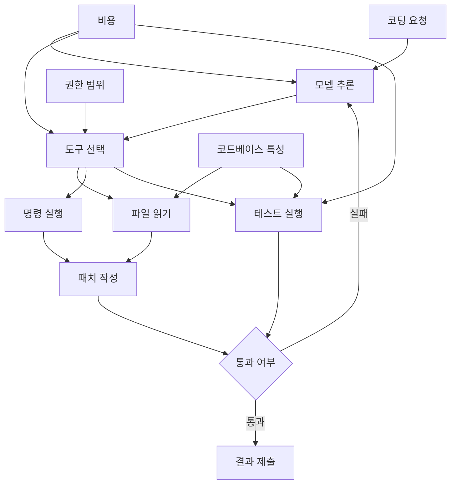

> 한 줄 요약: AI 코딩 에이전트 벤치마크를 볼 때는 어느 모델이 1등인지보다, 같은 코드베이스에서 어떤 권한과 도구, 비용 구조로 실패를 줄였는지를 봐야 한다.

## 무슨 일이 있었나

Reddit LocalLLaMA에서 Databricks의 코딩 에이전트 벤치마크가 화제가 됐다. 게시글의 핵심은 Databricks가 자사 대규모 코드베이스에서 여러 AI 코딩 에이전트를 비교했고, pi-coding-agent가 Claude Code나 Codex 계열보다 비용 면에서 약 2배 유리하면서도 높은 통과율을 보였다는 해석이다.

같은 글에는 GLM 5.2가 고성능 폐쇄형 모델과 비슷한 수준의 코딩 성능을 보였다는 주장도 붙었다. 다만 이 수치는 범용 지능 순위가 아니다. Databricks의 코드베이스, 태스크 구성, 평가 방식, 도구 사용 방식 안에서 나온 결과다.

2026년 7월 11일 기준으로, 제공된 자료에서 확인 가능한 사실과 해석을 나누면 이렇다.

| 구분 | 내용 |
|---|---|
| 확인된 사실 | Reddit에서 Databricks 벤치마크 결과를 두고 pi-coding-agent, Claude Code, Codex, GLM 5.2 비교가 논의됐다 |
| 확인된 사실 | 보조 사례로 GLM 5.2를 일반 PC에서 실행하려는 Colibri 프로젝트가 공유됐다 |
| 확인된 사실 | Anthropic은 2026년 7월 6일 앨버타 주정부가 Claude Code로 4억 6,600만 줄의 코드를 20시간 동안 검토했다고 발표했다 |
| 추정 또는 해석 | pi-coding-agent가 모든 조직에서 더 싸고 낫다는 결론 |
| 추정 또는 해석 | GLM 5.2가 모든 코딩 작업에서 Opus, GPT 계열과 동급이라는 결론 |
| 추정 또는 해석 | LM Arena 같은 공개 리더보드가 더 이상 실무 모델 선택에 충분하지 않다는 주장 |

논의는 단순한 모델 순위에서 시작되지 않았다. 비용, 도구 호출 수, 로컬 실행 가능성, 공개 리더보드의 대표성, 보안 검토 자동화가 함께 묶였다. 그래서 커뮤니티 반응도 성능표 하나를 보고 끝나는 분위기는 아니었다.

## 왜 사람들이 반응했나

### AI 코딩 에이전트 벤치마크는 왜 불편한가

개발자들이 먼저 걸리는 지점은 평가 단위다. 예전에는 모델이 문제를 맞혔는지, 코드를 생성했는지, 테스트를 통과했는지를 주로 봤다. 코딩 에이전트에서는 그것만으로 부족하다.

에이전트는 모델 하나가 아니라 실행 환경이다. 셸을 쓸 수 있는지, 파일을 읽고 고칠 수 있는지, 테스트를 몇 번 돌리는지, 실패 후 되돌리는지, 컨텍스트를 얼마나 보관하는지가 결과에 직접 영향을 준다.

pi-coding-agent가 bash 중심의 최소 도구 접근으로 더 싸게 보였다는 해석은 여기서 나온다. 도구가 적으면 불리해 보일 수 있지만, 실제로는 선택지가 줄어 불필요한 왕복이 줄어들 수 있다. 반대로 도구가 많은 에이전트는 더 똑똑해 보이지만, 태스크에 따라 호출 비용과 실패 지점이 늘어난다.

현업에서 비슷한 고민을 하다 보면 모델 가격표보다 더 자주 부딪히는 것은 턴 수다. 한 번의 답변이 비싸서가 아니라, 같은 문제를 해결하기 위해 파일 탐색, 명령 실행, 테스트, 재시도를 몇 바퀴 도는지가 총비용을 밀어 올린다.

### GLM 5.2와 오픈 모델 반응이 큰 이유

GLM 5.2가 폐쇄형 상위 모델과 비슷한 코딩 성능을 보였다는 말이 커뮤니티에서 크게 반응한 이유도 단순하다. 기업에서 코딩 에이전트는 소스코드, 로그, 내부 문서, 취약점 정보를 다룬다. 성능이 비슷하다면 다음 질문은 바로 데이터 경계로 넘어간다.

외부 API로 보낼 것인가. 자체 인프라에서 돌릴 것인가. 일부 태스크만 로컬 모델로 분리할 것인가. 이 선택은 단순한 비용 문제가 아니라 운영 판단이다.

Colibri 프로젝트가 GLM 5.2를 32GB RAM 수준의 일반 머신에서 돌리려 했다는 사례도 그래서 관심을 받았다. 원문 설명에 따르면 GLM 5.2는 744B 파라미터 규모의 Mixture-of-Experts 모델이지만, 토큰당 활성화되는 파라미터는 약 40B다. 라우팅된 전문가를 디스크에서 스트리밍해 메모리 부담을 낮추는 방식이다. dense 부분은 int4로 RAM에 두고, 전문가 레이어는 디스크와 LRU 캐시, OS 페이지 캐시를 활용한다고 설명한다.

이런 접근은 실무 선택지를 넓힌다. 모든 조직이 초대형 GPU 클러스터를 갖춰야만 대형 모델을 실험할 수 있는 것은 아니라는 기대가 생긴다. 물론 느린 추론, 디스크 I/O, 품질 저하, 운영 복잡도는 남는다. 그래도 로컬 실행 가능성 자체가 보이면 데이터 반출이 어려운 조직에는 의미가 있다.

### LM Arena 논쟁은 순위표에 대한 피로다

또 다른 보조 레퍼런스에서는 LM Arena가 새 오픈 모델을 충분히 반영하지 않는다는 불만이 나왔다. Qwen3.6 계열이나 Step 3.7 flash 같은 모델이 빠져 있다는 지적이다.

이 불만은 특정 사이트 하나를 공격한다기보다 공개 리더보드 방식의 한계를 보여준다. 리더보드는 모델을 빠르게 비교하게 해주지만, 실제 조직의 코드베이스, 권한 모델, 테스트 환경, 보안 요구사항을 대신하지 못한다.

특히 코딩 에이전트는 채팅 선호도 평가와 다르다. 사용자에게 더 자연스럽게 답한 모델이 레거시 저장소에서 더 안전하게 패치한다는 보장은 없다. 반대로 채팅에서는 덜 매끄러운 모델이 명령 실행과 테스트 루프에서는 더 안정적일 수도 있다.

### 정부 보안 사례가 같이 읽히는 이유

Anthropic의 앨버타 주정부 사례는 다른 방향에서 같은 질문을 던진다. Anthropic 발표에 따르면 앨버타 주정부는 2025년부터 Claude Code를 사용해 정부 시스템의 취약점을 찾고 수정했으며, 27개 부처, 약 1,280개 애플리케이션, 3,400개 코드 저장소를 대상으로 작업했다. 4억 6,600만 줄의 코드를 20시간에 검토했다는 수치도 제시됐다.

이 사례가 눈에 띄는 이유는 정부 시스템이라는 맥락 때문이다. 오래된 코드, 부족한 문서, 민감정보, 공공 서비스 중단 위험이 겹친 곳에서 코딩 에이전트를 쓴 것이다. 여기서는 모델 성능보다 감사 가능성, 접근 권한, 수정 검토, 책임 소재가 더 크게 보인다.

질문은 같다. AI가 코드를 고쳤다는 사실보다, 어떤 범위까지 읽었고, 어떤 수정은 자동화했으며, 누가 승인했고, 실패했을 때 어떻게 되돌렸는지가 더 실무적이다.

## 내가 보는 핵심

### 코딩 에이전트 선택 기준은 모델명이 아니라 작업 경계다

이번 논의의 핵심은 오픈 모델이 폐쇄형 모델을 이겼다거나, 특정 에이전트가 더 싸다는 말에 있지 않다. 코딩 에이전트 평가는 모델 비교보다 운영 설계 비교에 가까워지고 있다.

같은 모델도 도구 권한이 다르면 다른 제품이 된다. 같은 에이전트도 코드베이스가 다르면 성능이 달라진다. 같은 벤치마크 결과도 비용 계산에 프롬프트 토큰, 도구 호출, 테스트 시간, 실패 재시도, 사람 검토 시간이 들어갔는지에 따라 해석이 바뀐다.

그래서 Databricks 사례를 볼 때도 순위보다 평가 조건을 먼저 봐야 한다.

- 코드베이스 규모와 언어 구성이 무엇인가
- 태스크가 버그 수정인지, 리팩터링인지, 테스트 작성인지
- 에이전트가 셸과 테스트를 어느 수준까지 쓸 수 있었는지
- 실패한 변경을 어떻게 판정했는지
- 비용에 모델 호출만 넣었는지, 전체 작업 시간을 넣었는지
- 보안상 외부 API 사용이 허용되는 코드였는지

이 항목이 빠지면 벤치마크는 구매 근거라기보다 홍보 이미지에 가까워진다. 반대로 이 항목이 공개되면 특정 회사의 결과라도 실무 판단에 참고할 수 있다.

### 비용은 토큰 가격보다 실패 루프에서 나온다

pi-coding-agent가 약 2배 저렴하다는 Reddit 해석이 관심을 받은 이유는 비용 감각을 건드렸기 때문이다. 개발팀이 체감하는 AI 비용은 월 구독료만이 아니다. 실패한 패치를 리뷰하는 시간, 깨진 테스트를 되돌리는 시간, 잘못된 수정이 배포 전까지 숨어 있는 위험까지 포함된다.

작은 모델이 더 적은 턴으로 끝낸다면 빠른 토큰 생성보다 유리할 수 있다. 보조 레퍼런스의 27B 모델 사례에서도 비슷한 이야기가 나온다. 한 사용자는 27B 모델이 중립적인 시스템 프롬프트에서 모든 에이전트 태스크를 6~9회 도구 호출로 통과했고, 75B 모델은 튜닝된 프로필이 필요했으며 턴 수도 더 많았다고 주장했다.

이건 검증된 보편 법칙이 아니다. 개인 실험과 특정 환경의 결과다. 그래도 방향은 분명하다. 에이전트에서는 더 큰 모델이 항상 더 싼 모델은 아니다. 더 빠른 모델도 항상 더 빠른 작업 완료를 보장하지 않는다.

실제로 이런 상황에서는 다음과 같은 역전이 생긴다.

| 겉보기 장점 | 실제 비용으로 바뀌는 지점 |
|---|---|
| 큰 모델 | 매 호출 비용 증가, 긴 추론 반복 |
| 많은 도구 | 선택 오류, 불필요한 탐색, 권한 관리 부담 |
| 긴 컨텍스트 | 관련 없는 파일 포함, 토큰 비용 증가 |
| 자동 수정 | 리뷰 부담, 롤백 필요성 증가 |
| 로컬 실행 | 인프라 관리, 품질 편차, 속도 저하 |

좋은 코딩 에이전트는 답을 한 번 잘 쓰는 모델이라기보다, 좁은 권한 안에서 검증 가능한 변경을 적은 왕복으로 끝내는 시스템에 가깝다.

### 보안과 개인정보 이슈는 모델 성능보다 늦게 터진다

코딩 에이전트가 다루는 데이터는 일반 챗봇보다 민감하다. 저장소에는 API 키가 남아 있을 수 있고, 내부 도메인 지식이 코드에 묻어 있고, 취약점 패턴이 그대로 노출된다. 정부나 금융, 의료, 공공 시스템에서는 이 문제가 더 커진다.

앨버타 주정부 사례처럼 AI가 대규모 보안 검토에 쓰일 수 있다는 점은 분명하다. 다만 그 사례가 설득력을 가지려면 운영 통제가 같이 설명되어야 한다. 4억 6,600만 줄을 빠르게 봤다는 수치만으로는 부족하다. 어떤 코드가 외부 모델로 나갔는지, 민감정보는 마스킹됐는지, 생성된 패치는 사람이 검토했는지, 취약점 보고가 어떻게 추적됐는지까지 봐야 한다.

기업이 오픈 모델이나 로컬 실행에 관심을 갖는 이유도 여기에 있다. 성능이 조금 낮더라도 데이터 경계를 지키는 편이 나은 태스크가 있다. 반대로 고난도 리팩터링이나 복잡한 설계 변경은 폐쇄형 상위 모델을 쓰되, 접근 범위를 제한하는 방식이 더 현실적일 수 있다.

## 앞으로 볼 기준

### AI 코딩 에이전트 뉴스를 볼 때 확인할 질문

앞으로 비슷한 벤치마크나 출시 소식을 볼 때는 1등 모델부터 보지 않는 편이 낫다. 먼저 평가가 내 작업과 같은 문제를 풀었는지 확인해야 한다.

- 벤치마크가 실제 저장소에서 실행됐는가, 합성 문제였는가
- 에이전트가 파일 시스템, 셸, 테스트, 네트워크에 어떤 권한을 가졌는가
- 통과율은 테스트 통과만 의미하는가, 코드 리뷰 품질도 포함하는가
- 비용은 API 요금만인가, 전체 반복 횟수와 사람 검토까지 포함하는가
- 실패 사례가 공개됐는가
- 오픈 모델 비교에서 양자화, 컨텍스트 길이, KV 캐시, 추론 속도가 명시됐는가
- 리더보드 결과와 자체 코드베이스 결과가 충돌할 때 어느 쪽을 우선할 것인가
- 민감한 저장소를 외부 모델에 보낼 수 있는 정책이 있는가

이 질문에 답하지 못하면 도입 판단은 늦추는 게 낫다. 코딩 에이전트는 잘 맞으면 생산성을 올리지만, 잘못 맞으면 검토할 변경만 늘린다.

### 도입은 모델 비교표가 아니라 작은 운영 실험으로 시작해야 한다

현업에서는 작은 운영 실험으로 시작하는 편이 현실적이다.

먼저 위험이 낮은 저장소에서 반복 태스크를 고른다. 테스트 추가, 문서 동기화, 작은 버그 수정처럼 성공과 실패를 판정하기 쉬운 작업이 좋다.

그다음 같은 태스크를 여러 에이전트에 돌리되 모델명만 기록하지 않는다. 도구 호출 수, 총 소요 시간, 실패 후 재시도 횟수, 리뷰 코멘트 수, 되돌린 패치 수를 같이 본다.

마지막으로 데이터 경계별 모델 사용 원칙을 나눈다. 공개 저장소나 낮은 민감도의 코드는 외부 API를 쓸 수 있지만, 보안 취약점과 내부 인프라가 얽힌 저장소는 로컬 모델이나 제한된 프록시를 검토해야 한다.

이 과정에서 GLM 5.2 같은 오픈 모델, Claude Code 같은 상용 에이전트, Codex 계열 도구는 서로 대체재이면서 조합 대상이 된다. 하나를 골라 전부 맡기는 방식보다 태스크별로 권한과 비용을 나누는 편이 덜 위험하다.

처음 Reddit 글의 긴장은 가격과 성능 비교처럼 보였다. 하지만 안쪽을 보면 더 실무적인 질문이 남는다. 우리 코드베이스에서 에이전트가 어디까지 들어와도 되는가. 그리고 들어온 뒤에는 무엇으로 잘했다고 판정할 것인가.

그 답을 정하지 않은 상태에서 보는 벤치마크 1위는 별 의미가 없다. 반대로 그 답을 정해두면, 특정 모델이 커뮤니티에서 얼마나 뜨거운지보다 내 저장소에서 얼마나 적게 망가지고 빨리 회복하는지가 보인다.

## 참고 자료

- [선정 글감] [According to DataBricks, pi-coding-agent is ~2x cheaper than CC/Codex, GLM 5.2 on par with Opus 4.8 high](https://www.reddit.com/r/LocalLLaMA/comments/1usrek0/according_to_databricks_picodingagent_is_2x/) — Reddit LocalLLaMA
- [관련] [The untuned 27B beat the tuned 75B as an agent](https://www.reddit.com/r/LocalLLaMA/comments/1us8x06/the_untuned_27b_beat_the_tuned_75b_as_an_agent/) — Reddit LocalLLaMA
- [관련] [Is LM Arena over?](https://www.reddit.com/r/LocalLLaMA/comments/1ut0n1p/is_lm_arena_over/) — Reddit LocalLLaMA
- [관련] [Show HN: Getting GLM 5.2 running on my slow computer](https://github.com/JustVugg/colibri) — GitHub / Hacker News
- [관련] [Government of Alberta uses Claude to find and fix cybersecurity vulnerabilities across government systems](https://www.anthropic.com/news/alberta-government-claude-cybersecurity) — Anthropic News