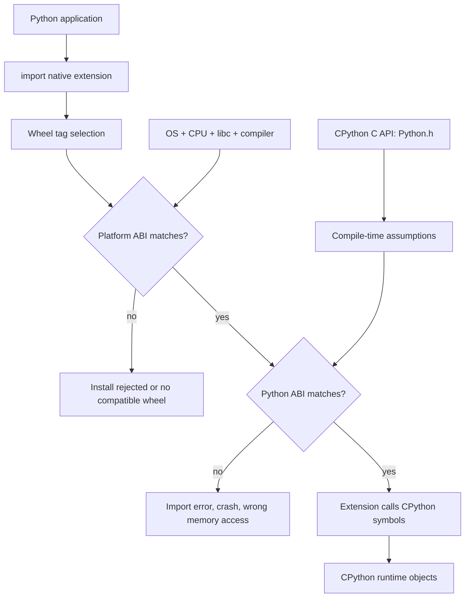

> 한 줄 요약: CPython ABI, Python wheel, free-threaded Python 문제는 저수준 구현 지식보다 배포 리스크 관리에 가깝다. 모든 Python 개발자가 ABI를 외울 필요는 없지만, 패키지를 배포하거나 네이티브 확장을 쓰는 팀은 어느 경계에서 깨지는지 알아야 한다.

## 왜 지금 이슈인가

Python 생태계에서 성능을 내려면 네이티브 코드와 만나는 경우가 많다. NumPy, Pandas, scikit-learn, Cython 기반 확장, Rust로 작성한 모듈은 겉으로는 `import` 한 줄이면 끝난다. 하지만 안쪽에서는 CPython 인터프리터와 컴파일된 바이너리가 같은 객체 메모리를 바라본다.

여기서 문제가 생기면 에러 메시지가 친절하지 않다. 버전이 안 맞으면 설치가 거부되기도 하지만, 더 나쁜 경우에는 설치와 import까지 된 뒤 런타임에서 잘못된 메모리를 읽거나 세그멘테이션 폴트(Segmentation Fault)로 죽는다.

이 주제가 커뮤니티에서 자주 논쟁이 되는 이유도 여기에 있다. Python은 고수준 언어지만, 배포와 운영의 마지막 장애는 종종 C ABI(Application Binary Interface)에서 나온다. 특히 free-threaded Python처럼 인터프리터 내부 가정이 바뀌는 흐름에서는 ABI가 패키징 지식에 그치지 않고 운영 안정성과 바로 연결된다.

## 커뮤니티에서 갈리는 지점

첫 번째 쟁점은 모든 Python 개발자가 CPython ABI를 알아야 하느냐다.

한쪽에서는 대부분의 애플리케이션 개발자가 `Python.h`, 심볼(Symbol), 구조체 레이아웃까지 알 필요는 없다고 본다. 순수 Python 코드만 배포하거나 검증된 바이너리 wheel만 쓰는 상황이라면 맞는 말이다. ABI는 매일 만지는 도구라기보다, 깨졌을 때 원인을 찾기 위한 지도에 가깝다.

반대쪽에서는 이 지도가 점점 더 많은 팀에 필요해졌다고 본다. Python 프로젝트가 단순 스크립트에 머무르지 않고 컨테이너 이미지, CI 빌드, 내부 패키지 저장소, 여러 OS와 CPU 아키텍처로 퍼지는 순간부터 wheel 태그를 읽는 능력은 운영 능력이 된다.

두 번째 쟁점은 성능과 안정성의 교환이다.

CPython C API는 강력하다. `Python.h`를 포함하면 인터프리터 내부 상태에 접근하고, Python 객체를 만들고, C, C++, Rust, Fortran 코드에서 Python과 상호작용할 수 있다. Cython이 Python 코드를 C 소스로 변환하고, 과학 계산 라이브러리들이 큰 성능 향상을 얻는 배경도 여기에 있다.

문제는 C API가 넓을수록 내부 구현 변화에 노출되는 면도 넓어진다는 점이다. 매크로(Macro), typedef, inline 함수, 구조체 필드 배치까지 기대하고 컴파일한 확장은 CPython이 바뀔 때 다시 빌드해야 할 가능성이 커진다.

세 번째 쟁점은 Rust나 C++로 Python 확장을 작성할 때의 기대치다.

Rust는 안전한 언어라는 인상이 강하지만, Rust 자체 ABI는 안정성을 보장하지 않는다. C ABI와 맞춰야 하는 구조체에는 `#[repr(C)]` 같은 명시가 필요하다. C++도 더 익숙해 보일 뿐, 이름 장식(Name Mangling), 표준 라이브러리 구현 차이, 컴파일러 차이 때문에 안정적인 ABI를 유지하기가 쉽지 않다.

언어를 바꾼다고 ABI 리스크가 사라지지는 않는다. Python 확장을 만든다는 것은 결국 어떤 ABI를 타깃으로 삼을지 결정하는 일이다.

## 아키텍처 관점에서 볼 점

CPython ABI를 아키텍처 관점에서 보면 세 층으로 나눌 수 있다.

첫째, Python 코드와 네이티브 확장 사이의 C API다. 개발자는 `Python.h`에 드러난 함수, 매크로, 구조체, typedef를 보고 코드를 작성한다. 이것은 소스 코드 수준의 계약이다.

둘째, 빌드된 바이너리가 실제로 기대하는 Python ABI다. 여기에는 export된 심볼 이름, 객체 메모리 레이아웃, 함수 호출 방식에 대한 기대가 들어간다. 바이너리에는 함수 시그니처 자체가 저장되지 않는다. 호출자는 컴파일 당시 헤더가 맞았다고 믿고 실행한다.

셋째, 운영체제와 CPU 아키텍처가 정하는 플랫폼 ABI다. x86_64 Linux와 x86_64 Windows는 같은 CPU라도 호출 규약이 다를 수 있다. Linux에서도 glibc와 musl 차이가 wheel 태그에 반영된다. 그래서 NumPy 같은 패키지가 여러 플랫폼별 wheel을 배포한다.

이 구조에서 장애는 설치 단계, import 단계, 런타임 단계로 나뉜다.

설치 단계에서 wheel 태그가 맞지 않으면 그나마 낫다. 실패가 빠르고 원인도 비교적 잘 드러난다. 플랫폼 태그가 맞지 않거나 Python 버전 태그가 맞지 않으면 pip가 호환 wheel을 선택하지 않는다.

import 단계에서 깨지는 경우는 더 까다롭다. 심볼이 없거나 동적 링커가 라이브러리를 찾지 못하면 모듈 로딩이 실패한다. 이때는 wheel이 어떤 Python ABI를 대상으로 빌드됐는지, 컨테이너 이미지의 libc가 무엇인지, 베이스 이미지가 바뀌었는지부터 봐야 한다.

런타임에서 깨지는 경우가 가장 위험하다. 구조체 레이아웃이나 호출 가정이 달라졌는데도 겉으로는 로딩이 되면, 잘못된 바이트를 읽고 예측하기 어려운 방식으로 실패할 수 있다. ABI mismatch가 무서운 이유가 여기에 있다.

free-threaded Python은 이 긴장을 더 키운다. 전역 인터프리터 락(Global Interpreter Lock, GIL)에 의존하던 내부 가정이 바뀌면, 기존 확장이 암묵적으로 기대하던 객체 접근 방식과 스레드 안전성도 다시 봐야 한다. 글감에서는 Python 3.15가 free-threaded build가 만든 문제를 고치기 위한 새 ABI를 제공할 예정이라고 설명한다. 이 대목은 새 버전 소식이라기보다, ABI를 기능 플래그처럼 취급하면 안 된다는 신호에 가깝다.

## 실무에서 볼 점

실제로 이런 상황에서는 먼저 우리 프로젝트가 네이티브 확장을 생산하는지, 소비만 하는지 구분해야 한다.

순수 Python 애플리케이션이 검증된 공개 패키지만 사용한다면 ABI를 깊게 다루기보다 배포 환경을 고정하는 쪽이 실용적이다. Python minor 버전, 베이스 이미지, CPU 아키텍처, `manylinux` 또는 `musllinux` 계열 여부를 잠그고, lockfile과 CI에서 설치 재현성을 확인하면 된다.

반대로 내부에서 Cython, pybind11, Rust 기반 확장을 빌드한다면 기준이 달라진다. 이때는 wheel 파일명을 산출물 이름이 아니라 호환성 계약으로 읽어야 한다. 어떤 CPython 버전용인지, 어떤 플랫폼용인지, 안정 ABI를 목표로 하는지, free-threaded build를 별도로 지원하는지 빌드 매트릭스에 드러나야 한다.

도입 전에 확인할 질문은 다음과 같다.

| 확인 지점 | 봐야 할 이유 |
|---|---|
| 지원 Python 버전 | CPython ABI는 Python 버전 변화와 맞물린다 |
| OS, CPU, libc 조합 | 플랫폼 ABI가 다르면 같은 wheel을 재사용할 수 없다 |
| C API 사용 범위 | 내부 구조체나 매크로 의존이 많을수록 재빌드 리스크가 커진다 |
| Rust/C++ FFI 경계 | 언어 자체 안전성과 ABI 안정성은 별개다 |
| free-threaded 지원 여부 | GIL 제거 흐름에서 기존 가정이 깨질 수 있다 |
| CI 빌드 매트릭스 | 깨지는 조합을 릴리스 뒤에 발견하면 복구 비용이 커진다 |

운영 리스크도 분명하다.

첫째, 컨테이너 베이스 이미지를 바꾸는 작업이 생각보다 큰 변경이 될 수 있다. `python:slim`에서 Alpine 계열로 옮기면 glibc와 musl 차이를 만나고, 그 순간 기존 wheel 전략이 흔들릴 수 있다.

둘째, x86_64에서만 테스트한 패키지를 ARM64 환경에 올릴 때 문제가 드러날 수 있다. Mac 개발 환경, CI 러너, 프로덕션 Kubernetes 노드의 아키텍처가 다르면 같은 requirements 파일도 다른 바이너리를 받는다.

셋째, 성능 최적화를 위해 네이티브 확장을 추가하면 장애 양상이 Python 예외에서 프로세스 크래시로 바뀔 수 있다. 이 변화는 관측성(Observability) 설계에도 영향을 준다. 로그만으로 부족하고, 코어 덤프, 심볼 정보, 빌드 provenance까지 추적해야 할 수 있다.

대안은 있다.

순수 Python 구현을 택하면 배포 호환성은 좋아진다. 대신 성능과 CPU 비용을 지불한다. 제한된 C API나 안정 ABI를 타깃으로 하면 wheel 수를 줄이고 호환성을 넓힐 수 있다. 대신 사용할 수 있는 API 범위가 줄거나 성능 최적화 여지가 줄어든다. 버전별, 플랫폼별 wheel을 촘촘히 배포하면 성능과 기능을 살릴 수 있다. 대신 릴리스 자동화와 테스트 비용이 늘어난다.

이 선택은 취향이 아니라 장애 비용의 문제다. 라이브러리 작성자는 설치 가능한 조합을 넓혀야 하고, 서비스 운영자는 자신이 실제로 쓰는 조합을 좁혀야 한다. 둘을 같은 기준으로 판단하면 배포 전략이 어긋난다.

## 정리

CPython ABI를 모든 개발자가 매일 알아야 한다는 말은 과하다. 하지만 Python 패키지를 배포하거나, 네이티브 확장에 의존하거나, free-threaded Python 같은 런타임 변화를 검토하는 팀이라면 ABI를 모른 채 운영하기 어렵다.

핵심은 저수준 지식을 많이 외우는 데 있지 않다. wheel 파일명이 말하는 호환성 조건을 읽고, 어떤 변경이 재빌드와 재검증을 요구하는지 판단하는 데 있다.

지금 확인할 것은 하나다. 현재 서비스에서 설치되는 네이티브 wheel 목록을 뽑아 Python 버전, 플랫폼 태그, CPU 아키텍처, libc 계열이 운영 환경과 어떻게 맞물리는지 확인해보자. 그 표가 없으면 Python 업그레이드와 베이스 이미지 변경은 아직 작은 작업이 아니다.

## 참고 자료

- [선정 글감] [What Every Python Developer Should Know About the CPython ABI](https://labs.quansight.org/blog/python-abi-abi3t) (Lobsters)