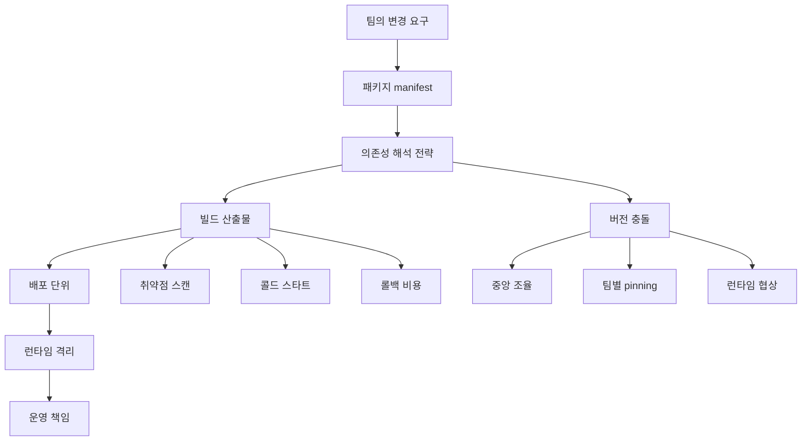

> 한 줄 요약: 패키지 관리와 의존성 관리는 도구 선택처럼 보이지만, 실제로는 팀이 변경 권한과 운영 책임을 어디에 둘지 정하는 아키텍처 결정이다.

## 왜 지금 이슈인가

패키지 관리, 의존성 관리, 배포 아키텍처는 개발자 커뮤니티에서 자주 논쟁이 되는 주제다. npm, Maven, Go Modules, Docker, Bazel, Nix, Terraform modules처럼 도구 이름은 달라도 핵심 쟁점은 비슷하다.

누가 버전을 올릴 수 있는가.  
누가 깨진 빌드를 고쳐야 하는가.  
누가 보안 패치를 밀어붙일 권한을 갖는가.  
그리고 누가 그 비용을 치르는가.

Lobsters에 올라온 Package Management as Org Chart는 이 지점을 풍자적으로 짚는다. 의존성 해석 전략은 단순한 알고리즘이 아니라 조직 안의 갈등을 처리하는 방식이라는 주장이다. 예를 들어 모노레포 단일 버전 정책은 모두가 같은 버전을 써야 한다는 규칙이고, Maven의 nearest-wins는 루트에 가까운 쪽의 요구가 이기는 방식이다. Docker는 애플리케이션이 자기 운영체제까지 들고 배포되는 모델이다.

여기에 Vercel Functions의 패키지 크기 제한 확대 사례를 붙여 보면 논점이 더 분명해진다. Vercel은 Fluid compute에서 Node.js와 Python Functions 패키지 크기를 기존 250MB에서 최대 5GB까지 지원한다고 밝혔다. Python 데이터·AI 라이브러리, 브라우저 자동화 의존성, 이미지·비디오 처리 패키지, 큰 generated client처럼 서버리스 경계 밖으로 밀려나던 워크로드를 다시 Functions 안으로 가져올 수 있게 된 셈이다.

커뮤니티에서 말이 붙는 이유는 제한이 커졌기 때문만은 아니다. 제한이 느슨해질수록 개발팀은 더 많은 것을 함수 하나에 넣을 수 있고, 플랫폼팀은 빌드 시간, 콜드 스타트, 취약점 스캔, 배포 추적, 런타임 격리를 다시 따져야 한다.

## 커뮤니티에서 갈리는 지점

### 의존성 관리는 왜 조직 문제인가?

패키지 매니저는 보통 기술 문서에서 이렇게 설명된다.

- lockfile은 재현 가능한 설치를 보장한다
- semantic versioning은 호환 가능한 변경을 표현한다
- monorepo는 코드 공유와 변경 추적을 쉽게 한다
- 컨테이너는 배포 환경 차이를 줄인다

맞는 말이다. 하지만 실무에서는 이 설명만으로 부족하다.

lockfile을 도입하면 누구의 로컬 설치가 깨졌는지보다 어떤 커밋이 의존성 그래프를 바꿨는지가 남는다. monorepo 단일 버전 정책을 쓰면 보안 패치 전파는 쉬워지지만, 한 팀의 업그레이드가 다른 팀의 릴리스 일정을 끌고 들어온다. 컨테이너 이미지를 쓰면 런타임을 개발팀이 통제할 수 있지만, 운영팀은 이미지 안에 들어간 OS 패키지와 네이티브 라이브러리까지 추적해야 한다.

이 논쟁은 기술 취향 싸움이 아니다. 변경 비용을 중앙에서 감당할지, 각 팀에 나눠줄지, 사용자 요청이 들어오는 시점까지 미룰지에 대한 선택이다.

### 모노레포 vs 워크스페이스 차이점

모노레포 단일 버전 정책은 의존성 충돌을 초기에 드러낸다. 하나의 버전만 허용하므로 React, protobuf, OpenTelemetry SDK, 데이터베이스 드라이버 같은 공통 의존성을 동시에 맞춰야 한다. 이 방식은 플랫폼팀이나 마이그레이션 담당자가 실제로 움직일 수 있을 때 효과가 있다.

반대로 workspaces는 하나의 저장소 안에서 각 패키지가 자기 manifest를 갖는다. 변경 추적은 쉽지만 버전 합의가 사라지는 것은 아니다. 충돌 지점이 루트에서 각 패키지 경계로 이동할 뿐이다.

| 방식 | 장점 | 숨어 있는 비용 |
| --- | --- | --- |
| 단일 버전 모노레포 | 보안 패치 전파, 전역 검색, 일관된 빌드 | 대규모 마이그레이션 조율 |
| workspaces | 팀별 릴리스 자율성, 점진적 업그레이드 | 중복 의존성, 런타임 충돌 |
| vendoring | upstream 변경과 장애로부터 격리 | 수동 병합, 패치 추적 |
| Docker 이미지 | 실행 환경 고정 | 이미지 내부 OS·라이브러리 관리 |
| Nix/Guix | 빌드 재현성 | 학습 비용, 채용·온보딩 부담 |

이런 선택은 조직 구조와 맞지 않으면 오래 버티기 어렵다. 중앙 플랫폼팀이 없는데 단일 버전 정책을 강제하면 업그레이드 티켓만 쌓인다. 반대로 각 팀이 서로 다른 런타임을 가져가는데 보안팀이 하나의 기준으로 스캔하려 하면 예외 목록이 운영 문서보다 길어진다.

### 서버리스 패키지 크기 확대는 자유인가, 부채인가?

Vercel Functions의 5GB 패키지 지원은 흥미로운 사례다. 기존 250MB 제한은 많은 백엔드 워크로드를 자연스럽게 걸러냈다. 큰 Python AI 라이브러리, Playwright 같은 브라우저 자동화 의존성, 대형 generated client는 Functions보다 컨테이너, 잡 큐, 별도 API 서버로 빠지는 경우가 많았다.

제한이 5GB로 커지면 선택지가 넓어진다. 작은 API 라우트와 무거운 이미지 처리 라우트를 같은 배포 모델로 묶을 수 있다. 프론트엔드 중심 팀은 별도 인프라 없이 더 많은 백엔드 로직을 넣을 수 있다.

하지만 패키지 크기 제한 완화는 아키텍처를 단순하게 보이게 하면서 운영 부담을 늘릴 수 있다. 큰 함수는 배포 산출물 스캔, 캐시 전략, 콜드 스타트, 롤백 시간, 리전별 전파 시간에 영향을 준다. Vercel이 Large Functions를 public beta로 두고, Fluid compute가 필요하며, Secure Compute나 Static IP와는 아직 함께 쓸 수 없다고 둔 것도 이 경계를 보여준다.

제품팀 입장에서는 막혀 있던 워크로드가 열린다. 플랫폼 관점에서는 서버리스가 가벼운 함수라는 전제가 흔들린다.

## 아키텍처 관점에서 볼 점

### 의존성 그래프는 배포 그래프와 따로 움직이지 않는다

패키지 의존성은 빌드 단계에서 끝나지 않는다. 배포 크기, 런타임 메모리, 보안 패치 범위, 장애 격리 단위까지 이어진다.

이 흐름에서 패키지 매니저는 C에만 있는 도구가 아니다. B에서 누가 manifest를 바꿀 수 있는지, D에서 어떤 산출물이 만들어지는지, G에서 누가 장애를 책임지는지까지 연결된다.

예를 들어 Go의 Minimal Version Selection(MVS)은 그래프 안에서 명시적으로 요구된 가장 높은 버전을 고른다. 새 버전이 나왔다고 자동으로 올라가지 않는다. 예측 가능성은 높아지지만, 취약점 패치도 누군가 명시적으로 요구해야 반영된다.

Maven의 nearest-wins는 다른 성격이다. 두 경로가 서로 다른 버전을 요구하면 루트에서 가까운 경로가 이긴다. 이해하기 쉽지만, 실제로 어떤 버전이 선택됐는지 모르면 간접 의존성이 조용히 바뀔 수 있다.

Nix나 Guix는 선언되지 않은 입력을 빌드에서 제거해 재현성을 강하게 만든다. 대신 개발 환경 자체가 낯설어지고, 작은 패키지 추가도 derivation과 캐시, 바이너리 배포 전략까지 같이 보게 된다.

### 큰 서버리스 함수는 어디에 놓아야 할까?

5GB Functions 같은 모델은 먼저 다음 중 어디에 해당하는지 나눠 봐야 한다.

- 큰 라이브러리가 필요하지만 요청당 실행 시간이 짧은 API
- 브라우저 자동화나 이미지 처리처럼 런타임 의존성이 큰 작업
- 모델 파일, generated client, 공통 애플리케이션 코드가 과하게 묶인 배포물

첫 번째는 서버리스로 갈 수 있다. 두 번째는 큐 기반 비동기 처리나 컨테이너 잡이 더 나을 수 있다. 세 번째는 패키지 크기 제한이 아니라 코드 경계 문제가 원인일 가능성이 높다.

서버리스 함수 크기 제한이 커졌다고 모든 백엔드를 함수로 넣는 것은 위험하다. 제한은 안전장치이기도 하다. 제한이 사라지면 아키텍처 검토가 더 필요해진다.

확인해야 할 질문은 단순하다.

- 이 의존성은 모든 라우트에 필요한가?
- 큰 패키지를 공유 코드로 끌어올린 이유가 명확한가?
- 배포 산출물의 SBOM(Software Bill of Materials)을 만들고 있는가?
- 보안 패치가 나왔을 때 어떤 함수가 영향을 받는지 추적 가능한가?
- 롤백 시 큰 산출물을 다시 배포하는 시간이 장애 대응 목표와 맞는가?

## 실무에서 볼 점

### 패키지 관리 정책은 먼저 책임 경계를 써야 한다

도구부터 정하면 논쟁이 길어진다. npm workspaces냐 pnpm이냐, Docker냐 Nix냐, Terraform module registry냐부터 이야기하면 각자 익숙한 실패 사례를 꺼내게 된다.

먼저 써야 하는 것은 책임 경계다.

| 질문 | 정책으로 바꿔야 할 내용 |
| --- | --- |
| 보안 패치는 누가 올리는가? | 중앙 PR, 자동 PR, 팀별 책임 |
| breaking change는 누가 검증하는가? | contract test, canary, 통합 테스트 |
| 공통 라이브러리 버전은 누가 결정하는가? | RFC, platform approval, owner file |
| 배포 산출물 크기는 누가 감시하는가? | CI budget, dashboard, 차단 기준 |
| registry 장애 시 어떻게 복구하는가? | proxy cache, vendoring, mirror |

현업에서 비슷한 고민을 하다 보면 기술 선택보다 예외 처리 규칙이 먼저 흔들린다. 모든 팀이 최신 버전을 따라가겠다는 선언은 쉽다. 문제는 릴리스 직전인 팀, 규제 검증을 다시 받아야 하는 팀, 네이티브 모듈 때문에 업그레이드가 막힌 팀이 생길 때다.

그래서 의존성 정책의 품질은 이상적인 상태보다 예외를 다루는 방식에서 드러난다.

### 보안 리스크는 패키지 수보다 추적 가능성에서 갈린다

패키지가 많다고 곧바로 위험한 것은 아니다. 위험한 것은 어떤 패키지가 어디에 들어갔는지 모르는 상태다.

Docker 이미지는 애플리케이션과 OS 라이브러리를 함께 묶는다. xz 같은 공급망 이슈가 생기면 몇 개의 이미지가 영향을 받는지 바로 알아야 한다. Artifactory나 사내 registry를 앞에 두는 방식은 통제를 강화하지만, 사내 fork가 쌓이면 upstream 패치를 놓칠 수 있다.

대형 서버리스 함수도 같은 문제가 있다. 5GB 산출물 안에 Python wheel, 브라우저 바이너리, generated client, 공통 코드가 함께 들어간다면 취약점 스캔 결과가 길어진다. 이때 필요한 것은 무조건적인 금지가 아니라 추적 가능한 구조다.

- lockfile을 커밋한다
- SBOM을 배포 산출물마다 만든다
- 이미지와 함수 패키지 크기를 CI에서 기록한다
- 사내 fork에는 owner와 upstream 추적 이슈를 붙인다
- 의존성 업데이트 PR은 테스트 자동화와 함께 묶는다

패키지 관리는 설치 성공 여부가 아니라 변경 추적 가능성으로 평가해야 한다.

### 도입 조건: 자동화가 없으면 정책은 벌칙이 된다

단일 버전 모노레포는 강한 정책이다. 하지만 자동 마이그레이션, 테스트 하네스(Test Harness), 코드 검색, owner 매핑이 없으면 병목이 된다. Bazel처럼 dependency edge를 명시하는 빌드 시스템도 그래프가 커질수록 강력하지만, 규칙을 이해하고 고칠 수 있는 사람이 적으면 운영 리스크가 된다.

Vercel의 Large Functions도 마찬가지다. preview 환경에서 먼저 opt-in하고, 250MB를 넘는 함수만 beta 경로를 타게 할 수 있다는 점은 조심스러운 도입 경로로 읽을 수 있다. 하지만 프로젝트 전체에서 어떤 함수가 왜 커졌는지 모르면 제한 확대는 문제를 늦게 발견하게 만든다.

도입 전에 최소한 다음 조건을 확인하는 편이 낫다.

- CI에서 패키지 크기 변화가 PR 단위로 보이는가
- 의존성 그래프 변경이 리뷰어에게 드러나는가
- 테스트가 팀 경계를 넘어 깨지는 변경을 잡는가
- 배포 단위별 owner가 명확한가
- 큰 함수와 작은 함수의 SLO(Service Level Objective)를 분리했는가
- Secure Compute, Static IP 같은 플랫폼 제약과 충돌하지 않는가

이 조건이 없다면 더 큰 패키지 제한이나 더 강한 패키지 매니저는 해결책이 아니라 새로운 우회로 쓰일 수 있다.

## 정리

패키지 관리 도구는 의존성 버전을 고르는 프로그램이지만, 그 결과는 조직의 책임 배분으로 나타난다. 모노레포, Docker, Nix, Maven, Go MVS, 서버리스 함수 크기 제한은 모두 같은 질문을 다른 방식으로 묻는다.

변경을 누가 승인하고, 누가 검증하고, 누가 장애를 맡을 것인가.

가장 최근에 올라간 의존성 업데이트나 배포 패키지 크기 증가 PR을 열어보면 답이 나온다. 그 변경이 어떤 서비스에 들어갔는지, 어떤 테스트가 막아주는지, 문제가 생겼을 때 누가 롤백할 수 있는지 설명할 수 없다면 패키지 관리 정책부터 다시 써야 한다.

## 참고 자료

- [선정 글감] [Package Management as Org Chart](https://nesbitt.io/2026/07/10/package-management-as-org-chart.html) — Lobsters
- [관련] [Vercel Functions can now be up to 5GB in package size](https://vercel.com/changelog/vercel-functions-can-now-be-up-to-5-gb-in-package-size) — Vercel Blog