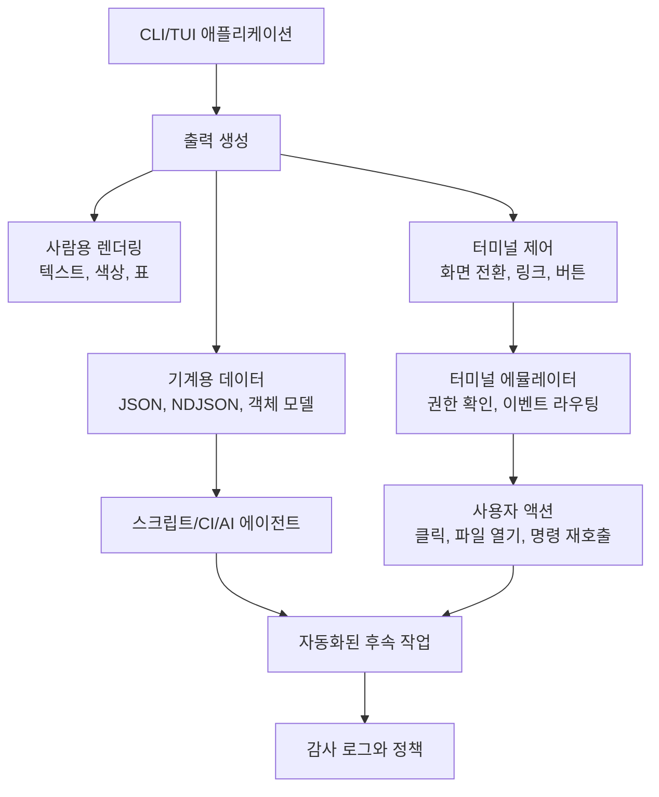

> 한 줄 요약: 터미널과 CLI 자동화의 병목은 화면이 낡아서가 아니라, 프로그램 사이의 계약이 아직도 바이트 스트림과 관습에 기대고 있다는 데 있다. 새 터미널 기능을 논하기 전에 구조화 데이터, 보안 경계, 유지보수 가능한 프로토콜을 먼저 봐야 한다.

## 왜 지금 이슈인가

터미널은 사라지지 않았다. Kubernetes 운영, 인프라 자동화, AI 에이전트, 빌드 파이프라인, 데이터베이스 관리 도구가 여전히 CLI 위에서 만난다. 예전보다 더 자주, 더 복잡하게 엮인다.

문제는 사람이 보는 화면과 프로그램이 읽는 인터페이스가 같은 통로를 쓴다는 데서 시작된다. 자동화가 조금만 복잡해져도 파싱, 이스케이프 시퀀스, 표준 출력 형식, 터미널 호환성 문제가 한꺼번에 튀어나온다.

Mitchell Hashimoto의 Ghostty 인터뷰가 흥미로운 이유도 특정 터미널 에뮬레이터 이야기로 끝나지 않기 때문이다. 그는 터미널을 브라우저처럼 모든 것을 담는 앱 플랫폼으로 키우기보다, 텍스트 기반 애플리케이션이 더 잘 합성되고 자동화될 수 있는 최소한의 프로토콜을 고민한다.

현업에서도 비슷한 문제는 자주 나온다.

- `kubectl get pods` 결과를 사람이 볼 표로 남길지, `-o json`으로 기계가 읽게 할지
- 배포 스크립트가 컬러 로그와 진행률 표시를 그대로 긁어도 되는지
- AI 코딩 에이전트가 터미널 기록 속 파일 링크나 버튼을 안전하게 다시 호출해도 되는지
- 운영 도구가 편리한 TUI가 될수록 자동화 가능성을 잃는 것은 아닌지

터미널 논쟁은 UI 취향 문제가 아니다. 인프라와 개발 도구가 서로 호출되는 방식, 실패했을 때 어디서 끊어낼 수 있는지에 대한 아키텍처 문제다.

## 커뮤니티에서 갈리는 지점

가장 큰 갈림길은 터미널을 어디까지 앱 플랫폼으로 볼 것인가다.

한쪽은 터미널이 이미 충분히 강력하다고 본다. 텍스트, 표준 입력(Standard Input), 표준 출력(Standard Output), 파이프라인(Pipeline), 종료 코드(Exit Code)만으로도 대부분의 자동화가 가능하다는 관점이다. 이쪽에서는 터미널이 버튼, 다중 화면, richer clipboard, 이벤트 라우팅 같은 기능을 품기 시작하면 브라우저와 데스크톱 앱을 어설프게 다시 만드는 것 아니냐고 묻는다.

다른 쪽은 지금의 터미널 계약이 너무 빈약하다고 본다. PTY(Pseudo Terminal)의 인밴드 신호(In-band Signaling)는 일반 텍스트와 제어 메시지를 같은 바이트 스트림에 섞는다. 사람이 볼 때는 자연스럽지만, 프로그램이 안정적으로 해석하기에는 취약하다.

PowerShell이 자주 언급되는 이유도 여기에 있다. PowerShell은 문자열 대신 객체를 파이프라인으로 넘기는 방향을 택했다. 모든 환경에서 그 방식이 정답이라는 뜻은 아니다. 다만 CLI 자동화가 문자열 파싱에 갇힐 때 생기는 문제를 정면으로 인정했다는 점에서 참고할 만하다.

오픈소스 유지보수 관점도 갈린다. Ghostty 인터뷰에서는 모든 사용자 요청을 받아들이면 방향 없는 코드 산이 되고, 반대로 비전만 밀면 실제 사용자의 불편을 놓칠 수 있다는 긴장이 나온다. 이건 터미널만의 문제가 아니다.

Scarf가 Haskell에서 멀어진 사례도 같은 선에 있다. Haskell의 타입 시스템과 신뢰성은 실제 서비스에서 효과를 냈지만, 컴파일 시간과 생태계 마찰이 운영 비용으로 누적됐다. 기술적으로 우아한 선택도 조직의 배포 속도, 채용, 디버깅, 라이브러리 생태계와 충돌할 수 있다.

패키지 관리 글에서 말하는 Conway의 법칙도 연결된다. 모노레포, 워크스페이스, Bazel, Nix, Maven의 의존성 해석 방식은 단순한 도구 취향이 아니다. 조직이 충돌을 해결하는 방식이 도구에 묻어난다. 터미널 프로토콜도 마찬가지다. 어떤 기능을 표준화할지는 결국 누가 누구에게 어떤 계약을 요구할 수 있는지의 문제다.

AI 스크래퍼로 인한 웹 운영 부담을 다룬 LWN 글은 보안 경계를 떠올리게 한다. 사람이 쓰는 것처럼 보이는 요청이 실제로는 자동화된 대량 트래픽일 수 있고, 사용자 에이전트(User-Agent) 같은 자기 보고식 신호는 믿기 어렵다. 터미널에서도 프로그램이 보낸 클릭 가능한 링크, 버튼, 파일 열기 요청을 전부 신뢰하면 비슷한 문제가 생긴다.

## 아키텍처 관점에서 볼 점

터미널 기반 도구를 설계할 때는 출력 채널을 하나로 보면 안 된다. 사람이 읽는 화면, 프로그램이 소비하는 데이터, 터미널 에뮬레이터가 처리하는 제어 메시지, 보안 결정을 요구하는 액션은 서로 다른 계약이어야 한다.

이 구조에서 위험한 설계는 다음과 같다.

| 설계 선택 | 편한 점 | 위험 |
| --- | --- | --- |
| 표 출력만 제공 | 사람이 바로 읽기 좋다 | 스크립트가 깨지기 쉽다 |
| 모든 기능을 이스케이프 시퀀스로 처리 | 기존 터미널과 이어지기 쉽다 | 보안 정책과 디버깅이 흐려진다 |
| TUI 중심으로만 제공 | 조작 경험이 좋다 | CI, 에이전트, 배치 자동화와 멀어진다 |
| JSON 출력만 제공 | 자동화가 쉽다 | 사람이 장애 상황에서 빠르게 읽기 어렵다 |
| 클릭 가능한 액션을 무제한 허용 | 생산성이 오른다 | 명령 주입, 파일 접근, 권한 오용이 생길 수 있다 |

Ghostty 인터뷰의 n-screen API 구상도 이 관점에서 볼 수 있다. 현재 많은 터미널 앱은 기본 화면과 대체 화면(Alternate Screen) 사이를 전환한다. Vim, less, 대부분의 TUI가 대체 화면을 쓰고, 셸의 스크롤백은 기본 화면에 남는다.

화면이 두 개뿐이면 애플리케이션은 전체 화면을 점유하거나, 셸 기록 속 상호작용을 포기해야 한다. 여러 화면을 만들고 터미널이 래핑, 선택, 마우스 이벤트를 관리한다면 더 정교한 텍스트 앱이 가능해진다.

다만 이 아이디어는 곧바로 범위 확장 문제를 부른다. 화면, 버튼, 클립보드, 파일 링크, 이벤트 라우팅이 늘어나면 터미널은 작은 윈도 서버(Window Server)에 가까워진다. 그러면 다음 질문에 답해야 한다.

- 어떤 이벤트가 애플리케이션으로 다시 전달되는가
- 스크롤백에 남은 버튼은 언제까지 유효한가
- 파일 열기나 명령 실행은 사용자 확인을 거쳐야 하는가
- 원격 SSH 세션에서 로컬 자원 접근은 어떻게 막는가
- 녹화된 터미널 로그를 다시 열 때 액션은 비활성화되는가

이 질문을 피하면 기능은 빠르게 붙지만 운영 리스크가 따라온다.

특히 AI 에이전트와 터미널이 만나는 지점에서는 더 조심해야 한다. 에이전트는 사람보다 훨씬 빠르게 출력물을 읽고 후속 명령을 만든다. 버튼 프로토콜이나 링크 프로토콜이 생긴다면, 그것은 단순 편의 기능이 아니라 에이전트가 호출할 수 있는 API 표면이 된다.

그렇다고 터미널의 새 기능이 브라우저 보안 모델을 그대로 따라야 한다는 뜻은 아니다. 오히려 더 작고 명확해야 한다. 출처, 권한, 사용자 확인, 감사 로그, 비활성화 가능한 정책이 없으면 운영 환경에서는 받아들이기 어렵다.

## 실무에서 볼 점

터미널이나 CLI 도구를 고를 때 기능 목록만 보면 판단이 흐려진다. 자동 완성, 컬러 출력, TUI, 플러그인, 검색 기능은 체감 품질을 올린다. 하지만 운영 도구라면 다음 조건을 먼저 봐야 한다.

- 모든 사람용 출력에 대응하는 기계용 출력이 있는가
- JSON 스키마나 출력 형식 변경 정책이 문서화되어 있는가
- 종료 코드가 오류 유형을 구분할 만큼 일관적인가
- 비대화형 모드(Non-interactive Mode)가 별도로 있는가
- 색상, 진행률 표시, 프롬프트를 끌 수 있는가
- 원격 세션과 로컬 세션의 권한 경계가 분리되는가
- CI와 에이전트가 쓸 때 감사 가능한 로그가 남는가

실제로는 예쁜 TUI보다 지루한 플래그 하나가 장애 대응 시간을 줄일 때가 많다.

예를 들어 Kubernetes 운영 스크립트가 `kubectl` 표 출력을 정규식으로 파싱하고 있다면 이미 위험 신호다. 클러스터 버전, 로케일, 컬럼 폭, 플러그인 출력 변화에 따라 깨질 수 있다. `-o json`, `jsonpath`, 서버 사이드 필터링을 먼저 검토해야 한다.

데이터베이스 관리 도구도 마찬가지다. 운영자가 보는 테이블 출력과 마이그레이션 파이프라인이 읽는 출력은 분리돼야 한다. 실패 메시지에 색상 코드가 섞여 파서가 깨지는 일은 사소해 보이지만, 배포 자동화에서는 실제 장애로 이어진다.

하네스(Harness)나 테스트 자동화에서도 터미널 계약은 비용이 된다. 테스트 결과가 사람용 로그에만 남으면 실패 원인 분류, 재시도 정책, flaky test 격리, 성능 회귀 탐지가 어렵다. 반대로 구조화 이벤트가 있으면 관측성(Observability) 파이프라인에 그대로 붙일 수 있다.

도입 기준은 거창할 필요가 없다.

| 상황 | 추천 방향 |
| --- | --- |
| 사람이 주로 쓰는 로컬 개발 도구 | 풍부한 TUI와 검색 기능 허용 |
| CI/CD에서 호출되는 도구 | 안정된 JSON 출력과 비대화형 모드 우선 |
| 운영 장애 대응 도구 | 사람용 요약과 기계용 상세 이벤트를 모두 제공 |
| AI 에이전트가 호출하는 도구 | 권한, 감사 로그, dry-run, 명령 확인 흐름 필요 |
| 원격 서버에서 실행되는 도구 | 로컬 파일, 클립보드, 브라우저 열기 기능 제한 |

Scarf의 Haskell 사례가 주는 교훈도 여기서 다시 읽을 수 있다. 언어와 도구는 내부 품질만으로 평가하기 어렵다. 빌드 시간, 생태계 마찰, 배포 복잡도, 팀의 학습 비용이 계속 누적되면 기술적 장점이 운영 비용에 묻힌다.

패키지 관리 글의 관점까지 끌어오면, 터미널과 CLI 표준화도 조직 구조를 비춘다. 플랫폼 팀이 강하면 공통 CLI 계약을 밀 수 있다. 제품 팀이 독립적으로 움직이면 각 팀의 도구가 서로 다른 출력 형식과 플러그인 체계를 갖기 쉽다. 어느 쪽이든 나쁘다는 뜻은 아니다. 다만 그 조직이 감당할 수 있는 조정 비용을 봐야 한다.

AI 스크래퍼 문제가 웹 운영자에게 자기 보고식 신호의 한계를 보여줬듯, 터미널 도구도 자기 설명만 믿으면 안 된다. 안전한 도구라고 주장하는 것보다 더 나은 기준은 실제로 어떤 권한을 요청하고, 어떤 액션을 기록하며, 어떤 모드에서 기능을 끌 수 있는지다.

## 정리

터미널의 미래를 브라우저처럼 만들지, 기존 UNIX 철학에 묶어둘지로만 보면 논의가 좁아진다. 더 실용적인 질문은 따로 있다.

이 도구는 사람이 읽는 화면과 자동화가 소비하는 계약을 분리하고 있는가.

Ghostty 인터뷰의 가치도 여기 있다. 터미널을 더 화려하게 만들자는 이야기가 아니라, 텍스트 기반 애플리케이션이 계속 쓰이려면 프로토콜, 합성 가능성, 보안 경계를 다시 설계해야 한다는 문제 제기다.

당장 확인할 것은 하나다. 운영이나 CI에서 쓰는 CLI 명령 하나를 골라, 사람이 보는 출력 대신 안정된 기계용 출력과 명확한 종료 코드만으로 같은 자동화를 재작성할 수 있는지 점검해보자. 거기서 막히는 부분이 그 도구의 실제 아키텍처 부채다.

## 참고 자료

- [선정 글감] [Lobsters Interview with mitchellh](https://alexalejandre.com/programming/interview-with-mitchell-hashimoto/) — Lobsters
- [관련] [After 7 years in production, Scarf has reluctantly moved away from Haskell](https://avi.press/posts/2026-07-10-after-7-years-in-production-scarf-has-reluctantly-moved-away-from-haskell.html) — Lobsters
- [관련] [Package Management as Org Chart](https://nesbitt.io/2026/07/10/package-management-as-org-chart.html) — Lobsters
- [관련] [An update on the scraper situation](https://lwn.net/SubscriberLink/1080822/990a8a5e2d379085/) — LWN.net