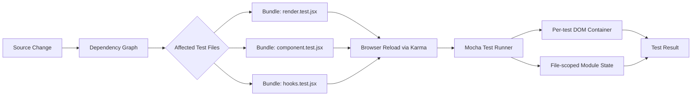

> 한 줄 요약: 테스트 자동화의 병목은 테스트 코드보다 격리(Isolation) 기본값에서 나오는 경우가 많다. 빠른 테스트는 도구 문제가 아니라, 어떤 상태를 공유해도 되는지 팀이 설명할 수 있느냐의 문제다.

## 왜 지금 이슈인가

테스트 자동화, 프런트엔드 테스트, 데이터베이스 호환성 테스트를 둘러싼 커뮤니티 반응에는 비슷한 질문이 깔려 있다.

왜 어떤 프로젝트는 1초 안에 1000개 테스트를 돌리고, 어떤 프로젝트는 단순한 덧셈 테스트 100개에도 1초 이상을 쓰는가?

선정 글감인 Preact 테스트 사례는 이 질문을 꽤 불편하게 만든다. 글에서는 브라우저의 실제 DOM(Real DOM)을 대상으로 1003개 테스트를 약 1초에 실행한다고 설명한다. 더 단순화한 렌더링 루프에서는 100,000번의 렌더링과 HTML 검증이 MacBook Air M1 기준 약 182ms에 끝났고, Mocha를 얹어도 약 210ms 수준이었다.

이 숫자가 눈에 띄는 이유는 빠른 도구 하나를 찾았기 때문이 아니다. 테스트 러너(Test Runner)가 기본으로 제공하는 강한 격리가 실제로 필요한 격리보다 훨씬 비쌀 수 있다는 점을 보여주기 때문이다.

비슷한 긴장은 pgrust 같은 데이터베이스 프로젝트에서도 보인다. pgrust는 Postgres 18.3 호환을 목표로 하고, 46,000개가 넘는 회귀 테스트(Regression Test) 쿼리의 기대 출력과 맞추는 방식을 내세운다. Hacker News에서도 779점과 686개 댓글이 붙을 만큼 반응이 컸다. 여기서도 핵심은 Rust로 다시 썼다는 언어 선택보다, 거대한 기존 시스템의 동작을 무엇으로 검증할 것인가에 있다.

프런트엔드 테스트든 데이터베이스 재구현이든, 사람들이 반응하는 지점은 비슷하다. 빠른 테스트는 검증을 줄이는 일이 아니라, 검증해야 할 경계를 더 정확히 잡는 일에 가깝다.

## 커뮤니티에서 갈리는 지점

테스트 격리를 강하게 거는 쪽의 논리는 명확하다. 각 테스트가 자기만의 환경을 가지면 전역 상태(Global State), 모듈 캐시(Module Cache), DOM, 타이머, 네트워크 목(Mock) 같은 공유 자원이 다음 테스트를 오염시키기 어렵다.

비동기 코드가 많아진 뒤에는 이 주장이 더 설득력을 얻었다. Promise와 async/await 기반 코드에서는 테스트가 끝난 것처럼 보여도 마이크로태스크(Microtask), 타이머, 이벤트 리스너가 남아 다음 테스트에 영향을 줄 수 있다. 테스트 러너가 기본적으로 환경 생성과 제거를 반복하는 이유가 여기에 있다.

반대쪽은 비용을 본다. Preact 사례에서 지적하듯, 대부분의 테스트 시간은 실제 검증 로직이 아니라 환경을 만들고 부수는 작업에 쓰일 수 있다. 입력을 받아 결과를 반환하는 순수 함수(Pure Function) 테스트에 매번 새 환경이 필요하지는 않다. 그런데 테스트 러너 기본값은 가장 넓은 사용 사례를 커버하려고 최대치에 가까운 격리를 선택한다.

이 갈등은 단순히 빠름과 안전함의 대립이 아니다.

| 선택 | 얻는 것 | 잃는 것 |
|---|---|---|
| 테스트마다 강한 격리 | 오염 가능성 감소, 디버깅 단순화 | 실행 시간 증가, CI 비용 증가, 피드백 지연 |
| 파일 단위 격리 | 속도와 격리의 절충 | 같은 파일 내부 상태 누수 가능 |
| 수동 격리 | 필요한 자원만 정리 가능 | 팀 규칙과 코드 리뷰 부담 증가 |
| 거의 무격리 | 매우 빠른 피드백 | 테스트 순서 의존성, 숨은 공유 상태 노출 |

Preact 글이 흥미로운 이유는 강한 격리를 무조건 거부하지 않는다는 데 있다. DOM은 공유 상태지만, 전체 문서(Document)를 매번 새로 만들지 않고 테스트마다 컨테이너 엘리먼트만 새로 만든다. 모듈 스코프 전역 상태는 테스트마다 리셋하는 전용 코드를 제품 코드에 넣지 않고, 테스트 파일마다 별도 번들을 만들어 범위를 제한한다.

pgrust 쪽도 다른 각도에서 같은 문제를 보여준다. Postgres를 Rust로 다시 쓰겠다는 주장은 쉽게 과장될 수 있지만, 실제 설득력은 회귀 테스트를 오라클(Oracle)로 삼는다는 점에서 나온다. 기존 Postgres와 같은 입력에 대해 같은 출력을 내는지 확인하는 방식은 새 구현의 자유도를 제한한다. 대신 호환성 논쟁을 감정이 아니라 테스트 결과로 끌고 온다.

다만 pgrust는 스스로 프로덕션 준비 상태가 아니라고 밝힌다. 기존 Postgres 확장과 PL/Python, PL/Perl, PL/Tcl 같은 절차형 언어 확장이 일반적으로 호환되지 않는다고도 적고 있다. 테스트를 많이 통과했다는 말과 운영에 넣어도 된다는 말은 다르다.

이 선을 구분하는 감각이 테스트 자동화 논의에서 중요하다.

## 아키텍처 관점에서 볼 점

테스트 아키텍처를 볼 때 먼저 나눠야 하는 것은 테스트 종류가 아니라 상태의 범위다.

- 함수 내부 상태
- 모듈 스코프 상태
- 프로세스 전역 상태
- 브라우저 DOM 상태
- 데이터베이스 상태
- 외부 시스템 상태

각 상태는 정리 비용과 장애 전파 범위가 다르다. 모든 상태를 같은 방식으로 격리하면 단순해 보이지만, 실행 시간과 운영 비용은 빠르게 커진다.

Preact의 구조는 이 구분을 잘 보여준다. 실제 DOM은 쓰되, 테스트마다 별도 컨테이너를 만든다. 모듈 스코프 상태는 테스트 파일마다 별도 번들을 만들어 파일 단위로 가둔다. 브라우저 실행 조율은 Karma가 맡고, 번들링은 esbuild가 맡고, 테스트 러너는 Mocha를 쓴다.



이 구조에서 빠른 지점은 세 가지다.

첫째, 전체 브라우저 환경을 테스트마다 새로 만들지 않는다. 브라우저는 무겁고, 문서 전체 초기화도 비싸다. 대신 프레임워크가 렌더링하는 단위가 단일 컨테이너라는 사실을 활용한다.

둘째, 제품 코드에 테스트 전용 리셋 API를 넣지 않는다. 전역 상태를 매번 리셋하는 함수가 생기면 테스트는 편해지지만, 실제 사용자 경로와 다른 코드 경로가 생긴다. Preact 글에서는 전역 상태가 깨지는 실패가 오히려 실제 버그를 드러낼 수 있다고 본다.

셋째, 번들러 속도를 아키텍처의 전제로 둔다. esbuild가 충분히 빠르기 때문에 테스트 파일마다 별도 번들을 만드는 선택이 가능해진다. 번들러가 느리다면 이 구조는 바로 병목이 된다.

여기서 실무 판단이 필요하다. 빠른 번들러, 작은 테스트 파일, 모듈 스코프 상태, 브라우저 기반 테스트라는 조건이 맞물릴 때 파일 단위 격리는 효과적이다. 반대로 데이터베이스 트랜잭션, 메시지 큐, 외부 API, 공유 캐시가 얽힌 백엔드 통합 테스트에서는 같은 방식이 그대로 통하지 않는다.

pgrust 사례는 더 큰 시스템에서 테스트 오라클을 어떻게 잡을지 보여준다. Postgres 회귀 테스트의 기대 출력과 맞추는 것은 강력한 검증이다. 디스크 호환성을 목표로 기존 Postgres 18.3 데이터 디렉터리에서 부팅할 수 있다고 설명하는 점도 아키텍처적으로 큰 주장이다.

하지만 데이터베이스에서는 테스트 통과와 운영 안정성 사이에 넓은 구간이 있다. 쿼리 플래너의 나쁜 선택, 확장 호환성, VACUUM 설계, 장애 복구, 동시성 제어, 백업과 복원, 관측성(Observability)은 단순 출력 비교만으로 충분히 검증되지 않는다. pgrust의 로드맵에 no-vacuum 설계, AI 생성 SQL에 대한 런타임 가드레일, 갑작스러운 나쁜 플랜 전환 감소 같은 항목이 있는 것도 이 때문으로 읽힌다.

테스트 아키텍처는 결국 이런 질문으로 돌아온다.

> 어떤 상태를 테스트마다 지울 것인가, 어떤 상태를 파일 단위로 가둘 것인가, 어떤 상태는 일부러 공유해 버그를 드러낼 것인가?

이 질문에 답하지 않고 테스트 러너 기본값만 바꾸면, 빠른 테스트가 아니라 빠르게 불안해지는 테스트가 된다.

## 실무에서 볼 점

테스트가 느릴 때 가장 먼저 할 일은 러너 교체가 아니다. 시간을 어디에 쓰는지 추적해야 한다.

실제로 이런 상황에서는 테스트 본문보다 beforeEach, afterEach, 환경 생성, 컨테이너 부팅, DB 마이그레이션, 목 서버 초기화가 더 비싼 경우가 많다. 프로파일링 없이 러너를 바꾸면 병목이 다른 곳으로 이동할 뿐이다.

도입 전에 확인할 조건은 꽤 구체적이어야 한다.

- 테스트 실패가 순서에 따라 달라지는가
- 모듈 스코프 변수가 테스트 간 공유되는가
- DOM, 타이머, 이벤트 리스너를 테스트마다 정리하는가
- 테스트 파일 단위 병렬 실행이 가능한가
- 랜덤 순서 실행에서 실패가 재현되는가
- CI와 로컬의 브라우저, Node.js, 번들러 버전이 일치하는가
- 느린 테스트의 시간이 검증 로직인지 환경 준비인지 구분되어 있는가

프런트엔드라면 Preact 방식처럼 컨테이너 단위 정리가 좋은 출발점이 될 수 있다.

```js
describe("rendering", () => {
  let container;

  beforeEach(() => {
    container = document.createElement("div");
  });

  afterEach(() => {
    container.remove();
  });

  it("renders paragraph", () => {
    render(<p>hello world</p>, container);

    if (container.innerHTML !== "<p>hello world</p>") {
      throw new Error("unexpected html");
    }
  });
});
```

이 코드는 단순하지만 기준이 분명하다. DOM 전체를 격리하지 않고, 프레임워크가 실제로 쓰는 경계만 격리한다. 테스트 속도를 높이는 핵심은 여기에 있다. 격리를 없애는 것이 아니라, 격리 단위를 시스템 구조에 맞춘다.

백엔드나 데이터베이스 테스트에서는 다른 단위가 필요하다. 예를 들어 요청 단위 트랜잭션 롤백, 테스트 스키마 분리, 컨테이너 재사용, 스냅샷 복원, 파일 시스템 샌드박스 같은 선택지가 있다. 빠른 피드백을 원한다면 모든 테스트에 Docker 컨테이너를 새로 띄우는 방식은 비싸다. 대신 테스트 그룹별로 자원을 재사용하고, 데이터 오염을 탐지하는 별도 검증을 붙이는 편이 나을 수 있다.

보안과 운영 리스크도 같이 봐야 한다.

테스트 격리를 낮추면 비밀값, 인증 토큰, 쿠키, 로컬 스토리지, 임시 파일이 다음 테스트로 새어 나갈 수 있다. 특히 브라우저 E2E 테스트나 API 통합 테스트에서는 한 테스트의 인증 상태가 다른 테스트를 통과시켜 버릴 수 있다. 이런 실패는 CI에서는 초록색으로 보이고, 운영에서는 권한 문제로 나타난다.

데이터베이스 호환성 프로젝트라면 리스크가 더 크다. pgrust처럼 디스크 호환성을 주장하는 구현은 테스트 환경에서는 매력적이지만, 실제 데이터 디렉터리를 대상으로 실험할 때는 백업, 복구 리허설, 확장 사용 여부, 버전 고정, 롤백 경로가 먼저다. 회귀 테스트 100% 통과가 운영 데이터 안전을 보장하지는 않는다.

트레이드오프는 이렇게 정리할 수 있다.

| 상황 | 권장 접근 |
|---|---|
| 순수 함수 중심 유닛 테스트 | 격리 최소화, 빠른 러너, 랜덤 순서 검증 |
| DOM 렌더링 테스트 | 테스트별 컨테이너 정리, 파일 단위 모듈 격리 |
| 상태 많은 프런트엔드 테스트 | 전역 상태 소유자 명시, 타이머와 이벤트 리스너 정리 |
| API 통합 테스트 | DB 트랜잭션 또는 스키마 단위 격리 |
| 데이터베이스 호환성 검증 | 기존 회귀 테스트를 오라클로 사용, 운영 리스크는 별도 검증 |
| 외부 시스템 연동 테스트 | 계약 테스트(Contract Test)와 소수의 실제 연동 테스트 분리 |

현업에서 비슷한 고민을 하다 보면 속도 개선 논의가 도구 이름으로 흐르기 쉽다. Vitest냐 Jest냐, Playwright냐 Cypress냐 같은 선택도 의미는 있다. 하지만 더 먼저 정해야 하는 것은 팀이 허용할 상태 공유의 범위다.

이 범위가 문서화되어 있지 않으면 빠른 테스트는 금방 취약해진다. 어떤 테스트는 실행 순서를 바꾸면 실패하고, 어떤 테스트는 단독 실행하면 실패한다. 그러면 팀은 다시 강한 격리 기본값으로 돌아가고, CI는 다시 느려진다.

## 정리

빠른 테스트 자동화는 러너의 마법이 아니라 상태 모델링의 결과다. 모든 테스트를 독립된 환경에 넣으면 안전해 보이지만, 비용은 CI 시간과 피드백 지연으로 돌아온다. 반대로 격리를 무작정 줄이면 테스트는 빠르게 거짓 안정감을 준다.

Preact 사례는 필요한 만큼만 격리하는 설계가 실행 시간에 큰 차이를 만든다는 점을 보여준다. pgrust 사례는 더 큰 시스템에서도 테스트 오라클을 무엇으로 삼을지가 기술 선택만큼 중요하다는 점을 보여준다.

당장 확인할 것은 하나다. 가장 느린 테스트 10개를 고르기보다, 테스트 전체 시간 중 환경 생성과 정리에 쓰는 비율을 먼저 재라. 그 숫자가 보이면 러너 교체, 파일 단위 격리, 컨테이너 재사용, 회귀 테스트 확대 중 무엇이 맞는지 덜 감으로 결정하게 된다.

## 참고 자료

- [선정 글감] [Running 1000 tests in 1s (2022)](https://marvinh.dev/blog/running-1000-test-in-1s/) — Lobsters
- [관련] [Postgres rewritten in Rust, now passing 100% of the Postgres regression tests](https://github.com/malisper/pgrust) — GitHub
- [관련] [Postgres rewritten in Rust, now passing 100% of the Postgres regression tests](https://news.ycombinator.com/item?id=48841676) — Hacker News