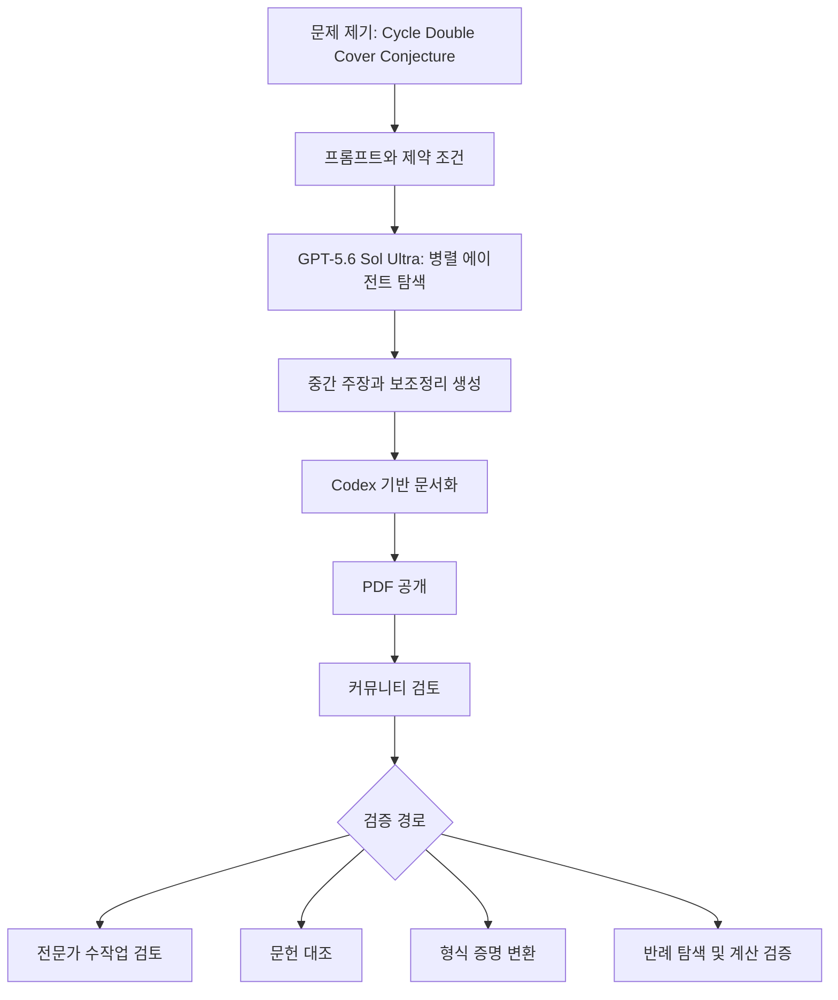

> 한 줄 요약: GPT-5.6 Sol Ultra가 Cycle Double Cover Conjecture 증명 PDF를 냈다는 소식에서 먼저 봐야 할 것은 “모델이 천재가 됐나”가 아니다. 검증되지 않은 고난도 결과를 누가, 어떤 절차로, 어느 범위까지 믿을 수 있느냐가 핵심이다.

## 무슨 일이 있었나

2026년 7월 9일 OpenAI는 GPT-5.6 제품군을 공개했다. Sol, Terra, Luna 세 모델 tier가 있고, 그중 Sol은 플래그십 모델로 소개됐다. `ultra`는 단일 모델명이 아니라 여러 에이전트를 병렬로 조정해 더 어려운 작업에 더 많은 계산을 쓰는 고성능 실행 설정이다.

그 직후 Hacker News에는 “GPT-5.6 Sol Ultra produces proof of the Cycle Double Cover Conjecture”라는 PDF 링크가 올라왔다. 2026년 7월 11일 확인 기준으로 해당 게시물은 457 points, 366 comments를 받았고, GPT-5.6 출시 글 자체도 1524 points, 1086 comments까지 커졌다.

PDF가 다루는 대상은 사이클 이중 덮개 추측(Cycle Double Cover Conjecture)이다. 모든 bridge 없는 유한 무방향 그래프에서 각 edge가 정확히 두 번 포함되도록 cycle들의 multiset을 만들 수 있다는 명제다.

PDF 안에는 다음 내용이 적혀 있다.

| 구분 | 내용 |
|---|---|
| 주장 | 모든 finite bridgeless undirected graph는 cycle double cover를 가진다 |
| 증명 전략 | loopless cubic graph로 축소한 뒤, nowhere-zero `F_2^3` flow와 선형대수 보조정리를 이용 |
| AI 사용 표기 | 증명은 GPT-5.6 Sol Ultra가 만들었고, 작성은 Codex with GPT-5.6 Sol로 했다고 적혀 있음 |
| 공개 상태 | OpenAI CDN에 3쪽짜리 PDF로 공개 |
| 아직 별도 검증 필요 | 학술지 심사, 독립 수학자 검토, formal proof checker 검증 여부는 PDF만으로 확인되지 않음 |

여기서 사실과 해석은 나눠서 봐야 한다. 확인된 것은 OpenAI CDN에 해당 PDF가 있고, PDF가 위 정리를 증명했다고 주장하며, Hacker News에서 큰 반응을 얻었다는 점이다. 아직 확인되지 않은 것은 증명이 수학계에서 받아들여질 만큼 완전한지, 기존 문헌의 빈틈을 놓치지 않았는지, 사람이 어느 정도 개입했는지다.

## 왜 사람들이 반응했나

### GPT-5.6 Sol Ultra 증명은 왜 바로 믿기 어려울까?

처음 반응은 놀라움이었다. 그래프 이론의 공개 문제가 3쪽짜리 PDF로 닫혔다면, 이것은 단순한 모델 벤치마크가 아니다. “모델이 코드를 잘 짠다”와 “모델이 새 수학을 만든다”는 전혀 다른 문제다.

다만 커뮤니티의 반응은 환호만으로 정리되지 않았다. PDF가 짧고 깔끔할수록 독자는 더 조심스러워진다. 난제를 푼 글이 반드시 길어야 하는 것은 아니지만, 짧은 증명에서는 한 줄의 누락이 전체를 무너뜨릴 수 있다.

모델이 만든 결과라서 더 엄격해야 한다는 말도 절반만 맞다. 사람이 쓴 증명도 틀릴 수 있고, 유명 저자 이름이 붙어도 검증은 필요하다. 다만 모델 산출물에는 별도의 위험이 있다. 모델은 자신이 어느 부분을 새로 만들었고 어느 부분을 기존 정리에서 가져왔는지 안정적으로 설명하지 못할 수 있다. 그럴듯한 논리 연결을 실제 정리처럼 보이게 쓰는 데도 능숙하다.

### 커뮤니티가 불편해한 지점은 무엇인가?

Hacker News 댓글에서 반복된 쟁점은 proof 자체만이 아니었다. 많은 사람이 prompt의 성격, 모델의 자율성, 검증 책임을 함께 봤다.

한 댓글 흐름은 prompt가 모델에게 단순히 문제를 던진 것이 아니라, 모호한 낙관론을 거부하고 실제 전역 호환성 조건을 해결하라는 식의 강한 지시를 담고 있다는 점을 짚었다. 이 반응은 성능을 깎아내리는 말이 아니다. 질문은 더 구체적이다.

AI가 스스로 증명한 것인가, 아니면 사람이 만든 문제 설정과 탐색 전략을 계산 자원으로 밀어붙인 것인가?

이 구분은 감정적 논쟁처럼 보이지만 실무적으로는 꽤 현실적인 문제다. 모델이 문제를 푸는 능력과, 문제를 풀도록 환경을 설계하는 능력은 다르다. 후자에는 프롬프트, 도구, 문헌, 검증기, 중간 실패 처리까지 포함된다.

OpenAI의 GPT-5.6 안내도 같은 방향을 가리킨다. 개발자 문서에서는 GPT-5.6이 의도를 더 잘 추론하더라도 hard constraint, approval boundary, success criteria는 여전히 명시하라고 말한다. 내부 coding-agent 평가에서는 더 간결한 prompt가 점수와 비용을 개선한 사례도 제시하지만, 이것 역시 “프롬프트가 사라진다”는 뜻은 아니다. 더 적은 말로 더 정확한 제약을 걸어야 한다는 뜻에 가깝다.

### 출시 글과 proof PDF가 같이 읽히는 이유

OpenAI의 GPT-5.6 출시 글은 성능 수치보다 운영 방식의 변화를 더 크게 보여준다. `ultra`는 기본적으로 네 개 에이전트를 병렬로 쓰는 설정이고, API에서는 multi-agent beta와 Programmatic Tool Calling이 함께 소개됐다. 프로그램이 도구 호출 결과를 중간에서 처리하고, 모델이 다시 판단해야 할 정보만 남기는 구조다.

이 조합은 연구나 개발 업무에서 유용하다. 동시에 검증 경계가 흐려진다. 사람이 대화창에서 한 번 답을 받은 것이 아니라, 여러 agent가 나눠서 탐색하고, 중간 산출물을 줄이고, 최종 보고서만 남기는 흐름이 되기 때문이다.

이 다이어그램에서 가장 약한 지점은 C가 아니라 F와 G 사이에 있다. 강한 모델이 산출물을 만들었다는 사실과, 그 산출물이 공동체 지식으로 편입된다는 사실 사이에는 별도의 검증 절차가 필요하다.

## 내가 보는 핵심

### AI가 증명했나보다 누가 검증했나가 먼저다

이번 사건을 “AI가 수학자를 대체했다”로 읽으면 너무 빠르다. 반대로 “검증 전이니 아무 의미 없다”로 닫아도 너무 좁다.

내가 보는 핵심은 생성 속도와 검증 속도의 불균형이다. 이전에는 사람이 논문을 쓰고, 다른 사람이 시간을 들여 읽고, 오류를 찾았다. 이제는 모델이 짧은 시간에 그럴듯한 증명 후보를 많이 낼 수 있다. 그러면 병목은 생성이 아니라 검증이 된다.

이런 상황에서는 “모델이 맞았는가”보다 “틀렸을 때 어디서 멈출 수 있는가”가 더 쓸모 있는 질문이다. 수학 증명이라면 형식화, 문헌 추적, 독립 재현이 필요하다. 코드라면 테스트, 정적 분석, 권한 분리, 롤백이 필요하다. 보안 분석이라면 재현 가능한 PoC와 악용 방지 경계가 필요하다.

GPT-5.6 system card도 비슷한 긴장을 보여준다. OpenAI는 GPT-5.6을 사이버보안과 생물·화학 영역에서 High capability로 분류하면서도 Critical threshold에는 도달하지 않았다고 적었다. 또 사이버 영역에서는 취약점을 찾고 고치는 능력이 공격을 끝까지 수행하는 능력보다 앞선다고 설명한다.

이 말은 양쪽으로 읽힌다. 방어자에게는 좋은 소식이지만, 플랫폼 운영자에게는 부담이다. 모델이 더 잘할수록 같은 기능이 방어와 공격 사이를 오가기 쉬워진다.

### 신뢰 문제는 모델 성능 문제가 아니라 권한 설계 문제다

OpenAI 문서에는 safeguards가 실시간 cyber·biology misuse classifier로 일부 요청을 차단하거나, 생성 중간에 몇 초 멈춰 검토할 수 있다는 설명이 있다. system card는 Sol cyber safeguards가 이전 모델보다 잠재적으로 유해한 활동을 약 10배 더 많이 차단한다고 밝히면서, 정상적인 사용자에게 friction이 생길 수 있다고도 말한다.

이 대목은 이번 proof 논쟁과도 연결된다. 모델이 강해질수록 사용자는 서로 반대되는 불만을 동시에 갖는다.

- 막히면: 내 정당한 연구와 업무가 왜 차단되는가
- 안 막히면: 위험한 능력을 너무 쉽게 풀어준 것 아닌가
- 맞히면: 이제 검증을 생략해도 되는가
- 틀리면: 누가 이 권위 있는 형식의 오류를 책임지는가

수학 증명 PDF는 안전 필터와 직접 관련 없어 보이지만, 같은 질문을 던진다. 산출물의 형식이 논문처럼 생겼을 때 독자는 권위를 느낀다. OpenAI CDN, GPT-5.6 Sol Ultra, Codex라는 이름이 붙으면 그 권위는 더 커진다. 그럴수록 provenance가 더 중요해진다.

실무에서 비슷한 고민을 하다 보면, 모델 품질보다 기록이 먼저 무너지는 경우가 많다. 어떤 모델 버전이었는지, reasoning effort가 무엇이었는지, 병렬 agent를 몇 개 썼는지, 어떤 문헌을 입력했는지, 어떤 중간 결과를 버렸는지 남아 있지 않으면 나중에 맞고 틀림을 따질 방법이 줄어든다.

### OpenAI 중심 뉴스처럼 보이지만 플랫폼 문제다

이번 이슈를 특정 회사의 승리나 실수로만 읽으면 시야가 좁아진다. 앞으로 어떤 frontier model이든 비슷한 장면을 만들 수 있다. Claude, Gemini, 오픈 모델, 사내 특화 모델 모두 고난도 산출물을 자동으로 만들고, 팀은 그것을 제품·문서·연구·운영 판단에 넣게 된다.

차이는 모델 이름이 아니라 검증 파이프라인이다.

| 상황 | 위험 | 필요한 기준 |
|---|---|---|
| AI가 난제 증명 후보를 작성 | 그럴듯한 오류가 권위 있게 유통 | 독립 검토, formalization, 문헌 대조 |
| AI가 보안 취약점 분석 | 방어와 공격의 경계 혼재 | 권한 분리, 로그, 안전 식별자, 승인 단계 |
| AI가 코드 변경까지 수행 | 의도 밖 행동, 데이터 파괴 | 샌드박스, diff review, 테스트 게이트 |
| AI가 여러 agent를 병렬 실행 | 중간 근거 소실 | agent별 입력·출력·판단 기록 |
| AI가 비용 효율을 이유로 교체됨 | 품질 회귀를 비용 절감으로 착각 | 대표 workload 기반 평가 |

이 표에서 가장 위험한 문장은 “성능이 좋아졌으니 그대로 바꾸자”다. GPT-5.6 개발자 안내는 마이그레이션할 때 기존 reasoning 설정을 기준으로 같은 설정과 한 단계 낮은 설정을 대표 작업에서 비교하라고 권한다. 이 태도는 proof PDF에도 그대로 적용된다. 놀라운 결과일수록 바로 믿거나 바로 버리지 말고, 비교 가능한 검증 작업으로 옮겨야 한다.

## 앞으로 볼 기준

### 다음 AI 증명 뉴스를 볼 때 무엇을 확인해야 할까?

앞으로 비슷한 뉴스는 더 자주 나올 가능성이 높다. 그때 먼저 볼 것은 모델 이름이 아니다.

- 원문 산출물이 공개됐는가
- prompt, model, mode, reasoning effort, tool 사용 범위가 남아 있는가
- 사람이 어느 단계에서 개입했는가
- 기존 문헌과 어떤 차이가 있는가
- 독립 전문가가 어느 부분을 검토했는가
- 형식 증명 시스템으로 옮길 계획이 있는가
- 반례 탐색이나 계산 검증을 누구나 재현할 수 있는가
- 실패했을 때 수정 이력과 철회 절차가 있는가

수학에서는 formal proof checker가 강한 기준이 될 수 있다. Lean, Coq, Isabelle 같은 도구로 옮겨지면 논쟁의 성격이 달라진다. 물론 형식화 자체도 노동이고, 모든 증명이 즉시 옮겨질 수 있는 것은 아니다. 그래도 “모델이 말했다”와 “검증기가 통과했다” 사이에는 큰 차이가 있다.

제품과 개발 조직에서는 비슷한 기준을 eval로 바꿔야 한다. OpenAI 문서도 Programmatic Tool Calling을 도입할 때 최종 답변이 근거를 빠뜨리지 않았는지, program output과 final message를 따로 테스트하라고 권한다. 중간 계산이 맞아도 최종 메시지가 필요한 caveat를 빼먹으면 사용자는 틀린 결정을 내릴 수 있다.

### GPT-5.6 같은 모델을 실무에 넣을 때의 판단 기준

GPT-5.6 Sol Ultra proof 이슈에서 얻을 수 있는 실무 기준은 단순하다. 모델을 더 믿기 전에, 모델이 틀렸을 때 드러나는 구조를 먼저 만들어야 한다.

- high effort, max, ultra는 품질 옵션이면서 비용·지연·감사 범위를 키우는 옵션이다
- multi-agent는 병렬 탐색을 빠르게 하지만, 근거 추적을 자동으로 해결하지 않는다
- safety classifier는 플랫폼 리스크를 줄이지만, 정상 업무에 마찰을 만들 수 있다
- 짧은 prompt가 더 잘 먹힐 수 있어도, 승인 경계와 성공 기준은 짧아지면 안 된다
- 모델 교체는 라이브러리 버전 업그레이드가 아니라 운영 정책 변경에 가깝다

이 관점에서 보면 이번 PDF의 가치는 증명이 최종적으로 맞느냐에만 있지 않다. 맞다면 검증 체계는 새로운 속도를 받아들여야 한다. 틀렸다면 그것도 기록할 만한 사건이다. 모델이 만든 그럴듯한 오류를 어떻게 발견하고, 얼마나 빨리 정정할 수 있는지 확인하는 사례가 되기 때문이다.

처음의 긴장으로 돌아가 보자. GPT-5.6 Sol Ultra가 Cycle Double Cover Conjecture를 증명했다는 문장은 눈길을 끈다. 하지만 지금 더 중요한 질문은 따로 있다. 모델이 답을 내는 속도에 맞춰, 우리가 검증하는 방식도 빨라질 수 있는가.

## 참고 자료

- [선정 글감] [GPT-5.6 Sol Ultra produces proof of the Cycle Double Cover Conjecture [pdf]](https://cdn.openai.com/pdf/04d1d1e4-bc75-476a-97cf-49055cd98d31/cdc_proof.pdf) — Hacker News Best
- [관련] [GPT-5.6: Frontier intelligence that scales with your ambition](https://openai.com/index/gpt-5-6/) — OpenAI Blog
- [관련] [GPT-5.6 System Card](https://deploymentsafety.openai.com/gpt-5-6/gpt-5-6.pdf) — OpenAI Deployment Safety
- [관련] [Model guidance: GPT-5.6](https://developers.openai.com/api/docs/guides/latest-model) — OpenAI API Docs
- [관련] [GPT-5.6 Sol Ultra produces proof of the Cycle Double Cover Conjecture](https://news.ycombinator.com/item?id=48863490) — Hacker News
- [관련] [GPT-5.6](https://news.ycombinator.com/item?id=48849066) — Hacker News