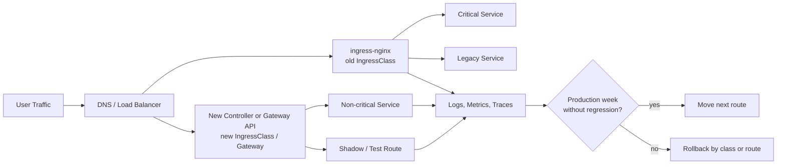

> 한 줄 요약: Kubernetes ingress-nginx 종료는 Gateway API로 바로 갈아타라는 뜻이 아니다. 먼저 해야 할 일은 컨트롤러를 바꾸는 것이 아니라, 현재 트래픽 규칙과 보안 대응 절차를 코드와 운영 데이터로 확인하는 것이다.

## 왜 지금 Kubernetes ingress-nginx 종료가 이슈인가

Kubernetes ingress-nginx는 많은 클러스터에서 인터넷 요청이 서비스로 들어오는 첫 관문이었다. 2026년 3월부터 Kubernetes SIG Network가 ingress-nginx 유지보수를 중단했고, 7월 9일 CNCF 글은 앞으로 보안 패치와 기능 작업을 기대하기 어렵다는 점을 운영자에게 다시 알렸다.

겉으로 보면 선택지는 단순해 보인다. 기존 Ingress API를 유지하면서 Contour 같은 다른 인그레스 컨트롤러(Ingress Controller)로 옮기거나, Kubernetes Gateway API로 전환하는 방법이 있다.

하지만 이 일을 컨트롤러 이름만 바꾸는 작업으로 보면 위험하다. 인그레스 컨트롤러는 단순 프록시가 아니다. TLS, 경로 재작성, 타임아웃, 세션 고정, 헬스 체크, 인증 연동이 한곳에 묶여 있다. 평소에는 조용하지만, 장애가 나면 가장 먼저 의심해야 하는 계층이기도 하다.

개발자 커뮤니티에서 이 이슈가 길게 논의되는 이유도 여기에 있다. 새 API가 더 낫다는 말만으로는 부족하다. 운영팀은 지금 돌아가는 요청 경로를 깨지 않으면서, 패치되지 않는 CVE 위험을 줄이고, 다음 교체 때도 덜 흔들리는 구조를 만들어야 한다.

## 커뮤니티에서 갈리는 지점: Gateway API vs Ingress 차이점

첫 번째 갈림길은 Ingress를 유지할지, Gateway API로 갈지다.

Ingress는 단순하고 널리 쓰였다. 문제는 단순한 API 위에 컨트롤러별 annotation이 계속 쌓였다는 점이다. `nginx.ingress.kubernetes.io/rewrite-target`, 타임아웃, 바디 크기, 세션 affinity 같은 설정은 사실상 ingress-nginx 방언이다.

Gateway API는 이 방언 문제를 줄이려는 방향이다. Gateway, HTTPRoute, ReferenceGrant 같은 리소스로 역할을 나누고, 인프라 운영자와 애플리케이션 팀의 책임 경계를 더 분명하게 잡는다. 그래서 장기적인 목적지로는 설득력이 있다.

다만 Gateway API가 곧 낮은 리스크를 뜻하지는 않는다. 운영 중인 시스템에서 가장 위험한 부분은 API 이름이 아니라 숨어 있는 트래픽 규칙이다. 예를 들어 특정 서비스가 trailing slash를 전제로 동작하거나, 느린 업로드 요청에 긴 idle timeout을 기대하거나, 인증 프록시 뒤에서 헤더 정규화 방식에 의존하고 있다면 마이그레이션은 조용히 깨질 수 있다.

Contour 같은 Envoy 기반 컨트롤러로 옮기는 선택지도 단순한 임시방편만은 아니다. 유지보수되는 코드로 보안 패치 경로를 되살리고, Gateway API 전환은 별도 일정으로 나누는 방식은 현실적인 완충 장치가 될 수 있다.

Scarf가 Haskell에서 벗어난 사례도 비슷한 지점을 건드린다. 그 글은 언어 자체의 성능이나 안정성이 실패했다는 이야기가 아니다. 타입 시스템과 신뢰성은 실제 운영에서 장점으로 남았지만, 컴파일 시간과 생태계 마찰이 계속 비용으로 쌓였다는 고백에 가깝다.

인그레스 컨트롤러도 같다. 지금 잘 동작한다는 사실과 앞으로 운영 가능한 선택이라는 사실은 다르다. 어느 순간에는 기술 자체의 장점보다 패치 가능성, 디버깅 가능한 생태계, 새로 합류한 사람이 이해할 수 있는 설정 표면이 더 중요한 판단 기준이 된다.

## 아키텍처 관점에서 볼 점: 인그레스 컨트롤러 마이그레이션은 데이터 흐름 변경이다

인그레스 교체는 YAML 리소스를 바꾸는 작업이 아니라 요청 흐름의 관문을 바꾸는 작업이다. 특히 다음 네 가지는 배포 전에 반드시 확인해야 한다.

| 확인 영역 | 흔한 착각 | 실제로 봐야 할 것 |
|---|---|---|
| TLS | 인증서만 같으면 된다 | SNI, 인증서 reload, 기본 cipher 정책 |
| 라우팅 | path 규칙은 동일하게 해석된다 | prefix match, trailing slash, rewrite 순서 |
| 연결 관리 | timeout 기본값은 비슷하다 | idle timeout, upstream timeout, slow request 처리 |
| 장애 대응 | 새 컨트롤러가 뜨면 끝난다 | IngressClass 단위 rollback, 로그와 메트릭 비교 |

아래처럼 old plane과 new plane을 병렬로 두고, IngressClass나 Gateway route 단위로 트래픽을 옮기는 구성이 안전하다.

핵심은 클러스터 전체를 한 번에 전환하지 않는 것이다. 같은 클러스터 안에서 예전 컨트롤러와 새 컨트롤러를 나란히 두고, `IngressClass` 또는 Gateway API의 `HTTPRoute` 단위로 이동하면 실패 범위를 줄일 수 있다.

이 방식은 보안 대응에도 유리하다. 유지보수가 끝난 컨트롤러를 당장 모두 걷어내지 못하더라도, 외부 노출이 큰 경로부터 새 컨트롤러로 옮기고 남은 경로를 추적할 수 있다. 패치되지 않는 CVE가 나왔을 때 무엇이 아직 위험 표면에 남아 있는지 설명할 수 있어야 한다.

### Kubernetes Gateway API 도입 전에 물어야 할 질문

Gateway API가 더 나은 모델이라는 주장에는 동의할 부분이 많다. 그렇지만 다음 질문에 답하지 못하면 도입은 새 표준을 들여오는 일이 아니라 새 모호함을 만드는 일이 된다.

- Gateway 리소스는 플랫폼 팀이 관리하고, HTTPRoute는 서비스 팀이 관리하는가?
- 네임스페이스 간 참조 권한은 ReferenceGrant로 제한되는가?
- 인증, rate limit, WAF, observability 설정은 어디에 붙는가?
- 기존 NGINX annotation 중 사라지는 기능은 무엇인가?
- 실패 시 DNS, LoadBalancer, IngressClass, route 중 어느 지점에서 되돌릴 것인가?

Gateway API는 책임 경계를 드러내는 장점이 있다. 반대로 말하면 조직 안의 책임 경계가 흐리면 YAML만 더 많아질 수 있다.

## 실무에서 볼 점: 보안 플레이북 없이 마이그레이션하지 말기

CISA의 2026년 7월 포스트모템은 다른 영역의 이야기지만, 인그레스 마이그레이션과도 맞닿아 있다. 민감한 키와 credential이 공개 저장소에 노출된 사건에서, CISA는 초기에 필요한 대응 플레이북을 사고 중에 만들어야 했다고 밝혔다. 연구자가 알릴 수 있는 경로도 충분히 명확하지 않았다고 했다.

이 사건이 보여주는 점은 단순하다. 보안 사고 대응은 사고가 난 뒤 즉석에서 해결할 일이 아니다. 누가 알림을 받고, 어떤 credential을 폐기하며, 어떤 로그로 악용 여부를 확인하고, 외부 제보를 어느 채널로 받을지가 미리 정해져 있어야 한다.

ingress-nginx 종료도 같은 종류의 운영 리스크다. 아직 장애가 난 것은 아니지만, 앞으로 CVE가 나왔을 때 패치를 받을 수 없는 구성 요소가 인터넷 앞단에 남는다. 대응 절차가 없으면 그때 가서 교체 계획과 사고 대응 계획을 동시에 써야 한다.

실무에서는 다음 순서가 낫다.

1. 현재 클러스터에서 ingress-nginx가 처리하는 host, path, annotation을 목록화한다.
2. 외부 노출, 인증 우회 가능성, 트래픽 규모 기준으로 경로를 분류한다.
3. 새 컨트롤러나 Gateway API에서 동등하게 표현되지 않는 규칙을 따로 표시한다.
4. 비핵심 서비스부터 병렬 구간에 태운다.
5. 전환 전후의 404, 499, 5xx, latency, TLS handshake error를 같은 대시보드에서 비교한다.
6. 최소 한 번은 rollback을 실제로 실행해 본다.

여기서 실패하기 쉬운 지점은 테스트 환경이 너무 깨끗하다는 점이다. 운영 인그레스에는 과거 장애를 막기 위해 추가된 annotation, 특정 클라이언트 호환성을 위한 TLS 설정, 임시로 넣었다가 영구화된 rewrite 규칙이 섞여 있다. 이런 설정일수록 문서에는 없고 manifest에만 남아 있는 경우가 많다.

하네스와 테스트 자동화 관점에서도 HTTP 200 몇 개를 확인하는 정도로는 부족하다. 경로 정규화, 대용량 요청, 느린 클라이언트, 인증 헤더, websocket, gRPC, redirect, 압축 응답을 포함한 트래픽 재현 세트가 필요하다. 인그레스는 애플리케이션 로직이 아니지만, 사용자에게는 애플리케이션의 일부처럼 보인다.

### Contour로 먼저 갈까, Gateway API로 바로 갈까?

둘 중 하나가 항상 정답은 아니다. 판단 기준은 팀의 시간표와 위험 표면이다.

| 선택 | 맞는 상황 | 조심할 점 |
|---|---|---|
| 다른 Ingress 컨트롤러로 교체 | 기존 Ingress 리소스가 많고, 빠르게 유지보수 경로를 복구해야 함 | annotation 호환성 검증이 필요하며 장기적으로 한 번 더 이동할 수 있음 |
| Gateway API로 전환 | 플랫폼 경계를 다시 잡고, 새 서비스 라우팅 모델을 표준화하려 함 | 학습 비용과 권한 모델 설계가 필요함 |
| 혼합 전략 | 보안 리스크를 먼저 낮추고, 현대화는 별도 단계로 나누려 함 | 두 경로가 장기간 공존하지 않도록 종료 기준이 필요함 |

현업에서 비슷한 결정을 하다 보면, 기술적으로 더 깔끔한 목적지보다 덜 위험하게 움직이는 순서가 더 중요할 때가 많다. 특히 인터넷 경계에 있는 구성 요소는 한 번에 크게 바꾸기보다, 되돌릴 수 있는 작은 단위로 바꾸는 편이 낫다.

## 정리

ingress-nginx 종료를 Gateway API 홍보 문구처럼 받아들이면 놓치는 것이 많다. 질문은 어떤 컨트롤러가 더 최신인가가 아니다. 우리 클러스터의 트래픽 규칙을 얼마나 알고 있는가, 패치되지 않는 보안 이슈가 나왔을 때 어느 경로를 먼저 끊거나 옮길 수 있는가, 새 구조가 다음 교체 때 혼란을 줄여줄 수 있는가다.

당장 확인할 것은 하나다. 운영 클러스터에서 ingress-nginx annotation이 붙은 Ingress 목록을 뽑고, 그중 외부 공개 host부터 새 컨트롤러나 Gateway API에서 재현 가능한지 표시해보자. 그 표가 없으면 마이그레이션 계획은 아직 계획이 아니라 희망에 가깝다.

## 참고 자료

- [선정 글감] [After the ingress-NGINX retirement, what your migration plan owes production](https://dev.to/leobaniak/after-the-ingress-nginx-retirement-what-your-migration-plan-owes-production-10de) — DEV Community
- [관련] [After 7 years in production, Scarf has reluctantly moved away from Haskell](https://avi.press/posts/2026-07-10-after-7-years-in-production-scarf-has-reluctantly-moved-away-from-haskell.html) — Lobsters
- [관련] [US cyber agency CISA had to build its incident playbook during the incident, agency reveals](https://techcrunch.com/2026/07/10/us-cyber-agency-cisa-had-to-build-its-incident-playbook-during-the-incident-agency-reveals/) — TechCrunch