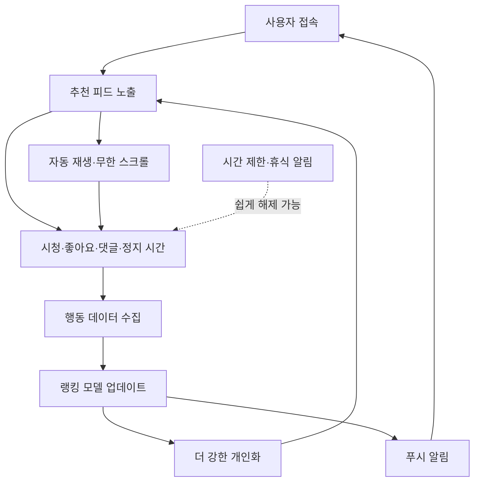

> 한 줄 요약: EU는 메타의 인스타그램과 페이스북 일부 설계가 DSA를 위반했을 수 있다고 봤다. 이 논쟁에서 중요한 건 앱에 중독 딱지를 붙이는 일이 아니다. 추천 피드의 기본값과 사용자의 선택권이 실제로 균형을 이루는지 따져보는 일이다.

## 무슨 일이 있었나

2026년 7월 10일, 유럽연합 집행위원회는 메타의 인스타그램과 페이스북 설계가 디지털서비스법(Digital Services Act, DSA)을 위반했다는 잠정 결론을 냈다.

문제가 된 범위는 앱 전체가 아니라 일부 설계다. 무한 스크롤(Infinite Scroll), 자동 재생(Autoplay), 푸시 알림, 고도로 개인화된 추천 알고리즘이 사용자를 계속 보게 만들고, 특히 미성년자와 취약한 이용자의 신체적, 정신적 안녕에 위험을 만든다는 판단이다.

아직 최종 제재는 아니다. 메타는 집행위의 증거를 검토하고 공식 답변을 제출할 수 있다. 최종적으로 위반이 확정되면 DSA상 전 세계 연간 매출의 최대 6%까지 과징금이 가능하지만, 실제 부과 여부와 액수는 정해지지 않았다.

| 구분 | 확인된 사실 | 아직 남은 판단 |
|---|---|---|
| 당사자 | EU 집행위원회, 메타 | 메타의 반박이 어느 정도 받아들여질지 |
| 대상 | 인스타그램, 페이스북 | 모든 기능이 아니라 어느 설계가 수정 대상인지 |
| 법적 근거 | DSA의 대형 온라인 플랫폼 위험 평가 및 완화 의무 | 위반 확정 및 제재 수준 |
| 쟁점 | 무한 스크롤, 자동 재생, 추천 알고리즘, 알림 | 어떤 대체 설계가 충분한 완화인지 |
| 사용자 범위 | EU 이용자, 특히 미성년자와 취약한 성인 | 지역별 기능 분리 여부 |

이 사건은 2024년 5월 시작된 메타 조사에서 이어졌다. 당시 EU는 미성년자 보호, 연령 확인, 래빗홀 효과(Rabbit Hole Effect), 플랫폼 이용이 정신 건강에 주는 영향 등을 함께 들여다보기 시작했다.

이번 잠정 판단은 그중 중독적 디자인에 초점을 맞춘다. 13세 미만 이용자 접근 차단, 알고리즘이 부정적 콘텐츠로 이용자를 밀어 넣는지에 대한 쟁점은 별도로 계속 남아 있다.

## 왜 사람들이 반응했나

Hacker News에서 이 이슈에 댓글이 많이 붙은 건 메타가 또 규제받아서만은 아니다. 개발자 커뮤니티는 이 사건을 제품 설계, 자유 선택, 네트워크 효과, 규제의 실효성 문제로 읽었다.

가장 많이 갈린 지점은 선택권이다. 어떤 사람들은 성인 이용자에게는 중독적인 피드와 덜 중독적인 피드 중 고를 권리를 줘야 한다고 본다. 반대로 다른 쪽은 그 선택이 이미 비대칭이라고 본다. 앱의 기본값은 자동 재생과 추천 피드인데, 절제 도구는 설정 깊숙한 곳에 있거나 쉽게 닫을 수 있는 팝업이라면 사용자가 실제로 통제권을 갖고 있다고 말하기 어렵다.

여기서 불편함이 생긴다. 플랫폼은 체류 시간을 늘리도록 거의 모든 화면을 조정한다. 그러면서 시간 제한, 휴식 알림, 부모 통제 도구를 제공한다고 말한다. 하지만 사용자가 닫기 한 번으로 무시할 수 있는 안전장치가 수백 번의 추천, 알림, 자동 재생과 같은 무게를 갖는지는 별개의 문제다.

커뮤니티 반응은 대체로 네 질문으로 모였다.

- 신뢰: 메타가 스스로 위험을 평가하고 완화했다는 말을 어디까지 믿을 수 있는가
- 권한: 정부가 피드 설계에 개입해도 되는가
- 비용: 과징금이 사업 비용으로 흡수되면 무엇이 달라지는가
- 사용성: 무한 스크롤을 끄면 이용자는 좋아지는가, 아니면 서비스 가치가 줄어드는가

특히 네트워크 효과(Network Effect)에 대한 지적이 날카롭다. 페이스북은 여전히 지역 행사, 소규모 사업장 공지, 그룹, 마켓플레이스 접근 통로로 쓰인다. 인스타그램도 친구 관계와 창작자 생태계가 묶여 있다. 그냥 쓰지 않으면 된다는 말은 기능적으로 맞지만, 사회적 비용을 설명하지 못한다.

그래서 이번 논쟁은 앱을 삭제하면 끝나는 개인 습관 문제가 아니다. 사회적 인프라처럼 쓰이는 플랫폼이 사용자의 주의력을 수익화할 때, 어디까지를 정상적인 제품 최적화로 보고 어디부터를 규제 가능한 위험으로 볼 것인가의 문제다.

## 내가 보는 핵심

EU의 판단을 대충 요약하면 “중독적인 기능을 끄면 된다”로 읽힐 수 있다. 나는 그게 절반만 맞다고 본다.

무한 스크롤이나 자동 재생은 눈에 잘 보이는 증상이다. 더 깊은 층에는 최적화 루프가 있다. 추천 시스템은 사용자가 멈추는 순간보다 계속 보는 순간을 더 쉽게 학습한다. 알림은 복귀를 만들고, 복귀는 더 많은 행동 데이터를 만들고, 행동 데이터는 다시 추천 품질과 광고 가치를 높인다.

이 구조에서 휴식 알림 하나를 넣는다고 위험이 사라졌다고 말하기는 어렵다. 위험은 기능 하나가 아니라 루프 전체에서 나온다.

그렇다고 무조건 규제가 정답이라는 뜻도 아니다. 중독이라는 단어는 강하지만, 제품 설계 평가 기준으로는 모호할 수 있다. 어떤 사용자는 알고리즘 피드를 정보 발견 도구로 쓴다. 어떤 창작자는 추천 시스템 덕분에 유통 경로를 얻는다. 소상공인이나 커뮤니티 운영자는 페이스북 페이지와 그룹에 의존하기도 한다.

그래서 더 나은 질문은 이쪽이다.

## 인스타그램 중독적 디자인 규제, 무엇을 바꿔야 할까?

기능을 없앨지보다 기본값을 어떻게 둘지가 더 실무적인 질문이다. 예를 들어 다음 조치들은 서로 다른 수준에 놓여 있다.

| 조치 | 효과 | 한계 |
|---|---|---|
| 무한 스크롤 제거 | 소비 흐름을 끊음 | 사용성 저하, 우회 설계 가능 |
| 자동 재생 기본 해제 | 비의도적 시청 감소 | 사용자가 다시 켤 수 있음 |
| 비개인화 피드 기본 제공 | 추천 압력 감소 | 콘텐츠 발견성이 줄 수 있음 |
| 휴식 알림 강화 | 마찰 추가 | 쉽게 닫히면 효과 제한 |
| 외부 감사용 데이터 제공 | 위험 검증 가능 | 개인정보 및 영업비밀 충돌 |

현업에서 비슷한 고민을 하다 보면 가장 어려운 지점은 지표다. 제품팀은 보통 체류 시간, 재방문율, 클릭률, 전환율을 빠르게 본다. 과사용, 피로도, 야간 이용, 후회 기반 사용 같은 지표는 측정도 어렵고 조직의 보상 구조와도 잘 맞지 않는다.

DSA가 플랫폼에 요구하는 위험 평가와 완화는 이 불균형을 건드린다. 대형 플랫폼은 자신들이 만든 시스템이 불법 콘텐츠, 공중보건, 미성년자 보호, 정신적, 신체적 안녕에 어떤 영향을 주는지 평가하고 줄여야 한다. EU의 DSA 안내도 대형 플랫폼이 광범위한 위험을 식별하고 줄일 의무가 있다고 설명한다.

다만 보고서가 존재한다고 위험이 줄어드는 것은 아니다. 2026년 5월 공개된 DSA 투명성 보고 관련 연구는 대형 플랫폼들의 보고 데이터에서 형식, 시점, 일관성, 완전성 문제가 여전히 남아 있다고 지적했다. 규제가 작동하려면 플랫폼이 무엇을 제출했는지보다 외부에서 같은 결론을 재현할 수 있는지가 더 중요하다.

이 사건을 회사 하나의 문제로만 보면 놓치는 부분이 있다. TikTok, YouTube, X, Snapchat, Threads 같은 서비스도 같은 질문을 받게 된다. 추천 시스템과 광고 모델, 알림, 숏폼, 사회적 관계망이 결합된 제품이라면 비슷한 위험 구조를 갖는다.

## 앞으로 볼 기준

다음에 비슷한 뉴스를 볼 때는 과징금 액수보다 네 가지를 먼저 봐야 한다.

첫째, 기본값이 바뀌는가. 설정 메뉴 어딘가에 선택지가 생기는 것과 처음부터 덜 개인화된 피드가 제공되는 것은 다르다. 사용자의 의지력을 전제로 한 보호 장치는 대규모 플랫폼에서 쉽게 약해진다.

둘째, 미성년자 보호가 연령 확인에만 갇히지 않는가. 나이를 맞히는 기술은 개인정보와 보안 리스크를 만든다. 반대로 나이를 제대로 확인하지 않으면 보호 정책이 무력해진다. 그래서 연령 확인, 데이터 최소화, 기본 제한, 부모 통제의 균형을 같이 봐야 한다.

셋째, 플랫폼이 무엇을 최적화하는지 공개되는가. 추천 알고리즘의 소스코드를 모두 공개하자는 요구는 현실적으로 복잡하다. 하지만 어떤 목표 함수(Objective Function)를 쓰는지, 야간 이용과 연속 시청, 반복 복귀 같은 위험 신호를 어떻게 완화하는지는 감사 가능한 형태로 설명돼야 한다.

넷째, 규제가 기능 제거에만 머무르는가. 무한 스크롤 버튼을 없애도 랭킹 모델이 같은 보상을 추구하면 비슷한 압력은 다른 UI로 옮겨간다. 화면 요소를 볼 것인지, 추천, 알림, 광고, 실험 플랫폼을 묶은 시스템을 볼 것인지가 중요하다.

이번 EU 판단이 맞느냐 틀리냐와 별개로 남는 질문이 있다. 플랫폼이 사용자를 오래 붙잡는 데 성공했을 때, 그 성공을 어디까지 제품 품질로 볼 것인가. 그리고 사용자가 떠나기 어려운 사회적 네트워크 위에서 그 성공이 만들어졌다면, 개인의 선택이라는 말은 어디까지 유효한가.

인스타그램과 페이스북은 이제 디자인을 설명해야 한다. 예쁜 버튼이나 편리한 피드가 아니라, 왜 그 기본값이 사용자를 그 방향으로 밀어도 되는지 설명해야 한다. 그 설명이 충분한지에 따라 다음 플랫폼 규제의 범위도 달라진다.

## 참고 자료

- [선정 글감] [EU Commission: addictive design Instagram and Facebook in breach of the DSA, Hacker News](https://news.ycombinator.com/item?id=48858292)
- [관련] [Commission preliminarily finds the addictive design of Instagram and Facebook in breach of the Digital Services Act, European Commission](https://ec.europa.eu/commission/presscorner/detail/en/ip_26_1579)
- [관련] [EU threatens Meta with fines over addictive features on Facebook and Instagram, TechCrunch](https://techcrunch.com/2026/07/10/eu-threatens-meta-with-fines-over-addictive-features-on-facebook-and-instagram/)
- [관련] [EU accuses Meta of failing to tackle mental health risks of addictive design, The Guardian](https://www.theguardian.com/technology/2026/jul/10/eu-accuses-meta-failing-tackle-mental-health-risks-addictive-design)
- [관련] [The Digital Services Act, European Commission](https://digital-strategy.ec.europa.eu/en/policies/digital-services-act)
- [관련] [Disarranged Harmonization of Transparency Reporting by Social Media Platforms Under the Digital Services Act, arXiv](https://arxiv.org/abs/2605.17655)