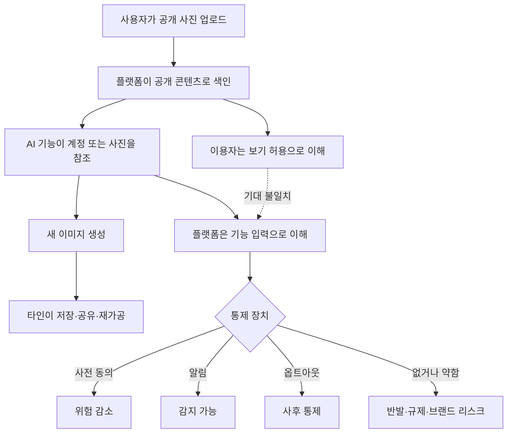

> 한 줄 요약: Meta가 Instagram AI 사진 기능을 철회한 일은 공개 게시물을 AI 창작 재료로 쓸 때 동의, 알림, 악용 책임을 어디까지 설계해야 하는지 보여준다.

## 무슨 일이 있었나

2026년 7월 10일 TechCrunch 보도에 따르면 Meta는 Instagram 공개 계정의 사진을 AI 이미지 생성에 참조할 수 있게 한 기능을 철회했다. 이 기능은 Meta Superintelligence Labs가 공개한 AI 이미지 생성기 Muse Image 관련 도구 묶음에 포함돼 있었다.

문제는 사용 방식이었다. 이용자가 공개 Instagram 계정을 @멘션하면, 해당 계정의 공개 사진을 참조해 이미지를 만들 수 있었다. 그런데 사진이 이런 방식으로 쓰였다는 사실을 계정 주인에게 알려주는 장치는 없었다.

확인된 사실과 해석을 나누면 이렇다.

| 구분 | 내용 |
|---|---|
| 확인된 사실 | Meta는 해당 기능을 이번 주 초 공개했고, 반발 이후 7월 10일 제거했다. |
| 확인된 사실 | Meta는 블로그에서 기능이 기대와 달리 받아들여졌고 더는 제공하지 않는다고 밝혔다. |
| 확인된 사실 | 기능은 공개 Instagram 계정을 AI 이미지 생성의 참조 대상으로 삼을 수 있었다. |
| 확인된 사실 | 설계상 참조 대상 계정에 별도 알림을 보내지 않았다. |
| 보도 기반 맥락 | 사용자와 탤런트 에이전시, CAA 등의 문제 제기가 있었다고 전해졌다. |
| 추정에 가까운 해석 | Meta는 공개 콘텐츠를 창작 도구의 입력으로 쓸 수 있다고 본 듯하지만, 이용자는 공개와 재사용 허용을 같은 의미로 받아들이지 않았다. |

이 사건만 보면 기능 하나가 빠르게 내려간 사례처럼 보인다. 하지만 같은 날 유럽연합(EU)이 Digital Services Act(DSA)를 근거로 Facebook과 Instagram의 중독적 설계에 문제를 제기한 흐름과 겹쳐 보면 결이 조금 달라진다.

EU 집행위원회는 무한 스크롤, 자동재생, 푸시 알림, 고도로 개인화된 추천 알고리즘이 이용자를 계속 머물게 만드는 구조라고 봤다. 특히 미성년자와 취약한 이용자에게 미치는 신체적, 정신적 영향을 Meta가 충분히 평가하지 않았다는 취지다. 아직 최종 판단은 아니고 Meta의 답변 절차가 남아 있다. 다만 위반이 확인되면 전 세계 연간 매출의 최대 6%까지 벌금이 부과될 수 있다는 설명도 나왔다.

같은 플랫폼에서 한쪽은 AI 창작 재료로 쓰이는 공개 콘텐츠가, 다른 한쪽은 체류 시간을 늘리는 추천 구조가 문제가 되고 있다. 둘 다 사용자의 행동과 콘텐츠를 플랫폼이 어디까지 다시 해석해도 되는가라는 질문으로 이어진다.

## 왜 사람들이 반응했나

가장 큰 불편은 공개 범위와 사용 허가의 차이에서 나왔다.

Instagram에 사진을 공개로 올렸다는 것은 다른 사람이 볼 수 있다는 뜻이다. 하지만 그 사진이 AI 이미지 생성의 참조값으로 쓰이고, 계정 주인이 모르는 사이 변형 이미지의 재료가 된다는 뜻은 아니다. 플랫폼은 공개 데이터를 기능 입력으로 볼 수 있다. 이용자는 자기 얼굴, 몸, 스타일, 생활 맥락이 복제 가능한 자산처럼 다뤄지는 순간 선을 넘었다고 느낀다.

이미지 생성 AI에서는 악용 가능성이 더 직접적으로 드러난다. TechCrunch는 AI가 소셜 플랫폼과 결합한 뒤 여성 유명인의 나체 이미지를 만드는 식의 오용이 반복됐고, 플랫폼의 가드레일이 자주 부족했다고 짚었다. 이런 상황에서 Instagram 공개 계정을 @멘션해 이미지를 만들 수 있는 기능은 안전장치가 얼마나 정교한지보다 먼저 이런 질문을 만든다.

- 참조된 사람은 알 수 있는가
- 원하지 않으면 사전에 막을 수 있는가
- 이미 생성된 결과물은 추적 가능한가
- 유명인뿐 아니라 일반 이용자에게도 같은 보호가 적용되는가
- 미성년자, 비공개 전환 직전 계정, 과거 공개 게시물은 어떻게 다루는가

사용자 반응이 커진 이유는 AI 자체에 대한 거부감만으로 설명하기 어렵다. 알림 없는 참조, 사후 옵트아웃에 가까운 통제, 악용 가능성이 큰 이미지 도구가 함께 묶여 있었기 때문이다.

여기에 AI 콘텐츠 피로감도 겹친다. Pangram이 공개한 소셜 피드 분석 글은 자사 브라우저 확장 프로그램의 옵트인 스캔 데이터를 바탕으로, 긴 글 형태의 소셜 게시물에서 AI 생성으로 판정된 비율이 높고 LinkedIn 비중이 컸다고 주장했다. 이 데이터는 표본과 탐지 방식의 한계가 있어 플랫폼 전체를 대표한다고 보기는 어렵다. 그래도 개발자 커뮤니티에서 반응이 붙은 이유는 알 수 있다.

사람들은 이미 피드에서 AI가 만든 글, 이미지, 댓글, 홍보 문구를 구분하느라 피곤해하고 있다. 그런 상태에서 플랫폼이 공개 계정 사진까지 AI 창작 기능에 연결하면, 사용자는 피드가 편해진다고 느끼기보다 더 통제하기 어려워졌다고 느낀다.

## 내가 보는 핵심

이번 Instagram AI 사진 기능 철회의 핵심은 프라이버시 설정 하나로 해결되지 않는다. 공개 계정인지 아닌지는 접근 권한의 문제이고, AI 참조에 쓰이는지는 파생 사용의 문제다.

현업에서 비슷한 제품 결정을 하다 보면 공개 데이터라는 말이 너무 많은 것을 덮어버린다. 검색 노출, 추천 노출, 임베딩 저장, 모델 학습, 생성형 참조, 광고 타기팅은 모두 공개 데이터를 쓴다고 말할 수 있다. 하지만 사용자 입장에서는 전혀 다른 행위다.

플랫폼 리스크는 대개 이 지점에서 생긴다. 법무 검토상 가능하다는 판단과 사용자가 납득할 수 있는 경험 사이에 간격이 생긴다. AI 기능은 결과물이 새 콘텐츠로 나타나기 때문에 원본 사용의 흔적도 흐려진다.

이 구조에서 가장 약한 고리는 모델의 품질이 아니라 통제 장치다.

AI 이미지 생성이 얼마나 자연스러운지, Muse Image의 성능이 어떤지는 이번 논쟁의 중심이 아니었다. 사용자와 커뮤니티가 본 것은 성능보다 권한 설계였다. 내 사진이 누구의 프롬프트에 들어가는지, 내가 알 수 있는지, 막을 수 있는지, 문제가 생겼을 때 플랫폼이 책임지는지가 더 중요한 질문이었다.

EU의 DSA 문제 제기와 연결하면 이 점이 더 분명해진다. 규제 당국은 이제 플랫폼을 단순한 게시판으로 보지 않는다. 무한 스크롤, 자동재생, 푸시, 추천 알고리즘처럼 사용자의 행동을 유도하는 설계를 위험 평가 대상으로 본다. AI 참조 기능도 같은 선 위에 놓일 가능성이 크다.

기능이 편리한가보다 먼저 물어야 할 것은 이것이다. 이 기능이 사용자의 선택권을 넓히는가, 아니면 사용자의 콘텐츠와 시간을 플랫폼 목적에 더 깊게 묶는가.

## 앞으로 볼 기준

다음에 비슷한 AI 플랫폼 기능이 나올 때는 발표 문구보다 기본값을 봐야 한다. 특히 소셜 플랫폼의 AI 기능은 멋진 데모보다 권한 흐름이 더 많은 것을 말해준다.

체크포인트는 네 가지다.

| 기준 | 확인할 질문 |
|---|---|
| 사전 동의 | 내 콘텐츠가 AI 참조나 생성에 쓰이기 전에 명시적으로 선택할 수 있는가 |
| 알림 | 내 계정이나 게시물이 참조됐을 때 알 수 있는가 |
| 철회 | 이미 허용한 사용을 나중에 막거나 되돌릴 수 있는가 |
| 남용 대응 | 딥페이크, 성적 이미지, 사칭, 괴롭힘에 대한 신고와 추적 경로가 있는가 |

범위도 봐야 한다. 공개 게시물 전체인지, 최근 게시물인지, 얼굴이 나온 사진인지, 브랜드 계정과 개인 계정에 같은 규칙이 적용되는지 확인해야 한다. 미성년자와 취약한 이용자에 대한 별도 제한도 빠질 수 없다.

기업 입장에서는 AI 기능을 붙이는 속도만큼, 실패했을 때의 회수 비용도 계산해야 한다. 이번처럼 기능을 며칠 만에 내리면 피해 확산을 줄일 수는 있다. 하지만 사용자가 한 번 느낀 불신은 기능 제거만으로 완전히 사라지지 않는다.

소셜 플랫폼의 AI 기능은 앞으로도 자주 이런 선을 건드릴 것이다. 공개 콘텐츠는 많고, 생성형 AI는 그 콘텐츠를 새로운 형태로 바꾸기 쉽다. 플랫폼은 사용자가 더 오래 머물 이유를 원한다. 그래서 다음 논쟁도 특정 회사의 실수라기보다 반복될 설계 문제에 가까울 가능성이 크다.

처음의 긴장으로 돌아가면 질문은 단순하다. 내 사진이 공개되어 있다는 이유만으로, 누군가의 AI 창작 재료가 되어도 되는가. 플랫폼이 이 질문에 먼저 답하지 않으면 사용자가 답을 대신한다. 이번에는 그 답이 기능 철회였다.

## 참고 자료

- [선정 글감] [Meta removes controversial AI feature on Instagram after backlash](https://techcrunch.com/2026/07/10/meta-removes-controversial-ai-feature-on-instagram-after-backlash/) — TechCrunch
- [관련] [EU threatens Meta with fines over addictive features on Facebook and Instagram](https://techcrunch.com/2026/07/10/eu-threatens-meta-with-fines-over-addictive-features-on-facebook-and-instagram/) — TechCrunch
- [관련] [AI content is everywhere on social media, especially LinkedIn](https://www.pangram.com/blog/ai-in-your-feed) — Pangram/Hacker News Best