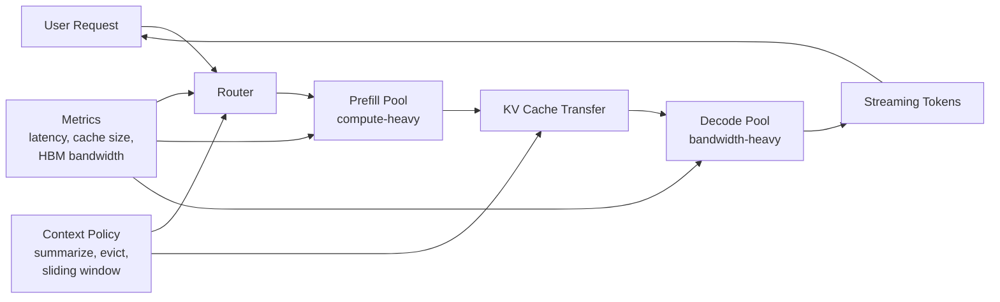

> 한 줄 요약: LLM 추론 비용을 GPU FLOPs와 토큰 단가로만 보면, 디코드(Decode) 구간의 실제 병목인 메모리 대역폭(Memory Bandwidth)과 KV 캐시(KV Cache) 비용을 놓치기 쉽다. 모든 워크로드가 메모리 병목인 것은 아니므로 프리필(Prefill)과 디코드를 나눠서 봐야 한다.

## 왜 지금 이슈인가

LLM 추론 비용, GPU 인프라, KV 캐시 최적화는 실제로는 같은 문제를 다른 말로 설명하는 경우가 많다. 모델을 처음 띄울 때는 GPU 사용률, 초당 토큰 수, 시간당 인스턴스 비용을 먼저 본다. 그런데 트래픽이 늘고 대화 컨텍스트가 길어지면 계산이 달라진다.

GPU는 비싸게 빌렸는데 연산 유닛은 다 쓰지 못한다. 토큰당 비용은 예상보다 높아진다. 긴 컨텍스트를 붙였을 뿐인데 지연 시간과 비용이 같이 흔들린다.

참고 글의 주장은 여기서 출발한다. 많은 팀이 FLOPs, 즉 초당 부동소수점 연산량을 기준으로 LLM 서빙 비용을 계산하지만, 실제 운영에서 자주 마주치는 병목은 디코드 단계의 메모리 대역폭이라는 것이다.

이 이야기가 개발자 커뮤니티에서 논쟁거리가 되는 이유는 분명하다. GPU 구매나 클라우드 계약은 스펙표 중심으로 진행되기 쉽다. 하지만 운영자가 실제로 감당해야 하는 것은 p95 지연 시간, 동시 대화 수, 컨텍스트 길이, 캐시 점유율, 장애 복구 시간이다.

특히 챗봇형 서비스는 큰 프롬프트를 한 번 처리하고 끝나는 배치 작업이 아니다. 사용자가 대화를 이어가면 이전 대화의 키와 값이 KV 캐시에 남고, 새 토큰을 만들 때마다 그 캐시를 다시 읽어야 한다. 긴 컨텍스트는 제품 기능으로 보이지만, 운영 관점에서는 매 토큰마다 따라붙는 대역폭 비용에 가깝다.

## 커뮤니티에서 갈리는 지점

### LLM 추론 비용은 FLOPs가 아니라 메모리 대역폭인가?

반은 맞고, 반은 위험한 말이다.

프리필(Prefill)은 사용자의 입력 프롬프트를 한 번에 처리하는 단계다. 큰 행렬 곱셈(Matrix Multiplication)이 많고 GPU가 잘하는 작업에 가깝다. 이 구간에서는 FLOPs가 성능과 비용을 설명하는 데 꽤 도움이 된다.

디코드(Decode)는 다르다. 모델이 다음 토큰을 하나씩 생성하는 단계다. 각 토큰을 만들 때 이미 쌓인 KV 캐시와 모델 가중치를 읽어야 한다. 계산량보다 데이터 이동량이 더 크게 체감되는 구간이다.

그래서 쟁점은 GPU가 빠른지 여부가 아니다. 내 서비스의 요청 패턴이 어느 쪽에 가까운지가 더 중요하다.

| 질문 | 프리필 중심 | 디코드 중심 |
| --- | --- | --- |
| 대표 워크로드 | 긴 문서 분류, 배치 요약, RAG 입력 처리 | 챗봇, 에이전트, 긴 대화 |
| 병목 후보 | 연산량, 배치 처리 효율 | 메모리 대역폭, KV 캐시 크기 |
| 유효한 지표 | FLOPs, GPU utilization | tokens/sec, cache hit, HBM bandwidth |
| 비용 리스크 | 큰 입력 폭주 | 긴 컨텍스트 누적, 동시 세션 증가 |

반대로 확인해야 할 지점도 있다. 메모리 대역폭이 병목이라는 말만 믿고 모든 구조를 디코드 최적화에 맞추면, 프리필이 많은 서비스에서는 복잡도만 늘 수 있다. 문서 기반 질의응답(RAG)처럼 매 요청마다 긴 검색 결과를 붙이는 서비스는 프리필 부담도 크다. 에이전트가 도구 호출마다 새 입력을 크게 재구성한다면, 디코드만 보고 잡은 계산이 어긋난다.

### 긴 컨텍스트는 기능인가, 비용인가?

둘 다다.

긴 컨텍스트 윈도우(Context Window)는 사용자 경험을 좋게 만든다. 이전 대화를 덜 잊고, 문서를 더 많이 넣고, 에이전트가 작업 상태를 오래 들고 갈 수 있다. 제품 관점에서는 매력적이다.

하지만 KV 캐시는 컨텍스트 길이에 따라 커진다. 동시 요청 수가 늘면 캐시도 같이 늘어난다. 이후 토큰을 생성할 때마다 그 캐시를 읽어야 하므로, 긴 컨텍스트는 한 번 비싼 입력으로 끝나지 않는다. 계속 비용을 만드는 상태가 된다.

현업에서는 긴 컨텍스트를 먼저 켜고 나중에 최적화하자는 이야기가 쉽게 나온다. 문제는 나중에 줄이기 어렵다는 점이다. 사용자는 더 긴 기억에 익숙해지고, 프롬프트 체인은 그 전제에 맞춰 커지고, 비용은 조용히 기본값이 된다.

그래서 긴 컨텍스트 도입은 모델 기능 검토가 아니라 인프라 계약 조건에 가깝게 다뤄야 한다. 몇 토큰까지 허용할지, 대화 기록을 언제 요약할지, 도구 호출 결과를 얼마나 보관할지, 사용자별 세션을 어떻게 만료할지까지 같이 정해야 한다.

## 아키텍처 관점에서 볼 점

### 프리필과 디코드를 왜 분리해야 할까?

참고 글이 제안하는 방향은 프리필과 디코드의 자원 성격을 분리해서 보는 것이다. 프리필은 계산 중심이고, 디코드는 메모리 대역폭 중심이다. 둘을 같은 GPU 풀에 넣으면 한쪽 기준으로 맞춘 용량이 다른 쪽에서는 낭비될 수 있다.

이를 아키텍처로 그리면 다음과 같다.

이 구조의 장점은 자원 배치를 워크로드에 맞출 수 있다는 점이다. 프리필 풀은 큰 입력을 빠르게 처리하는 데 맞추고, 디코드 풀은 KV 캐시와 모델 가중치 이동을 줄이는 데 맞춘다. 요청 라우터는 입력 길이, 예상 출력 길이, 세션 상태를 보고 어느 풀에 얼마나 보낼지 결정한다.

다만 분리하면 새 문제가 생긴다.

- 프리필 결과로 생긴 KV 캐시를 디코드 풀로 옮겨야 한다.
- 캐시 이동 중 지연 시간이 늘 수 있다.
- 풀 간 장애 격리와 재시도 정책이 필요하다.
- 라우터가 잘못 판단하면 tail latency가 커진다.
- 관측성(Observability)이 부족하면 어느 구간이 병목인지 다시 보이지 않는다.

즉, 분리 아키텍처는 설정값 하나로 끝나는 문제가 아니라 운영 체계다. 프리필과 디코드의 지표를 따로 보고, 장애도 따로 다루고, 비용도 따로 계산해야 효과가 난다.

### 산술 강도(Arithmetic Intensity)를 봐야 하는 이유

루프라인 모델(Roofline Model)은 계산량과 메모리 이동량의 비율을 보는 관점이다. 산술 강도(Arithmetic Intensity)가 높으면 연산 유닛을 더 많이 쓰는 쪽이 유리하다. 낮으면 더 많은 FLOPs를 사도 병목이 풀리지 않는다.

LLM 디코드는 낮은 산술 강도에 가까운 구간으로 설명할 수 있다. 토큰 하나를 만들기 위해 읽어야 할 데이터가 많고, 그에 비해 새로 하는 계산은 제한적이다. 그래서 GPU 스펙표의 최대 FLOPs가 두 배라고 해서 디코드 지연 시간이 같은 비율로 줄어들지는 않을 수 있다.

이 관점은 하드웨어 선택에도 영향을 준다. 최고 FLOPs보다 메모리 대역폭, HBM 용량, 캐시 구조, 인터커넥트(Interconnect), 배치 처리 효율이 더 큰 차이를 만들 수 있다. 클라우드 비용 비교표를 만들 때도 시간당 GPU 가격만 넣으면 부족하다. 디코드 중심 트래픽에서는 유효 tokens/sec와 p95 지연 시간을 같이 봐야 한다.

## 실무에서 볼 점

### 도입 전에 무엇을 측정해야 할까?

먼저 서비스 트래픽을 프리필과 디코드로 나눠야 한다. 전체 GPU 사용률 하나로는 부족하다.

- 입력 토큰 길이 분포
- 출력 토큰 길이 분포
- 동시 세션 수
- 세션별 컨텍스트 누적량
- 프리필 지연 시간과 디코드 지연 시간
- KV 캐시 메모리 사용량
- 초당 생성 토큰 수
- p50, p95, p99 지연 시간
- 배치 크기 변화에 따른 처리량

이 데이터를 보기 전에는 어떤 GPU가 싸다거나 어떤 모델이 효율적이라고 말하기 어렵다. 같은 모델도 짧은 질의응답과 긴 에이전트 대화에서는 비용 구조가 달라진다.

### 최적화 선택지는 무엇이 있나?

가장 먼저 볼 것은 컨텍스트 정책이다. 긴 컨텍스트를 무제한으로 유지하는 구조라면, 모델 교체보다 대화 기록 관리가 더 큰 효과를 낼 수 있다.

| 선택지 | 기대 효과 | 대가 |
| --- | --- | --- |
| 요약(Summarization) | 오래된 대화를 압축 | 정보 손실, 요약 품질 의존 |
| 슬라이딩 윈도우(Sliding Window) | 최근 컨텍스트만 유지 | 장기 의존성 약화 |
| 캐시 제거(Eviction) | KV 캐시 점유율 감소 | 재계산 비용 발생 가능 |
| 양자화(Quantization) | 가중치와 캐시 이동량 감소 | 품질 저하 검증 필요 |
| 배치 조정 | 처리량 개선 | 지연 시간 증가 가능 |
| 프리필/디코드 분리 | 자원 최적화 | 라우팅, 전송, 운영 복잡도 증가 |

양자화는 단순히 모델을 작게 만드는 기법으로만 보면 부족하다. 디코드 병목에서는 이동해야 할 바이트를 줄이는 비용 절감 수단이기도 하다. 다만 정확도, 도구 호출 안정성, 긴 컨텍스트에서의 품질 변화는 별도로 검증해야 한다.

배치도 조심해야 한다. 배치를 키우면 처리량은 좋아질 수 있지만, 실시간 대화에서는 첫 토큰 지연 시간이 나빠질 수 있다. 사용자는 평균 처리량보다 스트리밍이 멈칫하는 느낌에 더 민감하다.

### 실패하기 쉬운 지점

첫 번째는 GPU utilization만 보고 안심하는 것이다. 디코드 중심 서비스에서 GPU 사용률이 낮게 보인다고 해서 여유가 있다는 뜻은 아닐 수 있다. 메모리 대역폭이 이미 한계에 닿았는데 연산 유닛만 덜 쓰이고 있을 수 있다.

두 번째는 긴 컨텍스트를 제품 기능으로만 보는 것이다. 컨텍스트 길이는 가격 정책, 세션 정책, 캐시 정책과 묶어야 한다. 무료 사용자에게도 같은 길이를 열어둘지, 도구 호출 결과를 원문 그대로 보관할지, 일정 시간이 지난 대화는 요약할지 같은 결정이 비용을 바꾼다.

세 번째는 프리필/디코드 분리를 너무 빨리 도입하는 것이다. 트래픽이 작거나 요청 패턴이 단순하면 분리 구조의 이점보다 운영 복잡도가 더 클 수 있다. 라우팅 계층, 캐시 전송, 장애 대응, 모니터링까지 갖출 준비가 없다면 단일 서빙 구조에서 컨텍스트와 배치를 먼저 정리하는 편이 낫다.

### Kubernetes에서 운영한다면 무엇을 조심해야 하나?

Kubernetes에서 LLM 서빙을 돌릴 때는 GPU를 단순한 가속기 리소스로만 보면 안 된다. 프리필 풀과 디코드 풀을 나누면 스케줄링 기준도 달라진다. 어떤 노드는 연산 처리량이 우선이고, 어떤 노드는 메모리 대역폭과 캐시 유지가 우선이다.

운영 관점에서는 다음 조건이 필요하다.

- 프리필/디코드 Pod를 별도 노드 풀로 분리할 수 있는가
- GPU 메모리 사용량과 KV 캐시 지표를 수집할 수 있는가
- 라우터가 세션 상태를 보고 같은 디코드 풀로 보낼 수 있는가
- 노드 장애 시 캐시 손실을 허용할 것인가, 재계산할 것인가
- 오토스케일링 기준을 GPU 사용률이 아니라 지연 시간과 큐 길이로 둘 수 있는가

여기서 보안도 빠지면 안 된다. KV 캐시는 사용자 입력에서 파생된 실행 중 상태다. 보통 원문 텍스트처럼 저장되는 데이터는 아니지만, 세션 격리와 메모리 재사용 정책이 허술하면 민감 정보 처리 환경에서 문제가 될 수 있다. 멀티테넌트 환경에서는 캐시 격리, 로그 마스킹, 디버그 덤프 통제를 같이 넣어야 한다.

## 정리

LLM 추론 비용을 FLOPs로만 계산하는 방식은 프리필에는 어느 정도 맞지만, 디코드 중심 서비스에서는 쉽게 빗나간다. 챗봇, 에이전트, 긴 대화형 서비스라면 비용의 핵심은 다음 토큰을 계산하는 능력보다 KV 캐시와 가중치를 얼마나 효율적으로 읽고 옮기느냐에 가까워진다.

그렇다고 메모리 대역폭 하나로 모든 결정을 밀어붙이면 안 된다. 먼저 내 트래픽이 프리필 중심인지, 디코드 중심인지, 긴 컨텍스트가 실제로 얼마나 유지되는지 측정해야 한다. 그다음 컨텍스트 정책, 양자화, 배치, 프리필/디코드 분리를 순서대로 검토하는 편이 낫다.

당장 확인할 것은 하나다. 지금 운영 중인 LLM 서빙 지표에서 프리필 지연 시간과 디코드 지연 시간이 분리되어 있는가. 분리되어 있지 않다면 비용 최적화 논의는 아직 시작하기 이르다.

## 참고 자료

- [선정 글감] [You're Not Paying for Compute. You're Paying for Memory Bandwidth](https://dev.to/aiexplore369zoho/youre-not-paying-for-compute-youre-paying-for-memory-bandwidth-3b5h) — DEV Community