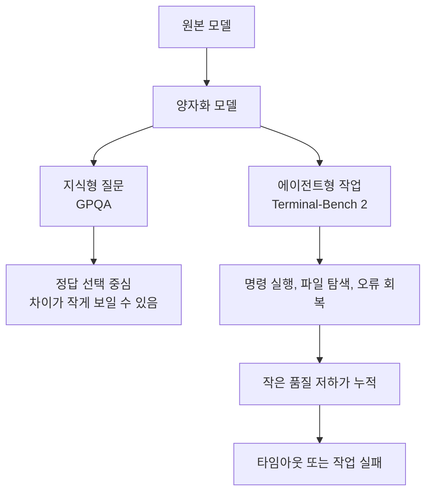

> 한 줄 요약: 로컬 LLM 논쟁은 이제 모델을 돌릴 수 있느냐보다, 어떤 양자화(Quantization)를 어떤 업무에 맡겨도 되는가에 가까워졌다. Qwen 3.6 관련 커뮤니티 반응도 성능표보다 운영 기준이 더 필요하다는 쪽에 가깝다.

## 무슨 일이 있었나

Reddit LocalLLaMA 커뮤니티에 Qwen 3.6 양자화 모델의 벤치마크 결과가 올라왔다. 글쓴이는 대학의 소규모 HPC 클러스터를 관리한다고 밝히며, 사용자가 양자화의 영향을 이해할 수 있도록 Qwen 3.6 계열을 여러 정밀도 조건에서 테스트했다고 설명했다.

제공된 요약에서 확인할 수 있는 내용은 다음과 같다.

| 항목 | 확인된 내용 |
|---|---|
| 대상 | Qwen 3.6 양자화 모델 |
| 측정 지표 | GPQA Diamond, Terminal-Bench 2 |
| 관찰 결과 | GPQA는 양자화별 차이가 작았고, Terminal-Bench 2는 저정밀 양자화에서 하락이 컸음 |
| 추가 관찰 | Qwen 공식 FP8 점수보다 낮은 결과가 나왔고, 글쓴이는 타임아웃 영향을 원인으로 추정 |
| 공개 위치 | Reddit LocalLLaMA 및 별도 벤치마크 페이지 링크 |

날짜는 제공된 RSS 묶음에 정확히 들어 있지 않았다. 이 글에서는 2026년 7월 현재 공유된 커뮤니티 논의로 다룬다. 정확한 게시 시각이나 테스트 환경 세부값은 원문과 벤치마크 페이지에서 확인해야 한다.

같은 시점에 보조 논의도 두 개 붙었다. 하나는 Unsloth가 Qwen3.6 27B와 35B-A3B의 NVFP4 양자화를 더 빠르게 만들었다고 주장한 글이다. 요약에 따르면 Qwen3.6 27B는 NVIDIA NVFP4 대비 2.5배 빠르고, 35B-A3B는 1.56배에서 1.79배 빠르다고 설명했다. W4A4 방식, FP8 KV 캐시 캘리브레이션, MMLU-Pro, AIME 2025, GPQA 비교도 언급됐다.

다른 글은 Strix Halo 장비에서 로컬 모델을 돌릴 때 하루 전력비가 최대 0.48달러 수준이라는 주장이다. 작성자는 Qwen 3.6 35B Q8_XL에서 50 tokens/s 정도를 언급하며, GPU 속도만 볼 게 아니라 크기, 소음, 전력, 가격도 같이 봐야 한다고 했다.

세 글을 한데 놓으면 쟁점은 단순하다. 작은 모델, 싼 장비, 빠른 양자화는 모두 좋아 보인다. 하지만 에이전트형 작업에서는 정확도표만 보고 결정하기 어렵다.

## 왜 사람들이 반응했나

LocalLLaMA 커뮤니티가 이런 글에 반응하는 이유는 실사용자의 질문이 바뀌었기 때문이다.

예전 질문은 대체로 이랬다.

- 이 모델이 내 GPU 메모리에 올라가는가
- 몇 tokens/s가 나오는가
- 벤치마크 점수가 원본 모델과 얼마나 가까운가

지금 질문은 더 까다롭다.

- 코딩 에이전트처럼 여러 단계를 수행하는 작업에서도 버티는가
- 타임아웃, 컨텍스트 길이, 도구 호출 실패가 점수에 얼마나 섞였는가
- 싸고 조용한 로컬 장비가 실제 업무 비용을 줄이는가
- 특정 양자화 포맷이 벤더 생태계에 종속되는가

GPQA Diamond 같은 지식형 벤치마크에서 차이가 작다는 말은 많은 사람에게 안도감을 준다. 모델이 알고 있는 지식 자체는 크게 망가지지 않았다는 신호처럼 보이기 때문이다.

그런데 Terminal-Bench 2에서 저정밀 양자화의 하락이 크다면 이야기가 달라진다. 지식은 남아 있어도 작업 수행 능력은 손상될 수 있다. 특히 터미널 작업, 코드 수정, 테스트 실행, 오류 회복처럼 절차가 긴 작업에서는 한 번의 틀린 토큰이 뒤쪽 흐름을 무너뜨릴 수 있다.

이 차이가 커뮤니티에서 말이 붙는 지점이다.

양자화는 보통 손실 압축처럼 설명된다. 메모리를 줄이고 속도를 높이려고 가중치 표현을 낮은 정밀도로 바꾸는 방식이다. 하지만 에이전트형 작업에서 손실은 숫자 하나로 끝나지 않는다. 잘못된 명령, 틀린 파일 선택, 반복되는 실패, 시간 초과로 이어진다.

Unsloth의 NVFP4 글이 같이 읽히는 이유도 여기에 있다. 2.5배 빠르다는 주장은 로컬 LLM 사용자에게 크게 다가온다. 속도는 사용성에 바로 영향을 준다. 답변이 느리면 모델 품질이 좋아도 손이 잘 가지 않는다.

다만 실무에서는 속도 주장과 정확도 주장을 나눠 봐야 한다. MMLU-Pro, AIME 2025, GPQA에서 손실이 작더라도 터미널 기반 작업이나 긴 도구 호출 작업에서 똑같이 괜찮다는 뜻은 아니다. 벤치마크가 다르면 실패 양상도 달라진다.

Strix Halo 전력비 글은 또 다른 축을 보여준다. 로컬 LLM의 비용은 GPU 가격만이 아니다. 전력, 소음, 발열, 책상 위 공간, 24시간 켜둘 수 있는지, 여러 사용자가 공유할 수 있는지가 모두 비용에 들어간다. 하루 0.48달러라는 수치는 작성자 환경의 주장일 뿐 일반화하면 안 되지만, 커뮤니티가 왜 이런 계산에 반응하는지는 분명하다.

클라우드 API는 요청당 비용이 보인다. 로컬 LLM은 비용이 흩어져 있다. 장비 구매비, 전기요금, 관리 시간, 모델 교체 비용, 실패한 작업을 사람이 다시 확인하는 비용이 따로 움직인다.

## 내가 보는 핵심

이번 이슈의 핵심은 Qwen 3.6 하나의 성능이 아니다. 로컬 LLM 운영에서 벤치마크를 읽는 방식이 바뀌어야 한다는 점이다.

지식형 벤치마크가 유지된다고 해서 업무형 성능까지 유지되는 것은 아니다. 특히 코딩 에이전트, 터미널 자동화, 데이터 처리 보조, 문서 변환처럼 절차가 긴 작업은 이런 부분에 취약하다.

- 중간 단계 오류가 뒤로 전파된다.
- 속도 저하가 타임아웃으로 바뀐다.
- 낮은 정밀도에서 애매한 판단이 늘어날 수 있다.

여기서 말하고 싶은 건 벤치마크가 틀렸다는 얘기가 아니다. 벤치마크마다 답하는 질문이 다르다는 얘기다.

GPQA는 모델이 어려운 지식 문제를 얼마나 맞히는지 보는 데 가깝다. Terminal-Bench 2는 터미널 환경에서 작업을 끝까지 수행하는 능력에 더 가깝다. NVFP4 속도 비교는 특정 하드웨어와 커널, 정밀도 조합에서 처리량이 얼마나 개선되는지를 보여준다. 전력비 논의는 사용자가 체감하는 총소유비용(TCO)에 가깝다.

이 네 가지를 한 점수로 합치면 판단이 흐려진다.

현업에서 비슷한 고민을 하다 보면 가장 위험한 선택은 평균 점수가 높은 구성을 그대로 운영에 넣는 것이다. 내부 업무는 평균보다 꼬리 리스크에 더 민감하다. 100번 중 95번 잘해도, 실패한 5번이 파일을 잘못 바꾸거나 배포 스크립트를 건드리면 사람이 반드시 확인해야 한다.

양자화 모델을 도입할 때는 모델 크기보다 업무 형태를 먼저 나눠야 한다.

| 업무 유형 | 양자화 허용 범위 | 확인할 것 |
|---|---|---|
| 단순 질의응답 | 비교적 넓음 | 지식형 벤치마크, 환각률, 한국어 품질 |
| 요약/분류 | 중간 | 원문 누락, 기준 일관성 |
| 코드 제안 | 좁음 | 테스트 통과율, 파일 맥락 이해 |
| 터미널 에이전트 | 매우 좁음 | 타임아웃, 명령 복구, 반복 실패율 |
| 운영 자동화 | 보수적 | 권한 격리, 롤백, 감사 로그 |

특히 에이전트형 작업에서는 모델만 보지 말고 실행 환경을 같이 봐야 한다. 낮은 정밀도 모델이 나쁜 선택이라는 뜻은 아니다. 로컬 환경에서는 양자화가 없으면 시작조차 어려운 경우가 많다. 문제는 어디까지 맡길지 정하지 않은 채 빠르고 싸다는 이유로 자동화 범위를 넓히는 것이다.

아키텍처 관점에서는 모델을 신뢰 경계 밖에 두는 편이 낫다. 모델이 명령을 제안하더라도 실행 권한, 파일 접근 범위, 네트워크 접근, 시간 제한, 재시도 횟수는 별도로 통제해야 한다. Terminal-Bench류 점수가 낮아지는 구간에서는 이 통제가 더 필요하다.

## 앞으로 볼 기준

다음에 Qwen 3.6이든 다른 오픈 모델이든 양자화 성능표를 볼 때는 질문을 먼저 바꿔야 한다.

이 모델이 얼마나 똑똑한가보다, 내가 맡기려는 작업에서 어떤 실패를 만드는가를 봐야 한다.

체크포인트는 이 정도면 충분하다.

- 벤치마크가 지식형인지, 에이전트형인지 구분한다.
- 속도 향상이 정확히 어떤 하드웨어와 커널 조합에서 나온 것인지 확인한다.
- 공식 점수와 커뮤니티 재현 점수가 다르면 타임아웃, 컨텍스트 길이, 실행 설정을 본다.
- 하루 전력비나 장비 가격만 보지 말고 사람이 재검수하는 비용을 포함한다.
- 자동 실행 권한을 주기 전에 실패 로그와 롤백 경로를 만든다.

이번 논의에서 한쪽만 맞고 다른 쪽은 틀렸다고 보기는 어렵다. Unsloth식 최적화는 로컬 LLM을 더 실용적으로 만들 수 있다. Strix Halo 같은 저전력 장비도 개인과 소규모 팀에게 좋은 선택지가 될 수 있다. Qwen 3.6 양자화 벤치마크 역시 지식형 작업에서는 꽤 괜찮은 신호를 준다.

다만 에이전트형 작업은 다르다. 모델이 답을 아는 것과 작업을 끝내는 것은 같은 능력이 아니다.

로컬 LLM을 운영하려는 사람에게 현실적인 결론은 이렇다. 양자화 모델을 쓰되, 업무를 나눠서 넣어야 한다. 지식 검색과 초안 작성에는 공격적으로 실험할 수 있다. 터미널 실행, 코드 변경, 운영 자동화에는 점수표보다 실패 사례를 먼저 모아야 한다.

성능표의 숫자가 좋아질수록 운영 기준은 더 차분해야 한다. 이제 로컬 LLM의 병목은 실행 가능성이 아니라 위임 가능한 범위를 정하는 일에 가까워지고 있다.

## 참고 자료

- [선정 글감] [Qwen 3.6 Q2-FP8 Terminal Bench 2 and GPQA Scores](https://www.reddit.com/r/LocalLLaMA/comments/1usclcz/qwen_36_q2fp8_terminal_bench_2_and_gpqa_scores/) (Reddit LocalLLaMA)
- [관련] [2.5x faster Qwen3.6 NVFP4 Unsloth quants](https://www.reddit.com/r/LocalLLaMA/comments/1usniqh/25x_faster_qwen36_nvfp4_unsloth_quants/) (Reddit LocalLLaMA)
- [관련] [At most my Strix Halo uses $0.48 a day](https://www.reddit.com/r/LocalLLaMA/comments/1ussasa/at_most_my_strix_halo_uses_048_a_day/) (Reddit LocalLLaMA)